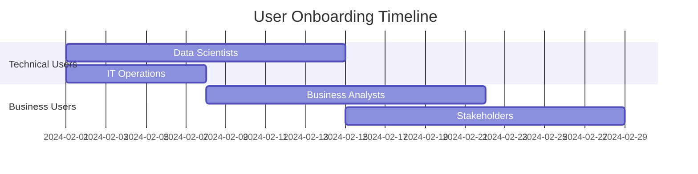

# 🚀 Anomaly Detection Platform - Business Rollout Strategy

## 📋 Executive Summary

This document outlines the comprehensive rollout strategy for the anomaly detection platform, including business integration, user onboarding, and success metrics.

### 🎯 Rollout Objectives
- **Primary Goal:** Successful deployment and adoption of the anomaly detection platform
- **Success Criteria:** 
  - 95% uptime in production
  - 80% user satisfaction score
  - 50% reduction in false positives compared to legacy systems
  - ROI positive within 6 months

## 📊 Rollout Phases

### Phase 1: Internal Beta (Weeks 1-2)
**Participants:** Development team and early internal adopters (5-10 users)

#### Objectives
- Validate platform stability in production environment
- Identify and resolve critical bugs
- Gather initial user feedback
- Test monitoring and alerting systems

#### Activities
- [ ] Deploy to production environment with limited access
- [ ] Configure monitoring dashboards and alerts
- [ ] Onboard development team as beta users
- [ ] Conduct daily standups to track issues
- [ ] Document known issues and workarounds

#### Success Criteria
- Zero critical bugs
- Platform uptime > 95%
- All monitoring systems operational
- Beta user feedback score > 7/10

#### Risk Mitigation
- Immediate rollback capability via automated deployment
- 24/7 monitoring with alert escalation
- Daily bug triage meetings
- Clear communication channels for issue reporting

### Phase 2: Limited Production Rollout (Weeks 3-4)
**Participants:** Selected business units (20-50 users)

#### Objectives
- Validate platform performance under realistic load
- Test business integration workflows
- Refine user onboarding process
- Establish support procedures

#### Activities
- [ ] Expand production access to selected business units
- [ ] Deploy comprehensive monitoring and logging
- [ ] Conduct user training sessions
- [ ] Implement support ticket system
- [ ] Begin collecting business metrics

#### Success Criteria
- Platform handles production load without degradation
- User onboarding completion rate > 90%
- Support ticket resolution time < 24 hours
- Business stakeholder approval for full rollout

#### Risk Mitigation
- Feature flags for gradual functionality rollout
- Automated scaling and load balancing
- Dedicated support team during business hours
- Fallback to legacy systems if needed

### Phase 3: Full Production Rollout (Weeks 5-8)
**Participants:** All intended users (100+ users)

#### Objectives
- Complete platform deployment across organization
- Achieve full business value realization
- Establish ongoing support and maintenance
- Measure ROI and business impact

#### Activities
- [ ] Complete user onboarding for all teams
- [ ] Transition from legacy systems
- [ ] Implement advanced features and customizations
- [ ] Establish regular business review meetings
- [ ] Begin optimization and enhancement planning

#### Success Criteria
- 100% user onboarding completion
- Legacy system decommissioning
- Target business metrics achieved
- Positive ROI demonstration

#### Risk Mitigation
- Gradual legacy system shutdown with parallel operation
- Comprehensive backup and disaster recovery testing
- Extended support hours during transition
- Clear escalation procedures for business-critical issues

### Phase 4: Optimization & Enhancement (Weeks 9-12)
**Participants:** All users plus new feature requests

#### Objectives
- Optimize platform performance based on real usage
- Implement user-requested enhancements
- Establish long-term roadmap
- Scale team and processes

#### Activities
- [ ] Performance optimization based on production metrics
- [ ] Feature enhancement based on user feedback
- [ ] Team scaling and knowledge transfer
- [ ] Long-term roadmap planning
- [ ] Success story documentation and sharing

## 👥 User Onboarding Strategy

### User Personas and Onboarding Paths

#### 1. Data Scientists
**Profile:** Advanced technical users who will build and tune models
**Onboarding Path:**
- Technical deep-dive sessions (2 hours)
- Hands-on model training workshop
- API integration tutorial
- Advanced feature demonstration

**Resources:**
- SDK documentation and examples
- Jupyter notebook templates
- Model development best practices
- Direct access to development team

#### 2. Business Analysts
**Profile:** Business users who will configure and monitor detections
**Onboarding Path:**
- Business-focused platform overview (1 hour)
- Dashboard configuration workshop
- Alert setup and management
- Reporting and analytics training

**Resources:**
- User-friendly documentation
- Video tutorials
- Template configurations
- Business intelligence integration

#### 3. IT Operations
**Profile:** Technical users responsible for platform maintenance
**Onboarding Path:**
- Technical architecture overview
- Monitoring and alerting deep-dive
- Troubleshooting procedures
- Integration with existing systems

**Resources:**
- Technical documentation
- Runbooks and procedures
- Alert escalation guides
- Direct support channel

#### 4. Business Stakeholders
**Profile:** Decision-makers who need high-level visibility
**Onboarding Path:**
- Executive summary session (30 minutes)
- Business value demonstration
- ROI metrics review
- Strategic roadmap discussion

**Resources:**
- Executive dashboards
- Business impact reports
- ROI calculators
- Regular business reviews

### Onboarding Schedule



## 🔗 Business Integration Points

### 1. Identity and Access Management (IAM)
**Integration:** Single Sign-On (SSO) with corporate identity provider

**Implementation:**
- Configure SAML/OAuth integration
- Map corporate roles to platform permissions
- Implement automated user provisioning
- Set up audit logging for access events

**Timeline:** Week 1-2
**Owner:** IT Security Team

### 2. Data Sources Integration
**Integration:** Connect to existing data pipelines and databases

**Implementation:**
- Configure database connections (PostgreSQL, MySQL, etc.)
- Set up API integrations with business systems
- Implement real-time streaming from Kafka/message queues
- Configure batch data ingestion workflows

**Timeline:** Week 2-4
**Owner:** Data Engineering Team

### 3. Notification Systems
**Integration:** Route alerts through existing communication channels

**Implementation:**
- Slack integration for development teams
- Email integration for business users
- PagerDuty integration for critical alerts
- Microsoft Teams integration for collaboration

**Timeline:** Week 1-3
**Owner:** DevOps Team

### 4. Business Intelligence (BI) Integration
**Integration:** Connect platform metrics to existing BI tools

**Implementation:**
- Tableau/PowerBI dashboard integration
- Automated report generation
- Data export capabilities
- Custom business metrics tracking

**Timeline:** Week 3-6
**Owner:** Business Intelligence Team

### 5. Incident Management
**Integration:** Connect with existing incident response workflows

**Implementation:**
- ServiceNow integration for ticket creation
- Jira integration for issue tracking
- Automated incident escalation
- Post-incident analysis workflows

**Timeline:** Week 2-4
**Owner:** IT Operations Team

### 6. Compliance and Audit
**Integration:** Ensure compliance with corporate governance

**Implementation:**
- Audit log export to SIEM systems
- Compliance reporting automation
- Data retention policy enforcement
- Privacy and security controls

**Timeline:** Week 1-8 (ongoing)
**Owner:** Compliance Team

## 📈 Success Metrics and KPIs

### Technical Metrics

#### Platform Performance
- **System Uptime:** Target >99.5%
- **API Response Time:** Target <200ms (95th percentile)
- **Error Rate:** Target <0.1%
- **Resource Utilization:** CPU <70%, Memory <80%

#### Security Metrics
- **Security Scan Pass Rate:** Target 100%
- **Vulnerability Resolution Time:** Target <48 hours for critical
- **Compliance Score:** Target >95%
- **Failed Authentication Attempts:** Monitor and alert

#### Operational Metrics
- **Deployment Success Rate:** Target >95%
- **Mean Time to Recovery (MTTR):** Target <15 minutes
- **Change Failure Rate:** Target <2%
- **Lead Time for Changes:** Target <2 hours

### Business Metrics

#### User Adoption
- **User Onboarding Completion Rate:** Target >90%
- **Daily Active Users:** Track growth trajectory
- **Feature Adoption Rate:** Monitor usage of key features
- **User Satisfaction Score:** Target >8/10

#### Business Value
- **False Positive Reduction:** Target 50% improvement
- **Detection Accuracy:** Target >95%
- **Time to Detection:** Target <5 minutes
- **Cost Savings:** Track operational efficiency gains

#### Support Metrics
- **Ticket Resolution Time:** Target <24 hours
- **First Contact Resolution Rate:** Target >80%
- **User Training Completion:** Target 100%
- **Knowledge Base Usage:** Track self-service adoption

## 🛡️ Risk Management

### High-Risk Scenarios

#### 1. Platform Downtime During Business Hours
**Impact:** High - Business operations disrupted
**Probability:** Low
**Mitigation:**
- Multi-region deployment with failover
- 24/7 monitoring with immediate alerts
- Automated rollback procedures
- Communication plan for stakeholders

#### 2. Data Integration Failures
**Impact:** Medium - Reduced detection capability
**Probability:** Medium
**Mitigation:**
- Data source redundancy
- Automated data quality monitoring
- Graceful degradation capabilities
- Manual data injection procedures

#### 3. User Adoption Resistance
**Impact:** High - Business value not realized
**Probability:** Medium
**Mitigation:**
- Comprehensive change management
- Executive sponsorship and communication
- Incentive programs for early adopters
- Success story sharing and celebration

#### 4. Security Breach or Compliance Violation
**Impact:** Very High - Legal and reputational damage
**Probability:** Low
**Mitigation:**
- Comprehensive security scanning and monitoring
- Regular penetration testing
- Audit trail maintenance
- Incident response procedures

### Risk Monitoring

```yaml
risk_monitoring:
  daily_checks:
    - System uptime and performance
    - Security scan results
    - User adoption metrics
    - Support ticket volume
  
  weekly_reviews:
    - Business metric trends
    - Risk indicator assessment
    - Stakeholder feedback
    - Resource utilization
  
  monthly_assessments:
    - Full risk register review
    - Mitigation effectiveness
    - Emerging risk identification
    - Strategic adjustment planning
```

## 📞 Communication Plan

### Stakeholder Communication Matrix

| Stakeholder Group | Frequency | Method | Content |
|-------------------|-----------|---------|---------|
| Executive Team | Weekly | Email Report | High-level metrics, risks, decisions needed |
| Business Users | Bi-weekly | Newsletter | Feature updates, tips, success stories |
| Technical Team | Daily | Slack/Standup | Technical issues, deployments, changes |
| Support Team | Real-time | Alerts/Dashboard | System status, incident updates |

### Communication Channels

#### 1. Executive Dashboard
- Real-time business metrics
- ROI tracking
- Risk indicators
- Strategic milestone progress

#### 2. User Community
- Slack channels for different user types
- Monthly user group meetings
- Feature request voting system
- Best practice sharing sessions

#### 3. Technical Updates
- Deployment notifications
- Maintenance windows
- Performance reports
- Security updates

## 🎓 Training and Support

### Training Program

#### 1. Role-Based Training Tracks
**Data Scientists (8 hours)**
- Platform architecture and capabilities
- Model development and deployment
- API integration and SDKs
- Performance optimization

**Business Analysts (4 hours)**
- Dashboard creation and customization
- Alert configuration
- Report generation
- Business metric interpretation

**IT Operations (6 hours)**
- System monitoring and maintenance
- Security and compliance
- Troubleshooting procedures
- Integration management

#### 2. Training Materials
- Interactive online modules
- Video tutorials and demos
- Hands-on workshops
- Reference documentation
- FAQ and troubleshooting guides

#### 3. Ongoing Support
**Tier 1 Support:** General usage questions, account issues
**Tier 2 Support:** Technical configuration, integration issues
**Tier 3 Support:** Platform bugs, performance issues, feature requests

**Support Channels:**
- Self-service knowledge base
- Email support with SLA
- Live chat during business hours
- Escalation to development team

### Center of Excellence (CoE)

#### Purpose
Establish internal expertise and drive best practices across the organization

#### Structure
- **CoE Lead:** Senior technical professional
- **Technical Experts:** 2-3 subject matter experts
- **Business Champions:** Representatives from key business units
- **Training Coordinators:** Learning and development specialists

#### Responsibilities
- Develop and maintain best practices
- Provide advanced technical support
- Drive platform adoption and optimization
- Coordinate training and certification programs
- Evaluate and implement new features

## 📅 Implementation Timeline

### Month 1: Foundation
- Week 1: Infrastructure deployment and security setup
- Week 2: Basic integrations and user onboarding system
- Week 3: Internal beta testing and feedback collection
- Week 4: Issue resolution and documentation completion

### Month 2: Controlled Rollout
- Week 5: Limited production rollout (20% of users)
- Week 6: Monitoring optimization and support process refinement
- Week 7: User training completion and feedback incorporation
- Week 8: Business integration validation and approval

### Month 3: Full Deployment
- Week 9: Full production rollout (100% of users)
- Week 10: Legacy system transition and decommissioning
- Week 11: Performance optimization and advanced feature enablement
- Week 12: Success measurement and celebration

### Month 4+: Optimization
- Ongoing performance monitoring and optimization
- Feature enhancement based on user feedback
- Expansion to additional use cases
- Long-term roadmap development

## 🎉 Success Celebration and Continuous Improvement

### Success Milestones
1. **Technical Milestone:** Platform deployed and stable
2. **Adoption Milestone:** 90% user onboarding completed
3. **Business Milestone:** Target ROI achieved
4. **Innovation Milestone:** New capabilities developed

### Celebration Activities
- All-hands presentation of achievements
- Individual and team recognition
- Case study development and sharing
- Industry conference presentations
- Internal innovation awards

### Continuous Improvement Process
1. **Monthly Reviews:** Metrics analysis and trend identification
2. **Quarterly Planning:** Feature roadmap and resource allocation
3. **Annual Assessment:** Strategic review and goal setting
4. **Feedback Loops:** Continuous user input and incorporation

This rollout strategy provides a comprehensive framework for successfully deploying and adopting the anomaly detection platform while minimizing risks and maximizing business value.