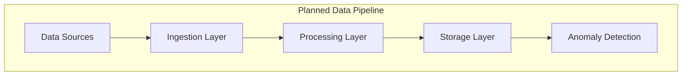

# ADR-002: Data Pipeline Architecture

🍞 **Breadcrumb:** 🏠 [Home](../../../index.md) > 👨‍💻 [Developer Guides](../../README.md) > 🏗️ [Architecture](../README.md) > 📋 [ADR](README.md) > Data Pipeline Architecture

## Status

PLANNED

## Context

### Problem Statement
Pynomaly requires a robust data pipeline architecture to handle various data sources, transformations, and anomaly detection workflows efficiently and scalably.

### Goals
- Design scalable data ingestion and processing pipelines
- Support real-time and batch processing modes
- Ensure data quality and validation throughout the pipeline
- Enable monitoring and observability of data flows

### Constraints
- Must support multiple data formats and sources
- Should handle both streaming and batch data
- Must ensure data consistency and reliability
- Should integrate with existing anomaly detection algorithms

### Assumptions
- Data volumes will grow significantly over time
- Multiple data sources will need to be supported
- Real-time processing requirements will increase
- Data quality issues will need automated handling

## Decision

### Chosen Solution
*[To be completed when ADR moves to PROPOSED status]*

### Rationale
*[To be completed when ADR moves to PROPOSED status]*

## Architecture

### System Overview

### Component Interactions
*[To be completed when ADR moves to PROPOSED status]*

## Options Considered

### Pros and Cons Matrix

| Option | Pros | Cons | Score |
|--------|------|------|-------|
| TBD | TBD | TBD | TBD |

### Rejected Alternatives
*[To be completed when ADR moves to PROPOSED status]*

## Implementation

### Technical Approach
*[To be completed when ADR moves to PROPOSED status]*

### Migration Strategy
*[To be completed when ADR moves to PROPOSED status]*

### Testing Strategy
*[To be completed when ADR moves to PROPOSED status]*

## Consequences

### Positive
- *[To be documented when decision is made]*

### Negative
- *[To be documented when decision is made]*

### Neutral
- *[To be documented when decision is made]*

## Compliance

### Security Impact
*[To be completed when ADR moves to PROPOSED status]*

### Performance Impact
*[To be completed when ADR moves to PROPOSED status]*

### Monitoring Requirements
*[To be completed when ADR moves to PROPOSED status]*

## Decision Log

| Date | Author | Action | Rationale |
|------|--------|--------|-----------|
| 2025-01-08 | Architecture Team | PLANNED | Identified need for comprehensive data pipeline architecture |

## References

- [Data Processing Requirements](../data-processing.md)
- [Anomaly Detection Algorithms](../algorithms.md)
- [ADR Index](README.md)

---

## 🔗 **Related Documentation**

### **Architecture**
- **[Architecture Overview](../README.md)** - System design principles
- **[Data Architecture](../data-architecture.md)** - Data system design
- **[ADR Index](README.md)** - All architectural decisions

### **Implementation**
- **[Data Processing Guide](../../data/processing.md)** - Data processing standards
- **[Contributing Guidelines](../../contributing/CONTRIBUTING.md)** - Development process
- **[Performance Guidelines](../../performance/README.md)** - Performance standards

### **Operations**
- **[Monitoring Guide](../../operations/monitoring.md)** - System monitoring
- **[Deployment Guide](../../operations/deployment.md)** - Deployment procedures
- **[Troubleshooting Guide](../../operations/troubleshooting.md)** - Issue resolution

---

**Authors:** Architecture Team  
**Last Updated:** 2025-01-08  
**Next Review:** 2025-04-08
