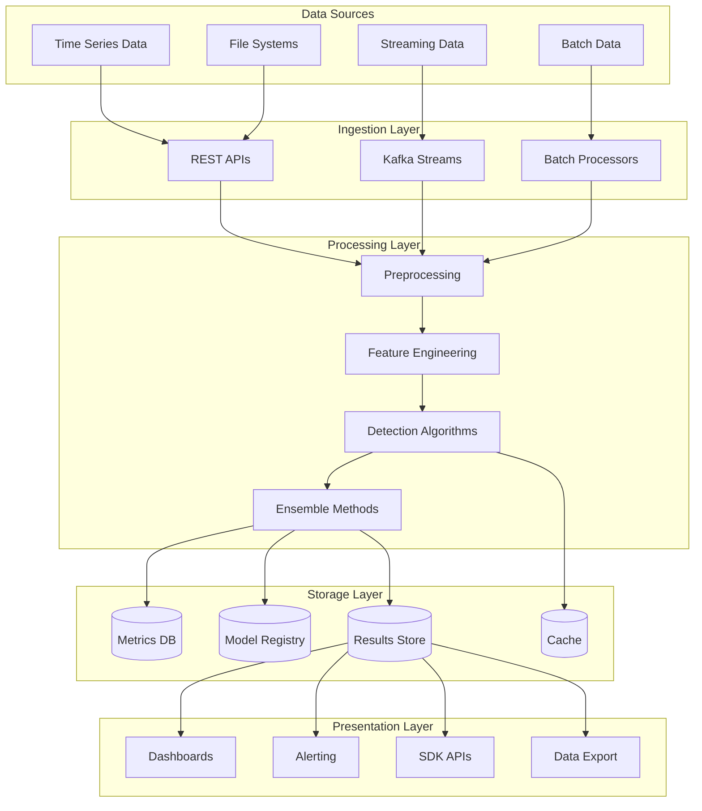

# Platform Overview

The **Anomaly Detection Platform** is a comprehensive, enterprise-grade solution designed to detect anomalies across various data types and use cases. Built with modern software engineering principles, it provides a scalable, maintainable, and extensible foundation for anomaly detection workflows.

## 🎯 Platform Mission

**To democratize anomaly detection by providing enterprise-ready tools that scale from research prototypes to production systems with minimal friction.**

## 🏗️ Architecture Philosophy

The monorepo is built on **Clean Architecture** principles with clear separation of concerns:

### Domain-Driven Design
- **Domain Layer**: Core business logic and entities
- **Application Layer**: Use cases and orchestration
- **Infrastructure Layer**: External concerns (databases, APIs, ML models)
- **Presentation Layer**: User interfaces (APIs, CLI, Web)

### Key Architectural Benefits
- **Testability**: Each layer can be tested in isolation
- **Maintainability**: Clear boundaries reduce coupling
- **Extensibility**: New features can be added without breaking existing functionality
- **Scalability**: Components can be scaled independently

## 📦 Platform Components

### Core Packages

#### 1. Anomaly Detection Package
**Path**: `src/packages/data/anomaly_detection/`
**Purpose**: Core anomaly detection algorithms and workflows

**Key Features**:
- 20+ anomaly detection algorithms
- Ensemble methods for improved accuracy
- Real-time streaming capabilities
- Explainable AI integration
- Production-ready deployment tools

**Algorithms Supported**:
```python
# Statistical Methods
- ZScore, ModifiedZScore, IQR
- SeasonalDecomposition, STL

# Machine Learning
- IsolationForest, OneClassSVM
- LocalOutlierFactor, EllipticEnvelope

# Deep Learning
- Autoencoders, LSTM, Transformer
- Variational Autoencoders

# Time Series Specific
- ARIMA-based, Prophet, Seasonal-Trend
```

#### 2. Machine Learning Package
**Path**: `src/packages/ai/machine_learning/`
**Purpose**: Advanced ML capabilities and model management

**Key Features**:
- AutoML for automated model selection
- Active learning workflows
- Model versioning and lifecycle management
- A/B testing framework for model comparison
- MLOps integration with monitoring

#### 3. Data Platform Package
**Path**: `src/packages/data/`
**Purpose**: Data processing and engineering capabilities

**Key Features**:
- ETL/ELT pipeline management
- Stream processing with Apache Kafka integration
- Data quality monitoring and validation
- Schema management and evolution
- Multi-format data support (JSON, CSV, Parquet, Avro)

#### 4. Enterprise Package
**Path**: `src/packages/enterprise/`
**Purpose**: Enterprise-grade features for production deployments

**Key Features**:
- Authentication and authorization (JWT, OAuth2, SAML)
- Role-based access control (RBAC)
- Audit logging and compliance reporting
- Policy enforcement and governance
- Multi-tenancy support

#### 5. Infrastructure Package
**Path**: `src/packages/infrastructure/`
**Purpose**: Infrastructure concerns and observability

**Key Features**:
- Comprehensive monitoring with Prometheus/Grafana
- Structured logging with ELK stack integration
- Distributed tracing with Jaeger
- Health checks and circuit breakers
- Configuration management

### Supporting Components

#### Software Development Kits (SDKs)
**Path**: `src/templates/client_sdks/`

**Available SDKs**:
- **Python SDK**: Full-featured with async support
- **TypeScript SDK**: Browser and Node.js compatible
- **Java SDK**: Enterprise-grade with Spring integration
- **Go SDK**: High-performance and lightweight (planned)

#### Command Line Interface
**Features**:
- Interactive anomaly detection workflows
- Batch processing capabilities
- Model training and evaluation
- Deployment management
- Configuration utilities

#### Web Interface
**Features**:
- Interactive dashboards for anomaly visualization
- Model management and monitoring
- Real-time alerts and notifications
- User and permission management

## 🚀 Deployment Options

### Development Environment
- **Local Development**: Docker Compose setup
- **Testing**: In-memory databases and mock services
- **CI/CD**: Automated testing and validation

### Production Environment
- **Kubernetes**: Cloud-native deployment with Helm charts
- **Docker**: Containerized deployment for any environment
- **Cloud Platforms**: AWS, GCP, Azure native integrations
- **On-Premise**: Traditional server deployments

## 🔧 Technology Stack

### Core Technologies
- **Python 3.11+**: Primary development language
- **FastAPI**: High-performance web framework
- **SQLAlchemy**: Database ORM with async support
- **Pydantic**: Data validation and serialization
- **Pytest**: Comprehensive testing framework

### Machine Learning Stack
- **scikit-learn**: Traditional ML algorithms
- **TensorFlow/Keras**: Deep learning models
- **PyTorch**: Research and advanced models
- **MLflow**: Experiment tracking and model registry
- **Apache Airflow**: Workflow orchestration

### Data Processing
- **Apache Kafka**: Stream processing
- **Apache Spark**: Large-scale data processing
- **Pandas/Polars**: Data manipulation
- **Apache Arrow**: Columnar data format
- **DuckDB**: Analytics database

### Infrastructure
- **PostgreSQL**: Primary database
- **Redis**: Caching and session storage
- **Elasticsearch**: Search and analytics
- **Prometheus**: Metrics collection
- **Grafana**: Visualization and alerting

## 📊 Data Flow Architecture



## 🎯 Use Case Categories

### 1. Financial Services
**Applications**:
- Real-time fraud detection
- Market manipulation detection
- Credit risk assessment
- Algorithmic trading anomalies

**Key Requirements**:
- Ultra-low latency (< 10ms)
- High availability (99.99%)
- Regulatory compliance (PCI DSS, SOX)
- Audit trails

### 2. Manufacturing & Industrial
**Applications**:
- Predictive maintenance
- Quality control monitoring
- Supply chain optimization
- Energy consumption anomalies

**Key Requirements**:
- High throughput (millions of sensor readings)
- Edge computing support
- Integration with industrial protocols
- Long-term trend analysis

### 3. Healthcare & Life Sciences
**Applications**:
- Patient monitoring systems
- Drug discovery anomalies
- Clinical trial data validation
- Medical device monitoring

**Key Requirements**:
- HIPAA compliance
- Data privacy and anonymization
- High precision (low false positive rates)
- Regulatory validation support

### 4. Technology & Security
**Applications**:
- Infrastructure monitoring
- Security breach detection
- User behavior analytics
- Performance optimization

**Key Requirements**:
- Real-time alerting
- Multi-dimensional data support
- Integration with existing tools
- Scalable architecture

## 🔄 Development Lifecycle

### 1. Research & Development
- Jupyter notebook environment
- Experiment tracking with MLflow
- Model prototyping and validation
- Algorithm research and implementation

### 2. Testing & Validation
- Comprehensive unit testing (95%+ coverage)
- Integration testing with real data
- Performance benchmarking
- A/B testing for model comparison

### 3. Deployment & Monitoring
- Automated CI/CD pipelines
- Blue-green deployments
- Real-time monitoring and alerting
- Automated rollback capabilities

### 4. Maintenance & Evolution
- Continuous model retraining
- Performance monitoring and optimization
- Security updates and patches
- Feature development and enhancement

## 📈 Scalability Characteristics

### Performance Metrics
- **Throughput**: 100K+ events/second per instance
- **Latency**: < 100ms for real-time detection
- **Accuracy**: > 95% for most algorithms
- **Availability**: 99.9% uptime guarantee

### Scaling Patterns
- **Horizontal Scaling**: Add more instances for increased throughput
- **Vertical Scaling**: Increase resources for complex algorithms
- **Auto-scaling**: Dynamic scaling based on load
- **Geographic Distribution**: Multi-region deployments

## 🛡️ Security & Compliance

### Security Features
- **Authentication**: Multi-factor authentication support
- **Authorization**: Fine-grained permission system
- **Encryption**: End-to-end encryption for data in transit and at rest
- **Audit Logging**: Comprehensive activity tracking

### Compliance Support
- **GDPR**: Data privacy and right to be forgotten
- **HIPAA**: Healthcare data protection
- **SOC 2**: Security and availability controls
- **ISO 27001**: Information security management

## 🚀 Getting Started

Ready to start using the monorepo? Choose your path:

1. **[Quick Start Guide](quickstart.md)** - Get up and running in 5 minutes
2. **[Installation Instructions](installation.md)** - Detailed setup for all environments
3. **[Learning Paths](learning-paths.md)** - Structured learning based on your role
4. **[Examples & Tutorials](../examples/index.md)** - Hands-on learning with real data

## 📞 Support & Resources

- **Documentation**: This comprehensive documentation portal
- **GitHub**: Source code, issues, and discussions
- **Community Forum**: Ask questions and share knowledge
- **Professional Support**: Enterprise support and consulting services

---

**Next Steps**: Explore the [Installation Guide](installation.md) to set up your development environment, or jump into the [Quick Start](quickstart.md) to see the monorepo in action.