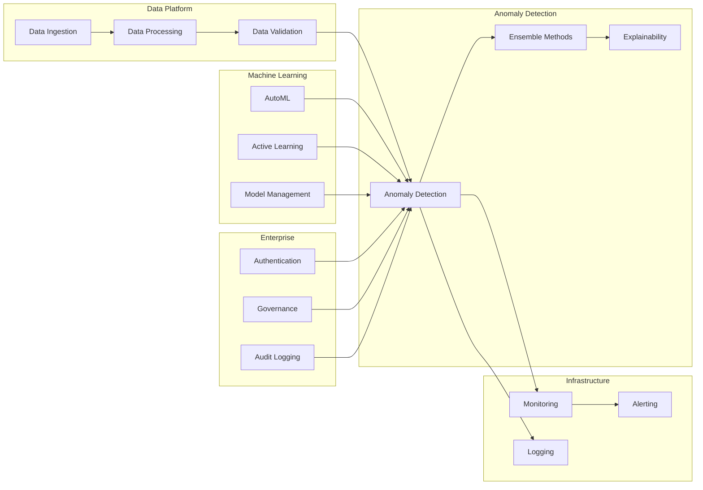

# Cross-Package Workflows

The Anomaly Detection Platform's modular architecture enables powerful workflows that span multiple packages. This guide demonstrates how to combine different packages to create comprehensive solutions.

## 🎯 Common Integration Patterns

### End-to-End Anomaly Detection Pipeline



## 🔄 Workflow Examples

### 1. Automated ML-Driven Anomaly Detection

This workflow combines **Machine Learning** and **Anomaly Detection** packages for fully automated model selection and deployment.

```python
from anomaly_detection import create_detector, load_dataset
from machine_learning import AutoMLOptimizer, ModelManager
from infrastructure.monitoring import MetricsCollector

# Step 1: Load and prepare data using Data Platform
from data_platform import DataLoader, DataProcessor

data_loader = DataLoader()
processor = DataProcessor()

# Load data from multiple sources
raw_data = data_loader.load_from_sources([
    'kafka://anomaly-stream',
    's3://data-lake/sensor-data',
    'postgres://metrics-db/system_metrics'
])

# Process and validate data
processed_data = processor.clean_and_validate(raw_data)
dataset = processor.create_dataset(processed_data, target_column='anomaly')

# Step 2: Use AutoML to find best algorithms
automl = AutoMLOptimizer(
    search_space=['isolation_forest', 'one_class_svm', 'autoencoder'],
    optimization_metric='f1_score',
    max_trials=50
)

# Automated algorithm selection and hyperparameter tuning
best_config = automl.optimize(dataset, time_budget_hours=2)

# Step 3: Create ensemble detector with optimized config
detector = create_detector('ensemble', algorithms=best_config.algorithms)

# Step 4: Set up model management and monitoring
model_manager = ModelManager()
metrics_collector = MetricsCollector()

# Register model for tracking
model_id = model_manager.register_model(
    detector, 
    metadata={
        'automl_config': best_config,
        'dataset_info': dataset.info(),
        'performance_metrics': best_config.metrics
    }
)

# Step 5: Deploy with monitoring
@metrics_collector.monitor_performance
def detect_anomalies(data):
    result = detector.detect(data)
    
    # Log results for governance
    model_manager.log_inference(model_id, {
        'input_size': len(data),
        'anomalies_detected': result.n_anomalies,
        'confidence_scores': result.confidence_scores.tolist(),
        'timestamp': datetime.utcnow()
    })
    
    return result

# Example usage
new_data = data_loader.load_streaming_batch()
anomaly_result = detect_anomalies(new_data)
```

### 2. Real-time Streaming with Enterprise Governance

This workflow combines **Data Platform**, **Anomaly Detection**, and **Enterprise** packages for governed real-time processing.

```python
from data_platform.streaming import KafkaStreamer
from anomaly_detection.streaming import StreamingDetector
from enterprise.auth import authenticate_user
from enterprise.governance import PolicyEngine, AuditLogger
from infrastructure.monitoring import RealTimeMonitor

# Step 1: Set up enterprise authentication and governance
@authenticate_user(required_roles=['anomaly_analyst'])
def setup_streaming_detection(user_context):
    
    # Step 2: Initialize policy engine for governance
    policy_engine = PolicyEngine()
    audit_logger = AuditLogger()
    
    # Check user permissions for data access
    if not policy_engine.check_permission(
        user_context, 'data:sensor_streams:read'
    ):
        raise PermissionError("Insufficient permissions for sensor data")
    
    # Step 3: Set up streaming data pipeline
    streamer = KafkaStreamer(
        topics=['sensor-data', 'network-metrics'],
        consumer_group='anomaly-detection'
    )
    
    # Step 4: Configure streaming detector
    detector = StreamingDetector(
        algorithm='isolation_forest',
        window_size=1000,
        slide_interval=100,
        contamination_rate=0.05
    )
    
    # Step 5: Set up monitoring
    monitor = RealTimeMonitor(
        metrics=['throughput', 'latency', 'accuracy'],
        alert_thresholds={
            'latency_p95': 100,  # 100ms
            'throughput_min': 1000,  # 1000 events/sec
            'accuracy_min': 0.95
        }
    )
    
    # Step 6: Process streaming data with governance
    def process_stream():
        for batch in streamer.stream():
            # Apply data governance policies
            if not policy_engine.validate_data_usage(batch, user_context):
                audit_logger.log_violation(
                    user=user_context.user_id,
                    action='data_access_denied',
                    resource=batch.source,
                    reason='policy_violation'
                )
                continue
            
            # Detect anomalies
            with monitor.measure_latency():
                result = detector.detect_batch(batch)
            
            # Log detection results for audit
            audit_logger.log_detection(
                user=user_context.user_id,
                algorithm=detector.algorithm,
                input_size=len(batch),
                anomalies_found=result.n_anomalies,
                confidence_threshold=detector.contamination_rate
            )
            
            # Handle anomalies based on severity
            for anomaly in result.anomalies:
                severity = classify_severity(anomaly)
                
                if severity == 'high':
                    # Immediate alert
                    monitor.trigger_alert(
                        severity='high',
                        message=f'High-severity anomaly detected: {anomaly}',
                        user=user_context.user_id
                    )
                elif severity == 'medium':
                    # Queue for investigation
                    queue_for_investigation(anomaly, user_context)
    
    return process_stream

# Usage with authentication
user = authenticate_user(token='jwt_token_here')
stream_processor = setup_streaming_detection(user)
stream_processor()
```

### 3. Multi-Modal Anomaly Detection with Active Learning

This workflow demonstrates how to combine multiple data types and use active learning for continuous improvement.

```python
from anomaly_detection import MultiModalDetector
from machine_learning.active_learning import ActiveLearningSession
from data_platform import MultiFormatLoader
from enterprise.governance import DataClassifier

# Step 1: Set up multi-modal data loading
loader = MultiFormatLoader()
classifier = DataClassifier()

# Load different data types
time_series_data = loader.load_timeseries('metrics.csv')
image_data = loader.load_images('sensor_images/')
text_data = loader.load_text('logs.json')
structured_data = loader.load_structured('events.parquet')

# Classify data sensitivity for governance
for data_source in [time_series_data, image_data, text_data, structured_data]:
    sensitivity = classifier.classify_sensitivity(data_source)
    data_source.metadata['sensitivity'] = sensitivity

# Step 2: Create multi-modal detector
detector = MultiModalDetector({
    'timeseries': {
        'algorithm': 'lstm_autoencoder',
        'window_size': 100,
        'features': ['value', 'timestamp']
    },
    'image': {
        'algorithm': 'cnn_autoencoder',
        'input_shape': (224, 224, 3),
        'preprocessing': 'normalize'
    },
    'text': {
        'algorithm': 'transformer_anomaly',
        'model': 'bert-base-uncased',
        'max_length': 512
    },
    'structured': {
        'algorithm': 'isolation_forest',
        'features': 'auto',
        'contamination': 0.1
    }
})

# Step 3: Initial detection round
initial_results = {}
for data_type, data in [
    ('timeseries', time_series_data),
    ('image', image_data),
    ('text', text_data),
    ('structured', structured_data)
]:
    result = detector.detect(data, modality=data_type)
    initial_results[data_type] = result

# Step 4: Set up active learning for continuous improvement
active_session = ActiveLearningSession(
    model=detector,
    sampling_strategy='uncertainty',
    batch_size=10,
    annotator_id='expert_analyst'
)

# Step 5: Human-in-the-loop improvement
def active_learning_loop():
    for iteration in range(10):  # 10 active learning iterations
        
        # Select most uncertain samples for annotation
        uncertain_samples = active_session.select_samples(
            data_sources=initial_results,
            n_samples=10,
            strategy='uncertainty'
        )
        
        # Present to human annotator (simulated here)
        annotations = {}
        for sample in uncertain_samples:
            # In practice, this would be a human interface
            is_anomaly = human_annotate(sample)
            annotations[sample.id] = {
                'is_anomaly': is_anomaly,
                'confidence': 'high',
                'feedback_type': 'binary_classification'
            }
        
        # Update model with human feedback
        active_session.incorporate_feedback(annotations)
        
        # Retrain detector with new labels
        detector.retrain(
            additional_labels=annotations,
            method='incremental'
        )
        
        # Evaluate improvement
        validation_data = loader.load_validation_set()
        new_performance = detector.evaluate(validation_data)
        
        print(f"Iteration {iteration + 1}: "
              f"F1-Score improved to {new_performance.f1_score:.3f}")
        
        # Stop if performance plateaus
        if new_performance.f1_score > 0.95:
            break

# Run active learning
active_learning_loop()
```

### 4. Enterprise Data Pipeline with Full Observability

This workflow shows a complete enterprise-grade pipeline with all observability and governance features.

```python
from data_platform import DataPipeline, DataQualityMonitor
from anomaly_detection import ProductionDetector
from enterprise.auth import RBACManager
from enterprise.governance import ComplianceManager
from infrastructure.monitoring import ObservabilityStack
from infrastructure.logging import StructuredLogger

# Step 1: Set up enterprise infrastructure
rbac = RBACManager()
compliance = ComplianceManager()
observability = ObservabilityStack()
logger = StructuredLogger()

# Step 2: Define data pipeline with quality monitoring
class EnterpriseAnomalyPipeline:
    def __init__(self, user_context):
        self.user = user_context
        self.pipeline = DataPipeline()
        self.quality_monitor = DataQualityMonitor()
        self.detector = ProductionDetector()
        
    @rbac.require_permissions(['data:read', 'anomaly:detect'])
    @compliance.audit_action('anomaly_detection')
    @observability.trace_execution
    def process_data(self, data_source):
        
        # Step 3: Data ingestion with quality checks
        with logger.context(user=self.user.id, action='data_ingestion'):
            raw_data = self.pipeline.ingest(
                source=data_source,
                format='auto_detect',
                validation_rules='strict'
            )
            
            # Quality monitoring
            quality_report = self.quality_monitor.assess(raw_data)
            
            if quality_report.quality_score < 0.8:
                logger.warning(
                    "Data quality below threshold",
                    quality_score=quality_report.quality_score,
                    issues=quality_report.issues
                )
                
                if not compliance.allow_low_quality_processing(self.user):
                    raise DataQualityError(
                        "Data quality insufficient for processing"
                    )
        
        # Step 4: Data preprocessing with lineage tracking
        with logger.context(action='data_preprocessing'):
            processed_data = self.pipeline.preprocess(
                data=raw_data,
                steps=['clean', 'normalize', 'feature_engineer'],
                track_lineage=True
            )
            
            # Log data lineage for governance
            compliance.record_data_lineage(
                source=data_source,
                transformations=self.pipeline.get_lineage(),
                output_schema=processed_data.schema
            )
        
        # Step 5: Anomaly detection with monitoring
        with observability.monitor_ml_inference():
            detection_result = self.detector.detect(
                data=processed_data,
                algorithm='ensemble',
                explainability=True
            )
            
            # Log detection metrics
            observability.record_metrics({
                'anomalies_detected': detection_result.n_anomalies,
                'processing_time': detection_result.metadata['processing_time'],
                'confidence_avg': detection_result.confidence_scores.mean(),
                'data_points_processed': len(processed_data)
            })
        
        # Step 6: Results validation and storage
        with logger.context(action='results_processing'):
            
            # Validate results against business rules
            validated_results = compliance.validate_results(
                results=detection_result,
                business_rules='anomaly_detection_rules',
                user_context=self.user
            )
            
            # Store results with proper access controls
            result_id = self.pipeline.store_results(
                results=validated_results,
                access_policy=rbac.get_user_access_policy(self.user),
                retention_policy='7_years'  # Compliance requirement
            )
            
            logger.info(
                "Anomaly detection completed",
                result_id=result_id,
                anomalies_count=validated_results.n_anomalies,
                confidence_threshold=self.detector.contamination_rate
            )
        
        return validated_results

# Step 7: Usage with full enterprise features
@rbac.authenticate_user
def run_enterprise_pipeline(user_token, data_sources):
    
    user_context = rbac.get_user_context(user_token)
    pipeline = EnterpriseAnomalyPipeline(user_context)
    
    results = []
    for source in data_sources:
        try:
            result = pipeline.process_data(source)
            results.append(result)
            
        except Exception as e:
            logger.error(
                "Pipeline execution failed",
                user=user_context.id,
                source=source,
                error=str(e)
            )
            
            # Alert operations team
            observability.trigger_alert(
                severity='high',
                message=f'Pipeline failure for user {user_context.id}',
                details={'source': source, 'error': str(e)}
            )
            
            # Compliance notification
            compliance.notify_incident(
                type='processing_failure',
                user=user_context.id,
                impact='data_processing_delayed'
            )
    
    return results

# Execute pipeline
user_token = 'jwt_user_token'
data_sources = ['s3://data-lake/sensor-stream', 'postgres://db/metrics']
results = run_enterprise_pipeline(user_token, data_sources)
```

## 🔗 Integration Best Practices

### 1. Package Communication Patterns

#### Event-Driven Architecture
```python
from infrastructure.events import EventBus

# Set up event bus for loose coupling
event_bus = EventBus()

# Anomaly Detection publishes events
@event_bus.publisher('anomaly.detected')
def on_anomaly_detected(anomaly_data):
    return {
        'anomaly_id': anomaly_data.id,
        'severity': anomaly_data.severity,
        'confidence': anomaly_data.confidence,
        'timestamp': datetime.utcnow()
    }

# Machine Learning subscribes to events
@event_bus.subscriber('anomaly.detected')
def update_model_performance(event_data):
    model_manager.record_inference_result(
        model_id=event_data['model_id'],
        accuracy=event_data['confidence']
    )

# Enterprise packages handle governance
@event_bus.subscriber('anomaly.detected')
def audit_anomaly_detection(event_data):
    audit_logger.log_event(
        event_type='anomaly_detected',
        severity=event_data['severity'],
        model_confidence=event_data['confidence']
    )
```

#### Dependency Injection
```python
from typing import Protocol
from infrastructure.di import Container, inject

# Define interfaces for loose coupling
class AnomalyDetector(Protocol):
    def detect(self, data) -> DetectionResult: ...

class ModelManager(Protocol):
    def get_model(self, model_id: str) -> Any: ...
    def update_model(self, model_id: str, model: Any) -> None: ...

# Implementation with dependency injection
class ProductionAnomalyService:
    def __init__(
        self,
        detector: AnomalyDetector = inject('anomaly_detector'),
        model_manager: ModelManager = inject('model_manager'),
        monitor: Monitor = inject('monitor')
    ):
        self.detector = detector
        self.model_manager = model_manager
        self.monitor = monitor
    
    def process(self, data):
        with self.monitor.measure_performance():
            result = self.detector.detect(data)
            self.model_manager.update_model_metrics(result)
            return result

# Configure container
container = Container()
container.register('anomaly_detector', IsolationForestDetector())
container.register('model_manager', MLflowModelManager())
container.register('monitor', PrometheusMonitor())
```

### 2. Configuration Management

#### Centralized Configuration
```python
from infrastructure.config import ConfigManager

# Centralized configuration for all packages
config = ConfigManager.load({
    'anomaly_detection': {
        'algorithms': {
            'isolation_forest': {
                'contamination': 0.1,
                'n_estimators': 100
            },
            'one_class_svm': {
                'nu': 0.05,
                'kernel': 'rbf'
            }
        },
        'ensemble': {
            'method': 'voting',
            'weights': 'uniform'
        }
    },
    'machine_learning': {
        'automl': {
            'max_trials': 100,
            'time_budget_hours': 2
        },
        'model_registry': {
            'backend': 'mlflow',
            'uri': 'postgresql://localhost/mlflow'
        }
    },
    'enterprise': {
        'auth': {
            'provider': 'oauth2',
            'token_expiry': 3600
        },
        'governance': {
            'audit_level': 'detailed',
            'retention_days': 2555  # 7 years
        }
    }
})

# Use configuration across packages
detector = create_detector(config.anomaly_detection.algorithms)
automl = AutoMLOptimizer(config.machine_learning.automl)
auth = AuthManager(config.enterprise.auth)
```

### 3. Error Handling and Resilience

#### Circuit Breaker Pattern
```python
from infrastructure.resilience import CircuitBreaker, RetryPolicy

# Set up circuit breakers for cross-package calls
@CircuitBreaker(
    failure_threshold=5,
    recovery_timeout=30,
    expected_exception=ServiceUnavailableError
)
@RetryPolicy(max_attempts=3, backoff='exponential')
def call_ml_service(data):
    return ml_service.optimize_model(data)

# Graceful degradation
def robust_anomaly_detection(data):
    try:
        # Try ML-optimized detection
        optimized_detector = call_ml_service(data)
        return optimized_detector.detect(data)
    
    except CircuitBreakerOpenError:
        # Fall back to default detector
        logger.warning("ML service unavailable, using default detector")
        default_detector = create_detector('isolation_forest')
        return default_detector.detect(data)
```

## 📊 Monitoring Cross-Package Workflows

### Distributed Tracing
```python
from infrastructure.tracing import trace_workflow

@trace_workflow(name='end_to_end_anomaly_detection')
def complete_anomaly_workflow(data_source):
    
    with trace_span('data_ingestion'):
        data = data_platform.ingest(data_source)
    
    with trace_span('data_preprocessing'):
        processed_data = data_platform.preprocess(data)
    
    with trace_span('anomaly_detection'):
        result = anomaly_detection.detect(processed_data)
    
    with trace_span('model_management'):
        machine_learning.update_model_metrics(result)
    
    with trace_span('governance_audit'):
        enterprise.audit_detection(result)
    
    return result
```

### Performance Monitoring
```python
from infrastructure.monitoring import WorkflowMonitor

monitor = WorkflowMonitor()

@monitor.track_workflow_performance
def monitored_workflow(data):
    # Track package-specific metrics
    monitor.start_phase('data_processing')
    processed_data = data_platform.process(data)
    monitor.end_phase('data_processing')
    
    monitor.start_phase('anomaly_detection')
    result = anomaly_detection.detect(processed_data)
    monitor.end_phase('anomaly_detection')
    
    # Record cross-package metrics
    monitor.record_metric('end_to_end_latency', monitor.total_time)
    monitor.record_metric('data_quality_score', processed_data.quality_score)
    monitor.record_metric('anomalies_detected', result.n_anomalies)
    
    return result
```

## 🚀 Next Steps

1. **[Production Deployment Guide](production-deployment.md)** - Deploy integrated workflows
2. **[Monitoring & Observability](monitoring.md)** - Monitor cross-package performance
3. **[Security Best Practices](security.md)** - Secure multi-package architectures
4. **[Performance Optimization](performance.md)** - Optimize cross-package communications

## 📚 Additional Resources

- **[Package API References](../api/index.md)** - Detailed API documentation
- **[Architecture Patterns](../architecture/design-patterns.md)** - Architectural guidance
- **[Example Applications](../examples/integrations.md)** - Complete integration examples
- **[Troubleshooting Guide](troubleshooting.md)** - Common integration issues