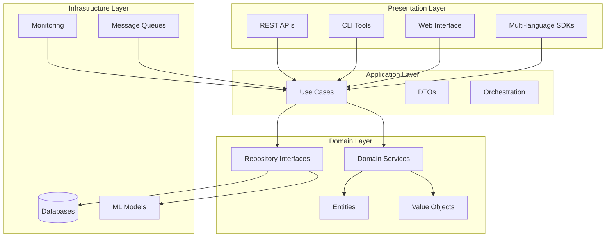

# Welcome to the Anomaly Detection Platform

<div align="center">
  
  
  **Enterprise-grade anomaly detection platform with machine learning capabilities**
  
  [](https://anomaly-detection-platform.github.io/docs)
  [](https://pypi.org/project/anomaly-detection/)
  [](https://github.com/anomaly-detection-platform/monorepo/actions)
  [](https://codecov.io/gh/anomaly-detection-platform/monorepo)
  [](https://github.com/anomaly-detection-platform/monorepo/blob/main/LICENSE)
</div>

---

## 🚀 What is the Anomaly Detection Platform?

The **Anomaly Detection Platform** is a comprehensive, enterprise-ready solution for detecting anomalies in time series data, streaming data, and batch datasets. Built with modern software architecture principles, it provides:

- **🤖 Advanced ML Algorithms** - State-of-the-art anomaly detection models
- **⚡ Real-time Processing** - High-performance streaming analytics  
- **🔧 Enterprise Features** - Authentication, authorization, and governance
- **📊 Multi-modal Support** - Time series, images, text, and structured data
- **🌐 Multi-language SDKs** - Python, TypeScript, Java, and more
- **☁️ Cloud-native** - Kubernetes-ready with observability built-in

## 🎯 Quick Navigation

<div class="grid cards" markdown>

-   :material-rocket-launch: **[Getting Started](getting-started/quickstart.md)**

    ---

    New to the platform? Start here for installation, basic concepts, and your first anomaly detection workflow.

-   :material-package-variant: **[Platform Packages](packages/index.md)**

    ---

    Explore the comprehensive suite of packages including anomaly detection, ML, data processing, and enterprise features.

-   :material-api: **[API Reference](api/index.md)**

    ---

    Complete API documentation for REST endpoints, Python/TypeScript/Java SDKs, and CLI tools.

-   :material-school: **[Examples & Tutorials](examples/index.md)**

    ---

    Hands-on examples, industry use cases, and step-by-step tutorials for common workflows.

</div>

## 🏗️ Platform Architecture

The platform follows **Clean Architecture** principles with clear domain boundaries:



## 📦 Core Packages

### [Anomaly Detection](packages/anomaly-detection/index.md)
The flagship package providing comprehensive anomaly detection capabilities with 20+ algorithms, ensemble methods, and real-time processing.

**Key Features:**
- Statistical, ML, and DL-based algorithms
- Streaming anomaly detection
- Explainable AI capabilities
- Production-ready deployment

### [Machine Learning](packages/machine-learning/index.md)
Advanced ML capabilities including AutoML, active learning, and model management with full MLOps integration.

**Key Features:**
- Automated model selection and tuning
- Active learning workflows
- Model versioning and deployment
- A/B testing framework

### [Data Platform](packages/data-platform/index.md)
Comprehensive data processing and engineering capabilities for batch and streaming workloads.

**Key Features:**
- ETL/ELT pipelines
- Stream processing
- Data quality monitoring
- Schema management

### [Enterprise](packages/enterprise/index.md)
Enterprise-grade features including authentication, authorization, governance, and compliance.

**Key Features:**
- Role-based access control
- Audit logging
- Policy enforcement
- Compliance reporting

## 🚀 Getting Started in 5 Minutes

### 1. Install the Platform

=== "Python"

    ```bash
    pip install anomaly-detection[all]
    ```

=== "Docker"

    ```bash
    docker run -p 8000:8000 anomaly-detection/platform:latest
    ```

=== "Kubernetes"

    ```bash
    kubectl apply -f https://raw.githubusercontent.com/anomaly-detection-platform/monorepo/main/deploy/k8s/platform.yaml
    ```

### 2. Your First Detection

```python
from anomaly_detection import create_detector, load_dataset

# Load sample data
data = load_dataset('timeseries_sample')

# Create detector
detector = create_detector('IsolationForest', contamination_rate=0.1)

# Detect anomalies
result = detector.detect(data)

print(f"Found {result.n_anomalies} anomalies out of {len(data)} samples")
```

### 3. Explore Advanced Features

- **[Real-time Streaming](packages/anomaly-detection/streaming.md)** - Process data streams in real-time
- **[Ensemble Methods](packages/anomaly-detection/ensemble.md)** - Combine multiple algorithms
- **[Explainable AI](packages/anomaly-detection/explainability.md)** - Understand why anomalies were detected
- **[Production Deployment](guides/production-deployment.md)** - Deploy at scale

## 🎓 Learning Paths

Choose your path based on your role and goals:

<div class="grid cards" markdown>

-   :material-chart-line: **Data Scientist**

    ---

    Learn to build, train, and deploy anomaly detection models with advanced algorithms and explainability.
    
    [:octicons-arrow-right-24: Start Learning](getting-started/learning-paths.md#data-scientist)

-   :material-code-tags: **Software Engineer**

    ---

    Integrate anomaly detection into applications using our SDKs, APIs, and deployment patterns.
    
    [:octicons-arrow-right-24: Start Building](getting-started/learning-paths.md#software-engineer)

-   :material-cloud: **DevOps Engineer**

    ---

    Deploy, monitor, and scale the platform in production environments with observability.
    
    [:octicons-arrow-right-24: Start Deploying](getting-started/learning-paths.md#devops-engineer)

-   :material-briefcase: **Business User**

    ---

    Understand platform capabilities, use cases, and business value across industries.
    
    [:octicons-arrow-right-24: Explore Use Cases](getting-started/learning-paths.md#business-user)

</div>

## 🌟 Key Features

### Advanced Algorithms
- **Statistical Methods**: Z-score, Modified Z-score, IQR, Seasonal decomposition
- **Machine Learning**: Isolation Forest, One-Class SVM, Local Outlier Factor
- **Deep Learning**: Autoencoders, LSTM-based detection, Transformer models
- **Time Series**: ARIMA-based, Prophet, Seasonal-Trend decomposition

### Production-Ready
- **High Performance**: Optimized for large-scale data processing
- **Scalability**: Horizontal scaling with Kubernetes
- **Observability**: Comprehensive metrics, logging, and tracing
- **Security**: Enterprise-grade authentication and authorization

### Developer Experience
- **Multi-language SDKs**: Python, TypeScript, Java with more coming
- **Comprehensive APIs**: RESTful APIs with OpenAPI specifications
- **CLI Tools**: Command-line interface for all operations
- **Rich Documentation**: Interactive examples and tutorials

## 📊 Use Cases

### Financial Services
- Fraud detection in transactions
- Market anomaly monitoring
- Risk management systems
- Regulatory compliance

### Manufacturing
- Equipment failure prediction
- Quality control monitoring
- Supply chain optimization
- Predictive maintenance

### Healthcare
- Patient monitoring systems
- Drug discovery anomalies
- Clinical trial monitoring
- Medical device validation

### Technology
- System performance monitoring
- Security breach detection
- User behavior analysis
- Infrastructure monitoring

## 🤝 Community & Support

### Get Help
- **[Documentation](getting-started/index.md)**: Comprehensive guides and references
- **[GitHub Issues](https://github.com/anomaly-detection-platform/monorepo/issues)**: Bug reports and feature requests
- **[Community Forum](resources/community.md)**: Ask questions and share knowledge
- **[Stack Overflow](https://stackoverflow.com/questions/tagged/anomaly-detection-platform)**: Technical Q&A

### Contribute
- **[Contributing Guide](resources/community.md#contributing)**: How to contribute to the platform
- **[Development Setup](getting-started/development.md)**: Set up your development environment
- **[Code of Conduct](resources/community.md#code-of-conduct)**: Community guidelines

## 📈 What's Next?

Ready to dive deeper? Here are some recommended next steps:

1. **[Platform Overview](getting-started/platform-overview.md)** - Understand the complete platform capabilities
2. **[Installation Guide](getting-started/installation.md)** - Detailed installation instructions for all environments  
3. **[Your First Project](getting-started/quickstart.md)** - Build your first anomaly detection system
4. **[Architecture Deep Dive](architecture/platform-architecture.md)** - Learn the technical architecture
5. **[Production Deployment](guides/production-deployment.md)** - Deploy to production environments

---

<div align="center">
  <p><strong>Ready to detect anomalies at scale?</strong></p>
  <p>
    <a href="getting-started/quickstart.md" class="md-button md-button--primary">Get Started Now</a>
    <a href="examples/index.md" class="md-button">View Examples</a>
  </p>
</div>