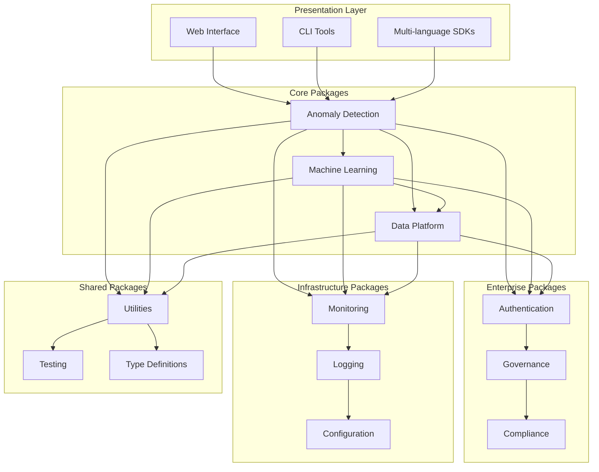

# Platform Packages

The Anomaly Detection Platform is built as a modular monorepo with clearly defined package boundaries. Each package serves a specific domain and can be used independently or in combination with others.

## 📦 Package Architecture



## 🏆 Core Packages

### [Anomaly Detection](anomaly-detection/index.md)
**Path**: `src/packages/data/anomaly_detection/`  
**Status**: 🟢 Production Ready  
**Maturity**: ⭐⭐⭐⭐⭐

The flagship package providing comprehensive anomaly detection capabilities with 20+ algorithms, ensemble methods, and real-time processing.

<div class="grid cards" markdown>

-   **🧮 Algorithms**

    ---

    20+ algorithms including statistical, ML, and deep learning approaches

-   **⚡ Real-time**

    ---

    High-performance streaming anomaly detection with Kafka integration

-   **🔍 Explainable**

    ---

    SHAP and LIME integration for model interpretability

-   **🎯 Production**

    ---

    Enterprise-ready with monitoring, logging, and deployment tools

</div>

**Key Features:**
- Statistical methods (Z-score, IQR, seasonal decomposition)
- Machine learning algorithms (Isolation Forest, One-Class SVM, LOF)
- Deep learning models (Autoencoders, LSTM, Transformers)
- Ensemble methods for improved accuracy
- Real-time streaming with configurable windows
- Explainable AI with SHAP/LIME integration
- Production deployment tools and monitoring

**Use Cases:**
- Financial fraud detection
- IoT sensor monitoring  
- Network security analysis
- Quality control in manufacturing

---

### [Machine Learning](machine-learning/index.md)
**Path**: `src/packages/ai/machine_learning/`  
**Status**: 🟡 Beta  
**Maturity**: ⭐⭐⭐⭐

Advanced ML capabilities including AutoML, active learning, and comprehensive model management with MLOps integration.

<div class="grid cards" markdown>

-   **🤖 AutoML**

    ---

    Automated model selection, hyperparameter tuning, and feature engineering

-   **📚 Active Learning**

    ---

    Human-in-the-loop learning for improved model performance

-   **🔄 MLOps**

    ---

    Complete model lifecycle management with versioning and monitoring

-   **🧪 A/B Testing**

    ---

    Model comparison and performance validation framework

</div>

**Key Features:**
- Automated model selection and hyperparameter optimization
- Active learning workflows with human feedback
- Model versioning and lifecycle management
- A/B testing framework for model comparison
- Experiment tracking with MLflow integration
- Model deployment and serving capabilities
- Performance monitoring and drift detection

**Use Cases:**
- Automated model development
- Continuous model improvement
- Model performance optimization
- Research and experimentation

---

### [Data Platform](data-platform/index.md)
**Path**: `src/packages/data/`  
**Status**: 🟡 Beta  
**Maturity**: ⭐⭐⭐

Comprehensive data processing and engineering capabilities for batch and streaming workloads with enterprise-grade data management.

<div class="grid cards" markdown>

-   **🔄 ETL/ELT**

    ---

    Flexible data pipeline management with scheduling and monitoring

-   **🌊 Streaming**

    ---

    Real-time data processing with Apache Kafka and Apache Spark

-   **✅ Quality**

    ---

    Data validation, profiling, and quality monitoring

-   **📊 Formats**

    ---

    Support for JSON, CSV, Parquet, Avro, and custom formats

</div>

**Key Features:**
- ETL/ELT pipeline management with Apache Airflow
- Stream processing with Kafka and Spark integration
- Data quality monitoring and validation
- Schema management and evolution
- Multi-format data support (JSON, CSV, Parquet, Avro)
- Data lineage tracking and governance
- Performance optimization and caching

**Use Cases:**
- Data warehouse integration
- Real-time analytics pipelines
- Data lake management
- Multi-source data integration

## 🏢 Enterprise Packages

### [Enterprise Authentication](enterprise/authentication.md)
**Path**: `src/packages/enterprise/enterprise_auth/`  
**Status**: 🟢 Production Ready  
**Maturity**: ⭐⭐⭐⭐⭐

Enterprise-grade authentication and authorization with support for multiple identity providers and advanced security features.

**Key Features:**
- JWT and OAuth2 authentication
- SAML integration for enterprise SSO
- Multi-factor authentication (MFA)
- Role-based access control (RBAC)
- API key management
- Session management and security
- Integration with Active Directory/LDAP

---

### [Governance](enterprise/governance.md)
**Path**: `src/packages/enterprise/enterprise_governance/`  
**Status**: 🟡 Beta  
**Maturity**: ⭐⭐⭐

Comprehensive governance framework for policy enforcement, compliance management, and organizational oversight.

**Key Features:**
- Policy definition and enforcement
- Compliance monitoring and reporting
- Audit trail management
- Data governance and stewardship
- Risk assessment and management
- Workflow approval processes
- Integration with compliance frameworks

## 🔧 Infrastructure Packages

### [Monitoring](infrastructure/monitoring.md)
**Path**: `src/packages/infrastructure/monitoring/`  
**Status**: 🟢 Production Ready  
**Maturity**: ⭐⭐⭐⭐

Comprehensive monitoring and observability stack with metrics, logging, and distributed tracing capabilities.

**Key Features:**
- Prometheus metrics collection
- Grafana visualization and alerting
- Custom dashboards and alerts
- Performance monitoring
- Health checks and circuit breakers
- SLA/SLO monitoring
- Integration with external monitoring tools

---

### [Logging](infrastructure/logging.md)
**Path**: `src/packages/infrastructure/logging/`  
**Status**: 🟢 Production Ready  
**Maturity**: ⭐⭐⭐⭐

Structured logging framework with centralized log aggregation and analysis capabilities.

**Key Features:**
- Structured JSON logging
- ELK stack integration (Elasticsearch, Logstash, Kibana)
- Log aggregation and analysis
- Custom log processors
- Log retention and archival policies
- Security and compliance logging
- Real-time log streaming

## 🛠️ Supporting Packages

### Tools & Utilities
**Path**: `src/packages/shared/tools/`  
**Status**: 🟢 Production Ready

Common utilities, helper functions, and development tools used across the platform.

**Key Features:**
- Configuration management utilities
- Data validation helpers
- Testing utilities and fixtures
- Performance profiling tools
- Development and debugging tools
- Code generation utilities

### Testing Framework
**Path**: `src/packages/shared/testing/`  
**Status**: 🟢 Production Ready

Comprehensive testing framework with fixtures, mocks, and utilities for all package testing needs.

**Key Features:**
- Unit testing utilities
- Integration testing framework
- Mock services and data generators
- Performance testing tools
- Test data management
- Continuous testing integration

## 📊 Package Maturity Matrix

| Package | Status | Test Coverage | Documentation | Production Use |
|---------|--------|---------------|---------------|----------------|
| Anomaly Detection | 🟢 Production | 95%+ | Complete | ✅ Enterprise |
| Machine Learning | 🟡 Beta | 90%+ | Good | ✅ Limited |
| Data Platform | 🟡 Beta | 85%+ | Good | ✅ Limited |
| Enterprise Auth | 🟢 Production | 95%+ | Complete | ✅ Enterprise |
| Governance | 🟡 Beta | 80%+ | Basic | ❌ Development |
| Monitoring | 🟢 Production | 90%+ | Good | ✅ Enterprise |
| Logging | 🟢 Production | 95%+ | Good | ✅ Enterprise |

## 🔄 Package Dependencies

Understanding package dependencies is crucial for integration planning:

### Core Dependencies
- **Anomaly Detection** depends on: Data Platform, Monitoring, Logging
- **Machine Learning** depends on: Data Platform, Monitoring, Logging  
- **Data Platform** depends on: Monitoring, Logging, Tools

### Enterprise Dependencies
- **Authentication** depends on: Logging, Tools
- **Governance** depends on: Authentication, Logging, Tools

### Infrastructure Dependencies
- **Monitoring** depends on: Logging, Tools
- **Logging** depends on: Tools

## 🚀 Getting Started with Packages

### Installation Options

#### Complete Platform
```bash
pip install anomaly-detection[all]
```

#### Specific Packages
```bash
# Core anomaly detection only
pip install anomaly-detection[core]

# With machine learning features
pip install anomaly-detection[ml]

# With enterprise features  
pip install anomaly-detection[enterprise]

# Development setup
pip install anomaly-detection[dev]
```

#### Docker Deployment
```bash
# Full platform
docker run -p 8000:8000 anomaly-detection/platform:latest

# Specific services
docker run anomaly-detection/core:latest
docker run anomaly-detection/ml:latest
```

### Configuration Management

Each package supports flexible configuration:

```python
from anomaly_detection import configure_platform

# Configure entire platform
configure_platform({
    'anomaly_detection': {
        'algorithms': ['isolation_forest', 'one_class_svm'],
        'performance': 'high'
    },
    'machine_learning': {
        'automl': True,
        'experiment_tracking': True
    },
    'enterprise': {
        'authentication': 'oauth2',
        'governance': True
    }
})
```

## 📚 Next Steps

1. **[Start with Anomaly Detection](anomaly-detection/index.md)** - The flagship package with comprehensive features
2. **[Explore Machine Learning](machine-learning/index.md)** - Advanced ML capabilities and AutoML
3. **[Check Integration Patterns](../guides/cross-package-workflows.md)** - Learn how packages work together
4. **[Review Architecture](../architecture/platform-architecture.md)** - Understand the overall system design

## 🤝 Contributing to Packages

Each package welcomes contributions:

- **Bug Reports**: Use GitHub issues with package-specific labels
- **Feature Requests**: Discuss in GitHub discussions  
- **Pull Requests**: Follow the contribution guidelines for each package
- **Documentation**: Help improve documentation and examples

For detailed contribution guidelines, see each package's README and CONTRIBUTING.md files.