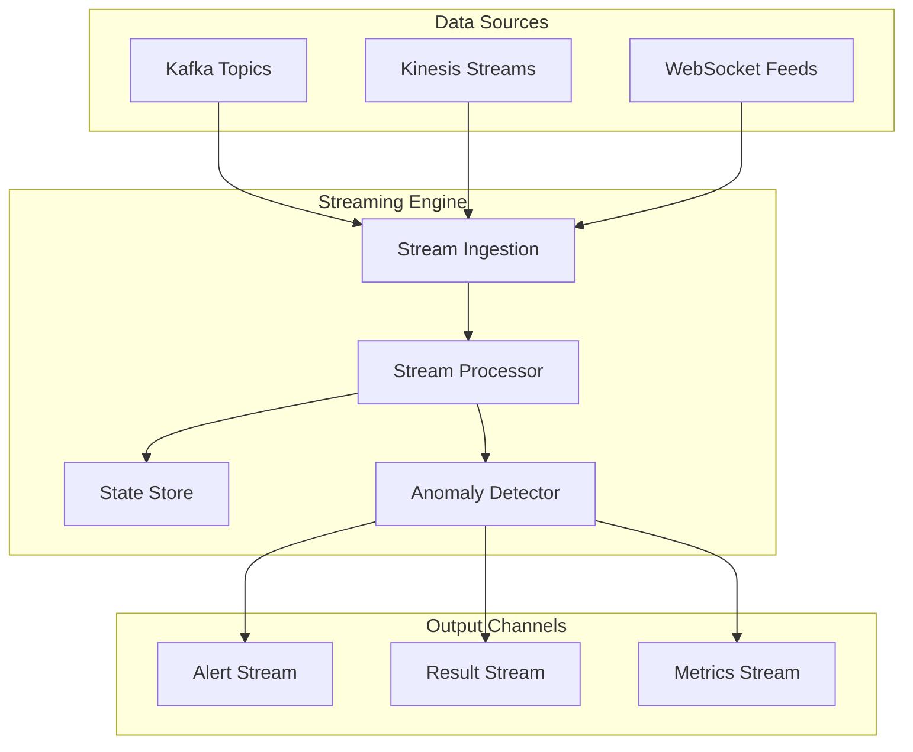
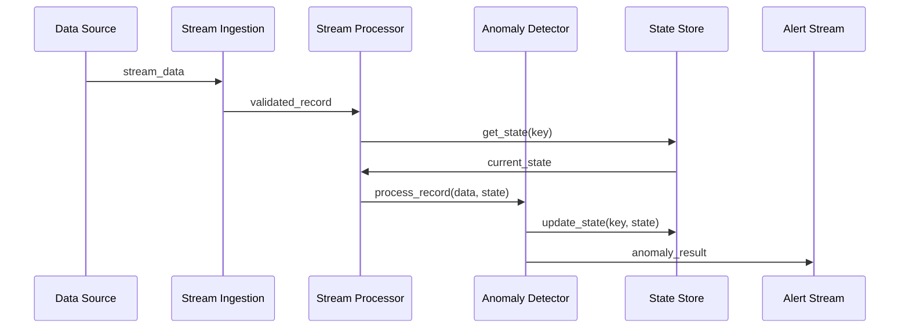

# ADR-011: Streaming Engine Architecture

🍞 **Breadcrumb:** 🏠 [Home](../../../index.md) > 👨‍💻 [Developer Guides](../../README.md) > 🏗️ [Architecture](../README.md) > 📋 [ADR](README.md) > Streaming Engine Architecture

## Status

PROPOSED

## Context

### Problem Statement
Pynomaly needs to support real-time anomaly detection for streaming data sources, requiring a robust streaming engine that can handle high-velocity data while maintaining low latency and high throughput. The current batch-oriented processing model is insufficient for use cases requiring immediate anomaly detection.

### Goals
- Enable real-time anomaly detection with <100ms latency
- Support multiple streaming data sources (Kafka, Kinesis, WebSocket)
- Maintain >10,000 records/second throughput
- Provide fault tolerance and exactly-once processing guarantees
- Support both stateful and stateless anomaly detection algorithms

### Constraints
- Must integrate with existing algorithm registry system
- Memory usage must be bounded for continuous operation
- Must support horizontal scaling
- Must work with existing monitoring and alerting systems
- Must maintain compatibility with batch processing workflows

### Assumptions
- Streaming data sources will provide structured data formats
- Algorithm performance characteristics are suitable for streaming
- Network latency between components is <10ms
- Data ordering may not be guaranteed in all streaming scenarios

## Decision

### Chosen Solution
Implement a **Streaming Engine** based on Apache Kafka Streams with custom processing topology for anomaly detection.

### Rationale
Apache Kafka Streams provides mature streaming capabilities with exactly-once processing guarantees, distributed state management, and horizontal scaling. This enables real-time anomaly detection while maintaining system reliability and performance.

## Architecture

### System Overview

### Component Interactions

## Options Considered

### Pros and Cons Matrix

| Option | Pros | Cons | Score |
|--------|------|------|-------|
| **Apache Kafka Streams** | ✅ Mature platform ✅ Exactly-once processing ✅ Horizontal scaling | ❌ Kafka dependency ❌ Learning curve | **9/10** |
| Apache Flink | ✅ Low latency ✅ Event time processing | ❌ Operational complexity ❌ Steeper learning curve | 8/10 |
| Custom Solution | ✅ Full control ✅ Minimal dependencies | ❌ Development overhead ❌ Reliability concerns | 5/10 |

### Rejected Alternatives
- **Apache Flink**: Too complex for current needs and adds operational overhead
- **Custom Solution**: Would require significant development effort and reliability concerns

## Implementation

### Technical Approach
1. Set up Kafka Streams infrastructure
2. Implement multi-source data ingestion layer
3. Create anomaly detection processing topology
4. Add state management for stateful algorithms
5. Implement output streams for results and alerts

### Migration Strategy
1. **Phase 1**: Implement streaming engine alongside batch processing
2. **Phase 2**: Migrate real-time use cases to streaming
3. **Phase 3**: Gradually transition remaining workloads

### Testing Strategy
- Unit tests for stream processing components
- Integration tests with algorithm registry
- Performance tests for throughput and latency
- Chaos engineering for fault tolerance

## Consequences

### Positive
- Real-time anomaly detection capabilities
- Scalable streaming infrastructure
- Fault-tolerant processing
- Integration with existing systems

### Negative
- Additional operational complexity
- Kafka infrastructure dependency
- Learning curve for streaming paradigms
- Increased memory and compute requirements

### Neutral
- New monitoring requirements for streaming metrics
- Changes to deployment architecture
- Additional testing requirements

## Compliance

### Security Impact
- Stream encryption for data in transit
- Authentication and authorization for stream access
- Audit logging for stream processing events

### Performance Impact
- Target: <100ms processing latency
- Target: >10,000 records/second throughput
- Memory: Bounded by configurable state store sizes

### Monitoring Requirements
- Stream processing latency metrics
- Throughput and error rate monitoring
- Kafka lag and consumer group health
- State store size and performance metrics

## Decision Log

| Date | Author | Action | Rationale |
|------|--------|--------|-----------|
| 2025-01-07 | Architecture Team | PROPOSED | Initial proposal for streaming engine |

## References

- [Apache Kafka Streams Documentation](https://kafka.apache.org/documentation/streams/)
- [Algorithm Registry ADR](ADR-003.md)
- [Streaming Data Processing Patterns](https://kafka.apache.org/documentation/streams/developer-guide/processor-api.html)

---

## 🔗 **Related Documentation**

### **Architecture**
- **[Architecture Overview](../overview.md)** - System design principles
- **[Clean Architecture](../overview.md)** - Architectural patterns
- **[ADR Index](README.md)** - All architectural decisions

### **Implementation**
- **[Implementation Guide](../../contributing/IMPLEMENTATION_GUIDE.md)** - Coding standards
- **[Contributing Guidelines](../../contributing/CONTRIBUTING.md)** - Development process
- **[File Organization](../../contributing/FILE_ORGANIZATION_STANDARDS.md)** - Project structure

### **Deployment**
- **[Production Deployment](../../../deployment/README.md)** - Production setup
- **[Security](../../../deployment/SECURITY.md)** - Security configuration
- **[Monitoring](../../../user-guides/basic-usage/monitoring.md)** - System observability

---

**Authors:** Architecture Team 
**Last Updated:** 2025-01-07 
**Next Review:** 2025-04-07
