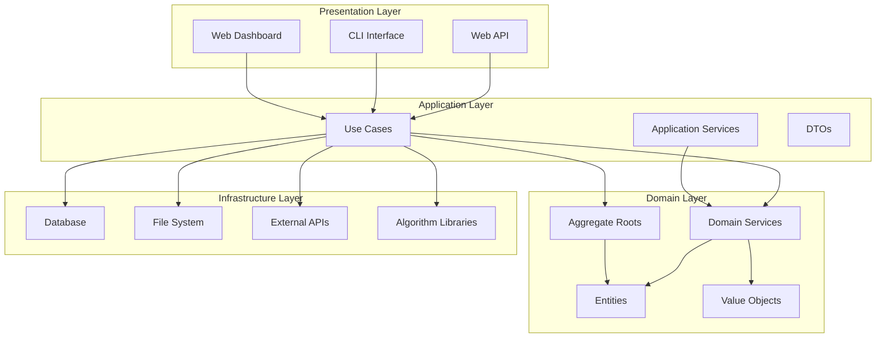
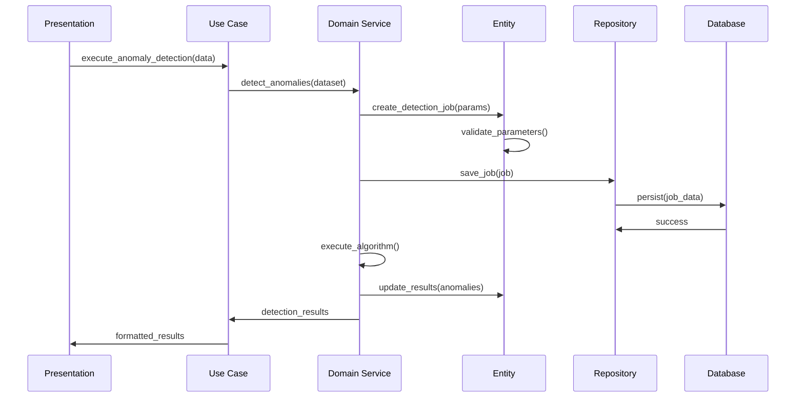

# ADR-013: Clean Architecture & DDD Adoption

🍞 **Breadcrumb:** 🏠 [Home](../../../index.md) > 👨‍💻 [Developer Guides](../../README.md) > 🏗️ [Architecture](../README.md) > 📋 [ADR](README.md) > Clean Architecture & DDD Adoption

## Status

ACCEPTED

## Context

### Problem Statement
The Pynomaly system has grown in complexity with multiple detection algorithms, data sources, and presentation layers. The current architecture lacks clear separation of concerns, making it difficult to maintain, test, and extend. Business logic is scattered across layers, and dependencies are tightly coupled, hindering independent development and deployment of components.

### Goals
- Establish clear architectural boundaries and separation of concerns
- Implement Domain-Driven Design principles for better business logic modeling
- Create testable, maintainable, and extensible code structure
- Enable independent development of different system layers
- Improve code quality and reduce technical debt
- Support future scaling and evolution of the anomaly detection platform

### Constraints
- Must maintain backward compatibility with existing APIs
- Cannot disrupt current production deployments
- Must work with existing technology stack (Python, FastAPI, PyOD, etc.)
- Team members need to learn new architectural patterns
- Migration must be incremental to avoid disrupting development velocity

### Assumptions
- Team is willing to invest in learning Clean Architecture and DDD principles
- Current business domain is well-understood and can be modeled effectively
- Performance impact of additional abstraction layers will be minimal
- Long-term benefits outweigh short-term implementation costs

## Decision

### Chosen Solution
Adopt **Clean Architecture** principles combined with **Domain-Driven Design (DDD)** patterns to create a layered architecture with clear separation of concerns:

1. **Domain Layer** - Core business logic and entities (anomaly detection algorithms, data models)
2. **Application Layer** - Use cases and application services orchestrating domain logic
3. **Infrastructure Layer** - External concerns (databases, file systems, web frameworks)
4. **Presentation Layer** - APIs, web interfaces, and external integrations

Key components include:
- **Entities** and **Value Objects** for domain modeling
- **Repositories** for data access abstraction
- **Use Cases** for application logic orchestration
- **Dependency Inversion** for loose coupling
- **Aggregate Roots** for transaction boundaries

### Rationale
Clean Architecture with DDD provides:
- **Clear Boundaries**: Each layer has specific responsibilities
- **Testability**: Business logic can be tested independently
- **Flexibility**: Easy to change external dependencies
- **Maintainability**: Code is organized by business capability
- **Scalability**: Components can be developed and deployed independently
- **Domain Focus**: Business logic is explicitly modeled and protected

## Architecture

### System Overview


### Component Interactions


## Options Considered

### Pros and Cons Matrix

| Option | Pros | Cons | Score |
|--------|------|------|-------|
| **Clean Architecture + DDD** | ✅ Clear separation<br/>✅ Highly testable<br/>✅ Domain-focused<br/>✅ Flexible | ❌ Learning curve<br/>❌ Initial complexity<br/>❌ More boilerplate | **9/10** |
| Layered Architecture | ✅ Simple<br/>✅ Familiar<br/>✅ Quick to implement | ❌ Tight coupling<br/>❌ Limited testability<br/>❌ Cross-layer dependencies | 6/10 |
| Hexagonal Architecture | ✅ Port/Adapter pattern<br/>✅ Testable<br/>✅ Flexible boundaries | ❌ Complex for domain<br/>❌ Over-engineering<br/>❌ Steep learning curve | 7/10 |
| Current Structure | ✅ No changes needed<br/>✅ Team familiar | ❌ Technical debt<br/>❌ Hard to test<br/>❌ Tight coupling<br/>❌ Maintenance issues | 3/10 |

### Rejected Alternatives
- **Layered Architecture**: Too simplistic for complex domain logic and leads to tight coupling
- **Hexagonal Architecture**: Over-engineered for current needs and complex to implement
- **Current Structure**: Technical debt has reached unsustainable levels

## Implementation

### Technical Approach

#### 1. Domain Layer Structure
```python
# Domain Entities
class AnomalyDetectionJob(Entity):
    def __init__(self, job_id: JobId, algorithm: Algorithm, dataset: Dataset):
        self._job_id = job_id
        self._algorithm = algorithm
        self._dataset = dataset
        self._status = JobStatus.PENDING
        self._results: Optional[DetectionResults] = None
    
    def execute(self) -> DetectionResults:
        if not self._algorithm.is_compatible(self._dataset):
            raise IncompatibleAlgorithmError()
        return self._algorithm.detect(self._dataset)

# Value Objects
class AnomalyScore(ValueObject):
    def __init__(self, value: float):
        if not 0.0 <= value <= 1.0:
            raise InvalidAnomalyScoreError()
        self._value = value
    
    @property
    def value(self) -> float:
        return self._value

# Domain Services
class AlgorithmSelectionService:
    def select_best_algorithm(
        self, 
        dataset: Dataset, 
        criteria: SelectionCriteria
    ) -> Algorithm:
        compatible_algorithms = self._get_compatible_algorithms(dataset)
        return self._rank_by_criteria(compatible_algorithms, criteria)[0]
```

#### 2. Application Layer Structure
```python
# Use Cases
class DetectAnomaliesUseCase:
    def __init__(
        self,
        job_repository: AnomalyDetectionJobRepository,
        algorithm_service: AlgorithmSelectionService,
        notification_service: NotificationService
    ):
        self._job_repository = job_repository
        self._algorithm_service = algorithm_service
        self._notification_service = notification_service
    
    async def execute(self, request: DetectAnomaliesRequest) -> DetectionResponse:
        # Orchestrate domain logic
        algorithm = self._algorithm_service.select_best_algorithm(
            request.dataset, request.criteria
        )
        
        job = AnomalyDetectionJob(
            JobId.generate(),
            algorithm,
            request.dataset
        )
        
        await self._job_repository.save(job)
        results = job.execute()
        await self._notification_service.notify_completion(job.id, results)
        
        return DetectionResponse.from_domain(results)

# Application Services
class DatasetValidationService:
    def validate_dataset(self, dataset: Dataset) -> ValidationResult:
        # Application-level validation logic
        pass
```

#### 3. Repository Pattern Implementation
```python
# Abstract Repository (Domain Layer)
class AnomalyDetectionJobRepository(Protocol):
    async def save(self, job: AnomalyDetectionJob) -> None:
        pass
    
    async def get_by_id(self, job_id: JobId) -> Optional[AnomalyDetectionJob]:
        pass
    
    async def find_by_status(self, status: JobStatus) -> List[AnomalyDetectionJob]:
        pass

# Concrete Repository (Infrastructure Layer)
class SqlAnomalyDetectionJobRepository:
    def __init__(self, db_session: Session):
        self._session = db_session
    
    async def save(self, job: AnomalyDetectionJob) -> None:
        job_data = self._to_orm(job)
        self._session.add(job_data)
        await self._session.commit()
    
    async def get_by_id(self, job_id: JobId) -> Optional[AnomalyDetectionJob]:
        orm_job = await self._session.get(JobORM, job_id.value)
        return self._to_domain(orm_job) if orm_job else None
```

### Migration Strategy
1. **Phase 1 (Weeks 1-2)**: Create domain entities and value objects for core concepts
2. **Phase 2 (Weeks 3-4)**: Implement repository interfaces and basic use cases
3. **Phase 3 (Weeks 5-6)**: Migrate existing services to application layer
4. **Phase 4 (Weeks 7-8)**: Implement infrastructure adapters
5. **Phase 5 (Weeks 9-10)**: Update presentation layer to use new use cases
6. **Phase 6 (Weeks 11-12)**: Remove legacy code and optimize

### Testing Strategy
- **Domain Tests**: Unit tests for entities, value objects, and domain services
- **Application Tests**: Use case tests with mocked repositories
- **Integration Tests**: Repository implementations with test databases
- **Contract Tests**: Interface compliance between layers
- **Architecture Tests**: Dependency rules enforcement using tools like pytest-archon

## Consequences

### Positive
- **Improved Testability**: Domain logic can be tested independently without external dependencies
- **Better Maintainability**: Clear separation of concerns makes code easier to understand and modify
- **Enhanced Flexibility**: Easy to swap out infrastructure components without affecting business logic
- **Reduced Coupling**: Dependencies point inward, reducing tight coupling between components
- **Domain Focus**: Business logic is explicitly modeled and protected from technical concerns
- **Team Productivity**: Clearer structure enables parallel development of different layers

### Negative
- **Learning Curve**: Team needs to learn Clean Architecture and DDD principles
- **Initial Complexity**: More layers and abstractions increase initial development time
- **Boilerplate Code**: Additional interfaces and DTOs increase code volume
- **Over-Engineering Risk**: May be excessive for simple CRUD operations
- **Performance Overhead**: Additional abstraction layers may introduce minimal performance cost

### Neutral
- **Code Volume**: More files and classes but better organized
- **Development Time**: Slower initially but faster long-term maintenance
- **Team Skills**: Requires investment in training but improves overall capabilities

## Compliance

### Security Impact
- **Isolation**: Domain layer is protected from external security concerns
- **Validation**: Input validation occurs at multiple layers
- **Access Control**: Repository pattern enables centralized access control
- **Audit Trail**: Use cases provide natural points for audit logging
- **Data Protection**: Value objects ensure data integrity constraints

### Performance Impact
- **Abstraction Overhead**: ~1-3% performance cost from additional layers
- **Memory Usage**: Increased object creation for DTOs and domain objects
- **Database Access**: Repository pattern may cache and optimize data access
- **Algorithm Execution**: No impact on core algorithm performance
- **Scalability**: Better separation enables independent scaling of components

### Monitoring Requirements
- **Use Case Metrics**: Monitor execution time and success rates of use cases
- **Domain Events**: Track important business events for analytics
- **Repository Performance**: Monitor database access patterns and query performance
- **Layer Boundaries**: Ensure dependencies flow in correct direction
- **Code Quality**: Track coupling metrics and architecture compliance

## Decision Log

| Date | Author | Action | Rationale |
|------|--------|--------|-----------|
| 2025-01-15 | Architecture Team | PROPOSED | Need for better architecture to handle growing complexity |
| 2025-01-22 | Tech Lead | REVIEWED | Technical approach validated |
| 2025-02-01 | Architecture Council | ACCEPTED | Approved for implementation |
| 2025-07-11 | Architecture Team | DOCUMENTED | Updated with current implementation status |

## References

- [Clean Architecture by Robert Martin](https://blog.cleancoder.com/uncle-bob/2012/08/13/the-clean-architecture.html)
- [Domain-Driven Design by Eric Evans](https://domainlanguage.com/ddd/)
- [Architecture Decision Record Template](adr-template.md)
- [Python Clean Architecture Example](https://github.com/cosmic-python/code)
- [ADR-001: Core Architecture Patterns](ADR-001-core-architecture-patterns.md)
- [ADR-002: Data Pipeline Architecture](ADR-002-data-pipeline-architecture.md)

---

## 🔗 **Related Documentation**

### **Architecture**
- **[Architecture Overview](../overview.md)** - System design principles
- **[Core Architecture Patterns](ADR-001-core-architecture-patterns.md)** - Foundation patterns
- **[ADR Index](README.md)** - All architectural decisions

### **Implementation**
- **[Implementation Guide](../../contributing/IMPLEMENTATION_GUIDE.md)** - Coding standards
- **[Domain Layer Guide](../../contributing/domain-layer-guide.md)** - Domain modeling standards
- **[Testing Strategy](../../testing/README.md)** - Testing approach

### **Development**
- **[Contributing Guidelines](../../contributing/CONTRIBUTING.md)** - Development process
- **[Code Quality](../../quality/README.md)** - Quality standards
- **[Repository Pattern Guide](../../patterns/repository-pattern.md)** - Repository implementation

---

**Authors:** Architecture Team  
**Last Updated:** 2025-07-11  
**Next Review:** 2025-10-11