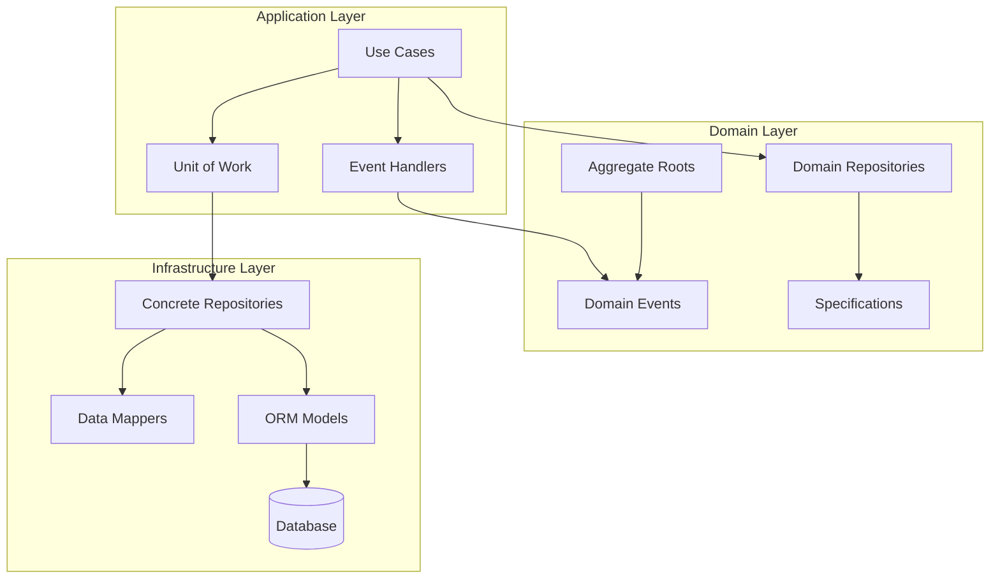
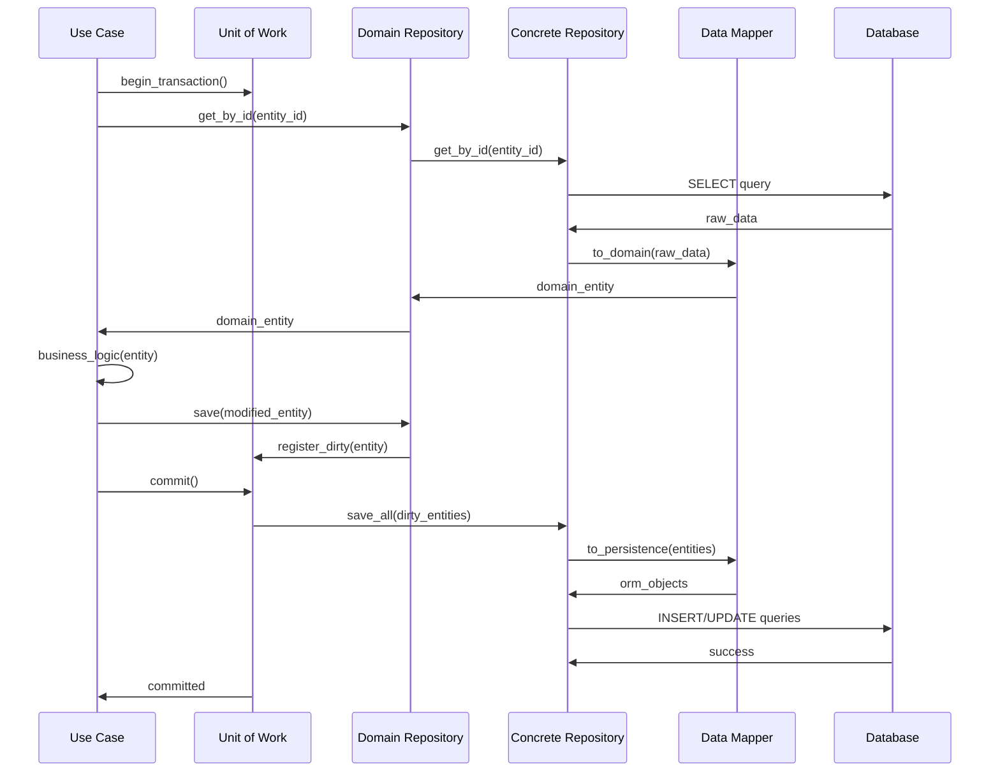

# ADR-014: Repository & Unit-of-Work Pattern

🍞 **Breadcrumb:** 🏠 [Home](../../../index.md) > 👨‍💻 [Developer Guides](../../README.md) > 🏗️ [Architecture](../README.md) > 📋 [ADR](README.md) > Repository & Unit-of-Work Pattern

## Status

PROPOSED

## Context

### Problem Statement

Following the adoption of Clean Architecture and DDD (ADR-013), we need a consistent approach for data access that maintains the separation between domain logic and infrastructure concerns. The current data access patterns are scattered across the codebase, leading to tight coupling between business logic and database implementation details, making testing difficult and violating Clean Architecture principles.

### Goals

- Implement consistent data access patterns across all domains
- Maintain transaction boundaries and data consistency
- Enable easy testing with mock repositories
- Support multiple data storage backends (SQL, NoSQL, file systems)
- Ensure proper separation between domain and infrastructure layers
- Provide atomic operations across multiple aggregates

### Constraints

- Must integrate with existing database infrastructure (PostgreSQL, SQLite)
- Cannot break existing API contracts during migration
- Must support both synchronous and asynchronous operations
- Performance must be comparable to current implementation
- Must work with existing ORM frameworks (SQLAlchemy)

### Assumptions

- Domain aggregates are well-defined and have clear boundaries
- Transactions will primarily involve single aggregates
- Cross-aggregate operations will be eventual consistency
- Team understands repository and unit-of-work patterns
- Current data models can be mapped to domain entities

## Decision

### Chosen Solution

Implement the **Repository Pattern** combined with the **Unit-of-Work Pattern** to provide a clean abstraction for data access:

1. **Repository Pattern** - Abstract data access for each aggregate root
2. **Unit-of-Work Pattern** - Manage transactions and track changes
3. **Domain Events** - Handle cross-aggregate consistency
4. **Specification Pattern** - Encapsulate complex query logic
5. **Data Mapper** - Convert between domain objects and persistence models

Key components:

- **Abstract Repository Interfaces** in domain layer
- **Concrete Repository Implementations** in infrastructure layer
- **Unit of Work** for transaction management
- **Domain Event Dispatcher** for eventual consistency
- **Specification Objects** for complex queries

### Rationale

This combination provides:

- **Clean Separation**: Domain layer is independent of persistence details
- **Testability**: Repositories can be easily mocked for unit tests
- **Consistency**: Unit-of-Work ensures transactional consistency
- **Flexibility**: Easy to switch between different storage backends
- **Performance**: Optimized queries through specifications
- **Maintainability**: Clear patterns for all data access operations

## Architecture

### System Overview



### Component Interactions



## Options Considered

### Pros and Cons Matrix

| Option | Pros | Cons | Score |
|--------|------|------|-------|
| **Repository + Unit-of-Work** | ✅ Clean separation<br/>✅ Testable<br/>✅ Transactional<br/>✅ Flexible | ❌ Initial complexity<br/>❌ More boilerplate<br/>❌ Learning curve | **9/10** |
| Active Record Pattern | ✅ Simple<br/>✅ Less code<br/>✅ Fast development | ❌ Tight coupling<br/>❌ Hard to test<br/>❌ Violates SRP | 5/10 |
| Data Access Objects (DAO) | ✅ Simple abstraction<br/>✅ Familiar pattern | ❌ Anemic domain<br/>❌ No transaction mgmt<br/>❌ Limited flexibility | 6/10 |
| Direct ORM Usage | ✅ No abstraction<br/>✅ Performance<br/>✅ Simple | ❌ Tight coupling<br/>❌ Domain pollution<br/>❌ Hard to test | 4/10 |

### Rejected Alternatives

- **Active Record Pattern**: Violates Single Responsibility Principle and creates tight coupling
- **Data Access Objects**: Too simplistic and doesn't handle complex transaction scenarios
- **Direct ORM Usage**: Violates Clean Architecture principles and makes testing difficult

## Implementation

### Technical Approach

#### 1. Repository Interface (Domain Layer)

```python
from abc import ABC, abstractmethod
from typing import Optional, List
from ..entities import AnomalyDetectionJob, JobId
from ..specifications import Specification

class AnomalyDetectionJobRepository(ABC):
    """Repository interface for AnomalyDetectionJob aggregate."""
    
    @abstractmethod
    async def get_by_id(self, job_id: JobId) -> Optional[AnomalyDetectionJob]:
        """Retrieve job by its unique identifier."""
        pass
    
    @abstractmethod
    async def save(self, job: AnomalyDetectionJob) -> None:
        """Save or update a job."""
        pass
    
    @abstractmethod
    async def delete(self, job: AnomalyDetectionJob) -> None:
        """Delete a job."""
        pass
    
    @abstractmethod
    async def find(self, specification: Specification) -> List[AnomalyDetectionJob]:
        """Find jobs matching the given specification."""
        pass
    
    @abstractmethod
    async def count(self, specification: Specification) -> int:
        """Count jobs matching the given specification."""
        pass
```

#### 2. Unit of Work Pattern

```python
from abc import ABC, abstractmethod
from typing import List, Dict, Any
from contextlib import asynccontextmanager

class UnitOfWork(ABC):
    """Unit of Work pattern for managing transactions."""
    
    def __init__(self):
        self._jobs: AnomalyDetectionJobRepository = None
        self._datasets: DatasetRepository = None
        self._committed = False
    
    @abstractmethod
    async def __aenter__(self):
        return self
    
    @abstractmethod
    async def __aexit__(self, exc_type, exc_val, exc_tb):
        if exc_type is None:
            await self.commit()
        else:
            await self.rollback()
    
    @abstractmethod
    async def commit(self) -> None:
        """Commit all changes in this unit of work."""
        pass
    
    @abstractmethod
    async def rollback(self) -> None:
        """Rollback all changes in this unit of work."""
        pass
    
    @property
    def jobs(self) -> AnomalyDetectionJobRepository:
        return self._jobs
    
    @property
    def datasets(self) -> DatasetRepository:
        return self._datasets

# Concrete Implementation
class SqlAlchemyUnitOfWork(UnitOfWork):
    def __init__(self, session_factory):
        super().__init__()
        self.session_factory = session_factory
        self.session = None
    
    async def __aenter__(self):
        self.session = self.session_factory()
        self._jobs = SqlAlchemyJobRepository(self.session)
        self._datasets = SqlAlchemyDatasetRepository(self.session)
        return self
    
    async def __aexit__(self, exc_type, exc_val, exc_tb):
        if exc_type is None:
            await self.commit()
        else:
            await self.rollback()
        await self.session.close()
    
    async def commit(self):
        await self.session.commit()
        self._committed = True
    
    async def rollback(self):
        await self.session.rollback()
```

#### 3. Specification Pattern

```python
from abc import ABC, abstractmethod
from typing import Any

class Specification(ABC):
    """Base specification for query encapsulation."""
    
    @abstractmethod
    def is_satisfied_by(self, candidate: Any) -> bool:
        """Check if candidate satisfies this specification."""
        pass
    
    @abstractmethod
    def to_sql_criteria(self) -> Dict[str, Any]:
        """Convert specification to SQL criteria."""
        pass

class JobsByStatusSpecification(Specification):
    def __init__(self, status: JobStatus):
        self.status = status
    
    def is_satisfied_by(self, job: AnomalyDetectionJob) -> bool:
        return job.status == self.status
    
    def to_sql_criteria(self) -> Dict[str, Any]:
        return {"status": self.status.value}

class JobsByDateRangeSpecification(Specification):
    def __init__(self, start_date: datetime, end_date: datetime):
        self.start_date = start_date
        self.end_date = end_date
    
    def is_satisfied_by(self, job: AnomalyDetectionJob) -> bool:
        return self.start_date <= job.created_at <= self.end_date
    
    def to_sql_criteria(self) -> Dict[str, Any]:
        return {
            "created_at__gte": self.start_date,
            "created_at__lte": self.end_date
        }
```

#### 4. Concrete Repository Implementation

```python
from sqlalchemy.orm import Session
from sqlalchemy import and_, or_
from typing import List, Optional

class SqlAlchemyJobRepository(AnomalyDetectionJobRepository):
    def __init__(self, session: Session):
        self.session = session
        self.mapper = JobDataMapper()
    
    async def get_by_id(self, job_id: JobId) -> Optional[AnomalyDetectionJob]:
        orm_job = await self.session.get(JobORM, job_id.value)
        return self.mapper.to_domain(orm_job) if orm_job else None
    
    async def save(self, job: AnomalyDetectionJob) -> None:
        orm_job = self.mapper.to_orm(job)
        self.session.merge(orm_job)
    
    async def delete(self, job: AnomalyDetectionJob) -> None:
        orm_job = await self.session.get(JobORM, job.id.value)
        if orm_job:
            await self.session.delete(orm_job)
    
    async def find(self, specification: Specification) -> List[AnomalyDetectionJob]:
        criteria = specification.to_sql_criteria()
        query = self.session.query(JobORM)
        
        for field, value in criteria.items():
            if "__gte" in field:
                query = query.filter(getattr(JobORM, field.replace("__gte", "")) >= value)
            elif "__lte" in field:
                query = query.filter(getattr(JobORM, field.replace("__lte", "")) <= value)
            else:
                query = query.filter(getattr(JobORM, field) == value)
        
        orm_jobs = await query.all()
        return [self.mapper.to_domain(orm_job) for orm_job in orm_jobs]
```

#### 5. Data Mapper

```python
class JobDataMapper:
    """Maps between domain entities and ORM models."""
    
    def to_domain(self, orm_job: JobORM) -> AnomalyDetectionJob:
        if not orm_job:
            return None
        
        return AnomalyDetectionJob(
            job_id=JobId(orm_job.id),
            algorithm=Algorithm.from_string(orm_job.algorithm_name),
            dataset=Dataset.from_dict(orm_job.dataset_config),
            status=JobStatus(orm_job.status),
            created_at=orm_job.created_at,
            results=DetectionResults.from_dict(orm_job.results) if orm_job.results else None
        )
    
    def to_orm(self, job: AnomalyDetectionJob) -> JobORM:
        return JobORM(
            id=job.id.value,
            algorithm_name=job.algorithm.name,
            dataset_config=job.dataset.to_dict(),
            status=job.status.value,
            created_at=job.created_at,
            results=job.results.to_dict() if job.results else None
        )
```

### Migration Strategy

1. **Phase 1 (Week 1)**: Define repository interfaces for core aggregates
2. **Phase 2 (Week 2)**: Implement Unit of Work pattern and base infrastructure
3. **Phase 3 (Week 3)**: Create concrete repository implementations for jobs
4. **Phase 4 (Week 4)**: Implement specification pattern for complex queries
5. **Phase 5 (Week 5)**: Create data mappers for all domain entities
6. **Phase 6 (Week 6)**: Update use cases to use new repositories
7. **Phase 7 (Week 7)**: Migrate remaining entities and remove legacy code

### Testing Strategy

- **Repository Interface Tests**: Test contracts using abstract base test classes
- **Specification Tests**: Unit tests for all specification implementations
- **Integration Tests**: Test concrete repositories with test databases
- **Unit of Work Tests**: Test transaction boundaries and rollback scenarios
- **Data Mapper Tests**: Test bidirectional mapping between domain and ORM
- **Performance Tests**: Benchmark query performance vs. current implementation

## Consequences

### Positive

- **Clean Architecture Compliance**: Perfect separation between domain and infrastructure
- **Testability**: Easy to mock repositories for unit testing domain logic
- **Transaction Management**: Proper handling of data consistency across operations
- **Flexibility**: Easy to switch between different storage backends
- **Query Optimization**: Specifications enable reusable, optimized queries
- **Maintainability**: Clear patterns for all data access operations

### Negative

- **Initial Complexity**: More layers and abstractions to understand
- **Boilerplate Code**: Additional interfaces and implementations required
- **Performance Overhead**: Minimal overhead from abstraction layers
- **Learning Curve**: Team needs to understand repository and unit-of-work patterns
- **Mapping Overhead**: Additional object creation for domain/ORM mapping

### Neutral

- **Code Volume**: More files but better organized and more maintainable
- **Development Speed**: Slower initially but faster for complex operations
- **Database Independence**: Good for flexibility but may not use DB-specific features

## Compliance

### Security Impact

- **Access Control**: Centralized data access enables security policies
- **Input Validation**: Specifications validate query parameters
- **SQL Injection**: Parameterized queries through ORM prevent injection
- **Audit Trail**: Unit of Work provides transaction logging points
- **Data Isolation**: Repository pattern enables row-level security

### Performance Impact

- **Query Optimization**: Specifications enable query reuse and optimization
- **N+1 Problem**: Data mappers can implement eager loading strategies
- **Connection Pooling**: Unit of Work manages database connections efficiently
- **Caching**: Repository layer enables transparent caching implementation
- **Batch Operations**: Unit of Work supports efficient batch processing

### Monitoring Requirements

- **Repository Performance**: Monitor query execution times per repository
- **Transaction Metrics**: Track commit/rollback ratios and duration
- **Specification Usage**: Monitor which specifications are used most frequently
- **Data Mapper Performance**: Track mapping overhead and optimization opportunities
- **Connection Pool Health**: Monitor database connection usage patterns

## Decision Log

| Date | Author | Action | Rationale |
|------|--------|--------|-----------|
| 2025-02-01 | Architecture Team | PROPOSED | Follow-up to Clean Architecture adoption (ADR-013) |
| 2025-02-05 | Data Team | REVIEWED | Technical approach validated |
| 2025-02-10 | Tech Lead | APPROVED | Implementation strategy confirmed |

## References

- [Repository Pattern by Martin Fowler](https://martinfowler.com/eaaCatalog/repository.html)
- [Unit of Work Pattern by Martin Fowler](https://martinfowler.com/eaaCatalog/unitOfWork.html)
- [Specification Pattern by Eric Evans](https://www.domainlanguage.com/wp-content/uploads/2016/05/DDD_Reference_2015-03.pdf)
- [ADR-013: Clean Architecture & DDD Adoption](ADR-013-clean-architecture-ddd-adoption.md)
- [Cosmic Python Book](https://www.cosmicpython.com/)

---

## 🔗 **Related Documentation**

### **Architecture**

- **[Clean Architecture & DDD](ADR-013-clean-architecture-ddd-adoption.md)** - Foundation architecture patterns
- **[Core Architecture Patterns](ADR-001-core-architecture-patterns.md)** - Architectural foundations
- **[ADR Index](README.md)** - All architectural decisions

### **Implementation**

- **[Domain Layer Guide](../../contributing/domain-layer-guide.md)** - Domain modeling standards
- **[Repository Implementation Guide](../../patterns/repository-pattern.md)** - Implementation details
- **[Testing Strategy](../../testing/README.md)** - Testing approach

### **Database**

- **[Production Database Technology](ADR-015-production-database-technology-selection.md)** - Database selection
- **[Database Migration Guide](../../database/migration-guide.md)** - Migration procedures
- **[ORM Best Practices](../../database/orm-best-practices.md)** - ORM usage guidelines

---

**Authors:** Architecture Team  
**Last Updated:** 2025-07-11  
**Next Review:** 2025-10-11
