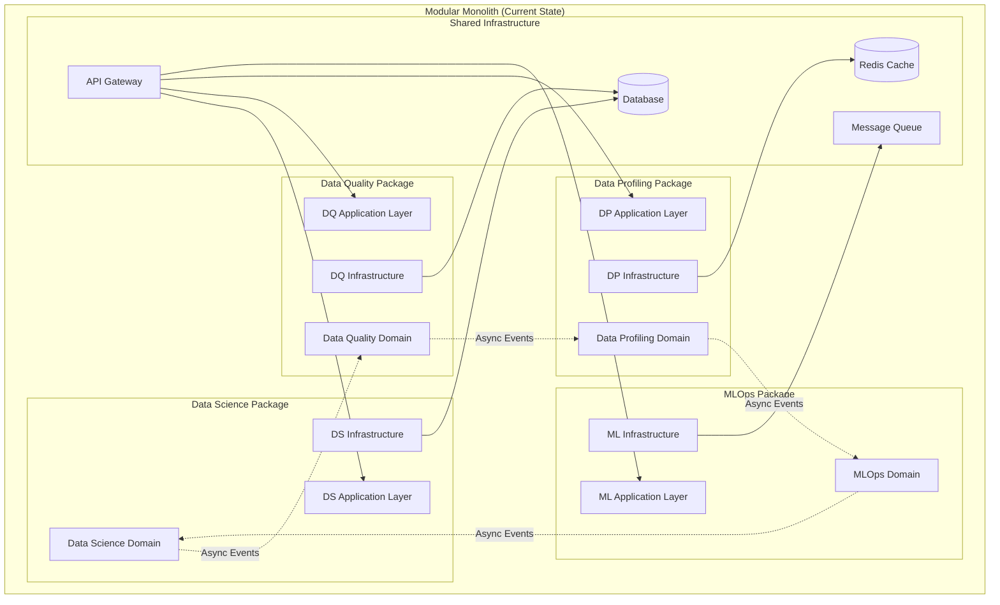
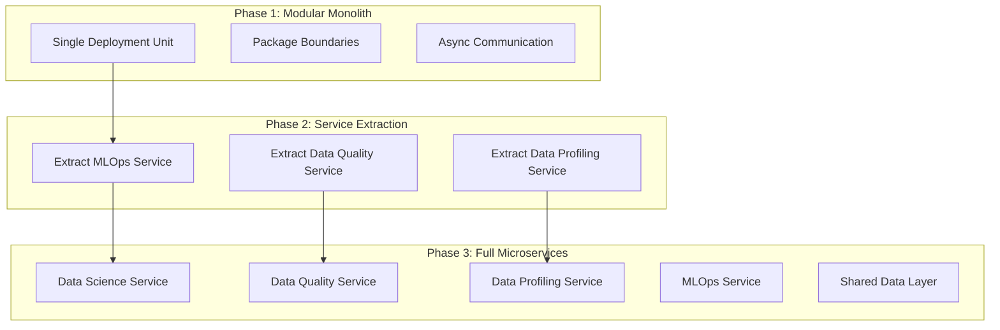
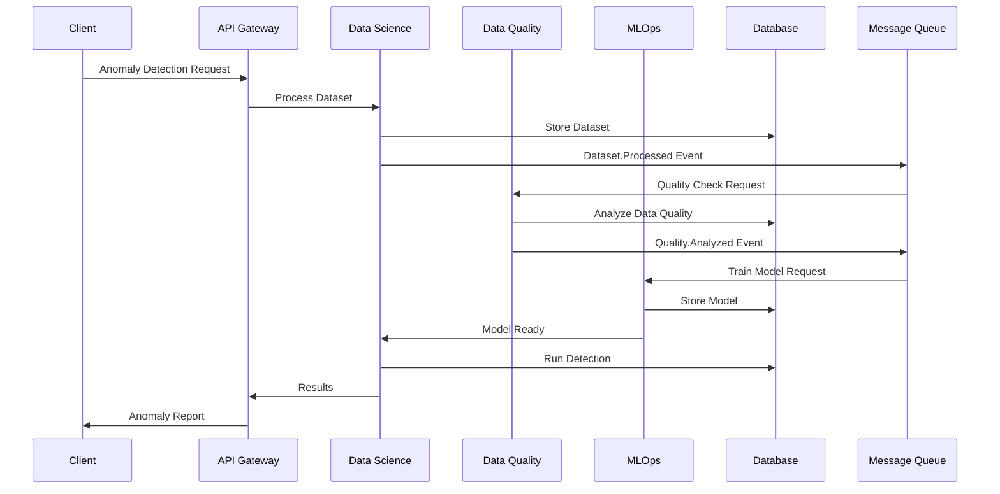
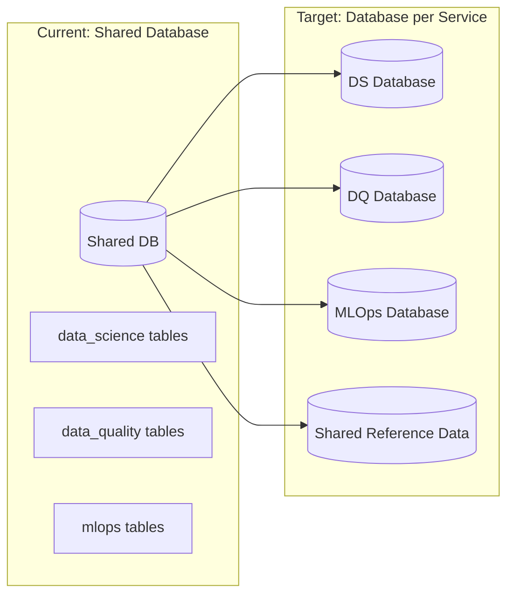

# ADR-020: Microservices vs Monolith Architecture Strategy

🍞 **Breadcrumb:** 🏠 [Home](../../../index.md) > 👨‍💻 [Developer Guides](../../README.md) > 🏗️ [Architecture](../README.md) > 📋 [ADR](README.md) > Microservices vs Monolith Strategy

## Status

PROPOSED

## Context

### Problem Statement

Pynomaly has evolved into a complex anomaly detection platform with multiple domain packages (`data_science`, `data_quality`, `data_profiling`, `mlops`) and sophisticated inter-package dependencies. The current monolithic architecture with package-based separation is reaching scalability and maintainability limits as the platform grows. We need to decide on the long-term architecture strategy for scaling the platform while maintaining development velocity and operational simplicity.

### Goals

- **Scalability**: Support independent scaling of different domain components
- **Team Autonomy**: Enable teams to develop and deploy independently
- **Maintainability**: Reduce coupling between domain boundaries
- **Operational Simplicity**: Minimize infrastructure complexity
- **Development Velocity**: Maintain rapid development and testing cycles
- **Data Consistency**: Ensure data integrity across domain boundaries

### Constraints

- **Existing Codebase**: 100,000+ lines of tightly coupled monolithic code
- **Team Size**: Small team (5-10 developers) with limited DevOps resources
- **Performance Requirements**: Sub-second response times for anomaly detection
- **Data Volume**: Processing gigabytes of data daily with real-time requirements
- **Infrastructure Budget**: Cost-conscious cloud deployment
- **Regulatory Compliance**: Data governance and audit trail requirements

### Assumptions

- The platform will continue to grow in complexity and scale
- Multiple domain teams will eventually own different packages
- Real-time data processing remains a core requirement
- Cloud-native deployment is preferred
- Investment in DevOps tooling and infrastructure is feasible

## Decision

### Chosen Solution

**Adopt a "Modular Monolith with Microservices Readiness" approach** using package-based domain separation with well-defined boundaries, async communication patterns, and gradual extraction path to microservices.

### Rationale

1. **Risk Mitigation**: Allows gradual evolution without big-bang rewrite
2. **Team Readiness**: Builds microservices capabilities while maintaining simplicity
3. **Infrastructure Efficiency**: Reduces operational overhead during transition
4. **Development Velocity**: Maintains rapid iteration and testing cycles
5. **Data Consistency**: Enables strong consistency within modules, eventual consistency between modules

## Architecture

### System Overview


### Migration Path to Microservices


### Component Interactions


## Options Considered

### Pros and Cons Matrix

| Option | Pros | Cons | Score |
|--------|------|------|-------|
| **Pure Monolith** | ✅ Simple deployment<br/>✅ Strong consistency<br/>✅ Easy debugging | ❌ Poor scalability<br/>❌ Technology lock-in<br/>❌ Team coupling | 5/10 |
| **Big Bang Microservices** | ✅ Full autonomy<br/>✅ Technology diversity<br/>✅ Independent scaling | ❌ High complexity<br/>❌ Data consistency challenges<br/>❌ Massive rewrite | 4/10 |
| **Modular Monolith with Migration Path** | ✅ Gradual evolution<br/>✅ Risk mitigation<br/>✅ Team learning<br/>✅ Operational simplicity | ❌ Initial coupling<br/>❌ Requires discipline | **8/10** |
| **Event-Driven Monolith** | ✅ Loose coupling<br/>✅ Event sourcing benefits | ❌ Complex event handling<br/>❌ Debugging challenges | 6/10 |

### Rejected Alternatives

**Big Bang Microservices Rewrite**: Rejected due to high risk, resource requirements, and potential for introducing bugs in a working system. The team lacks sufficient DevOps expertise for immediate microservices adoption.

**Pure Monolith Continuation**: Rejected because it doesn't address scalability concerns and team autonomy requirements as the platform grows.

## Implementation

### Technical Approach

#### Phase 1: Strengthen Module Boundaries (Months 1-3)
1. **Enforce Package Dependencies**: Use dependency analysis tools to prevent circular dependencies
2. **Standardize APIs**: Define clear interfaces between packages using dependency injection
3. **Implement Event Bus**: Add internal event system for async communication
4. **Database Schema Separation**: Logically separate tables by domain

```python
# Example: Package Interface Definition
from abc import ABC, abstractmethod
from typing import Protocol

class DataQualityService(Protocol):
    async def analyze_quality(self, dataset_id: UUID) -> QualityReport:
        ...

class MLOpsService(Protocol):
    async def train_model(self, dataset_id: UUID, config: ModelConfig) -> Model:
        ...
```

#### Phase 2: Extract Supporting Services (Months 4-8)
1. **MLOps Service**: Extract model training and management
2. **Data Quality Service**: Extract data validation and profiling
3. **Implement API Gateway**: Add request routing and authentication
4. **Add Service Discovery**: Implement service registry pattern

#### Phase 3: Core Service Extraction (Months 9-12)
1. **Data Science Service**: Extract core anomaly detection logic
2. **Implement Distributed Transactions**: Add saga pattern for consistency
3. **Add Circuit Breakers**: Implement fault tolerance patterns
4. **Complete Service Mesh**: Add observability and security

### Migration Strategy

#### Database Migration


#### Service Extraction Process
1. **Identify Service Boundaries**: Use Domain-Driven Design bounded contexts
2. **Create Service Skeleton**: Set up independent deployment pipeline
3. **Implement Data Synchronization**: Use event sourcing or Change Data Capture
4. **Gradual Traffic Migration**: Use feature flags and canary deployments
5. **Remove Monolith Dependencies**: Clean up old code paths

### Testing Strategy

#### Integration Testing
- **Contract Testing**: Use Pact or OpenAPI contracts between services
- **End-to-End Testing**: Maintain critical user journey tests
- **Chaos Engineering**: Test resilience to service failures

#### Performance Testing
- **Load Testing**: Verify each phase maintains performance SLAs
- **Latency Testing**: Ensure inter-service communication overhead is acceptable
- **Scalability Testing**: Validate independent scaling capabilities

## Consequences

### Positive
- **Gradual Risk Mitigation**: Reduces risk of big-bang architecture changes
- **Team Learning**: Builds microservices expertise incrementally
- **Improved Scalability**: Enables independent scaling of high-demand components
- **Technology Flexibility**: Allows different technology choices per service
- **Deployment Independence**: Reduces deployment coordination overhead
- **Fault Isolation**: Limits blast radius of failures to individual services

### Negative
- **Increased Complexity**: More moving parts to monitor and maintain
- **Network Latency**: Inter-service communication adds latency overhead
- **Data Consistency Challenges**: Requires careful design of distributed transactions
- **Operational Overhead**: Requires investment in DevOps tooling and practices
- **Debugging Complexity**: Distributed tracing required for troubleshooting
- **Team Coordination**: Requires clear API contracts and versioning strategies

### Neutral
- **Development Velocity**: Initial slowdown followed by acceleration
- **Infrastructure Costs**: Higher operational costs offset by improved efficiency
- **Learning Curve**: Team needs to develop new skills and practices

## Compliance

### Security Impact
- **Service-to-Service Authentication**: Implement mutual TLS or JWT tokens
- **API Gateway Security**: Centralized authentication and authorization
- **Network Segmentation**: Isolate services using network policies
- **Audit Logging**: Distributed tracing for compliance and security monitoring

### Performance Impact
- **Latency**: 10-50ms additional latency per service hop
- **Throughput**: Potential for improved throughput through independent scaling
- **Resource Usage**: Higher memory and CPU overhead from service boundaries
- **Caching Strategy**: Distributed caching to mitigate performance impacts

### Monitoring Requirements
- **Service Health**: Individual service health checks and metrics
- **Distributed Tracing**: Request flow visibility across service boundaries
- **Business Metrics**: End-to-end user journey monitoring
- **Infrastructure Metrics**: Container and orchestration platform monitoring

## Decision Log

| Date | Author | Action | Rationale |
|------|--------|--------|-----------|
| 2025-07-14 | Architecture Team | PROPOSED | Initial proposal based on growth requirements and team readiness assessment |

## References

- [ADR-001: Core Architecture Patterns](ADR-001-core-architecture-patterns.md)
- [ADR-013: Clean Architecture & DDD Adoption](ADR-013-clean-architecture-ddd-adoption.md)
- [Martin Fowler - Monolith First](https://martinfowler.com/bliki/MonolithFirst.html)
- [Microservices Pattern Book](https://microservices.io/patterns/)
- [Building Event-Driven Microservices](https://www.oreilly.com/library/view/building-event-driven-microservices/9781492057888/)

---

## 🔗 **Related Documentation**

### **Architecture**
- **[Architecture Overview](../overview.md)** - System design principles
- **[Clean Architecture](../overview.md)** - Architectural patterns
- **[ADR Index](README.md)** - All architectural decisions

### **Implementation**
- **[Implementation Guide](../../contributing/IMPLEMENTATION_GUIDE.md)** - Coding standards
- **[Contributing Guidelines](../../contributing/CONTRIBUTING.md)** - Development process
- **[File Organization](../../contributing/FILE_ORGANIZATION_STANDARDS.md)** - Project structure

### **Deployment**
- **[Production Deployment](../../../deployment/README.md)** - Production setup
- **[Security](../../../deployment/SECURITY.md)** - Security configuration
- **[Monitoring](../../../user-guides/basic-usage/monitoring.md)** - System observability

---

**Authors:** Architecture Team<br/>
**Last Updated:** 2025-07-14<br/>
**Next Review:** 2025-10-14