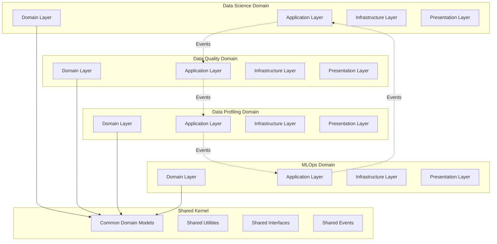
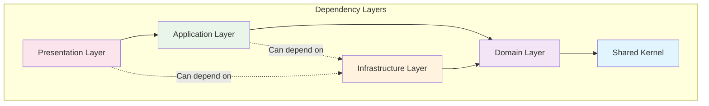
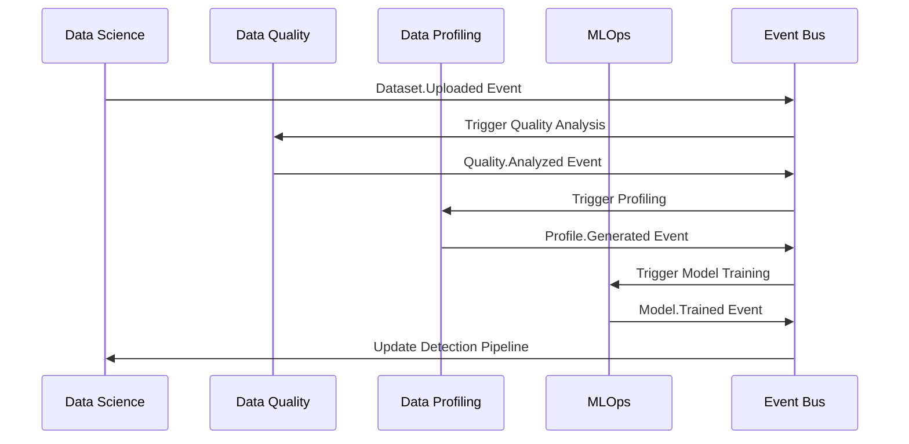

# ADR-021: Multi-Package Domain Organization

🍞 **Breadcrumb:** 🏠 [Home](../../../index.md) > 👨‍💻 [Developer Guides](../../README.md) > 🏗️ [Architecture](../README.md) > 📋 [ADR](README.md) > Multi-Package Domain Organization

## Status

PROPOSED

## Context

### Problem Statement

Pynomaly has evolved from a simple anomaly detection library into a comprehensive data science platform with multiple specialized domains. The current package structure includes `data_science`, `data_quality`, `data_profiling`, and `mlops` packages, each with complex interdependencies. Without clear domain boundaries and organization principles, the codebase risks becoming a distributed monolith with tight coupling, unclear ownership, and maintenance challenges.

### Goals

- **Clear Domain Boundaries**: Establish well-defined boundaries between functional areas
- **Loose Coupling**: Minimize dependencies between packages
- **High Cohesion**: Group related functionality within appropriate domains
- **Team Ownership**: Enable clear ownership and responsibility for each domain
- **Scalable Organization**: Support future growth and additional domains
- **Shared Kernel Management**: Handle common functionality across domains

### Constraints

- **Existing Codebase**: Significant existing code with established patterns
- **Team Structure**: Current team members have overlapping responsibilities
- **Feature Dependencies**: Some features require coordination across multiple domains
- **Performance Requirements**: Cannot introduce significant performance overhead
- **Backward Compatibility**: Must maintain existing API contracts

### Assumptions

- Domain-Driven Design principles will guide package organization
- Each package will eventually have dedicated team ownership
- Cross-domain communication will be primarily event-driven
- Shared functionality will be managed through a shared kernel approach

## Decision

### Chosen Solution

**Implement Domain-Driven Design (DDD) package organization** with clear bounded contexts, explicit dependency direction, and shared kernel management for common functionality.

### Rationale

1. **Domain Expertise**: Aligns code organization with business domains
2. **Team Autonomy**: Enables teams to own complete vertical slices
3. **Reduced Coupling**: Clear boundaries minimize unintended dependencies
4. **Scalability**: Supports adding new domains without architectural changes
5. **Maintainability**: Easier to understand and modify domain-specific logic

## Architecture

### Domain Package Structure


### Package Dependency Rules


### Cross-Domain Communication


## Options Considered

### Pros and Cons Matrix

| Option | Pros | Cons | Score |
|--------|------|------|-------|
| **Layer-based Organization** | ✅ Simple structure<br/>✅ Easy to understand | ❌ Poor domain cohesion<br/>❌ Cross-cutting changes<br/>❌ Team coordination issues | 4/10 |
| **Feature-based Packages** | ✅ Feature cohesion<br/>✅ Team alignment | ❌ Unclear boundaries<br/>❌ Code duplication<br/>❌ Shared logic challenges | 5/10 |
| **Domain-Driven Packages** | ✅ Clear boundaries<br/>✅ Domain expertise<br/>✅ Team ownership<br/>✅ Loose coupling | ❌ Initial complexity<br/>❌ Learning curve | **8/10** |
| **Micropackages** | ✅ Maximum isolation<br/>✅ Independent deployment | ❌ Over-engineering<br/>❌ Integration complexity<br/>❌ Shared code challenges | 6/10 |

### Rejected Alternatives

**Layer-based Organization**: Rejected because it creates tight coupling across domain boundaries and makes it difficult for teams to own complete features.

**Feature-based Packages**: Rejected due to unclear domain boundaries and difficulty in determining where to place shared functionality.

## Implementation

### Technical Approach

#### Package Structure Definition
```
src/packages/
├── shared_kernel/
│   ├── domain/
│   │   ├── entities/
│   │   ├── value_objects/
│   │   ├── events/
│   │   └── interfaces/
│   ├── infrastructure/
│   │   ├── messaging/
│   │   ├── persistence/
│   │   └── monitoring/
│   └── application/
│       ├── dto/
│       ├── exceptions/
│       └── utilities/
├── data_science/
│   ├── domain/
│   │   ├── entities/
│   │   ├── value_objects/
│   │   ├── services/
│   │   └── repositories/
│   ├── application/
│   │   ├── services/
│   │   ├── use_cases/
│   │   └── dto/
│   ├── infrastructure/
│   │   ├── repositories/
│   │   ├── adapters/
│   │   └── external/
│   └── presentation/
│       ├── api/
│       ├── cli/
│       └── web/
├── data_quality/
│   └── [same structure as data_science]
├── data_profiling/
│   └── [same structure as data_science]
└── mlops/
    └── [same structure as data_science]
```

#### Dependency Management
```python
# Package dependency configuration
[tool.poetry.dependencies]
shared-kernel = {path = "./src/packages/shared_kernel"}

[tool.poetry.group.data-science.dependencies]
data-science = {path = "./src/packages/data_science"}

[tool.poetry.group.data-quality.dependencies]
data-quality = {path = "./src/packages/data_quality"}

# Dependency analysis configuration
[tool.dependency-cruiser]
forbidden = [
    {
        name = "no-circular-deps",
        from = {},
        to = {circular = true}
    },
    {
        name = "no-reverse-deps",
        from = {path = "shared_kernel"},
        to = {path = "data_science|data_quality|data_profiling|mlops"}
    }
]
```

#### Cross-Domain Event System
```python
# Shared Kernel Event Base
from abc import ABC
from datetime import datetime
from uuid import UUID, uuid4
from typing import Dict, Any

class DomainEvent(ABC):
    def __init__(self):
        self.event_id = uuid4()
        self.occurred_on = datetime.utcnow()
        self.event_version = 1
    
    @property
    def event_type(self) -> str:
        return self.__class__.__name__

# Data Science Domain Events
class DatasetUploadedEvent(DomainEvent):
    def __init__(self, dataset_id: UUID, file_path: str, metadata: Dict[str, Any]):
        super().__init__()
        self.dataset_id = dataset_id
        self.file_path = file_path
        self.metadata = metadata

# Data Quality Domain Events
class QualityAnalysisCompletedEvent(DomainEvent):
    def __init__(self, dataset_id: UUID, quality_score: float, issues: List[str]):
        super().__init__()
        self.dataset_id = dataset_id
        self.quality_score = quality_score
        self.issues = issues
```

#### Domain Service Interfaces
```python
# Shared Kernel Interfaces
from abc import ABC, abstractmethod
from typing import Protocol

class DataQualityAnalyzer(Protocol):
    async def analyze_dataset(self, dataset_id: UUID) -> QualityReport:
        ...

class ModelTrainer(Protocol):
    async def train_anomaly_detector(self, dataset_id: UUID, config: TrainingConfig) -> Model:
        ...

# Domain Service Registration
from dependency_injector import containers, providers

class SharedContainer(containers.DeclarativeContainer):
    event_bus = providers.Singleton(EventBus)
    message_broker = providers.Singleton(RabbitMQBroker)

class DataScienceContainer(containers.DeclarativeContainer):
    shared = providers.DependenciesContainer()
    
    dataset_repository = providers.Singleton(DatasetRepository)
    anomaly_detector_service = providers.Factory(
        AnomalyDetectorService,
        repository=dataset_repository,
        event_bus=shared.event_bus
    )
```

### Migration Strategy

#### Phase 1: Extract Shared Kernel (Weeks 1-2)
1. **Identify Common Elements**: Extract shared domain models, events, and utilities
2. **Create Shared Package**: Establish shared_kernel package structure
3. **Migrate Common Code**: Move shared functionality to shared kernel
4. **Update Dependencies**: Update existing packages to depend on shared kernel

#### Phase 2: Reorganize Domain Packages (Weeks 3-6)
1. **Data Science Package**: Reorganize existing data science code into DDD structure
2. **Data Quality Package**: Extract and organize data quality functionality
3. **Data Profiling Package**: Separate profiling logic from data science
4. **MLOps Package**: Extract model lifecycle management functionality

#### Phase 3: Implement Event-Driven Communication (Weeks 7-8)
1. **Event Bus Implementation**: Add internal event bus for cross-domain communication
2. **Event Handlers**: Implement event handlers in each domain
3. **Remove Direct Dependencies**: Replace direct calls with event-driven communication
4. **Testing and Validation**: Ensure event-driven communication works correctly

### Testing Strategy

#### Package Isolation Testing
```python
# Test package dependency rules
def test_package_dependencies():
    analyzer = DependencyAnalyzer()
    violations = analyzer.check_forbidden_dependencies()
    assert len(violations) == 0, f"Dependency violations found: {violations}"

# Test domain boundaries
def test_domain_boundaries():
    boundary_checker = DomainBoundaryChecker()
    violations = boundary_checker.check_cross_domain_calls()
    assert len(violations) == 0, f"Domain boundary violations: {violations}"
```

#### Integration Testing
- **Event Flow Testing**: Test complete event flows across domain boundaries
- **API Contract Testing**: Ensure domain APIs remain stable during refactoring
- **Performance Testing**: Verify that domain separation doesn't impact performance

## Consequences

### Positive
- **Clear Ownership**: Each domain package has clear boundaries and responsibilities
- **Reduced Coupling**: Explicit dependencies prevent accidental coupling
- **Team Autonomy**: Teams can work independently within their domain boundaries
- **Testability**: Easier to test individual domains in isolation
- **Scalability**: New domains can be added without affecting existing ones
- **Maintainability**: Domain-specific changes are contained within appropriate packages

### Negative
- **Initial Complexity**: Requires understanding of DDD principles and practices
- **Event Overhead**: Event-driven communication adds some performance overhead
- **Learning Curve**: Team needs to learn domain modeling and event-driven patterns
- **Coordination Effort**: Cross-domain features require more coordination
- **Testing Complexity**: Integration testing becomes more complex

### Neutral
- **Code Volume**: Similar amount of code, but better organized
- **Development Speed**: Initial slowdown followed by improved velocity
- **Infrastructure**: May require additional messaging infrastructure

## Compliance

### Security Impact
- **Access Control**: Domain boundaries enable fine-grained access control
- **Data Isolation**: Clear separation of sensitive data by domain
- **Audit Trails**: Domain-specific logging and audit capabilities
- **Principle of Least Privilege**: Domains only access required resources

### Performance Impact
- **Event Latency**: 1-5ms additional latency for cross-domain communication
- **Memory Usage**: Some overhead from event handling infrastructure
- **CPU Overhead**: Minimal overhead from dependency injection container
- **Caching**: Domain-specific caching strategies possible

### Monitoring Requirements
- **Domain Metrics**: Per-domain performance and business metrics
- **Event Flow Monitoring**: Track event propagation across domains
- **Dependency Health**: Monitor inter-domain communication health
- **Resource Usage**: Track resource usage per domain

## Decision Log

| Date | Author | Action | Rationale |
|------|--------|--------|-----------|
| 2025-07-14 | Architecture Team | PROPOSED | Need clear domain organization for scaling team and codebase |

## References

- [ADR-001: Core Architecture Patterns](ADR-001-core-architecture-patterns.md)
- [ADR-013: Clean Architecture & DDD Adoption](ADR-013-clean-architecture-ddd-adoption.md)
- [ADR-020: Microservices vs Monolith Strategy](ADR-020-microservices-vs-monolith-strategy.md)
- [Domain-Driven Design by Eric Evans](https://www.amazon.com/Domain-Driven-Design-Tackling-Complexity-Software/dp/0321125215)
- [Implementing Domain-Driven Design by Vaughn Vernon](https://www.amazon.com/Implementing-Domain-Driven-Design-Vaughn-Vernon/dp/0321834577)

---

## 🔗 **Related Documentation**

### **Architecture**
- **[Architecture Overview](../overview.md)** - System design principles
- **[Clean Architecture](../overview.md)** - Architectural patterns
- **[ADR Index](README.md)** - All architectural decisions

### **Implementation**
- **[Implementation Guide](../../contributing/IMPLEMENTATION_GUIDE.md)** - Coding standards
- **[Contributing Guidelines](../../contributing/CONTRIBUTING.md)** - Development process
- **[File Organization](../../contributing/FILE_ORGANIZATION_STANDARDS.md)** - Project structure

### **Deployment**
- **[Production Deployment](../../../deployment/README.md)** - Production setup
- **[Security](../../../deployment/SECURITY.md)** - Security configuration
- **[Monitoring](../../../user-guides/basic-usage/monitoring.md)** - System observability

---

**Authors:** Architecture Team<br/>
**Last Updated:** 2025-07-14<br/>
**Next Review:** 2025-10-14