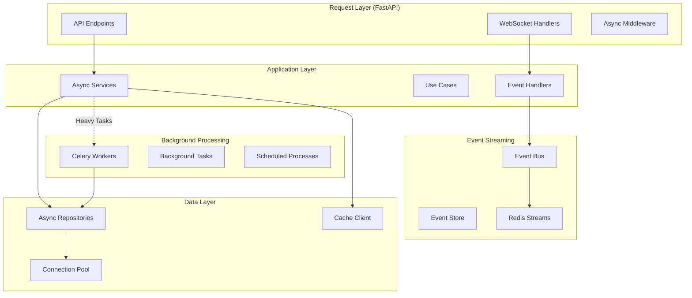
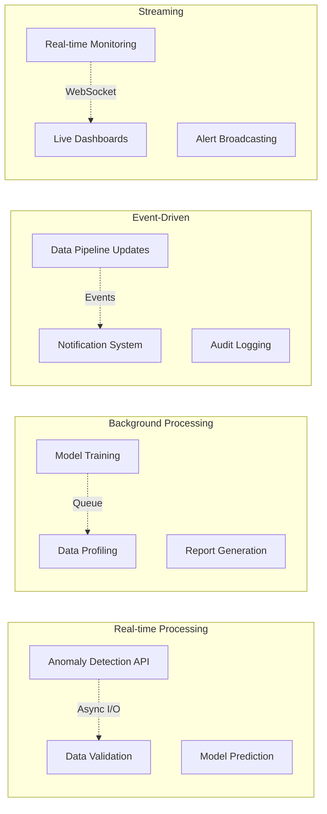
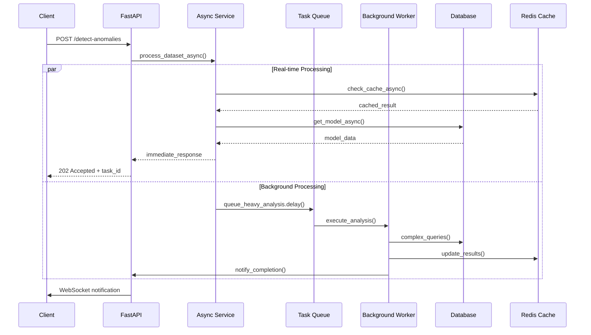

# ADR-022: Asynchronous Processing Architecture

🍞 **Breadcrumb:** 🏠 [Home](../../../index.md) > 👨‍💻 [Developer Guides](../../README.md) > 🏗️ [Architecture](../README.md) > 📋 [ADR](README.md) > Asynchronous Processing Architecture

## Status

PROPOSED

## Context

### Problem Statement

Pynomaly's codebase extensively uses `async/await` patterns throughout the application, but lacks a comprehensive asynchronous processing architecture strategy. The current implementation mixes synchronous and asynchronous code inconsistently, has no clear strategy for handling long-running tasks, background processing, or event-driven workflows. This creates performance bottlenecks, resource contention, and makes it difficult to scale the platform for high-throughput anomaly detection workloads.

### Goals

- **Consistent Async Patterns**: Establish clear guidelines for async/await usage
- **Background Processing**: Enable long-running tasks without blocking user requests
- **Event-Driven Architecture**: Support reactive, event-driven workflows
- **Scalability**: Handle high-throughput data processing efficiently
- **Resource Efficiency**: Optimize CPU and I/O resource utilization
- **Fault Tolerance**: Provide resilient handling of async operation failures

### Constraints

- **Existing Codebase**: Significant existing async/await code that must be preserved
- **Performance Requirements**: Sub-second response times for real-time detection
- **Resource Limits**: Memory and CPU constraints in cloud environments
- **Framework Compatibility**: Must work with FastAPI and existing infrastructure
- **Database Concurrency**: Limited database connection pools
- **Third-party Integrations**: External APIs with varying async support

### Assumptions

- Python's asyncio will remain the primary async framework
- Message queues will be available for background task processing
- Database operations will be primarily async using SQLAlchemy async
- WebSocket connections will be used for real-time updates
- Event sourcing patterns may be implemented in the future

## Decision

### Chosen Solution

**Implement a Layered Asynchronous Architecture** with clear separation between real-time request processing, background task processing, and event-driven workflows using asyncio, Celery for heavy tasks, and Redis for event streaming.

### Rationale

1. **Performance Optimization**: Async I/O maximizes throughput for I/O-bound operations
2. **Resource Efficiency**: Better utilization of CPU and memory resources
3. **Scalability**: Non-blocking operations support higher concurrency
4. **User Experience**: Immediate responses with background processing for heavy operations
5. **Event-Driven**: Enables reactive architectures and real-time features

## Architecture

### Async Processing Layers


### Async Patterns by Use Case


### Concurrency Model


## Options Considered

### Pros and Cons Matrix

| Option | Pros | Cons | Score |
|--------|------|------|-------|
| **Pure Asyncio** | ✅ Simple model<br/>✅ Built-in Python<br/>✅ Fast I/O | ❌ Poor CPU-bound tasks<br/>❌ GIL limitations<br/>❌ Complex debugging | 6/10 |
| **Threading + Asyncio** | ✅ Mixed workloads<br/>✅ Legacy compatibility | ❌ Complexity<br/>❌ Race conditions<br/>❌ Resource overhead | 5/10 |
| **Async + Task Queue** | ✅ Scalable<br/>✅ Fault tolerant<br/>✅ Specialized workers<br/>✅ Monitoring | ❌ Infrastructure complexity<br/>❌ Network latency | **8/10** |
| **Pure Multiprocessing** | ✅ CPU performance<br/>✅ True parallelism | ❌ Memory overhead<br/>❌ IPC complexity<br/>❌ Not web-friendly | 4/10 |

### Rejected Alternatives

**Pure Asyncio without Task Queue**: Rejected because it cannot efficiently handle CPU-intensive operations like model training and would block the event loop.

**Threading-based Approach**: Rejected due to Python's GIL limitations and complexity of coordinating between threaded and async code.

## Implementation

### Technical Approach

#### Async Service Layer Pattern
```python
from abc import ABC, abstractmethod
from typing import TypeVar, Generic, Optional, List
from uuid import UUID
import asyncio
from dataclasses import dataclass

@dataclass
class AsyncResult:
    task_id: UUID
    status: str
    result: Optional[Any] = None
    error: Optional[str] = None

class AsyncService(ABC):
    def __init__(self, 
                 repository: AsyncRepository,
                 task_queue: TaskQueue,
                 cache: AsyncCache):
        self.repository = repository
        self.task_queue = task_queue
        self.cache = cache

    async def process_immediate(self, request: Any) -> Any:
        """Handle requests that must complete immediately"""
        # Check cache first
        cached = await self.cache.get(request.cache_key)
        if cached:
            return cached
        
        # Process with timeout
        try:
            result = await asyncio.wait_for(
                self._process_core(request), 
                timeout=5.0
            )
            await self.cache.set(request.cache_key, result)
            return result
        except asyncio.TimeoutError:
            # Fall back to background processing
            return await self.process_background(request)

    async def process_background(self, request: Any) -> AsyncResult:
        """Queue heavy processing for background execution"""
        task_id = uuid4()
        await self.task_queue.enqueue(
            task_name="heavy_processing",
            task_id=task_id,
            payload=request.dict()
        )
        return AsyncResult(task_id=task_id, status="queued")

    @abstractmethod
    async def _process_core(self, request: Any) -> Any:
        """Core processing logic - must be implemented by subclasses"""
        pass
```

#### Background Task Processing
```python
from celery import Celery
from celery.signals import task_postrun, task_failure
import asyncio

app = Celery('pynomaly')

@app.task(bind=True)
def train_anomaly_model(self, dataset_id: str, config: dict):
    """Heavy CPU-bound task that runs in background"""
    try:
        # Run async code in background worker
        loop = asyncio.new_event_loop()
        asyncio.set_event_loop(loop)
        
        result = loop.run_until_complete(
            _train_model_async(dataset_id, config)
        )
        
        # Notify completion via event
        loop.run_until_complete(
            publish_event("model.training.completed", {
                "task_id": self.request.id,
                "dataset_id": dataset_id,
                "result": result
            })
        )
        
        return result
    except Exception as exc:
        self.retry(countdown=60, max_retries=3)

async def _train_model_async(dataset_id: str, config: dict):
    """Actual async implementation"""
    async with get_async_session() as session:
        repository = DatasetRepository(session)
        service = ModelTrainingService(repository)
        return await service.train_model(dataset_id, config)
```

#### Event-Driven Processing
```python
import asyncio
from typing import Callable, Dict, List
from dataclasses import dataclass

@dataclass
class Event:
    event_type: str
    payload: dict
    timestamp: datetime
    correlation_id: Optional[UUID] = None

class AsyncEventBus:
    def __init__(self):
        self._handlers: Dict[str, List[Callable]] = {}
        self._redis = Redis.from_url("redis://localhost")

    async def publish(self, event: Event):
        """Publish event to all registered handlers"""
        # Local async handlers
        if event.event_type in self._handlers:
            tasks = [
                handler(event) 
                for handler in self._handlers[event.event_type]
            ]
            await asyncio.gather(*tasks, return_exceptions=True)
        
        # Redis stream for cross-service communication
        await self._redis.xadd(
            f"events:{event.event_type}",
            event.payload,
            maxlen=10000
        )

    def subscribe(self, event_type: str, handler: Callable):
        """Register async event handler"""
        if event_type not in self._handlers:
            self._handlers[event_type] = []
        self._handlers[event_type].append(handler)

    async def start_stream_consumer(self):
        """Start consuming Redis streams"""
        while True:
            try:
                events = await self._redis.xread(
                    {"events:*": "$"}, 
                    block=1000
                )
                for stream, messages in events:
                    for msg_id, fields in messages:
                        await self._handle_stream_event(stream, fields)
            except Exception as e:
                logger.error(f"Stream consumer error: {e}")
                await asyncio.sleep(5)

# Usage Example
event_bus = AsyncEventBus()

@event_bus.subscribe("dataset.uploaded")
async def handle_dataset_upload(event: Event):
    dataset_id = event.payload["dataset_id"]
    # Trigger async quality analysis
    await quality_service.analyze_dataset(dataset_id)

@event_bus.subscribe("quality.analysis.completed")
async def handle_quality_complete(event: Event):
    dataset_id = event.payload["dataset_id"]
    # Trigger async model training
    await training_service.queue_training(dataset_id)
```

#### WebSocket Real-time Updates
```python
from fastapi import WebSocket, WebSocketDisconnect
from typing import Dict, Set
import asyncio
import json

class ConnectionManager:
    def __init__(self):
        self.active_connections: Dict[str, Set[WebSocket]] = {}

    async def connect(self, websocket: WebSocket, channel: str):
        await websocket.accept()
        if channel not in self.active_connections:
            self.active_connections[channel] = set()
        self.active_connections[channel].add(websocket)

    def disconnect(self, websocket: WebSocket, channel: str):
        if channel in self.active_connections:
            self.active_connections[channel].discard(websocket)

    async def broadcast_to_channel(self, channel: str, message: dict):
        if channel in self.active_connections:
            disconnected = set()
            for connection in self.active_connections[channel]:
                try:
                    await connection.send_text(json.dumps(message))
                except:
                    disconnected.add(connection)
            
            # Remove disconnected clients
            self.active_connections[channel] -= disconnected

manager = ConnectionManager()

@app.websocket("/ws/monitoring/{user_id}")
async def websocket_endpoint(websocket: WebSocket, user_id: str):
    await manager.connect(websocket, f"user:{user_id}")
    try:
        while True:
            # Keep connection alive
            await websocket.receive_text()
    except WebSocketDisconnect:
        manager.disconnect(websocket, f"user:{user_id}")

# Event handler for real-time updates
@event_bus.subscribe("anomaly.detected")
async def notify_anomaly_detection(event: Event):
    user_id = event.payload.get("user_id")
    if user_id:
        await manager.broadcast_to_channel(
            f"user:{user_id}",
            {
                "type": "anomaly_detected",
                "data": event.payload
            }
        )
```

### Migration Strategy

#### Phase 1: Standardize Existing Async Code (Weeks 1-2)
1. **Audit Async Usage**: Identify inconsistent async/await patterns
2. **Standardize Patterns**: Apply consistent async service patterns
3. **Add Connection Pooling**: Implement proper async database connection management
4. **Error Handling**: Add comprehensive async error handling

#### Phase 2: Implement Background Processing (Weeks 3-4)
1. **Setup Celery Infrastructure**: Configure Redis/RabbitMQ for task queues
2. **Identify Heavy Operations**: Move CPU-intensive tasks to background
3. **Add Task Monitoring**: Implement task status tracking and monitoring
4. **Result Notification**: Add WebSocket notifications for task completion

#### Phase 3: Event-Driven Architecture (Weeks 5-6)
1. **Event Bus Implementation**: Create async event bus with Redis streams
2. **Domain Events**: Implement domain events for cross-package communication
3. **Event Handlers**: Add async event handlers for reactive workflows
4. **Event Sourcing**: Consider event sourcing for audit and replay capabilities

### Testing Strategy

#### Async Testing Patterns
```python
import pytest
import asyncio
from unittest.mock import AsyncMock

@pytest.mark.asyncio
async def test_async_service():
    # Mock async dependencies
    mock_repository = AsyncMock()
    mock_cache = AsyncMock()
    mock_queue = AsyncMock()
    
    service = AsyncAnomalyService(mock_repository, mock_queue, mock_cache)
    
    # Test immediate processing
    result = await service.process_immediate(test_request)
    assert result.status == "completed"
    
    # Verify cache was checked
    mock_cache.get.assert_called_once()

@pytest.mark.asyncio
async def test_background_task_integration():
    # Test background task execution
    task_result = train_anomaly_model.delay(dataset_id, config)
    
    # Wait for completion with timeout
    result = await asyncio.wait_for(task_result.get(), timeout=30)
    assert result["status"] == "success"

@pytest.mark.asyncio
async def test_event_flow():
    event_bus = AsyncEventBus()
    received_events = []
    
    @event_bus.subscribe("test.event")
    async def handler(event):
        received_events.append(event)
    
    await event_bus.publish(Event("test.event", {"data": "test"}))
    await asyncio.sleep(0.1)  # Allow event processing
    
    assert len(received_events) == 1
```

#### Performance Testing
- **Concurrency Testing**: Test system under high concurrent load
- **Memory Profiling**: Monitor async task memory usage and leaks
- **Event Throughput**: Measure event processing rates and latency
- **WebSocket Load**: Test WebSocket connection limits and performance

## Consequences

### Positive
- **Improved Throughput**: Higher concurrent request handling capacity
- **Better Resource Utilization**: Efficient use of CPU and I/O resources
- **Responsive User Experience**: Non-blocking operations for better UX
- **Scalable Architecture**: Async patterns support horizontal scaling
- **Real-time Capabilities**: WebSocket support for live updates
- **Fault Isolation**: Failed background tasks don't affect real-time requests

### Negative
- **Increased Complexity**: Async programming is more complex than synchronous
- **Debugging Challenges**: Async stack traces and debugging are more difficult
- **Memory Usage**: Event loops and async objects have memory overhead
- **Infrastructure Requirements**: Need Redis/message queue infrastructure
- **Learning Curve**: Team needs to master async programming patterns
- **Testing Complexity**: Async testing requires specialized approaches

### Neutral
- **Code Structure**: Different but not necessarily more or less code
- **Development Speed**: Initial slowdown followed by improved productivity
- **Operational Overhead**: More monitoring but better observability

## Compliance

### Security Impact
- **Connection Security**: Secure WebSocket connections with authentication
- **Task Queue Security**: Secure message queue access and encryption
- **Async Session Management**: Proper session handling in async contexts
- **Rate Limiting**: Async-aware rate limiting to prevent abuse

### Performance Impact
- **Latency**: 1-5ms overhead for async operations vs sync
- **Throughput**: 5-10x improvement in I/O-bound operations
- **Memory Usage**: 10-20% increase from async infrastructure
- **CPU Efficiency**: Better CPU utilization through non-blocking I/O

### Monitoring Requirements
- **Async Task Monitoring**: Track async task performance and failures
- **Event Flow Tracing**: Monitor event propagation and processing times
- **Connection Pool Health**: Monitor database and cache connection pools
- **WebSocket Metrics**: Track WebSocket connection counts and performance
- **Background Task Metrics**: Monitor Celery task queue health and processing times

## Decision Log

| Date | Author | Action | Rationale |
|------|--------|--------|-----------|
| 2025-07-14 | Architecture Team | PROPOSED | Need comprehensive async strategy for scaling platform performance |

## References

- [ADR-001: Core Architecture Patterns](ADR-001-core-architecture-patterns.md)
- [ADR-016: Message Queue Choice](ADR-016-message-queue-choice.md)
- [ADR-020: Microservices vs Monolith Strategy](ADR-020-microservices-vs-monolith-strategy.md)
- [Python Asyncio Documentation](https://docs.python.org/3/library/asyncio.html)
- [FastAPI Async Guide](https://fastapi.tiangolo.com/async/)
- [Celery Documentation](https://docs.celeryproject.org/)

---

## 🔗 **Related Documentation**

### **Architecture**
- **[Architecture Overview](../overview.md)** - System design principles
- **[Clean Architecture](../overview.md)** - Architectural patterns
- **[ADR Index](README.md)** - All architectural decisions

### **Implementation**
- **[Implementation Guide](../../contributing/IMPLEMENTATION_GUIDE.md)** - Coding standards
- **[Contributing Guidelines](../../contributing/CONTRIBUTING.md)** - Development process
- **[File Organization](../../contributing/FILE_ORGANIZATION_STANDARDS.md)** - Project structure

### **Deployment**
- **[Production Deployment](../../../deployment/README.md)** - Production setup
- **[Security](../../../deployment/SECURITY.md)** - Security configuration
- **[Monitoring](../../../user-guides/basic-usage/monitoring.md)** - System observability

---

**Authors:** Architecture Team<br/>
**Last Updated:** 2025-07-14<br/>
**Next Review:** 2025-10-14