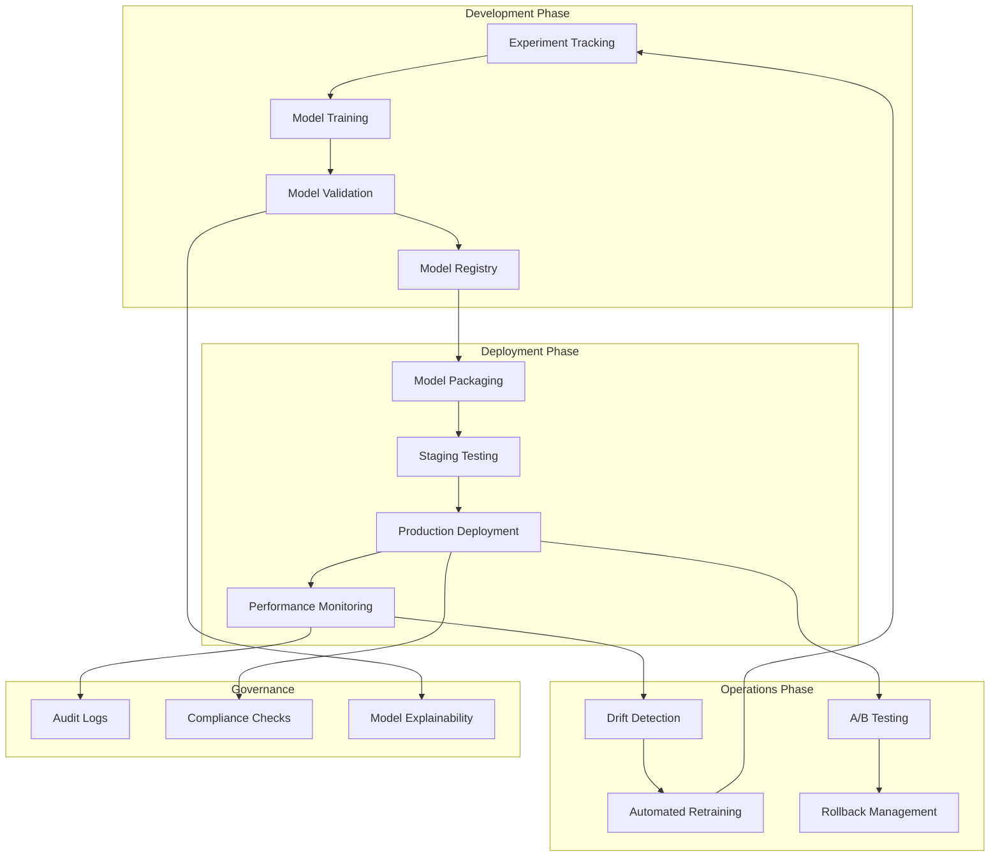
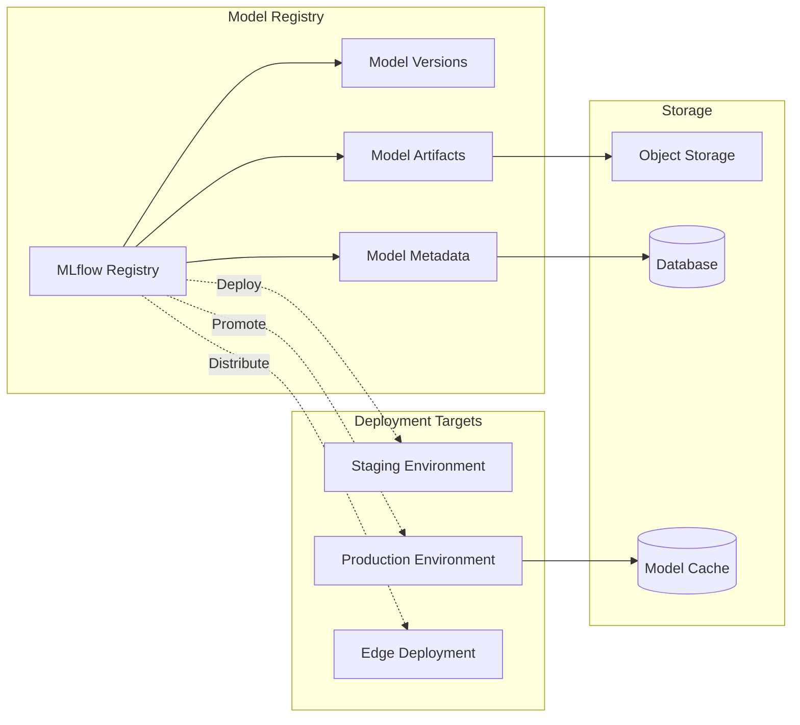
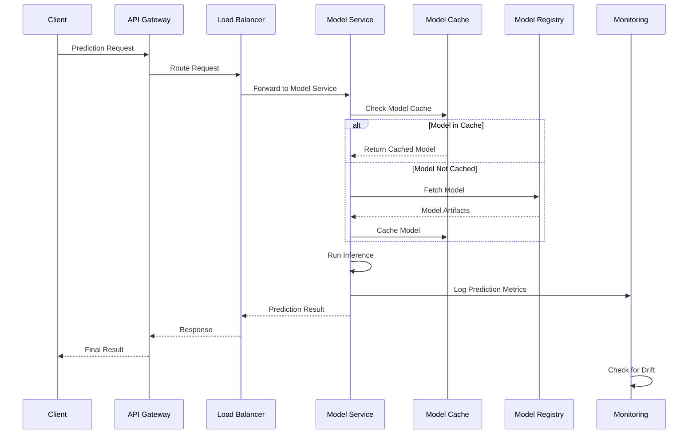

# ADR-023: ML Model Lifecycle Management

🍞 **Breadcrumb:** 🏠 [Home](../../../index.md) > 👨‍💻 [Developer Guides](../../README.md) > 🏗️ [Architecture](../README.md) > 📋 [ADR](README.md) > ML Model Lifecycle Management

## Status

PROPOSED

## Context

### Problem Statement

Pynomaly has extensive MLOps functionality including model training, versioning, deployment, and monitoring, but lacks a comprehensive ML model lifecycle management strategy. The current implementation has scattered model management logic across different packages, inconsistent model versioning, no clear deployment pipeline, and limited model performance monitoring. As the platform scales to support multiple models, teams, and deployment environments, we need a unified approach to ML model lifecycle management.

### Goals

- **Model Versioning**: Comprehensive versioning strategy for models, datasets, and experiments
- **Deployment Pipeline**: Automated, reliable model deployment with rollback capabilities
- **Performance Monitoring**: Continuous monitoring of model performance and drift detection
- **Experiment Tracking**: Track experiments, hyperparameters, and model metrics
- **A/B Testing**: Support for model comparison and gradual rollouts
- **Governance**: Model governance, compliance, and audit trails
- **Scalability**: Support for multiple models and deployment environments

### Constraints

- **Existing Infrastructure**: Must work with current FastAPI and database infrastructure
- **Performance Requirements**: Model inference must remain under 100ms for real-time detection
- **Storage Costs**: Model artifacts and experiment data storage must be cost-effective
- **Team Workflow**: Must integrate with existing development and deployment workflows
- **Compliance Requirements**: Model decisions must be auditable and explainable
- **Resource Limitations**: Training and deployment infrastructure constraints

### Assumptions

- Model artifacts will be stored in cloud object storage (S3/Azure Blob)
- MLflow or similar platform will be used for experiment tracking
- Container-based deployment will be the primary deployment method
- Model performance will be monitored continuously in production
- Multiple model versions may run simultaneously for A/B testing

## Decision

### Chosen Solution

**Implement a Comprehensive MLOps Pipeline** with MLflow for experiment tracking, containerized model deployment, automated monitoring, and governance workflows integrated with the existing Pynomaly architecture.

### Rationale

1. **Standardization**: Unified approach to model management across all domains
2. **Automation**: Reduces manual effort and human errors in deployment
3. **Observability**: Comprehensive monitoring and alerting for model performance
4. **Compliance**: Built-in governance and audit capabilities
5. **Scalability**: Supports multiple models, teams, and environments
6. **Integration**: Seamless integration with existing Pynomaly infrastructure

## Architecture

### ML Lifecycle Overview


### Model Registry Architecture


### Model Serving Architecture


## Options Considered

### Pros and Cons Matrix

| Option | Pros | Cons | Score |
|--------|------|------|-------|
| **MLflow + Custom Deployment** | ✅ Industry standard<br/>✅ Full control<br/>✅ Integration flexibility | ❌ Infrastructure overhead<br/>❌ Custom deployment logic | **8/10** |
| **Kubeflow** | ✅ Kubernetes native<br/>✅ Complete pipeline<br/>✅ Scalable | ❌ Complex setup<br/>❌ Kubernetes dependency<br/>❌ Overkill for current needs | 6/10 |
| **Cloud ML Services** | ✅ Managed infrastructure<br/>✅ Built-in monitoring<br/>✅ Easy scaling | ❌ Vendor lock-in<br/>❌ Limited customization<br/>❌ Cost scaling | 7/10 |
| **Custom ML Platform** | ✅ Full customization<br/>✅ Perfect fit | ❌ Development overhead<br/>❌ Maintenance burden<br/>❌ Time to market | 4/10 |

### Rejected Alternatives

**Custom ML Platform**: Rejected due to high development and maintenance overhead. Building a complete MLOps platform would divert resources from core anomaly detection features.

**Kubeflow**: Rejected as too complex for current team size and requirements. The overhead of managing Kubernetes pipelines outweighs benefits.

## Implementation

### Technical Approach

#### Model Registry Implementation
```python
from mlflow import MlflowClient
from mlflow.models import ModelSignature
from mlflow.tracking import MlflowClient
import mlflow.sklearn
from typing import Dict, Any, Optional
from dataclasses import dataclass
from enum import Enum

class ModelStage(Enum):
    STAGING = "Staging"
    PRODUCTION = "Production"
    ARCHIVED = "Archived"

@dataclass
class ModelMetadata:
    name: str
    version: str
    stage: ModelStage
    metrics: Dict[str, float]
    tags: Dict[str, str]
    signature: ModelSignature
    description: Optional[str] = None

class ModelRegistry:
    def __init__(self, tracking_uri: str):
        self.client = MlflowClient(tracking_uri)
        mlflow.set_tracking_uri(tracking_uri)

    async def register_model(self, 
                           model: Any, 
                           name: str, 
                           metadata: ModelMetadata) -> str:
        """Register a new model version"""
        with mlflow.start_run():
            # Log model with signature
            model_uri = mlflow.sklearn.log_model(
                model, 
                "model",
                signature=metadata.signature,
                registered_model_name=name
            )
            
            # Log metrics and tags
            mlflow.log_metrics(metadata.metrics)
            for key, value in metadata.tags.items():
                mlflow.set_tag(key, value)
            
            # Get the model version
            run = mlflow.active_run()
            model_version = self.client.create_model_version(
                name=name,
                source=model_uri,
                run_id=run.info.run_id,
                description=metadata.description
            )
            
            return model_version.version

    async def promote_model(self, 
                          name: str, 
                          version: str, 
                          stage: ModelStage) -> None:
        """Promote model to different stage"""
        self.client.transition_model_version_stage(
            name=name,
            version=version,
            stage=stage.value
        )

    async def get_model(self, 
                       name: str, 
                       stage: ModelStage = ModelStage.PRODUCTION) -> Any:
        """Load model from registry"""
        model_uri = f"models:/{name}/{stage.value}"
        return mlflow.sklearn.load_model(model_uri)

    async def list_models(self) -> List[ModelMetadata]:
        """List all registered models"""
        models = []
        for rm in self.client.list_registered_models():
            for mv in rm.latest_versions:
                models.append(ModelMetadata(
                    name=rm.name,
                    version=mv.version,
                    stage=ModelStage(mv.current_stage),
                    metrics={},  # Would need to fetch from run
                    tags=mv.tags or {},
                    signature=None,  # Would need to fetch from model
                    description=mv.description
                ))
        return models
```

#### Model Deployment Service
```python
import docker
import asyncio
from typing import Dict, Any
from dataclasses import dataclass
from kubernetes import client, config

@dataclass
class DeploymentConfig:
    model_name: str
    model_version: str
    environment: str
    replicas: int = 1
    resources: Dict[str, str] = None
    environment_vars: Dict[str, str] = None

class ModelDeploymentService:
    def __init__(self, registry: ModelRegistry):
        self.registry = registry
        self.docker_client = docker.from_env()
        config.load_incluster_config()  # For K8s deployment
        self.k8s_apps_v1 = client.AppsV1Api()

    async def build_model_image(self, 
                              model_name: str, 
                              version: str) -> str:
        """Build Docker image for model"""
        # Generate Dockerfile
        dockerfile_content = f"""
        FROM python:3.9-slim
        
        WORKDIR /app
        
        # Install dependencies
        COPY requirements.txt .
        RUN pip install -r requirements.txt
        
        # Copy model artifacts
        COPY model/ ./model/
        
        # Copy serving code
        COPY serve.py .
        
        EXPOSE 8080
        
        CMD ["python", "serve.py"]
        """
        
        # Build image
        image_tag = f"{model_name}:{version}"
        build_result = await asyncio.get_event_loop().run_in_executor(
            None,
            self.docker_client.images.build,
            {
                "path": ".",
                "dockerfile": dockerfile_content,
                "tag": image_tag
            }
        )
        
        return image_tag

    async def deploy_to_kubernetes(self, 
                                 config: DeploymentConfig) -> Dict[str, Any]:
        """Deploy model to Kubernetes"""
        
        # Create deployment manifest
        deployment = client.V1Deployment(
            api_version="apps/v1",
            kind="Deployment",
            metadata=client.V1ObjectMeta(
                name=f"{config.model_name}-{config.model_version}",
                labels={"model": config.model_name, "version": config.model_version}
            ),
            spec=client.V1DeploymentSpec(
                replicas=config.replicas,
                selector=client.V1LabelSelector(
                    match_labels={"model": config.model_name}
                ),
                template=client.V1PodTemplateSpec(
                    metadata=client.V1ObjectMeta(
                        labels={"model": config.model_name, "version": config.model_version}
                    ),
                    spec=client.V1PodSpec(
                        containers=[
                            client.V1Container(
                                name="model-server",
                                image=f"{config.model_name}:{config.model_version}",
                                ports=[client.V1ContainerPort(container_port=8080)],
                                env=[
                                    client.V1EnvVar(name=k, value=v)
                                    for k, v in (config.environment_vars or {}).items()
                                ],
                                resources=client.V1ResourceRequirements(
                                    requests=config.resources or {"cpu": "100m", "memory": "256Mi"}
                                )
                            )
                        ]
                    )
                )
            )
        )
        
        # Deploy to Kubernetes
        result = self.k8s_apps_v1.create_namespaced_deployment(
            body=deployment,
            namespace=config.environment
        )
        
        return {
            "deployment_name": result.metadata.name,
            "namespace": result.metadata.namespace,
            "status": "deployed"
        }

    async def rollback_deployment(self, 
                                model_name: str, 
                                environment: str, 
                                target_version: str) -> Dict[str, Any]:
        """Rollback to previous model version"""
        deployment_name = f"{model_name}-{target_version}"
        
        # Update deployment image
        deployment = self.k8s_apps_v1.read_namespaced_deployment(
            name=deployment_name,
            namespace=environment
        )
        
        deployment.spec.template.spec.containers[0].image = f"{model_name}:{target_version}"
        
        result = self.k8s_apps_v1.patch_namespaced_deployment(
            name=deployment_name,
            namespace=environment,
            body=deployment
        )
        
        return {
            "deployment_name": result.metadata.name,
            "rolled_back_to": target_version,
            "status": "rollback_complete"
        }
```

#### Model Monitoring Service
```python
import numpy as np
from scipy.stats import ks_2samp
from typing import List, Dict, Any, Tuple
import logging
from dataclasses import dataclass
from datetime import datetime, timedelta

@dataclass
class DriftDetectionResult:
    feature_name: str
    drift_score: float
    p_value: float
    is_drift: bool
    threshold: float = 0.05

class ModelMonitoringService:
    def __init__(self, 
                 model_registry: ModelRegistry,
                 metrics_storage: MetricsStorage):
        self.registry = model_registry
        self.metrics = metrics_storage
        self.logger = logging.getLogger(__name__)

    async def log_prediction(self, 
                           model_name: str, 
                           version: str,
                           input_data: Dict[str, Any],
                           prediction: Any,
                           confidence: float,
                           latency_ms: float) -> None:
        """Log individual prediction for monitoring"""
        await self.metrics.log_prediction({
            "model_name": model_name,
            "version": version,
            "timestamp": datetime.utcnow().isoformat(),
            "input_data": input_data,
            "prediction": prediction,
            "confidence": confidence,
            "latency_ms": latency_ms
        })

    async def detect_data_drift(self, 
                              model_name: str,
                              current_data: np.ndarray,
                              reference_data: np.ndarray,
                              feature_names: List[str]) -> List[DriftDetectionResult]:
        """Detect data drift using statistical tests"""
        drift_results = []
        
        for i, feature_name in enumerate(feature_names):
            # Kolmogorov-Smirnov test for drift detection
            ks_statistic, p_value = ks_2samp(
                reference_data[:, i], 
                current_data[:, i]
            )
            
            is_drift = p_value < 0.05  # 5% significance level
            
            drift_results.append(DriftDetectionResult(
                feature_name=feature_name,
                drift_score=ks_statistic,
                p_value=p_value,
                is_drift=is_drift
            ))
            
            if is_drift:
                self.logger.warning(
                    f"Data drift detected in feature {feature_name} "
                    f"for model {model_name}: KS={ks_statistic:.4f}, p={p_value:.4f}"
                )
        
        return drift_results

    async def check_model_performance(self, 
                                    model_name: str,
                                    time_window: timedelta = timedelta(hours=24)) -> Dict[str, Any]:
        """Check model performance metrics over time window"""
        end_time = datetime.utcnow()
        start_time = end_time - time_window
        
        # Get prediction metrics from storage
        metrics = await self.metrics.get_metrics(
            model_name=model_name,
            start_time=start_time,
            end_time=end_time
        )
        
        if not metrics:
            return {"status": "no_data", "model_name": model_name}
        
        # Calculate performance statistics
        confidences = [m["confidence"] for m in metrics]
        latencies = [m["latency_ms"] for m in metrics]
        
        performance_stats = {
            "model_name": model_name,
            "time_window": str(time_window),
            "total_predictions": len(metrics),
            "avg_confidence": np.mean(confidences),
            "min_confidence": np.min(confidences),
            "avg_latency_ms": np.mean(latencies),
            "p95_latency_ms": np.percentile(latencies, 95),
            "low_confidence_rate": len([c for c in confidences if c < 0.7]) / len(confidences)
        }
        
        # Performance alerts
        alerts = []
        if performance_stats["avg_confidence"] < 0.8:
            alerts.append("LOW_CONFIDENCE")
        if performance_stats["p95_latency_ms"] > 200:
            alerts.append("HIGH_LATENCY")
        if performance_stats["low_confidence_rate"] > 0.1:
            alerts.append("HIGH_UNCERTAINTY_RATE")
        
        performance_stats["alerts"] = alerts
        
        return performance_stats

    async def trigger_retraining_if_needed(self, 
                                         model_name: str,
                                         drift_results: List[DriftDetectionResult],
                                         performance_stats: Dict[str, Any]) -> bool:
        """Determine if model needs retraining based on drift and performance"""
        
        # Count significant drift features
        drift_features = len([r for r in drift_results if r.is_drift])
        total_features = len(drift_results)
        drift_ratio = drift_features / total_features if total_features > 0 else 0
        
        # Retraining triggers
        should_retrain = (
            drift_ratio > 0.3 or  # More than 30% of features drifting
            "LOW_CONFIDENCE" in performance_stats.get("alerts", []) or
            "HIGH_UNCERTAINTY_RATE" in performance_stats.get("alerts", [])
        )
        
        if should_retrain:
            self.logger.info(
                f"Triggering retraining for {model_name}: "
                f"drift_ratio={drift_ratio:.2f}, alerts={performance_stats.get('alerts', [])}"
            )
            
            # Trigger retraining workflow
            await self._trigger_retraining_workflow(model_name, {
                "drift_features": drift_features,
                "drift_ratio": drift_ratio,
                "performance_alerts": performance_stats.get("alerts", [])
            })
        
        return should_retrain

    async def _trigger_retraining_workflow(self, 
                                         model_name: str,
                                         trigger_reason: Dict[str, Any]) -> None:
        """Trigger automated retraining workflow"""
        # This would integrate with the task queue system (ADR-022)
        from pynomaly.application.services.training_service import TrainingService
        
        training_service = TrainingService()
        await training_service.queue_retraining_task(
            model_name=model_name,
            reason=trigger_reason,
            priority="high"
        )
```

### Migration Strategy

#### Phase 1: Experiment Tracking Setup (Weeks 1-2)
1. **MLflow Installation**: Deploy MLflow server with database backend
2. **Experiment Integration**: Integrate existing training code with MLflow tracking
3. **Model Registry**: Set up model registry and migrate existing models
4. **Basic Monitoring**: Add basic prediction logging

#### Phase 2: Deployment Pipeline (Weeks 3-5)
1. **Containerization**: Create model serving containers and deployment templates
2. **Staging Environment**: Set up staging deployment for model testing
3. **Automated Deployment**: Implement automated deployment from registry
4. **Blue-Green Deployment**: Add blue-green deployment capabilities

#### Phase 3: Advanced Monitoring (Weeks 6-8)
1. **Drift Detection**: Implement statistical drift detection
2. **Performance Monitoring**: Add comprehensive performance metrics
3. **Alerting System**: Set up alerts for model performance issues
4. **Automated Retraining**: Implement triggered retraining workflows

### Testing Strategy

#### Model Validation Testing
```python
@pytest.mark.asyncio
async def test_model_deployment():
    registry = ModelRegistry("sqlite:///test.db")
    deployment_service = ModelDeploymentService(registry)
    
    # Test model registration
    model = DummyModel()
    metadata = ModelMetadata(
        name="test-model",
        version="1.0.0",
        stage=ModelStage.STAGING,
        metrics={"accuracy": 0.95},
        tags={"algorithm": "isolation_forest"}
    )
    
    version = await registry.register_model(model, "test-model", metadata)
    assert version == "1"
    
    # Test deployment
    config = DeploymentConfig(
        model_name="test-model",
        model_version="1.0.0",
        environment="test"
    )
    
    result = await deployment_service.deploy_to_kubernetes(config)
    assert result["status"] == "deployed"
```

#### Drift Detection Testing
- **Statistical Test Validation**: Verify drift detection algorithms work correctly
- **Performance Benchmarking**: Test monitoring overhead and latency
- **Integration Testing**: End-to-end testing of ML pipeline workflows

## Consequences

### Positive
- **Standardized ML Workflows**: Consistent approach to model development and deployment
- **Improved Model Quality**: Better tracking and validation of model performance
- **Faster Time to Production**: Automated deployment reduces manual effort
- **Risk Mitigation**: Rollback capabilities and staged deployments reduce deployment risk
- **Compliance**: Built-in audit trails and governance capabilities
- **Team Collaboration**: Shared experiment tracking and model registry

### Negative
- **Infrastructure Complexity**: Additional infrastructure components to manage
- **Learning Curve**: Team needs to learn MLOps tools and practices
- **Storage Costs**: Model artifacts and experiment data require significant storage
- **Operational Overhead**: Monitoring and maintenance of ML pipeline components
- **Deployment Latency**: Container startup time may affect deployment speed

### Neutral
- **Development Process**: Different but not necessarily slower development workflow
- **Resource Usage**: Some overhead offset by better resource utilization
- **Code Organization**: More structured but potentially more complex codebase

## Compliance

### Security Impact
- **Model Artifact Security**: Secure storage and access control for model files
- **Deployment Security**: Container security scanning and runtime protection
- **Access Control**: Role-based access to model registry and deployment environments
- **Audit Logging**: Comprehensive logging of model operations and decisions

### Performance Impact
- **Inference Latency**: 5-10ms additional latency from containerized serving
- **Memory Usage**: Container overhead and model caching requirements
- **Storage Performance**: Model loading and artifact retrieval times
- **Monitoring Overhead**: Minimal performance impact from metrics collection

### Monitoring Requirements
- **Model Performance Metrics**: Accuracy, latency, throughput, and confidence scores
- **Infrastructure Metrics**: Container health, resource usage, and deployment status
- **Business Metrics**: Model predictions impact on business outcomes
- **Drift Detection Alerts**: Automated alerting for data and concept drift
- **Pipeline Health**: End-to-end ML pipeline monitoring and error tracking

## Decision Log

| Date | Author | Action | Rationale |
|------|--------|--------|-----------|
| 2025-07-14 | Architecture Team | PROPOSED | Need comprehensive MLOps strategy for model lifecycle management |

## References

- [ADR-001: Core Architecture Patterns](ADR-001-core-architecture-patterns.md)
- [ADR-022: Asynchronous Processing Architecture](ADR-022-asynchronous-processing-architecture.md)
- [MLflow Documentation](https://mlflow.org/docs/latest/index.html)
- [Kubernetes ML Serving](https://kubernetes.io/docs/concepts/extend-kubernetes/api-extension/)
- [ML Engineering Book](https://www.oreilly.com/library/view/machine-learning-engineering/9781492058052/)

---

## 🔗 **Related Documentation**

### **Architecture**
- **[Architecture Overview](../overview.md)** - System design principles
- **[Clean Architecture](../overview.md)** - Architectural patterns
- **[ADR Index](README.md)** - All architectural decisions

### **Implementation**
- **[Implementation Guide](../../contributing/IMPLEMENTATION_GUIDE.md)** - Coding standards
- **[Contributing Guidelines](../../contributing/CONTRIBUTING.md)** - Development process
- **[File Organization](../../contributing/FILE_ORGANIZATION_STANDARDS.md)** - Project structure

### **Deployment**
- **[Production Deployment](../../../deployment/README.md)** - Production setup
- **[Security](../../../deployment/SECURITY.md)** - Security configuration
- **[Monitoring](../../../user-guides/basic-usage/monitoring.md)** - System observability

---

**Authors:** Architecture Team<br/>
**Last Updated:** 2025-07-14<br/>
**Next Review:** 2025-10-14