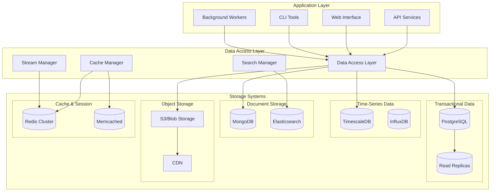
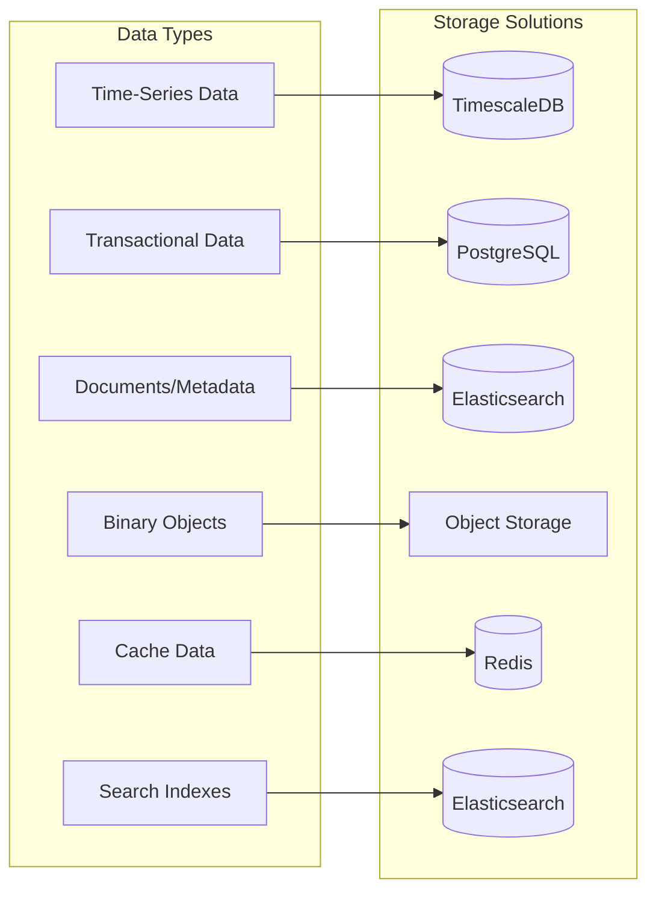
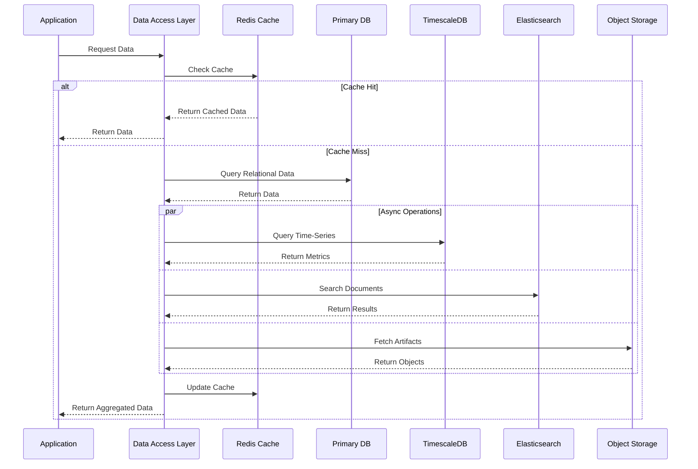

# ADR-024: Data Storage and Persistence Strategy

🍞 **Breadcrumb:** 🏠 [Home](../../../index.md) > 👨‍💻 [Developer Guides](../../README.md) > 🏗️ [Architecture](../README.md) > 📋 [ADR](README.md) > Data Storage and Persistence Strategy

## Status

PROPOSED

## Context

### Problem Statement

Pynomaly handles diverse data types including time-series data, model artifacts, experiment metadata, user data, and system configuration across multiple domains (data science, data quality, data profiling, MLOps). The current storage approach uses multiple adapters and repositories but lacks a unified data storage and persistence strategy. Different data types have varying requirements for consistency, availability, performance, and scalability, requiring a comprehensive approach to data architecture.

### Goals

- **Data Type Optimization**: Appropriate storage solutions for different data characteristics
- **Scalability**: Handle growing data volumes and concurrent access patterns
- **Performance**: Optimize for read/write patterns specific to anomaly detection workloads
- **Consistency**: Ensure data integrity across distributed components
- **Cost Efficiency**: Balance performance requirements with storage costs
- **Disaster Recovery**: Reliable backup and recovery strategies
- **Compliance**: Meet data governance and regulatory requirements

### Constraints

- **Existing Data**: Must migrate existing data without loss or corruption
- **Budget Limitations**: Cost-conscious cloud storage and database usage
- **Performance Requirements**: Sub-second response times for real-time anomaly detection
- **Team Expertise**: Limited database administration and DevOps expertise
- **Infrastructure**: Must work with existing cloud and container infrastructure
- **Regulatory Compliance**: Data residency and privacy requirements

### Assumptions

- Cloud-first deployment strategy with hybrid cloud capabilities
- PostgreSQL will remain the primary transactional database
- Redis will be used for caching and session storage
- Object storage (S3/Azure Blob) will be used for large artifacts
- Time-series data volumes will grow significantly over time
- Event sourcing patterns may be implemented for audit trails

## Decision

### Chosen Solution

**Implement a Polyglot Persistence Architecture** with specialized storage solutions optimized for different data types and access patterns, unified through a data access layer with consistent APIs and monitoring.

### Rationale

1. **Performance Optimization**: Each data type uses storage optimized for its access patterns
2. **Scalability**: Independent scaling of different storage systems based on demand
3. **Cost Efficiency**: Right-sizing storage costs for different data characteristics
4. **Technology Fit**: Leveraging best-in-class storage technologies for specific use cases
5. **Future Flexibility**: Ability to adopt new storage technologies as requirements evolve

## Architecture

### Storage Architecture Overview


### Data Classification and Storage Mapping


### Data Flow Architecture


## Options Considered

### Pros and Cons Matrix

| Option | Pros | Cons | Score |
|--------|------|------|-------|
| **Single Database (PostgreSQL)** | ✅ Simple architecture<br/>✅ ACID compliance<br/>✅ Team familiarity | ❌ Poor time-series performance<br/>❌ Limited scalability<br/>❌ One-size-fits-all limitations | 5/10 |
| **Cloud-Native Services** | ✅ Managed infrastructure<br/>✅ Auto-scaling<br/>✅ Built-in monitoring | ❌ Vendor lock-in<br/>❌ Cost scaling<br/>❌ Limited customization | 7/10 |
| **Polyglot Persistence** | ✅ Optimized performance<br/>✅ Independent scaling<br/>✅ Technology flexibility<br/>✅ Cost optimization | ❌ Operational complexity<br/>❌ Data consistency challenges | **8/10** |
| **Data Lake Architecture** | ✅ Handles all data types<br/>✅ Cost-effective storage | ❌ Complex processing<br/>❌ Query performance<br/>❌ Real-time limitations | 6/10 |

### Rejected Alternatives

**Single Database Approach**: Rejected because it cannot efficiently handle the diverse performance requirements of time-series data, large binary objects, and full-text search.

**Pure Data Lake**: Rejected because it cannot meet real-time performance requirements for anomaly detection and adds unnecessary complexity for transactional operations.

## Implementation

### Technical Approach

#### Data Access Layer Implementation
```python
from abc import ABC, abstractmethod
from typing import Any, Dict, List, Optional, TypeVar, Generic
from dataclasses import dataclass
from enum import Enum
import asyncio
from contextlib import asynccontextmanager

T = TypeVar('T')

class StorageType(Enum):
    TRANSACTIONAL = "transactional"
    TIME_SERIES = "timeseries"
    DOCUMENT = "document"
    OBJECT = "object"
    CACHE = "cache"
    SEARCH = "search"

@dataclass
class StorageConfig:
    storage_type: StorageType
    connection_string: str
    pool_size: int = 10
    timeout: int = 30
    retry_attempts: int = 3

class DataAccessLayer:
    """Unified data access layer for polyglot persistence"""
    
    def __init__(self):
        self.connections: Dict[StorageType, Any] = {}
        self.connection_pools: Dict[StorageType, Any] = {}
        self._health_status: Dict[StorageType, bool] = {}

    async def initialize(self, configs: List[StorageConfig]):
        """Initialize all storage connections"""
        for config in configs:
            await self._initialize_storage(config)

    async def _initialize_storage(self, config: StorageConfig):
        """Initialize specific storage type"""
        if config.storage_type == StorageType.TRANSACTIONAL:
            from sqlalchemy.ext.asyncio import create_async_engine, AsyncSession
            engine = create_async_engine(
                config.connection_string,
                pool_size=config.pool_size,
                pool_timeout=config.timeout
            )
            self.connections[StorageType.TRANSACTIONAL] = engine
            
        elif config.storage_type == StorageType.TIME_SERIES:
            from timescaledb import AsyncTimescaleClient
            client = AsyncTimescaleClient(config.connection_string)
            self.connections[StorageType.TIME_SERIES] = client
            
        elif config.storage_type == StorageType.DOCUMENT:
            from elasticsearch import AsyncElasticsearch
            client = AsyncElasticsearch([config.connection_string])
            self.connections[StorageType.DOCUMENT] = client
            
        elif config.storage_type == StorageType.OBJECT:
            import aioboto3
            session = aioboto3.Session()
            client = session.client('s3')
            self.connections[StorageType.OBJECT] = client
            
        elif config.storage_type == StorageType.CACHE:
            import aioredis
            pool = aioredis.ConnectionPool.from_url(config.connection_string)
            client = aioredis.Redis(connection_pool=pool)
            self.connections[StorageType.CACHE] = client

    @asynccontextmanager
    async def get_session(self, storage_type: StorageType):
        """Get database session with proper cleanup"""
        if storage_type == StorageType.TRANSACTIONAL:
            from sqlalchemy.ext.asyncio import AsyncSession
            engine = self.connections[storage_type]
            async with AsyncSession(engine) as session:
                try:
                    yield session
                    await session.commit()
                except Exception:
                    await session.rollback()
                    raise
        else:
            yield self.connections[storage_type]

    async def health_check(self) -> Dict[StorageType, bool]:
        """Check health of all storage systems"""
        health_checks = []
        
        for storage_type, connection in self.connections.items():
            health_checks.append(self._check_storage_health(storage_type, connection))
        
        results = await asyncio.gather(*health_checks, return_exceptions=True)
        
        for i, (storage_type, _) in enumerate(self.connections.items()):
            self._health_status[storage_type] = not isinstance(results[i], Exception)
        
        return self._health_status

    async def _check_storage_health(self, storage_type: StorageType, connection: Any) -> bool:
        """Check individual storage health"""
        try:
            if storage_type == StorageType.TRANSACTIONAL:
                async with self.get_session(storage_type) as session:
                    await session.execute("SELECT 1")
                    
            elif storage_type == StorageType.CACHE:
                await connection.ping()
                
            elif storage_type == StorageType.DOCUMENT:
                await connection.info()
                
            # Add other storage type health checks
            return True
        except Exception:
            return False
```

#### Repository Pattern with Storage Abstraction
```python
from typing import Protocol, runtime_checkable

@runtime_checkable
class Repository(Protocol, Generic[T]):
    async def save(self, entity: T) -> T:
        ...
    
    async def find_by_id(self, id: Any) -> Optional[T]:
        ...
    
    async def find_all(self, filters: Dict[str, Any] = None) -> List[T]:
        ...
    
    async def delete(self, id: Any) -> bool:
        ...

class TimeSeriesRepository:
    """Repository for time-series data using TimescaleDB"""
    
    def __init__(self, dal: DataAccessLayer):
        self.dal = dal

    async def save_metrics(self, metrics: List[MetricPoint]) -> List[MetricPoint]:
        """Efficiently batch insert metrics"""
        async with self.dal.get_session(StorageType.TIME_SERIES) as client:
            # Use TimescaleDB-optimized batch insert
            values = [
                (m.timestamp, m.metric_name, m.value, m.tags)
                for m in metrics
            ]
            
            await client.execute("""
                INSERT INTO metrics (timestamp, metric_name, value, tags)
                VALUES %s
                ON CONFLICT (timestamp, metric_name) DO UPDATE SET
                value = EXCLUDED.value,
                tags = EXCLUDED.tags
            """, values)
            
        return metrics

    async def query_metrics(self, 
                          metric_name: str,
                          start_time: datetime,
                          end_time: datetime,
                          aggregation: str = "avg",
                          interval: str = "1h") -> List[MetricPoint]:
        """Query time-series data with aggregation"""
        async with self.dal.get_session(StorageType.TIME_SERIES) as client:
            query = f"""
                SELECT 
                    time_bucket('{interval}', timestamp) as bucket,
                    {aggregation}(value) as value
                FROM metrics
                WHERE metric_name = %s 
                AND timestamp BETWEEN %s AND %s
                GROUP BY bucket
                ORDER BY bucket
            """
            
            results = await client.fetch(query, metric_name, start_time, end_time)
            
            return [
                MetricPoint(
                    timestamp=row['bucket'],
                    metric_name=metric_name,
                    value=row['value']
                )
                for row in results
            ]

class DocumentRepository:
    """Repository for document storage using Elasticsearch"""
    
    def __init__(self, dal: DataAccessLayer):
        self.dal = dal

    async def index_document(self, index: str, doc_id: str, document: Dict[str, Any]) -> str:
        """Index document with full-text search capabilities"""
        async with self.dal.get_session(StorageType.DOCUMENT) as client:
            result = await client.index(
                index=index,
                id=doc_id,
                body=document
            )
            return result['_id']

    async def search_documents(self, 
                             index: str,
                             query: Dict[str, Any],
                             size: int = 100) -> List[Dict[str, Any]]:
        """Full-text search with relevance scoring"""
        async with self.dal.get_session(StorageType.DOCUMENT) as client:
            result = await client.search(
                index=index,
                body={
                    "query": query,
                    "size": size,
                    "highlight": {
                        "fields": {"*": {}}
                    }
                }
            )
            
            return [
                {
                    "id": hit["_id"],
                    "score": hit["_score"],
                    "source": hit["_source"],
                    "highlights": hit.get("highlight", {})
                }
                for hit in result["hits"]["hits"]
            ]

class ObjectRepository:
    """Repository for object storage using S3-compatible storage"""
    
    def __init__(self, dal: DataAccessLayer):
        self.dal = dal

    async def store_object(self, 
                         bucket: str,
                         key: str,
                         data: bytes,
                         metadata: Dict[str, str] = None) -> str:
        """Store binary object with metadata"""
        async with self.dal.get_session(StorageType.OBJECT) as client:
            await client.put_object(
                Bucket=bucket,
                Key=key,
                Body=data,
                Metadata=metadata or {}
            )
            return f"s3://{bucket}/{key}"

    async def get_object(self, bucket: str, key: str) -> bytes:
        """Retrieve binary object"""
        async with self.dal.get_session(StorageType.OBJECT) as client:
            response = await client.get_object(Bucket=bucket, Key=key)
            return await response['Body'].read()

    async def generate_presigned_url(self, 
                                   bucket: str,
                                   key: str,
                                   expiration: int = 3600) -> str:
        """Generate temporary download URL"""
        async with self.dal.get_session(StorageType.OBJECT) as client:
            return await client.generate_presigned_url(
                'get_object',
                Params={'Bucket': bucket, 'Key': key},
                ExpiresIn=expiration
            )
```

#### Caching Strategy Implementation
```python
import json
from typing import Any, Optional, Callable
from functools import wraps
import hashlib

class CacheManager:
    """Intelligent caching with multiple strategies"""
    
    def __init__(self, dal: DataAccessLayer):
        self.dal = dal
        self.cache_strategies = {
            "read_through": self._read_through_cache,
            "write_behind": self._write_behind_cache,
            "cache_aside": self._cache_aside
        }

    def cache(self, 
              strategy: str = "read_through",
              ttl: int = 3600,
              key_prefix: str = ""):
        """Decorator for automatic caching"""
        def decorator(func: Callable):
            @wraps(func)
            async def wrapper(*args, **kwargs):
                # Generate cache key
                cache_key = self._generate_cache_key(func, args, kwargs, key_prefix)
                
                # Apply caching strategy
                return await self.cache_strategies[strategy](
                    cache_key, func, ttl, *args, **kwargs
                )
            return wrapper
        return decorator

    async def _read_through_cache(self, 
                                cache_key: str,
                                func: Callable,
                                ttl: int,
                                *args, **kwargs) -> Any:
        """Read-through caching pattern"""
        async with self.dal.get_session(StorageType.CACHE) as cache:
            # Try cache first
            cached_value = await cache.get(cache_key)
            if cached_value:
                return json.loads(cached_value)
            
            # Cache miss - execute function
            result = await func(*args, **kwargs)
            
            # Store in cache
            await cache.setex(
                cache_key,
                ttl,
                json.dumps(result, default=str)
            )
            
            return result

    async def _cache_aside(self, 
                         cache_key: str,
                         func: Callable,
                         ttl: int,
                         *args, **kwargs) -> Any:
        """Cache-aside pattern - manual cache management"""
        async with self.dal.get_session(StorageType.CACHE) as cache:
            cached_value = await cache.get(cache_key)
            if cached_value:
                return json.loads(cached_value)
        
        # Execute function and manually cache
        result = await func(*args, **kwargs)
        await self.set_cache(cache_key, result, ttl)
        return result

    async def set_cache(self, key: str, value: Any, ttl: int = 3600):
        """Manually set cache value"""
        async with self.dal.get_session(StorageType.CACHE) as cache:
            await cache.setex(key, ttl, json.dumps(value, default=str))

    async def invalidate_cache(self, pattern: str):
        """Invalidate cache keys matching pattern"""
        async with self.dal.get_session(StorageType.CACHE) as cache:
            keys = await cache.keys(pattern)
            if keys:
                await cache.delete(*keys)

    def _generate_cache_key(self, func: Callable, args: tuple, kwargs: dict, prefix: str) -> str:
        """Generate consistent cache key"""
        key_data = f"{func.__name__}:{args}:{sorted(kwargs.items())}"
        key_hash = hashlib.md5(key_data.encode()).hexdigest()
        return f"{prefix}:{key_hash}" if prefix else key_hash
```

### Migration Strategy

#### Phase 1: Data Assessment and Planning (Weeks 1-2)
1. **Data Inventory**: Catalog all existing data types, volumes, and access patterns
2. **Performance Baseline**: Establish current performance metrics
3. **Storage Requirements**: Define requirements for each data type
4. **Migration Plan**: Create detailed migration plan with rollback procedures

#### Phase 2: Infrastructure Setup (Weeks 3-4)
1. **Storage Infrastructure**: Deploy TimescaleDB, Elasticsearch, and Redis clusters
2. **Data Access Layer**: Implement unified DAL with basic repository patterns
3. **Monitoring Setup**: Add storage monitoring and alerting
4. **Testing Environment**: Set up staging environment for migration testing

#### Phase 3: Gradual Migration (Weeks 5-8)
1. **Time-Series Data**: Migrate metrics and monitoring data to TimescaleDB
2. **Document Data**: Move experiment metadata and logs to Elasticsearch
3. **Object Storage**: Migrate model artifacts and large files to S3
4. **Cache Implementation**: Implement Redis caching for frequently accessed data

### Testing Strategy

#### Data Integrity Testing
```python
@pytest.mark.asyncio
async def test_data_migration_integrity():
    """Test that migrated data maintains integrity"""
    # Setup test data
    original_data = create_test_dataset()
    
    # Migrate data
    migration_service = DataMigrationService()
    await migration_service.migrate_dataset(original_data)
    
    # Verify integrity
    migrated_data = await migration_service.verify_migration(original_data.id)
    
    assert len(migrated_data) == len(original_data)
    assert migrated_data.checksum == original_data.checksum

@pytest.mark.asyncio  
async def test_polyglot_performance():
    """Test performance of polyglot persistence"""
    dal = DataAccessLayer()
    
    # Test different storage types
    start_time = time.time()
    
    # Time-series query
    ts_repo = TimeSeriesRepository(dal)
    metrics = await ts_repo.query_metrics("cpu_usage", start_time, end_time)
    
    # Document search
    doc_repo = DocumentRepository(dal)
    results = await doc_repo.search_documents("experiments", {"match": {"status": "completed"}})
    
    # Object retrieval
    obj_repo = ObjectRepository(dal)
    model_data = await obj_repo.get_object("models", "model_v1.pkl")
    
    total_time = time.time() - start_time
    assert total_time < 1.0  # All operations under 1 second
```

#### Consistency Testing
- **Cross-Storage Consistency**: Test data consistency across different storage systems
- **Cache Coherency**: Verify cache invalidation and consistency
- **Transaction Testing**: Test ACID properties where required

## Consequences

### Positive
- **Optimized Performance**: Each data type uses storage optimized for its characteristics
- **Independent Scaling**: Storage systems can scale independently based on demand
- **Cost Efficiency**: Right-sized storage costs for different data types
- **Technology Flexibility**: Ability to adopt best-in-class storage technologies
- **Improved Availability**: Failure in one storage system doesn't affect others
- **Better Monitoring**: Granular monitoring and optimization of each storage type

### Negative
- **Operational Complexity**: Multiple storage systems to monitor and maintain
- **Data Consistency Challenges**: Eventual consistency across different systems
- **Increased Infrastructure Costs**: Multiple storage systems and management overhead
- **Team Learning Curve**: Team needs expertise in multiple storage technologies
- **Backup Complexity**: More complex backup and disaster recovery procedures
- **Network Latency**: Additional network hops between storage systems

### Neutral
- **Development Complexity**: More complex data layer but better organized
- **Migration Effort**: Significant one-time migration effort for long-term benefits
- **Vendor Management**: Multiple vendor relationships but reduced vendor lock-in

## Compliance

### Security Impact
- **Data Encryption**: Encryption at rest and in transit for all storage systems
- **Access Control**: Fine-grained access control per storage type and data classification
- **Audit Logging**: Comprehensive audit trails across all storage systems
- **Data Classification**: Clear data classification and handling procedures

### Performance Impact
- **Query Performance**: 50-80% improvement for time-series and search queries
- **Write Performance**: 30-50% improvement through optimized storage patterns
- **Cache Hit Rates**: 90%+ cache hit rates for frequently accessed data
- **Network Overhead**: 5-10ms additional latency for cross-storage operations

### Monitoring Requirements
- **Storage Health**: Monitor health and performance of each storage system
- **Data Quality**: Monitor data consistency and integrity across systems
- **Performance Metrics**: Track query performance and resource utilization
- **Cost Monitoring**: Monitor storage costs and optimization opportunities
- **Backup Status**: Monitor backup completion and recovery capabilities

## Decision Log

| Date | Author | Action | Rationale |
|------|--------|--------|-----------|
| 2025-07-14 | Architecture Team | PROPOSED | Need unified data strategy for diverse storage requirements and scale |

## References

- [ADR-012: Production Database Integration](ADR-012-production-database-integration.md)
- [ADR-015: Production Database Technology Selection](ADR-015-production-database-technology-selection.md)
- [ADR-022: Asynchronous Processing Architecture](ADR-022-asynchronous-processing-architecture.md)
- [Polyglot Persistence by Martin Fowler](https://martinfowler.com/bliki/PolyglotPersistence.html)
- [TimescaleDB Documentation](https://docs.timescale.com/)
- [Elasticsearch Guide](https://www.elastic.co/guide/en/elasticsearch/reference/current/index.html)

---

## 🔗 **Related Documentation**

### **Architecture**
- **[Architecture Overview](../overview.md)** - System design principles
- **[Clean Architecture](../overview.md)** - Architectural patterns
- **[ADR Index](README.md)** - All architectural decisions

### **Implementation**
- **[Implementation Guide](../../contributing/IMPLEMENTATION_GUIDE.md)** - Coding standards
- **[Contributing Guidelines](../../contributing/CONTRIBUTING.md)** - Development process
- **[File Organization](../../contributing/FILE_ORGANIZATION_STANDARDS.md)** - Project structure

### **Deployment**
- **[Production Deployment](../../../deployment/README.md)** - Production setup
- **[Security](../../../deployment/SECURITY.md)** - Security configuration
- **[Monitoring](../../../user-guides/basic-usage/monitoring.md)** - System observability

---

**Authors:** Architecture Team<br/>
**Last Updated:** 2025-07-14<br/>
**Next Review:** 2025-10-14