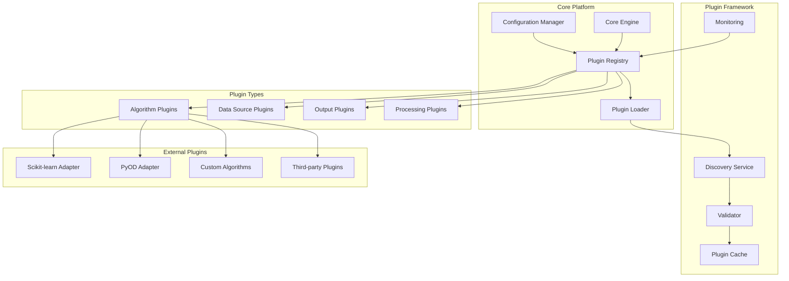
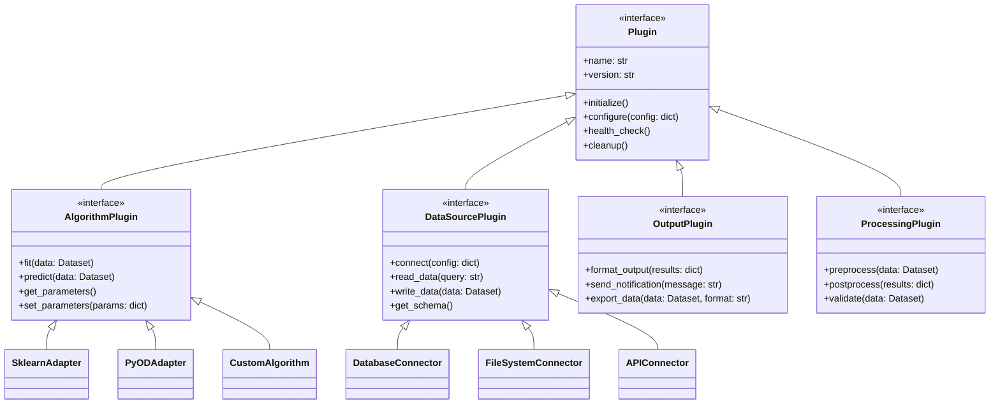
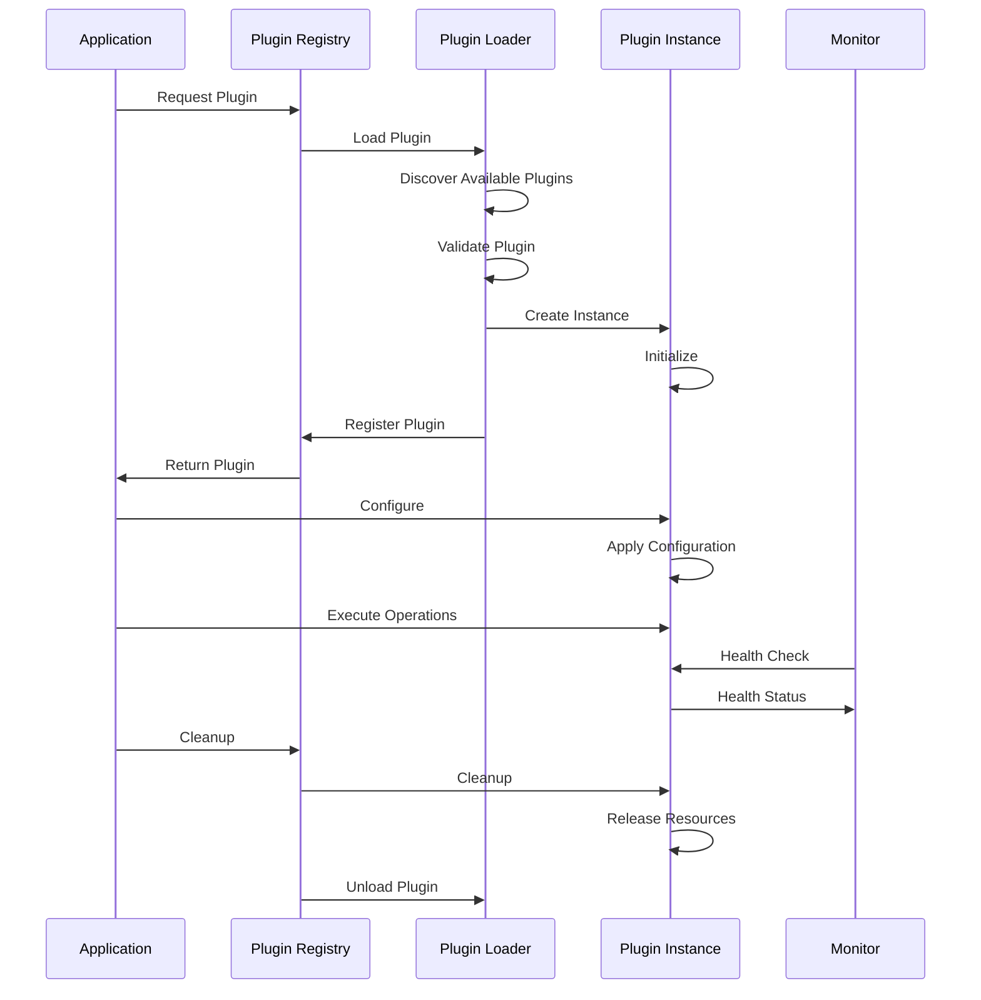

# ADR-025: Plugin and Adapter Architecture

🍞 **Breadcrumb:** 🏠 [Home](../../../index.md) > 👨‍💻 [Developer Guides](../../README.md) > 🏗️ [Architecture](../README.md) > 📋 [ADR](README.md) > Plugin and Adapter Architecture

## Status

PROPOSED

## Context

### Problem Statement

Pynomaly currently has extensive adapter pattern usage for integrating different machine learning algorithms (sklearn, PyOD, custom implementations) and external systems, but lacks a unified plugin and adapter architecture. The current implementation has scattered adapter code, inconsistent interfaces, limited extensibility for third-party integrations, and no clear strategy for plugin loading and lifecycle management. As the platform grows to support more algorithms, data sources, and integrations, we need a comprehensive plugin architecture.

### Goals

- **Extensibility**: Easy integration of new algorithms, data sources, and external systems
- **Modularity**: Clear separation between core platform and extensions
- **Third-party Support**: Enable external developers to create plugins
- **Dynamic Loading**: Runtime discovery and loading of plugins
- **Lifecycle Management**: Proper plugin initialization, configuration, and cleanup
- **Version Compatibility**: Manage plugin versioning and compatibility
- **Security**: Safe execution of third-party code with appropriate isolation

### Constraints

- **Existing Adapters**: Must work with current sklearn and PyOD adapter implementations
- **Performance Requirements**: Plugin loading must not impact runtime performance
- **Security Concerns**: Third-party plugins must be executed safely
- **Team Resources**: Limited time for complex plugin framework development
- **Python Ecosystem**: Must work with standard Python packaging and distribution
- **Backward Compatibility**: Existing algorithm integrations must continue working

### Assumptions

- Plugins will be distributed as Python packages via PyPI or internal repositories
- Dynamic discovery will use Python entry points mechanism
- Plugin interfaces will be defined using protocols and abstract base classes
- Configuration will be handled through standardized configuration schemas
- Security isolation will use Python's importlib and sandboxing where appropriate

## Decision

### Chosen Solution

**Implement a Standardized Plugin and Adapter Framework** using Python entry points for discovery, protocol-based interfaces for type safety, and a centralized registry for lifecycle management with support for both internal adapters and external plugins.

### Rationale

1. **Standardization**: Unified interface for all integrations reduces complexity
2. **Extensibility**: Easy addition of new algorithms and integrations
3. **Community Ecosystem**: Enables third-party developers to extend the platform
4. **Maintainability**: Clear separation between core platform and extensions
5. **Performance**: Lazy loading and caching optimize runtime performance
6. **Security**: Controlled plugin execution with appropriate isolation

## Architecture

### Plugin Architecture Overview


### Plugin Interface Hierarchy


### Plugin Lifecycle


## Options Considered

### Pros and Cons Matrix

| Option | Pros | Cons | Score |
|--------|------|------|-------|
| **Protocol-based Plugin Framework** | ✅ Type safety<br/>✅ Clear interfaces<br/>✅ Python native<br/>✅ Easy testing | ❌ Limited dynamic features<br/>❌ Learning curve | **8/10** |
| **Dynamic Import System** | ✅ Full flexibility<br/>✅ Runtime discovery | ❌ Type safety issues<br/>❌ Security concerns<br/>❌ Debugging complexity | 6/10 |
| **Microservice Plugins** | ✅ Strong isolation<br/>✅ Language agnostic | ❌ Network overhead<br/>❌ Deployment complexity<br/>❌ Overkill for algorithms | 5/10 |
| **Configuration-based Adapters** | ✅ Simple approach<br/>✅ No dynamic loading | ❌ Limited extensibility<br/>❌ Requires core changes | 4/10 |

### Rejected Alternatives

**Microservice Plugin Architecture**: Rejected because the network overhead and deployment complexity outweigh benefits for algorithm plugins, though it might be suitable for future data source integrations.

**Pure Dynamic Import**: Rejected due to security concerns and lack of type safety, which would make the system harder to maintain and debug.

## Implementation

### Technical Approach

#### Plugin Interface Definition
```python
from abc import ABC, abstractmethod
from typing import Any, Dict, List, Optional, Protocol, runtime_checkable
from dataclasses import dataclass
from enum import Enum
import asyncio
from uuid import UUID, uuid4

class PluginType(Enum):
    ALGORITHM = "algorithm"
    DATA_SOURCE = "data_source"
    OUTPUT = "output"
    PROCESSING = "processing"

@dataclass
class PluginMetadata:
    name: str
    version: str
    plugin_type: PluginType
    author: str
    description: str
    dependencies: List[str]
    compatibility_version: str
    configuration_schema: Dict[str, Any]

@runtime_checkable
class Plugin(Protocol):
    """Base plugin interface"""
    
    @property
    def metadata(self) -> PluginMetadata:
        """Plugin metadata"""
        ...
    
    async def initialize(self, config: Dict[str, Any] = None) -> None:
        """Initialize plugin with configuration"""
        ...
    
    async def health_check(self) -> Dict[str, Any]:
        """Check plugin health status"""
        ...
    
    async def cleanup(self) -> None:
        """Cleanup plugin resources"""
        ...

@runtime_checkable
class AlgorithmPlugin(Plugin, Protocol):
    """Algorithm plugin interface for anomaly detection"""
    
    async def fit(self, data: 'Dataset', parameters: Dict[str, Any] = None) -> 'Model':
        """Train the algorithm on provided data"""
        ...
    
    async def predict(self, model: 'Model', data: 'Dataset') -> 'PredictionResult':
        """Make predictions using trained model"""
        ...
    
    async def explain(self, model: 'Model', data: 'Dataset') -> 'ExplanationResult':
        """Provide explanations for predictions"""
        ...
    
    def get_hyperparameter_space(self) -> Dict[str, Any]:
        """Get hyperparameter search space definition"""
        ...
    
    def validate_parameters(self, parameters: Dict[str, Any]) -> bool:
        """Validate provided parameters"""
        ...

@runtime_checkable
class DataSourcePlugin(Plugin, Protocol):
    """Data source plugin interface"""
    
    async def connect(self, connection_config: Dict[str, Any]) -> bool:
        """Establish connection to data source"""
        ...
    
    async def read_data(self, query: Dict[str, Any]) -> 'Dataset':
        """Read data from source"""
        ...
    
    async def write_data(self, data: 'Dataset', destination: str) -> bool:
        """Write data to destination"""
        ...
    
    async def get_schema(self) -> Dict[str, Any]:
        """Get data source schema information"""
        ...
    
    async def test_connection(self) -> bool:
        """Test connection to data source"""
        ...
```

#### Plugin Registry Implementation
```python
import importlib
import importlib.util
from pathlib import Path
from typing import Type, Dict, Set
import logging
from concurrent.futures import ThreadPoolExecutor
import pkg_resources

class PluginRegistry:
    """Central registry for plugin management"""
    
    def __init__(self):
        self._plugins: Dict[str, Plugin] = {}
        self._plugin_classes: Dict[str, Type[Plugin]] = {}
        self._metadata_cache: Dict[str, PluginMetadata] = {}
        self._health_status: Dict[str, bool] = {}
        self.logger = logging.getLogger(__name__)
        self._executor = ThreadPoolExecutor(max_workers=4)

    async def discover_plugins(self) -> List[PluginMetadata]:
        """Discover available plugins using entry points"""
        discovered = []
        
        # Discover from entry points
        for entry_point in pkg_resources.iter_entry_points('pynomaly.plugins'):
            try:
                plugin_class = entry_point.load()
                if self._validate_plugin_class(plugin_class):
                    metadata = await self._extract_metadata(plugin_class)
                    self._plugin_classes[metadata.name] = plugin_class
                    self._metadata_cache[metadata.name] = metadata
                    discovered.append(metadata)
                    self.logger.info(f"Discovered plugin: {metadata.name} v{metadata.version}")
            except Exception as e:
                self.logger.error(f"Failed to load plugin {entry_point.name}: {e}")
        
        # Discover from local plugins directory
        await self._discover_local_plugins(discovered)
        
        return discovered

    async def _discover_local_plugins(self, discovered: List[PluginMetadata]) -> None:
        """Discover plugins from local plugins directory"""
        plugins_dir = Path("plugins")
        if not plugins_dir.exists():
            return
        
        for plugin_file in plugins_dir.glob("*.py"):
            try:
                spec = importlib.util.spec_from_file_location(
                    plugin_file.stem, plugin_file
                )
                module = importlib.util.module_from_spec(spec)
                spec.loader.exec_module(module)
                
                # Look for plugin classes in module
                for attr_name in dir(module):
                    attr = getattr(module, attr_name)
                    if (isinstance(attr, type) and 
                        issubclass(attr, Plugin) and 
                        attr != Plugin):
                        
                        metadata = await self._extract_metadata(attr)
                        self._plugin_classes[metadata.name] = attr
                        self._metadata_cache[metadata.name] = metadata
                        discovered.append(metadata)
                        
            except Exception as e:
                self.logger.error(f"Failed to load local plugin {plugin_file}: {e}")

    def _validate_plugin_class(self, plugin_class: Type) -> bool:
        """Validate that class implements required plugin interface"""
        required_interfaces = [Plugin]
        
        # Check if it implements any specific plugin interface
        if issubclass(plugin_class, AlgorithmPlugin):
            required_interfaces.append(AlgorithmPlugin)
        elif issubclass(plugin_class, DataSourcePlugin):
            required_interfaces.append(DataSourcePlugin)
        
        # Validate required methods exist
        for interface in required_interfaces:
            if not issubclass(plugin_class, interface):
                return False
        
        return True

    async def _extract_metadata(self, plugin_class: Type[Plugin]) -> PluginMetadata:
        """Extract metadata from plugin class"""
        # Try to get metadata from class attributes or methods
        if hasattr(plugin_class, 'get_metadata'):
            return await plugin_class.get_metadata()
        elif hasattr(plugin_class, 'METADATA'):
            return plugin_class.METADATA
        else:
            # Fallback to basic metadata
            return PluginMetadata(
                name=plugin_class.__name__,
                version="1.0.0",
                plugin_type=PluginType.ALGORITHM,  # Default
                author="Unknown",
                description=plugin_class.__doc__ or "No description",
                dependencies=[],
                compatibility_version="1.0.0",
                configuration_schema={}
            )

    async def load_plugin(self, plugin_name: str, config: Dict[str, Any] = None) -> Plugin:
        """Load and initialize a plugin"""
        if plugin_name in self._plugins:
            return self._plugins[plugin_name]
        
        if plugin_name not in self._plugin_classes:
            raise ValueError(f"Plugin {plugin_name} not found")
        
        plugin_class = self._plugin_classes[plugin_name]
        
        try:
            # Create plugin instance
            plugin_instance = plugin_class()
            
            # Initialize plugin
            await plugin_instance.initialize(config or {})
            
            # Register plugin
            self._plugins[plugin_name] = plugin_instance
            self._health_status[plugin_name] = True
            
            self.logger.info(f"Loaded plugin: {plugin_name}")
            return plugin_instance
            
        except Exception as e:
            self.logger.error(f"Failed to load plugin {plugin_name}: {e}")
            raise

    async def unload_plugin(self, plugin_name: str) -> bool:
        """Unload a plugin and cleanup resources"""
        if plugin_name not in self._plugins:
            return False
        
        try:
            plugin = self._plugins[plugin_name]
            await plugin.cleanup()
            
            del self._plugins[plugin_name]
            del self._health_status[plugin_name]
            
            self.logger.info(f"Unloaded plugin: {plugin_name}")
            return True
            
        except Exception as e:
            self.logger.error(f"Failed to unload plugin {plugin_name}: {e}")
            return False

    async def health_check_all(self) -> Dict[str, Dict[str, Any]]:
        """Check health of all loaded plugins"""
        health_results = {}
        
        for plugin_name, plugin in self._plugins.items():
            try:
                health_info = await plugin.health_check()
                health_results[plugin_name] = {
                    "healthy": True,
                    "details": health_info
                }
                self._health_status[plugin_name] = True
            except Exception as e:
                health_results[plugin_name] = {
                    "healthy": False,
                    "error": str(e)
                }
                self._health_status[plugin_name] = False
        
        return health_results

    def get_available_plugins(self, plugin_type: PluginType = None) -> List[PluginMetadata]:
        """Get list of available plugins, optionally filtered by type"""
        plugins = list(self._metadata_cache.values())
        
        if plugin_type:
            plugins = [p for p in plugins if p.plugin_type == plugin_type]
        
        return plugins

    def get_loaded_plugins(self) -> List[str]:
        """Get list of currently loaded plugin names"""
        return list(self._plugins.keys())
```

#### Adapter Integration Implementation
```python
from sklearn.ensemble import IsolationForest
from sklearn.svm import OneClassSVM
import numpy as np

class SklearnAdapterPlugin:
    """Sklearn algorithm adapter implementing AlgorithmPlugin"""
    
    METADATA = PluginMetadata(
        name="sklearn_adapter",
        version="1.0.0",
        plugin_type=PluginType.ALGORITHM,
        author="Pynomaly Team",
        description="Adapter for scikit-learn anomaly detection algorithms",
        dependencies=["scikit-learn>=1.0.0"],
        compatibility_version="1.0.0",
        configuration_schema={
            "algorithm": {
                "type": "string",
                "enum": ["IsolationForest", "OneClassSVM", "LocalOutlierFactor"],
                "default": "IsolationForest"
            },
            "hyperparameters": {
                "type": "object",
                "default": {}
            }
        }
    )

    def __init__(self):
        self.algorithm_map = {
            "IsolationForest": IsolationForest,
            "OneClassSVM": OneClassSVM,
            # Add other sklearn algorithms
        }
        self.config = {}
        self.algorithm_class = None

    @property
    def metadata(self) -> PluginMetadata:
        return self.METADATA

    async def initialize(self, config: Dict[str, Any] = None) -> None:
        """Initialize sklearn adapter"""
        self.config = config or {}
        algorithm_name = self.config.get("algorithm", "IsolationForest")
        
        if algorithm_name not in self.algorithm_map:
            raise ValueError(f"Unsupported algorithm: {algorithm_name}")
        
        self.algorithm_class = self.algorithm_map[algorithm_name]

    async def fit(self, data: 'Dataset', parameters: Dict[str, Any] = None) -> 'Model':
        """Train sklearn algorithm"""
        # Merge configuration parameters with provided parameters
        all_params = {**self.config.get("hyperparameters", {}), **(parameters or {})}
        
        # Create and train algorithm
        algorithm = self.algorithm_class(**all_params)
        
        # Convert dataset to numpy array (assuming appropriate method exists)
        X = data.to_numpy()
        
        # Fit the model
        algorithm.fit(X)
        
        # Wrap in our Model class
        model = Model(
            algorithm=algorithm,
            metadata={
                "plugin_name": self.metadata.name,
                "algorithm_type": self.config.get("algorithm"),
                "parameters": all_params,
                "training_data_shape": X.shape
            }
        )
        
        return model

    async def predict(self, model: 'Model', data: 'Dataset') -> 'PredictionResult':
        """Make predictions using trained sklearn model"""
        X = data.to_numpy()
        
        # Get predictions and scores
        predictions = model.algorithm.predict(X)  # 1 for normal, -1 for anomaly
        
        if hasattr(model.algorithm, 'decision_function'):
            scores = model.algorithm.decision_function(X)
        elif hasattr(model.algorithm, 'score_samples'):
            scores = model.algorithm.score_samples(X)
        else:
            scores = np.ones(len(X))  # Fallback
        
        # Convert sklearn format to our format
        is_anomaly = predictions == -1
        confidence_scores = np.abs(scores)
        
        return PredictionResult(
            predictions=is_anomaly.tolist(),
            scores=scores.tolist(),
            confidence=confidence_scores.tolist(),
            metadata={
                "model_type": model.metadata.get("algorithm_type"),
                "plugin_name": self.metadata.name
            }
        )

    async def explain(self, model: 'Model', data: 'Dataset') -> 'ExplanationResult':
        """Provide explanations for sklearn predictions"""
        # Basic feature importance if available
        if hasattr(model.algorithm, 'feature_importances_'):
            feature_importance = model.algorithm.feature_importances_.tolist()
        else:
            # Fallback to uniform importance
            feature_importance = [1.0 / data.n_features] * data.n_features
        
        return ExplanationResult(
            feature_importance=feature_importance,
            explanations=["Feature importance from sklearn algorithm"],
            metadata={
                "explanation_type": "feature_importance",
                "plugin_name": self.metadata.name
            }
        )

    def get_hyperparameter_space(self) -> Dict[str, Any]:
        """Get hyperparameter search space for sklearn algorithms"""
        algorithm_name = self.config.get("algorithm", "IsolationForest")
        
        hyperparameter_spaces = {
            "IsolationForest": {
                "n_estimators": {"type": "int", "range": [50, 200]},
                "contamination": {"type": "float", "range": [0.01, 0.5]},
                "max_features": {"type": "float", "range": [0.5, 1.0]}
            },
            "OneClassSVM": {
                "kernel": {"type": "categorical", "values": ["rbf", "linear", "poly"]},
                "gamma": {"type": "float", "range": [0.001, 1.0], "scale": "log"},
                "nu": {"type": "float", "range": [0.01, 0.5]}
            }
        }
        
        return hyperparameter_spaces.get(algorithm_name, {})

    def validate_parameters(self, parameters: Dict[str, Any]) -> bool:
        """Validate parameters against sklearn algorithm requirements"""
        try:
            # Try creating algorithm with parameters
            self.algorithm_class(**parameters)
            return True
        except Exception:
            return False

    async def health_check(self) -> Dict[str, Any]:
        """Check health of sklearn adapter"""
        return {
            "status": "healthy",
            "algorithm_class": self.algorithm_class.__name__ if self.algorithm_class else None,
            "available_algorithms": list(self.algorithm_map.keys())
        }

    async def cleanup(self) -> None:
        """Cleanup sklearn adapter resources"""
        self.algorithm_class = None
        self.config = {}
```

#### Plugin Manager Service
```python
class PluginManager:
    """High-level plugin management service"""
    
    def __init__(self):
        self.registry = PluginRegistry()
        self.config_manager = ConfigurationManager()
        self.monitor = PluginMonitor()

    async def initialize(self) -> None:
        """Initialize plugin manager"""
        # Discover all available plugins
        await self.registry.discover_plugins()
        
        # Load core plugins
        await self._load_core_plugins()
        
        # Start monitoring
        await self.monitor.start_monitoring(self.registry)

    async def _load_core_plugins(self) -> None:
        """Load essential plugins on startup"""
        core_plugins = [
            "sklearn_adapter",
            "pyod_adapter",
            # Add other core plugins
        ]
        
        for plugin_name in core_plugins:
            try:
                config = await self.config_manager.get_plugin_config(plugin_name)
                await self.registry.load_plugin(plugin_name, config)
            except Exception as e:
                self.logger.warning(f"Failed to load core plugin {plugin_name}: {e}")

    async def get_algorithm_plugin(self, algorithm_name: str) -> AlgorithmPlugin:
        """Get a specific algorithm plugin"""
        # Check if plugin is already loaded
        plugin = self.registry._plugins.get(algorithm_name)
        if plugin and isinstance(plugin, AlgorithmPlugin):
            return plugin
        
        # Try to load plugin
        try:
            plugin = await self.registry.load_plugin(algorithm_name)
            if isinstance(plugin, AlgorithmPlugin):
                return plugin
            else:
                raise ValueError(f"Plugin {algorithm_name} is not an algorithm plugin")
        except Exception:
            raise ValueError(f"Algorithm plugin {algorithm_name} not found or failed to load")

    async def list_available_algorithms(self) -> List[Dict[str, Any]]:
        """List all available algorithm plugins"""
        algorithm_plugins = self.registry.get_available_plugins(PluginType.ALGORITHM)
        
        return [
            {
                "name": plugin.name,
                "version": plugin.version,
                "description": plugin.description,
                "author": plugin.author,
                "loaded": plugin.name in self.registry.get_loaded_plugins()
            }
            for plugin in algorithm_plugins
        ]

    async def reload_plugin(self, plugin_name: str) -> bool:
        """Reload a plugin (useful for development)"""
        # Unload if loaded
        if plugin_name in self.registry.get_loaded_plugins():
            await self.registry.unload_plugin(plugin_name)
        
        # Rediscover plugins
        await self.registry.discover_plugins()
        
        # Load plugin with fresh configuration
        config = await self.config_manager.get_plugin_config(plugin_name)
        await self.registry.load_plugin(plugin_name, config)
        
        return True
```

### Migration Strategy

#### Phase 1: Framework Setup (Weeks 1-2)
1. **Plugin Interfaces**: Define all plugin interfaces and protocols
2. **Registry Implementation**: Create plugin registry and discovery system
3. **Core Framework**: Implement plugin loading and lifecycle management
4. **Testing Infrastructure**: Set up plugin testing framework

#### Phase 2: Existing Adapter Migration (Weeks 3-4)
1. **Sklearn Adapter**: Convert existing sklearn adapter to plugin format
2. **PyOD Adapter**: Convert PyOD adapter to plugin format
3. **Custom Algorithms**: Wrap existing custom algorithms as plugins
4. **Backward Compatibility**: Ensure existing code continues working

#### Phase 3: Enhanced Features (Weeks 5-6)
1. **Configuration Management**: Add plugin configuration system
2. **Monitoring Integration**: Add plugin health monitoring
3. **Documentation**: Create plugin development documentation
4. **Example Plugins**: Create example plugins for third-party developers

### Testing Strategy

#### Plugin Testing Framework
```python
@pytest.mark.asyncio
async def test_plugin_lifecycle():
    """Test complete plugin lifecycle"""
    registry = PluginRegistry()
    
    # Test discovery
    plugins = await registry.discover_plugins()
    assert len(plugins) > 0
    
    # Test loading
    plugin = await registry.load_plugin("sklearn_adapter")
    assert plugin is not None
    
    # Test health check
    health = await plugin.health_check()
    assert health["status"] == "healthy"
    
    # Test unloading
    success = await registry.unload_plugin("sklearn_adapter")
    assert success

@pytest.mark.asyncio
async def test_algorithm_plugin_interface():
    """Test algorithm plugin interface compliance"""
    plugin = SklearnAdapterPlugin()
    await plugin.initialize({"algorithm": "IsolationForest"})
    
    # Test training
    model = await plugin.fit(test_dataset)
    assert model is not None
    
    # Test prediction
    results = await plugin.predict(model, test_dataset)
    assert len(results.predictions) == len(test_dataset)
    
    # Test explanation
    explanations = await plugin.explain(model, test_dataset)
    assert len(explanations.feature_importance) == test_dataset.n_features
```

#### Security Testing
- **Sandbox Testing**: Test plugin execution in isolated environments
- **Resource Limiting**: Test resource usage limits and cleanup
- **Error Handling**: Test graceful handling of plugin failures

## Consequences

### Positive
- **Extensibility**: Easy addition of new algorithms and integrations
- **Modularity**: Clear separation between core platform and extensions
- **Community Growth**: Enables third-party ecosystem development
- **Maintainability**: Simplified maintenance of integrations
- **Type Safety**: Protocol-based interfaces provide compile-time checking
- **Performance**: Lazy loading and caching optimize resource usage

### Negative
- **Complexity**: Additional abstraction layer increases system complexity
- **Learning Curve**: Developers need to learn plugin development patterns
- **Debugging Challenges**: Plugin issues can be harder to debug
- **Version Management**: Plugin versioning and compatibility challenges
- **Security Risks**: Third-party code execution requires careful security measures
- **Testing Overhead**: More complex testing requirements for plugin interactions

### Neutral
- **Development Process**: Different development workflow for extensions
- **Documentation**: Additional documentation requirements for plugin APIs
- **Migration Effort**: One-time effort to convert existing adapters

## Compliance

### Security Impact
- **Code Isolation**: Plugin execution isolation and resource limits
- **Access Control**: Restricted access to core platform APIs
- **Input Validation**: Strict validation of plugin inputs and outputs
- **Audit Logging**: Comprehensive logging of plugin operations and access

### Performance Impact
- **Loading Time**: 10-50ms overhead for plugin loading and initialization
- **Memory Usage**: Additional memory overhead for plugin framework
- **Runtime Performance**: Minimal overhead for plugin execution
- **Caching Benefits**: Improved performance through plugin result caching

### Monitoring Requirements
- **Plugin Health**: Monitor health and performance of loaded plugins
- **Resource Usage**: Track CPU, memory, and other resource usage per plugin
- **Error Rates**: Monitor plugin error rates and failure patterns
- **Usage Analytics**: Track plugin usage patterns and adoption
- **Security Events**: Monitor and alert on suspicious plugin behavior

## Decision Log

| Date | Author | Action | Rationale |
|------|--------|--------|-----------|
| 2025-07-14 | Architecture Team | PROPOSED | Need unified plugin architecture for extensibility and third-party ecosystem |

## References

- [ADR-003: Algorithm Selection and Registry Pattern](ADR-003.md)
- [ADR-021: Multi-Package Domain Organization](ADR-021-multi-package-domain-organization.md)
- [Python Entry Points Documentation](https://packaging.python.org/specifications/entry-points/)
- [Protocol Documentation](https://docs.python.org/3/library/typing.html#typing.Protocol)
- [Plugin Architecture Patterns](https://python-patterns.guide/gang-of-four/bridge/)

---

## 🔗 **Related Documentation**

### **Architecture**
- **[Architecture Overview](../overview.md)** - System design principles
- **[Clean Architecture](../overview.md)** - Architectural patterns
- **[ADR Index](README.md)** - All architectural decisions

### **Implementation**
- **[Implementation Guide](../../contributing/IMPLEMENTATION_GUIDE.md)** - Coding standards
- **[Contributing Guidelines](../../contributing/CONTRIBUTING.md)** - Development process
- **[File Organization](../../contributing/FILE_ORGANIZATION_STANDARDS.md)** - Project structure

### **Deployment**
- **[Production Deployment](../../../deployment/README.md)** - Production setup
- **[Security](../../../deployment/SECURITY.md)** - Security configuration
- **[Monitoring](../../../user-guides/basic-usage/monitoring.md)** - System observability

---

**Authors:** Architecture Team<br/>
**Last Updated:** 2025-07-14<br/>
**Next Review:** 2025-10-14