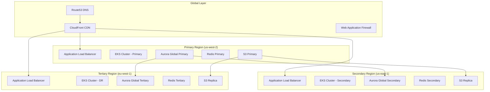

# Global Multi-Region Scaling Strategy

## Overview

This document outlines the comprehensive strategy for scaling the MLOps platform globally across multiple regions, ensuring high availability, optimal performance, and intelligent traffic distribution worldwide.

## Architecture Overview

### Global Infrastructure Design



## Regional Distribution Strategy

### Traffic Distribution Model

| Region | Role | Traffic % | Purpose |
|--------|------|-----------|---------|
| us-west-2 (Primary) | Production Hub | 60% | Main production workloads, full feature set |
| us-east-1 (Secondary) | Active Secondary | 30% | Load distribution, US East Coast users |
| eu-west-1 (Tertiary) | Disaster Recovery | 10% | European users, disaster recovery |

### Regional Capacity Planning

#### Primary Region (us-west-2)
- **Cluster Size**: 50+ nodes (20-200 auto-scaling range)
- **Node Types**: 
  - CPU-optimized: 10 nodes (c5.2xlarge, c5.4xlarge)
  - Memory-optimized: 6 nodes (m5.4xlarge, m5.8xlarge)
  - GPU-enabled: 4 nodes (p3.2xlarge, p3.8xlarge)
- **Database**: Aurora PostgreSQL Global (Primary) - db.r5.4xlarge
- **Cache**: Redis Cluster - 6 nodes (cache.r6g.4xlarge)
- **Storage**: S3 with versioning and lifecycle policies

#### Secondary Region (us-east-1)
- **Cluster Size**: 30+ nodes (15-150 auto-scaling range)
- **Node Types**:
  - CPU-optimized: 6 nodes (c5.2xlarge, c5.4xlarge)
  - Memory-optimized: 4 nodes (m5.4xlarge, m5.8xlarge)
  - GPU-enabled: 2 nodes (p3.2xlarge)
- **Database**: Aurora PostgreSQL Global (Secondary) - db.r5.2xlarge
- **Cache**: Redis Cluster - 3 nodes (cache.r6g.2xlarge)
- **Storage**: S3 cross-region replica

#### Tertiary Region (eu-west-1)
- **Cluster Size**: 15+ nodes (10-75 auto-scaling range)
- **Node Types**:
  - CPU-optimized: 3 nodes (c5.large, c5.xlarge)
  - Memory-optimized: 2 nodes (m5.2xlarge, m5.4xlarge)
  - GPU-enabled: 1 node (p3.2xlarge)
- **Database**: Aurora PostgreSQL Global (Tertiary) - db.r5.xlarge
- **Cache**: Redis Cluster - 2 nodes (cache.r6g.large)
- **Storage**: S3 cross-region replica with Glacier storage class

## Global Load Balancing & Routing

### Intelligent Traffic Routing

#### Route53 Health Checks & Failover
```yaml
Health Check Configuration:
  Primary Region:
    - Endpoint: primary-alb.us-west-2.elb.amazonaws.com
    - Check Interval: 30 seconds
    - Failure Threshold: 3 consecutive failures
    - Health Check Path: /health
    
  Secondary Region:
    - Endpoint: secondary-alb.us-east-1.elb.amazonaws.com
    - Check Interval: 30 seconds
    - Failure Threshold: 3 consecutive failures
    - Health Check Path: /health
    
  Tertiary Region:
    - Endpoint: tertiary-alb.eu-west-1.elb.amazonaws.com
    - Check Interval: 30 seconds
    - Failure Threshold: 3 consecutive failures
    - Health Check Path: /health

Routing Policies:
  1. Weighted Routing (Normal Operation):
     - Primary: 60% weight
     - Secondary: 30% weight
     - Tertiary: 10% weight
  
  2. Latency-Based Routing:
     - Route to lowest latency region for user
     - Fallback to health-based routing
  
  3. Geolocation Routing:
     - North America → Primary/Secondary
     - Europe → Tertiary
     - Asia-Pacific → Primary
     - Default → Primary

Failover Logic:
  1. If Primary fails → Secondary becomes primary (80%), Tertiary secondary (20%)
  2. If Secondary fails → Primary (80%), Tertiary (20%)
  3. If Tertiary fails → Primary (70%), Secondary (30%)
```

#### CloudFront CDN Configuration
```yaml
Distribution Settings:
  Price Class: PriceClass_All (global edge locations)
  Origins:
    - Primary: primary-alb.us-west-2.elb.amazonaws.com
    - Secondary: secondary-alb.us-east-1.elb.amazonaws.com
    - Tertiary: tertiary-alb.eu-west-1.elb.amazonaws.com
  
  Cache Behaviors:
    Static Assets: 24-hour TTL
    API Responses: No cache (TTL=0)
    Model Artifacts: 7-day TTL
    
  Origin Groups:
    Primary Group: Primary + Secondary (failover)
    Secondary Group: Tertiary (disaster recovery)
```

## Data Replication & Consistency

### Database Strategy (Aurora Global)

#### Global Cluster Configuration
```yaml
Aurora Global Database:
  Primary Region: us-west-2
  Secondary Regions: [us-east-1, eu-west-1]
  
  Replication:
    Lag: < 1 second (typical)
    Read Replicas: 2 per region
    Backup Retention: 30 days
    
  Failover:
    Automatic: Enabled
    RTO (Recovery Time Objective): < 1 minute
    RPO (Recovery Point Objective): < 1 second
    
  Cross-Region Backup:
    Enabled: true
    Backup Region: us-east-2
    Retention: 90 days
```

#### Database Access Patterns
```yaml
Read/Write Split:
  Primary Region:
    - All writes
    - Local reads (60%)
  
  Secondary Region:
    - Read-only queries (30%)
    - Analytics workloads
  
  Tertiary Region:
    - Read-only queries (10%)
    - Reporting workloads
    - Disaster recovery standby
```

### Object Storage Strategy (S3)

#### Cross-Region Replication
```yaml
S3 Bucket Strategy:
  Primary Buckets (us-west-2):
    - mlops-global-data (raw data, features)
    - mlops-global-models (trained models)
    - mlops-global-artifacts (deployment artifacts)
  
  Replication Rules:
    Data Bucket:
      - Replicate to us-east-1 (STANDARD_IA)
      - Replicate to eu-west-1 (GLACIER)
    
    Models Bucket:
      - Replicate to us-east-1 (STANDARD)
      - Replicate to eu-west-1 (STANDARD_IA)
    
    Artifacts Bucket:
      - Replicate to us-east-1 (STANDARD)
      - No replication to eu-west-1 (disaster recovery only)

Lifecycle Policies:
  Data:
    - STANDARD (0-30 days)
    - STANDARD_IA (30-90 days)
    - GLACIER (90-365 days)
    - DEEP_ARCHIVE (365+ days)
  
  Models:
    - STANDARD (0-90 days)
    - STANDARD_IA (90+ days)
  
  Artifacts:
    - STANDARD (0-30 days)
    - STANDARD_IA (30+ days)
```

### Cache Strategy (Redis)

#### Global Redis Configuration
```yaml
Cache Replication:
  Primary Cluster (us-west-2):
    - 6 nodes (cache.r6g.4xlarge)
    - Multi-AZ: enabled
    - Global Replication: enabled
  
  Secondary Cluster (us-east-1):
    - 3 nodes (cache.r6g.2xlarge)
    - Replicates from primary
    - Read preference: local
  
  Tertiary Cluster (eu-west-1):
    - 2 nodes (cache.r6g.large)
    - Disaster recovery only
    - Async replication

Cache Strategies:
  Model Cache:
    - TTL: 1 hour
    - Replication: synchronous
    - Eviction: LRU
  
  Feature Cache:
    - TTL: 15 minutes
    - Replication: asynchronous
    - Eviction: LFU
  
  Session Cache:
    - TTL: 24 hours
    - Replication: synchronous
    - Eviction: TTL-based
```

## Auto-Scaling Strategy

### Global Auto-Scaling Architecture

#### Predictive Scaling
```yaml
Predictive Scaling Configuration:
  Enabled: true
  Prediction Window: 48 hours
  Buffer Time: 10 minutes
  
  Machine Learning Models:
    - Time series forecasting (seasonal patterns)
    - Traffic pattern recognition
    - Regional demand prediction
    
  Scaling Metrics:
    - Historical traffic patterns
    - Seasonal business cycles
    - Regional usage patterns
    - Model inference demand
```

#### Reactive Scaling
```yaml
Horizontal Pod Autoscaler (HPA):
  Target Metrics:
    - CPU: 70% utilization
    - Memory: 80% utilization
    - Custom: requests per second
    - Custom: inference latency p95
  
  Scaling Behavior:
    Scale Up:
      - Stabilization: 60 seconds
      - Max increase: 50% or 4 pods
      - Cooldown: 300 seconds
    
    Scale Down:
      - Stabilization: 300 seconds
      - Max decrease: 25% or 2 pods
      - Cooldown: 600 seconds

Vertical Pod Autoscaler (VPA):
  Enabled: true
  Update Mode: Auto
  Resource Recommendations:
    - CPU: based on usage patterns
    - Memory: based on working set
    - GPU: based on utilization
```

#### Cluster Auto-Scaling
```yaml
Cluster Autoscaler:
  Node Groups:
    CPU-Optimized:
      - Min: 3 nodes per region
      - Max: 50 nodes (primary), 30 (secondary), 15 (tertiary)
      - Scale-up threshold: 70% allocation
      - Scale-down threshold: 50% allocation
    
    Memory-Optimized:
      - Min: 2 nodes per region
      - Max: 30 nodes (primary), 20 (secondary), 10 (tertiary)
      - Scale-up threshold: 75% allocation
      - Scale-down threshold: 40% allocation
    
    GPU-Enabled:
      - Min: 1 node (primary/secondary), 0 (tertiary)
      - Max: 20 nodes (primary), 10 (secondary), 5 (tertiary)
      - Scale-up threshold: 80% allocation
      - Scale-down threshold: 30% allocation

Cost Optimization:
  Spot Instances: 50% of capacity
  Reserved Instances: 30% of base capacity
  On-Demand: 20% for critical workloads
```

### Regional Scaling Patterns

#### Traffic-Based Scaling
```yaml
Time-Based Patterns:
  US Business Hours (PST):
    - Primary: Scale up 8 AM - 6 PM PST
    - Secondary: Scale up 11 AM - 9 PM EST
    - Tertiary: Minimal scaling
  
  European Business Hours (GMT):
    - Tertiary: Scale up 8 AM - 6 PM GMT
    - Primary/Secondary: Maintain baseline
  
  Asian Business Hours (JST):
    - Primary: Scale up 5 PM - 1 AM PST (next day)
    - Secondary/Tertiary: Minimal scaling

Seasonal Patterns:
  Q4 Holiday Season:
    - All regions: +50% baseline capacity
    - Extended scaling windows
    - Pre-provisioned GPU capacity
  
  Summer (Q3):
    - Reduced capacity in EU region
    - Increased capacity in US regions
    - Cost optimization focus
```

## Performance Optimization

### Global Performance Targets

#### Service Level Objectives (SLOs)
```yaml
Global SLOs:
  Availability: 99.95% (4.38 hours downtime/year)
  API Response Time: p95 < 100ms, p99 < 200ms
  Model Inference: p95 < 50ms, p99 < 100ms
  Error Rate: < 0.1%
  
Regional SLOs:
  Primary Region:
    - Availability: 99.99%
    - API Response: p95 < 50ms
    - Model Inference: p95 < 30ms
  
  Secondary Region:
    - Availability: 99.95%
    - API Response: p95 < 75ms
    - Model Inference: p95 < 40ms
  
  Tertiary Region:
    - Availability: 99.9%
    - API Response: p95 < 100ms
    - Model Inference: p95 < 60ms
```

#### Performance Optimization Techniques
```yaml
Network Optimization:
  - CDN edge caching (150+ locations)
  - Regional API gateways
  - Keep-alive connections
  - HTTP/2 and HTTP/3 support
  - Connection pooling

Application Optimization:
  - Model caching at edge
  - Feature store caching
  - Batch inference optimization
  - Connection multiplexing
  - Async processing

Infrastructure Optimization:
  - Enhanced networking (ENA, SR-IOV)
  - NVMe SSD storage
  - GPU optimization for ML workloads
  - Memory optimization
  - CPU affinity tuning
```

## Disaster Recovery & Business Continuity

### Recovery Time Objectives

#### RTO/RPO Matrix
| Scenario | Region Impact | RTO | RPO | Recovery Action |
|----------|---------------|-----|-----|-----------------|
| Single AZ failure | None | < 5 minutes | 0 | Auto-failover |
| Single region failure | 1 region | < 15 minutes | < 1 minute | Route53 failover |
| Multi-region failure | 2 regions | < 30 minutes | < 5 minutes | Manual DR activation |
| Global outage | All regions | < 2 hours | < 15 minutes | Full DR procedure |

#### Disaster Recovery Procedures

##### Automated Failover (Single Region)
```yaml
Trigger Conditions:
  - Region health check fails for 3 consecutive minutes
  - API error rate > 50% for 5 minutes
  - Database connectivity lost for 2 minutes

Automated Actions:
  1. Route53 removes failed region from DNS
  2. CloudFront origin group fails over
  3. Remaining regions scale up (+50% capacity)
  4. Database read replicas promoted if needed
  5. Alert teams via PagerDuty

Recovery Time: < 15 minutes
```

##### Manual Disaster Recovery (Multi-Region)
```yaml
Trigger Conditions:
  - Multiple regions experiencing issues
  - Coordinated attack or major infrastructure failure
  - Manual activation by incident commander

Manual Actions:
  1. Assess scope and impact
  2. Activate disaster recovery team
  3. Promote tertiary region to primary
  4. Redirect all traffic to functioning regions
  5. Scale up DR region to full capacity
  6. Restore data from cross-region backups
  7. Communicate with stakeholders

Recovery Time: < 2 hours
```

### Data Backup Strategy

#### Backup Tiers
```yaml
Tier 1 - Critical Data (RPO < 1 minute):
  - Model weights and configurations
  - Feature definitions
  - User authentication data
  - System configurations

Tier 2 - Important Data (RPO < 15 minutes):
  - Training data
  - Model artifacts
  - Application logs
  - Monitoring data

Tier 3 - Archive Data (RPO < 1 hour):
  - Historical training data
  - Audit logs
  - Performance metrics
  - Compliance records
```

## Cost Optimization

### Global Cost Strategy

#### Cost Breakdown by Region
```yaml
Estimated Monthly Costs (USD):
  Primary Region (us-west-2): $12,000 - $18,000
    - Compute: $8,000 - $12,000
    - Storage: $2,000 - $3,000
    - Network: $1,500 - $2,500
    - Database: $500 - $500

  Secondary Region (us-east-1): $6,000 - $9,000
    - Compute: $4,000 - $6,000
    - Storage: $1,000 - $1,500
    - Network: $800 - $1,200
    - Database: $200 - $300

  Tertiary Region (eu-west-1): $2,000 - $4,000
    - Compute: $1,200 - $2,500
    - Storage: $400 - $800
    - Network: $300 - $600
    - Database: $100 - $100

  Global Services: $1,000 - $2,000
    - CloudFront CDN: $500 - $1,000
    - Route53: $50 - $100
    - WAF: $200 - $400
    - S3 Cross-Region Replication: $250 - $500

Total Estimated Cost: $21,000 - $33,000/month
```

#### Cost Optimization Strategies
```yaml
Compute Optimization:
  - 50% Spot Instances (70% cost reduction)
  - 30% Reserved Instances (40% cost reduction)
  - 20% On-Demand (baseline capacity)
  - Right-sizing based on utilization

Storage Optimization:
  - Intelligent Tiering for S3
  - Lifecycle policies for old data
  - Compression for archived data
  - Regional storage optimization

Network Optimization:
  - CloudFront caching (reduce origin requests)
  - Regional data processing (reduce transfer)
  - VPC endpoints (avoid NAT gateway costs)
  - Direct Connect for high-volume transfers
```

## Monitoring & Observability

### Global Monitoring Strategy

#### Multi-Region Metrics Collection
```yaml
Prometheus Federation:
  Global Prometheus (Primary):
    - Collects from all regional Prometheus
    - Global alerting rules
    - Long-term storage (90 days)
  
  Regional Prometheus:
    - Local metrics collection
    - Regional alerting
    - Short-term storage (30 days)

Key Metrics:
  Infrastructure:
    - Node health across regions
    - Network latency between regions
    - Resource utilization by region
    - Auto-scaling events
  
  Application:
    - Request rates by region
    - Error rates by region
    - Response times by region
    - Model inference performance
  
  Business:
    - Revenue by region
    - User activity by region
    - Model usage patterns
    - Cost optimization metrics
```

#### Global Alerting Strategy
```yaml
Alert Severity Levels:
  P0 (Critical - 5 min response):
    - Complete region failure
    - Global error rate > 5%
    - Security incidents
    - Data loss events
  
  P1 (High - 15 min response):
    - Single AZ failure
    - Error rate > 1% in any region
    - Database replication lag > 5 minutes
    - Performance degradation > 50%
  
  P2 (Medium - 1 hour response):
    - High resource utilization (> 80%)
    - Minor performance degradation
    - Non-critical service failures
    - Capacity planning alerts
  
  P3 (Low - 4 hour response):
    - Cost anomalies
    - Capacity recommendations
    - Performance optimization opportunities
    - Compliance notifications

Alert Routing:
  - P0/P1: PagerDuty + Slack + Email
  - P2: Slack + Email
  - P3: Email only
```

## Security & Compliance

### Global Security Strategy

#### Multi-Region Security Architecture
```yaml
Network Security:
  - VPC peering between regions (encrypted)
  - Private subnets for all compute
  - WAF rules applied globally
  - DDoS protection (AWS Shield Advanced)
  - Network ACLs and Security Groups

Data Security:
  - Encryption at rest (all regions)
  - Encryption in transit (TLS 1.3)
  - Key management (KMS per region)
  - Cross-region key replication
  - Certificate management (ACM)

Access Control:
  - IAM roles with minimal permissions
  - Cross-region access policies
  - Multi-factor authentication
  - Service-to-service authentication
  - Audit logging (CloudTrail)
```

#### Compliance Considerations
```yaml
Data Residency:
  EU Users:
    - Data processed in eu-west-1
    - GDPR compliance
    - Data subject rights
  
  US Users:
    - Data processed in us-west-2/us-east-1
    - SOC 2 compliance
    - State privacy law compliance
  
  Global Requirements:
    - ISO 27001 certification
    - SOC 2 Type II
    - GDPR compliance (where applicable)
    - Regional data protection laws
```

## Implementation Roadmap

### Phase 1: Foundation (Weeks 1-4)
- [ ] Deploy global infrastructure via Terraform
- [ ] Set up cross-region networking
- [ ] Configure Aurora Global Database
- [ ] Implement S3 cross-region replication
- [ ] Set up CloudFront distribution
- [ ] Configure Route53 health checks

### Phase 2: Application Deployment (Weeks 5-8)
- [ ] Deploy applications to all regions
- [ ] Configure regional load balancing
- [ ] Set up auto-scaling policies
- [ ] Implement monitoring stack
- [ ] Configure alerting and notifications
- [ ] Performance testing and optimization

### Phase 3: Operational Excellence (Weeks 9-12)
- [ ] Disaster recovery testing
- [ ] Cost optimization implementation
- [ ] Security hardening
- [ ] Compliance validation
- [ ] Documentation and runbooks
- [ ] Team training and knowledge transfer

### Phase 4: Continuous Improvement (Ongoing)
- [ ] Performance monitoring and optimization
- [ ] Cost analysis and optimization
- [ ] Security posture improvements
- [ ] Capacity planning and scaling
- [ ] Feature enhancements
- [ ] Operational process refinement

## Success Metrics

### Technical Metrics
- **Global Availability**: Target 99.95%
- **Response Time**: p95 < 100ms globally
- **Error Rate**: < 0.1% globally
- **RTO**: < 15 minutes for region failover
- **RPO**: < 1 minute for data loss

### Business Metrics
- **Cost Efficiency**: 30% cost reduction through optimization
- **User Experience**: 25% improvement in response times
- **Reliability**: 99.95% uptime SLA achievement
- **Scalability**: Support 10x traffic growth
- **Global Reach**: Support users in 50+ countries

### Operational Metrics
- **Deployment Speed**: < 30 minutes for global deployments
- **Recovery Time**: < 15 minutes for automated failover
- **Monitoring Coverage**: 100% of critical services
- **Alert Response**: 95% of alerts acknowledged within SLA
- **Documentation**: 100% of procedures documented

This global scaling strategy provides a comprehensive framework for deploying and operating the MLOps platform at global scale with enterprise-grade reliability, performance, and cost efficiency.