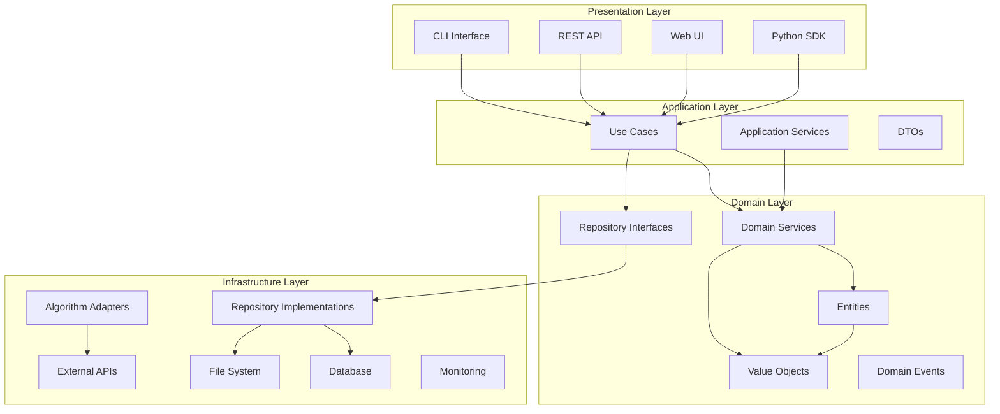

# Architecture Overview

Pynomaly follows **Clean Architecture** principles combined with **Domain-Driven Design (DDD)** and **Hexagonal Architecture (Ports & Adapters)** patterns. This architectural approach ensures maintainability, testability, and flexibility for a production-ready anomaly detection platform.

## Architectural Principles

### 1. Dependency Inversion
Dependencies flow inward toward the domain layer. The domain layer has no dependencies on external frameworks or libraries.

### 2. Separation of Concerns
Each layer has a specific responsibility:
- **Domain**: Business logic and rules
- **Application**: Use case orchestration
- **Infrastructure**: External integrations
- **Presentation**: User interfaces

### 3. Ports and Adapters
External systems are accessed through well-defined interfaces (ports) with concrete implementations (adapters).

## Architecture Diagram



## Layer Descriptions

### Domain Layer
The core of the application containing business entities and rules.

**Components:**
- **Entities**: `Detector`, `Dataset`, `Anomaly`, `DetectionResult`
- **Value Objects**: `AnomalyScore`, `ContaminationRate`, `ConfidenceInterval`
- **Domain Services**: Business logic that doesn't belong to a single entity
- **Repository Interfaces**: Data access contracts
- **Domain Events**: Events that occur in the domain

**Key Characteristics:**
- No external dependencies
- Contains business rules and validation
- Framework-agnostic
- Highly testable

### Application Layer
Orchestrates business workflows and use cases.

**Components:**
- **Use Cases**: `DetectAnomalies`, `TrainDetector`, `EvaluateModel`
- **Application Services**: Coordinate multiple domain services
- **DTOs**: Data transfer objects for boundaries
- **Command/Query Handlers**: CQRS pattern implementation

**Responsibilities:**
- Coordinate domain objects
- Handle transactions
- Manage application state
- Validate input/output

### Infrastructure Layer
Implements external concerns and technical details.

**Components:**
- **Algorithm Adapters**: Integrate ML libraries (PyOD, scikit-learn, etc.)
- **Repository Implementations**: Data persistence
- **External Service Clients**: APIs, message queues
- **Configuration**: Settings and environment management
- **Monitoring**: Logging, metrics, tracing

**Technologies:**
- PyOD, TODS, PyGOD for algorithms
- SQLAlchemy for database ORM
- Redis for caching
- OpenTelemetry for observability

### Presentation Layer
User-facing interfaces and APIs.

**Components:**
- **REST API**: FastAPI-based web service
- **CLI**: Typer-based command-line interface
- **Web UI**: Progressive Web App with HTMX
- **Python SDK**: Programmatic interface

## Core Patterns

### 1. Repository Pattern
Abstracts data access through interfaces.

```python
# Domain layer - interface
class DetectorRepository(ABC):
    async def save(self, detector: Detector) -> None: ...
    async def get(self, id: str) -> Optional[Detector]: ...

# Infrastructure layer - implementation
class SQLDetectorRepository(DetectorRepository):
    async def save(self, detector: Detector) -> None:
        # SQLAlchemy implementation
```

### 2. Adapter Pattern
Integrates external algorithms through common interfaces.

```python
# Shared protocol
class DetectorProtocol(Protocol):
    async def train(self, data: Dataset) -> None: ...
    async def detect(self, data: Any) -> DetectionResult: ...

# Algorithm-specific adapters
class PyODAdapter(DetectorProtocol): ...
class SklearnAdapter(DetectorProtocol): ...
```

### 3. Factory Pattern
Creates complex objects with proper configuration.

```python
class DetectorFactory:
    @staticmethod
    def create_isolation_forest(**params) -> Detector:
        # Validation and default parameters
        return Detector(algorithm="IsolationForest", parameters=params)
```

### 4. Strategy Pattern
Enables algorithm selection at runtime.

```python
class DetectionStrategy(ABC):
    async def detect(self, data: Any) -> DetectionResult: ...

class IsolationForestStrategy(DetectionStrategy): ...
class LOFStrategy(DetectionStrategy): ...
```

### 5. Observer Pattern
Handles domain events and cross-cutting concerns.

```python
@event_handler(AnomalyDetectedEvent)
async def send_alert(event: AnomalyDetectedEvent):
    if event.severity == "high":
        await alert_service.send(event)
```

## Dependency Injection

Pynomaly uses a dependency injection container to manage object creation and dependencies.

```python
from dependency_injector import containers, providers

class Container(containers.DeclarativeContainer):
    # Configuration
    config = providers.Configuration()
    
    # Repositories
    detector_repository = providers.Factory(
        SQLDetectorRepository,
        session=database.session
    )
    
    # Services
    detection_service = providers.Factory(
        DetectionService,
        detector_repo=detector_repository
    )
    
    # Use cases
    detect_anomalies_use_case = providers.Factory(
        DetectAnomalies,
        detection_service=detection_service
    )
```

## Data Flow

### 1. Training Flow
```
CLI/API Request → Use Case → Domain Service → Algorithm Adapter → ML Library
                     ↓
              Repository ← Domain Entity ← Training Result
```

### 2. Detection Flow
```
Data Input → Use Case → Domain Service → Trained Detector → Anomaly Result
                ↓
          Event Bus ← Domain Event ← Anomaly Detected
```

### 3. Query Flow
```
Query Request → Use Case → Repository → Database → Entity → DTO → Response
```

## Configuration Management

### Environment-Based Configuration
```python
from pydantic_settings import BaseSettings

class Settings(BaseSettings):
    database_url: str
    redis_url: str
    log_level: str = "INFO"
    
    class Config:
        env_file = ".env"
```

### Algorithm Registry
```python
class AlgorithmRegistry:
    _algorithms: Dict[str, Type[DetectorProtocol]] = {}
    
    @classmethod
    def register(cls, name: str, adapter_class: Type):
        cls._algorithms[name] = adapter_class
    
    @classmethod
    def create(cls, name: str, **params) -> DetectorProtocol:
        adapter_class = cls._algorithms[name]
        return adapter_class(**params)
```

## Error Handling Strategy

### 1. Domain Errors
Business rule violations and domain-specific errors.

```python
class DomainError(Exception):
    """Base class for domain errors"""
    pass

class DetectorNotTrainedError(DomainError):
    """Raised when trying to use an untrained detector"""
    pass
```

### 2. Infrastructure Errors
External system failures and technical issues.

```python
class InfrastructureError(Exception):
    """Base class for infrastructure errors"""
    pass

class DatabaseConnectionError(InfrastructureError):
    """Database connectivity issues"""
    pass
```

### 3. Error Boundaries
Handle errors at appropriate layers.

```python
# Application layer - catch and translate
try:
    result = await domain_service.detect(data)
except DomainError as e:
    raise ApplicationError(f"Detection failed: {e}")
except Exception as e:
    logger.error(f"Unexpected error: {e}")
    raise SystemError("Internal system error")
```

## Testing Strategy

### 1. Unit Tests
Test individual components in isolation.

```python
# Domain layer tests
def test_detector_validation():
    detector = Detector(name="Test", algorithm="Invalid")
    with pytest.raises(InvalidAlgorithmError):
        detector.validate()

# Infrastructure tests with mocks
@pytest.fixture
def mock_repository():
    return Mock(spec=DetectorRepository)
```

### 2. Integration Tests
Test component interactions.

```python
@pytest.mark.integration
async def test_detection_workflow(container):
    use_case = container.detect_anomalies_use_case()
    result = await use_case.execute(DetectAnomaliesRequest(...))
    assert result.anomalies_detected > 0
```

### 3. Contract Tests
Verify adapter implementations.

```python
@pytest.mark.parametrize("adapter_class", [
    PyODAdapter, SklearnAdapter, TODSAdapter
])
def test_adapter_contract(adapter_class):
    adapter = adapter_class()
    assert isinstance(adapter, DetectorProtocol)
```

## Performance Considerations

### 1. Async/Await
All I/O operations are asynchronous to maximize throughput.

```python
async def detect_batch(self, data: List[Dict]) -> List[DetectionResult]:
    tasks = [self.detect_single(item) for item in data]
    return await asyncio.gather(*tasks)
```

### 2. Caching Strategy
Cache frequently accessed data and computation results.

```python
@lru_cache(maxsize=100)
def get_detector_schema(algorithm: str) -> Dict:
    return algorithm_registry.get_schema(algorithm)
```

### 3. Connection Pooling
Efficient database and external service connections.

```python
# Database connection pool
engine = create_async_engine(
    database_url,
    pool_size=20,
    max_overflow=30
)
```

## Monitoring and Observability

### 1. Structured Logging
```python
import structlog

logger = structlog.get_logger()

async def detect_anomalies(self, request):
    logger.info(
        "detection_started",
        detector_id=request.detector_id,
        data_size=len(request.data)
    )
```

### 2. Metrics Collection
```python
from prometheus_client import Counter, Histogram

detection_counter = Counter('anomaly_detections_total')
detection_duration = Histogram('anomaly_detection_duration_seconds')

@detection_duration.time()
async def detect(self, data):
    result = await self._detect(data)
    detection_counter.inc()
    return result
```

### 3. Distributed Tracing
```python
from opentelemetry import trace

tracer = trace.get_tracer(__name__)

async def detect_anomalies(self, request):
    with tracer.start_as_current_span("detect_anomalies") as span:
        span.set_attribute("detector.algorithm", request.algorithm)
        return await self._detect(request)
```

## Security Considerations

### 1. Input Validation
Validate all inputs at boundaries.

```python
from pydantic import BaseModel, validator

class DetectionRequest(BaseModel):
    data: List[Dict[str, Any]]
    
    @validator('data')
    def validate_data_size(cls, v):
        if len(v) > 10000:
            raise ValueError('Data size exceeds limit')
        return v
```

### 2. Authentication & Authorization
Secure API endpoints and resources.

```python
from fastapi import Depends, HTTPException
from fastapi.security import HTTPBearer

security = HTTPBearer()

async def get_current_user(token: str = Depends(security)):
    user = await auth_service.validate_token(token)
    if not user:
        raise HTTPException(401, "Invalid token")
    return user
```

### 3. Data Encryption
Encrypt sensitive data at rest and in transit.

```python
from cryptography.fernet import Fernet

class EncryptedRepository:
    def __init__(self, key: bytes):
        self.cipher = Fernet(key)
    
    async def save_sensitive_data(self, data: str):
        encrypted = self.cipher.encrypt(data.encode())
        await self.repository.save(encrypted)
```

## Deployment Architecture

### 1. Containerization
```dockerfile
FROM python:3.11-slim
WORKDIR /app
COPY requirements.txt .
RUN pip install -r requirements.txt
COPY . .
CMD ["uvicorn", "pynomaly.presentation.api:app", "--host", "0.0.0.0"]
```

### 2. Kubernetes Deployment
```yaml
apiVersion: apps/v1
kind: Deployment
metadata:
  name: pynomaly-api
spec:
  replicas: 3
  selector:
    matchLabels:
      app: pynomaly-api
  template:
    metadata:
      labels:
        app: pynomaly-api
    spec:
      containers:
      - name: api
        image: pynomaly:latest
        ports:
        - containerPort: 8000
        env:
        - name: DATABASE_URL
          valueFrom:
            secretKeyRef:
              name: pynomaly-secrets
              key: database-url
```

### 3. Horizontal Scaling
```python
# Load balancer configuration
from sklearn.base import BaseEstimator

class DistributedDetector(BaseEstimator):
    def __init__(self, worker_urls: List[str]):
        self.workers = [DetectorClient(url) for url in worker_urls]
    
    async def detect(self, data: Any) -> DetectionResult:
        # Distribute work across workers
        chunk_size = len(data) // len(self.workers)
        tasks = []
        for i, worker in enumerate(self.workers):
            start = i * chunk_size
            end = start + chunk_size if i < len(self.workers) - 1 else len(data)
            tasks.append(worker.detect(data[start:end]))
        
        results = await asyncio.gather(*tasks)
        return self._combine_results(results)
```

This architecture ensures Pynomaly is maintainable, scalable, and production-ready while maintaining clean separation of concerns and testability.