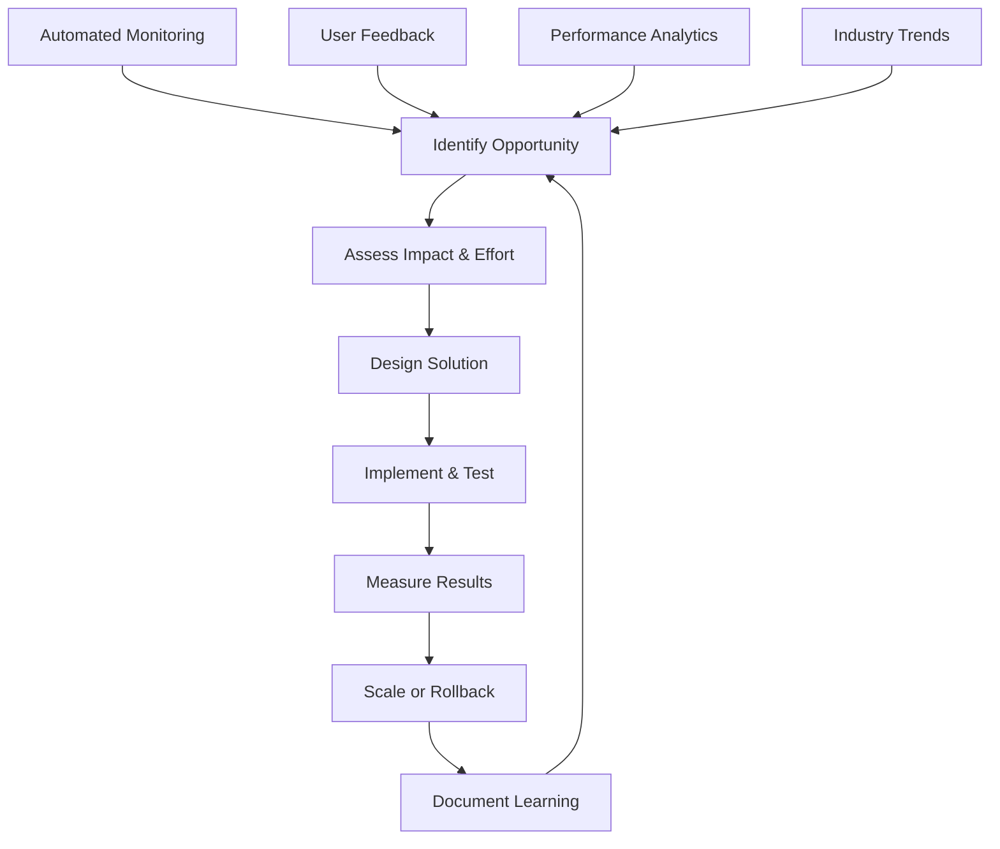

# MLOps Platform Continuous Improvement Framework

## Executive Summary

This framework establishes systematic processes for continuously improving the MLOps platform through data-driven insights, automated optimization, and structured feedback loops. The goal is to maintain platform excellence while adapting to evolving business needs and technological advances.

## Core Principles

### 1. Data-Driven Decision Making
- All improvements backed by quantitative evidence
- A/B testing for significant changes
- Business impact measurement for prioritization
- Performance regression prevention

### 2. Automated Optimization
- Self-healing infrastructure
- Auto-tuning model parameters
- Dynamic resource allocation
- Predictive maintenance

### 3. Continuous Learning
- Knowledge sharing across teams
- Post-incident learning
- Industry best practice adoption
- Innovation experimentation

### 4. Customer-Centric Focus
- User experience optimization
- Business value maximization
- Stakeholder feedback integration
- Impact measurement

---

## Improvement Process Overview



## 1. Performance Analytics & Monitoring

### Continuous Performance Tracking

#### Platform Performance Metrics
```yaml
SLA Tracking:
  - Platform Availability: 99.9% target
  - Model Latency P95: <100ms
  - Error Rate: <0.1%
  - Throughput: Meet business demand +20% headroom

Business Impact Metrics:
  - Revenue Generated: $30M+ annually
  - Cost Savings: $6M+ annually  
  - ROI: 300%+ sustained
  - Customer Satisfaction: >4.5/5.0

Model Performance Metrics:
  - Accuracy Tracking: Model-specific thresholds
  - Drift Detection: <30% drift tolerance
  - Prediction Volume: Business demand fulfillment
  - Inference Quality: Prediction confidence tracking
```

#### Automated Performance Analysis
```python
# Weekly Performance Analysis Pipeline
class PerformanceAnalyzer:
    def __init__(self):
        self.metrics_collector = MetricsCollector()
        self.trend_analyzer = TrendAnalyzer()
        self.anomaly_detector = AnomalyDetector()
        
    async def weekly_analysis(self):
        # Collect metrics from past week
        metrics = await self.metrics_collector.get_weekly_metrics()
        
        # Trend analysis
        trends = self.trend_analyzer.analyze_trends(metrics)
        
        # Anomaly detection
        anomalies = self.anomaly_detector.detect_anomalies(metrics)
        
        # Generate insights and recommendations
        insights = self.generate_insights(trends, anomalies)
        
        # Create improvement opportunities
        opportunities = self.identify_opportunities(insights)
        
        return {
            "metrics_summary": metrics,
            "trend_analysis": trends,
            "anomalies": anomalies,
            "improvement_opportunities": opportunities,
            "recommended_actions": self.prioritize_actions(opportunities)
        }
```

### Real-time Optimization

#### Auto-Scaling Intelligence
```yaml
Intelligent Auto-Scaling:
  - Predictive scaling based on historical patterns
  - Business event anticipation (campaigns, launches)
  - Cost-performance optimization
  - Multi-metric scaling decisions
  
Performance Auto-Tuning:
  - Model parameter optimization
  - Infrastructure right-sizing
  - Cache configuration tuning
  - Network optimization
```

## 2. Model Lifecycle Management

### Automated Model Improvement

#### Model Performance Monitoring
```python
class ModelImprovementPipeline:
    def __init__(self):
        self.performance_tracker = ModelPerformanceTracker()
        self.drift_detector = DataDriftDetector()
        self.retraining_scheduler = RetrainingScheduler()
        
    async def continuous_model_improvement(self, model_id: str):
        # Monitor model performance
        performance_metrics = await self.performance_tracker.get_metrics(model_id)
        
        # Check for drift
        drift_metrics = await self.drift_detector.check_drift(model_id)
        
        # Decide on retraining
        if self.should_retrain(performance_metrics, drift_metrics):
            # Trigger automated retraining
            retraining_job = await self.retraining_scheduler.schedule_retraining(
                model_id=model_id,
                trigger_reason="performance_degradation",
                priority="high"
            )
            
            return retraining_job
        
        # Suggest parameter tuning
        tuning_suggestions = self.suggest_parameter_tuning(performance_metrics)
        
        return {
            "action": "parameter_tuning",
            "suggestions": tuning_suggestions,
            "expected_improvement": self.estimate_improvement(tuning_suggestions)
        }
```

#### Feature Engineering Evolution
```yaml
Feature Pipeline Improvement:
  - Feature importance tracking
  - New feature candidate identification
  - Automated feature engineering
  - A/B testing for feature changes
  
Feature Quality Management:
  - Data quality monitoring
  - Feature freshness tracking
  - Schema evolution management
  - Impact analysis for changes
```

### Model Experimentation Framework

#### Continuous A/B Testing
```python
class ContinuousExperimentationFramework:
    def __init__(self):
        self.experiment_manager = ExperimentManager()
        self.statistical_analyzer = StatisticalAnalyzer()
        
    async def run_model_experiments(self):
        # Queue of experiment candidates
        experiment_candidates = [
            {
                "name": "churn_model_v2_vs_v1",
                "models": ["customer_churn_v2", "customer_churn_v1"],
                "traffic_split": [0.1, 0.9],  # Conservative rollout
                "success_metrics": ["accuracy", "business_impact"],
                "duration_days": 14
            },
            {
                "name": "fraud_ensemble_optimization",
                "models": ["fraud_detection_optimized", "fraud_detection_current"],
                "traffic_split": [0.05, 0.95],  # Very conservative for fraud
                "success_metrics": ["precision", "recall", "latency"],
                "duration_days": 7
            }
        ]
        
        # Run experiments
        active_experiments = []
        for candidate in experiment_candidates:
            experiment = await self.experiment_manager.create_experiment(candidate)
            active_experiments.append(experiment)
        
        return active_experiments
```

## 3. Infrastructure Evolution

### Capacity Planning & Optimization

#### Predictive Capacity Management
```python
class CapacityPlanner:
    def __init__(self):
        self.usage_forecaster = UsageForecaster()
        self.cost_optimizer = CostOptimizer()
        self.resource_planner = ResourcePlanner()
        
    async def quarterly_capacity_planning(self):
        # Forecast usage for next quarter
        usage_forecast = await self.usage_forecaster.forecast_quarterly()
        
        # Optimize costs while meeting demand
        optimal_config = await self.cost_optimizer.optimize_for_forecast(
            usage_forecast
        )
        
        # Plan resource allocation
        resource_plan = await self.resource_planner.create_plan(
            optimal_config, usage_forecast
        )
        
        return {
            "capacity_plan": resource_plan,
            "cost_projection": optimal_config["projected_cost"],
            "recommendations": optimal_config["recommendations"],
            "risk_analysis": self.analyze_capacity_risks(resource_plan)
        }
```

#### Technology Stack Evolution
```yaml
Technology Evaluation Process:
  Quarterly Reviews:
    - Emerging technology assessment
    - Performance benchmarking
    - Cost-benefit analysis
    - Migration planning
    
  Evaluation Criteria:
    - Performance improvement potential
    - Cost impact analysis
    - Team learning curve
    - Community support and maturity
    - Integration complexity
    
  Decision Framework:
    - POC development for promising technologies
    - Risk assessment and mitigation planning
    - Rollback strategy definition
    - Training and documentation requirements
```

## 4. Team Capability Development

### Skills Development Program

#### Continuous Learning Framework
```yaml
Learning Objectives:
  Technical Skills:
    - Advanced ML techniques and algorithms
    - Cloud-native technologies and patterns
    - DevOps and infrastructure automation
    - Data engineering and pipeline optimization
    
  Business Skills:
    - Domain expertise development
    - Product management principles
    - Customer empathy and user research
    - Financial modeling and ROI analysis
    
  Soft Skills:
    - Communication and presentation
    - Leadership and mentoring
    - Problem-solving and critical thinking
    - Collaboration and team dynamics

Learning Methods:
  Formal Training:
    - Online courses and certifications
    - Conference attendance and speaking
    - Internal training sessions
    - External workshops and bootcamps
    
  Experiential Learning:
    - Rotation programs across teams
    - Innovation time allocation (20%)
    - Hackathons and innovation challenges
    - Open source contributions
    
  Knowledge Sharing:
    - Weekly tech talks and demos
    - Best practice documentation
    - Post-mortem learning sessions
    - Cross-team collaboration projects
```

#### Innovation & Experimentation
```python
class InnovationProgram:
    def __init__(self):
        self.innovation_tracker = InnovationTracker()
        self.experiment_budget = 100000  # $100K quarterly budget
        
    async def quarterly_innovation_cycle(self):
        # Collect innovation proposals
        proposals = await self.collect_innovation_proposals()
        
        # Evaluate and prioritize
        prioritized_proposals = self.prioritize_proposals(proposals)
        
        # Allocate budget and resources
        funded_projects = self.allocate_innovation_budget(
            prioritized_proposals, self.experiment_budget
        )
        
        # Track progress and results
        for project in funded_projects:
            await self.innovation_tracker.track_project(project)
        
        return {
            "funded_projects": funded_projects,
            "total_budget_allocated": sum(p["budget"] for p in funded_projects),
            "expected_outcomes": [p["expected_outcome"] for p in funded_projects]
        }
```

## 5. Feedback Integration

### Customer & Stakeholder Feedback

#### Multi-Channel Feedback Collection
```yaml
Feedback Channels:
  Direct Feedback:
    - User interviews and surveys
    - Stakeholder review meetings
    - Customer success manager inputs
    - Support ticket analysis
    
  Indirect Feedback:
    - Usage pattern analysis
    - Performance metric trends
    - Business outcome tracking
    - Competitive analysis insights
    
  Internal Feedback:
    - Team retrospectives
    - Engineering feedback
    - Operations team insights
    - Security and compliance reviews
```

#### Feedback Processing Pipeline
```python
class FeedbackProcessor:
    def __init__(self):
        self.sentiment_analyzer = SentimentAnalyzer()
        self.topic_extractor = TopicExtractor()
        self.priority_scorer = PriorityScorer()
        
    async def process_feedback(self, feedback_batch):
        processed_feedback = []
        
        for feedback in feedback_batch:
            # Analyze sentiment
            sentiment = self.sentiment_analyzer.analyze(feedback["content"])
            
            # Extract topics and themes
            topics = self.topic_extractor.extract_topics(feedback["content"])
            
            # Score priority based on impact and effort
            priority_score = self.priority_scorer.score(
                feedback, sentiment, topics
            )
            
            processed_feedback.append({
                "original_feedback": feedback,
                "sentiment": sentiment,
                "topics": topics,
                "priority_score": priority_score,
                "recommended_action": self.suggest_action(
                    sentiment, topics, priority_score
                )
            })
        
        return processed_feedback
```

## 6. Process Optimization

### Workflow Improvement

#### Development Process Enhancement
```yaml
Development Workflow Optimization:
  Code Quality:
    - Automated code review tools
    - Performance regression testing
    - Security scanning integration
    - Documentation quality checks
    
  Deployment Pipeline:
    - Deployment time reduction targets
    - Rollback capability improvements
    - Blue-green deployment optimization
    - Canary release automation
    
  Testing Strategy:
    - Test coverage improvement
    - Performance test automation
    - End-to-end test reliability
    - Test environment management
```

#### Operational Excellence
```python
class OperationalExcellenceTracker:
    def __init__(self):
        self.incident_analyzer = IncidentAnalyzer()
        self.mttr_tracker = MTTRTracker()
        self.sla_monitor = SLAMonitor()
        
    async def monthly_excellence_review(self):
        # Analyze incidents and responses
        incident_analysis = await self.incident_analyzer.analyze_month()
        
        # Track MTTR improvements
        mttr_trends = await self.mttr_tracker.get_trends()
        
        # Review SLA performance
        sla_performance = await self.sla_monitor.get_monthly_report()
        
        # Generate improvement recommendations
        recommendations = self.generate_operational_improvements(
            incident_analysis, mttr_trends, sla_performance
        )
        
        return {
            "incident_summary": incident_analysis,
            "mttr_performance": mttr_trends,
            "sla_compliance": sla_performance,
            "improvement_recommendations": recommendations,
            "next_month_targets": self.set_improvement_targets(recommendations)
        }
```

## 7. Success Metrics & KPIs

### Improvement Tracking Dashboard

#### Key Performance Indicators
```yaml
Platform Excellence KPIs:
  Technical Performance:
    - System uptime: 99.9% → 99.95%
    - Average response time: <100ms → <80ms
    - Error rate: <0.1% → <0.05%
    - Deployment frequency: Weekly → Daily
    - Lead time: 2 weeks → 1 week
    - MTTR: 30 minutes → 15 minutes
    
  Business Impact:
    - Revenue attribution: $30M → $40M
    - Cost efficiency: 15% improvement annually
    - Customer satisfaction: 4.5 → 4.7
    - Time to value: 2 months → 1 month
    
  Team Productivity:
    - Feature delivery velocity: 20% improvement
    - Innovation project success rate: 60% → 75%
    - Knowledge sharing index: Quarterly improvement
    - Team satisfaction: >4.0/5.0 sustained
```

#### Improvement ROI Calculation
```python
class ImprovementROICalculator:
    def calculate_improvement_roi(self, improvement_data):
        # Calculate implementation costs
        implementation_cost = sum([
            improvement_data["development_cost"],
            improvement_data["infrastructure_cost"], 
            improvement_data["training_cost"],
            improvement_data["opportunity_cost"]
        ])
        
        # Calculate benefits
        annual_benefits = sum([
            improvement_data["cost_savings"],
            improvement_data["revenue_increase"],
            improvement_data["efficiency_gains"],
            improvement_data["risk_mitigation_value"]
        ])
        
        # Calculate ROI
        roi = (annual_benefits - implementation_cost) / implementation_cost
        payback_months = implementation_cost / (annual_benefits / 12)
        
        return {
            "roi_percentage": roi * 100,
            "payback_period_months": payback_months,
            "net_annual_benefit": annual_benefits - implementation_cost,
            "investment_efficiency": annual_benefits / implementation_cost
        }
```

## 8. Implementation Roadmap

### Phase 1: Foundation (Months 1-3)
- [ ] **Monitoring Enhancement**: Deploy advanced performance analytics
- [ ] **Automated Optimization**: Implement basic auto-tuning
- [ ] **Feedback Systems**: Establish multi-channel feedback collection
- [ ] **Baseline Metrics**: Document current performance baselines

### Phase 2: Automation (Months 4-6)
- [ ] **Model Lifecycle**: Automated retraining and optimization
- [ ] **Infrastructure**: Predictive scaling and resource optimization
- [ ] **Process Automation**: CI/CD pipeline enhancements
- [ ] **Knowledge Management**: Automated insight generation

### Phase 3: Intelligence (Months 7-9)
- [ ] **Predictive Analytics**: Implement forecasting systems
- [ ] **Recommendation Engine**: AI-driven improvement suggestions
- [ ] **Advanced Experimentation**: Sophisticated A/B testing framework
- [ ] **Cross-functional Integration**: Unified improvement dashboard

### Phase 4: Optimization (Months 10-12)
- [ ] **Performance Excellence**: Achieve stretch performance targets
- [ ] **Cost Leadership**: Implement advanced cost optimization
- [ ] **Innovation Acceleration**: Scale innovation program
- [ ] **Continuous Evolution**: Self-improving system capabilities

## 9. Governance & Decision Making

### Improvement Committee Structure
```yaml
Improvement Governance:
  Executive Steering:
    - Quarterly strategic reviews
    - Budget allocation decisions
    - Cross-functional priority setting
    - Success metric evaluation
    
  Technical Working Groups:
    - Platform Architecture Evolution
    - Model Performance Optimization
    - Infrastructure Efficiency
    - Security & Compliance
    
  Innovation Council:
    - Technology evaluation and adoption
    - Experimentation portfolio management
    - Knowledge sharing coordination
    - External partnership assessment
```

### Decision Framework
```python
class ImprovementDecisionFramework:
    def __init__(self):
        self.impact_assessor = ImpactAssessor()
        self.effort_estimator = EffortEstimator()
        self.risk_analyzer = RiskAnalyzer()
        
    def evaluate_improvement_proposal(self, proposal):
        # Assess business impact
        impact_score = self.impact_assessor.assess(proposal)
        
        # Estimate implementation effort
        effort_score = self.effort_estimator.estimate(proposal)
        
        # Analyze risks
        risk_score = self.risk_analyzer.analyze(proposal)
        
        # Calculate prioritization score
        priority_score = (impact_score / effort_score) * (1 - risk_score)
        
        # Generate recommendation
        recommendation = self.generate_recommendation(
            impact_score, effort_score, risk_score, priority_score
        )
        
        return {
            "impact_score": impact_score,
            "effort_score": effort_score,
            "risk_score": risk_score,
            "priority_score": priority_score,
            "recommendation": recommendation,
            "decision_rationale": self.explain_decision(recommendation)
        }
```

## 10. Success Stories & Case Studies

### Improvement Case Study Template
```yaml
Case Study Format:
  Problem Statement:
    - Business context and pain points
    - Technical challenges identified
    - Impact quantification
    
  Solution Approach:
    - Investigation and analysis methods
    - Solution design and alternatives considered
    - Implementation strategy and timeline
    
  Results Achieved:
    - Performance improvements measured
    - Business impact realized
    - Lessons learned and best practices
    
  Future Applications:
    - Scaling opportunities identified
    - Additional use cases discovered
    - Continuous improvement plans
```

This continuous improvement framework ensures the MLOps platform remains at the forefront of performance, efficiency, and business value delivery. Through systematic measurement, automated optimization, and continuous learning, the platform will evolve to meet future challenges while maintaining operational excellence.