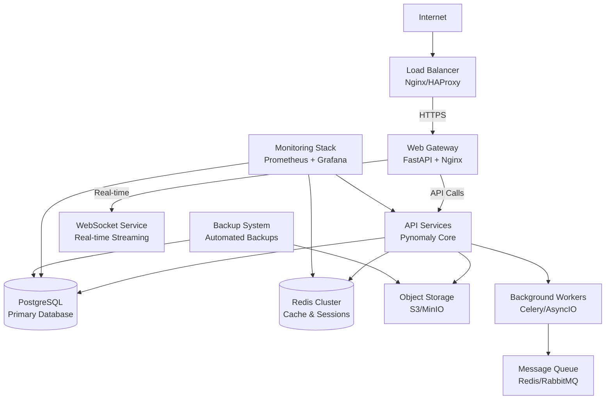

# Pynomaly Production Deployment Guide v2.0

**Complete Production Deployment Guide for Enterprise-Ready Anomaly Detection Platform**

---

## 📋 Table of Contents

1. [Production Readiness Checklist](#production-readiness-checklist)
2. [Architecture & Prerequisites](#architecture--prerequisites)
3. [Quick Start Production Deployment](#quick-start-production-deployment)
4. [Security Hardening Guide](#security-hardening-guide)
5. [Monitoring & Observability Setup](#monitoring--observability-setup)
6. [Backup & Recovery Procedures](#backup--recovery-procedures)
7. [Performance Tuning Guide](#performance-tuning-guide)
8. [Troubleshooting Procedures](#troubleshooting-procedures)
9. [Infrastructure as Code Examples](#infrastructure-as-code-examples)
10. [Maintenance & Operations](#maintenance--operations)

---

## 🎯 Production Readiness Checklist

### Pre-Deployment Checklist

- [ ] **System Requirements**: Verify minimum hardware specifications
- [ ] **Dependencies**: Install Docker 24.0+, Docker Compose 2.20+, Kubernetes 1.27+
- [ ] **Security**: SSL certificates, firewall rules, VPN access configured
- [ ] **Database**: PostgreSQL 15+ production instance ready
- [ ] **Cache**: Redis 6.2+ cluster configured
- [ ] **Storage**: Persistent volumes for data and backups
- [ ] **Networking**: Load balancer and reverse proxy configured
- [ ] **DNS**: Domain names and SSL certificates ready
- [ ] **Monitoring**: Prometheus, Grafana, and alerting configured

### Deployment Verification Checklist

- [ ] **Health Checks**: All services respond to health endpoints
- [ ] **API Functionality**: Core API endpoints operational
- [ ] **Database Connectivity**: Connection pooling and migrations complete
- [ ] **Authentication**: User management and access control working
- [ ] **Real-time Streaming**: WebSocket connections functional
- [ ] **File Uploads**: Data ingestion and processing working
- [ ] **Model Loading**: ML models loaded and inference working
- [ ] **Monitoring**: Metrics collection and dashboards operational
- [ ] **Alerting**: Alert rules configured and tested
- [ ] **Backup**: Automated backup procedures verified

### Post-Deployment Checklist

- [ ] **Load Testing**: Performance benchmarks validated
- [ ] **Security Scan**: Vulnerability assessment completed
- [ ] **Documentation**: Runbooks and procedures updated
- [ ] **Team Training**: Operations team trained on procedures
- [ ] **Disaster Recovery**: Recovery procedures tested
- [ ] **Monitoring**: 24/7 monitoring alerts configured
- [ ] **Maintenance**: Scheduled maintenance procedures in place

---

## 🏗️ Architecture & Prerequisites

### Production Architecture



### System Requirements

| Component | Minimum | Recommended | Enterprise |
|-----------|---------|-------------|------------|
| **CPU** | 4 cores | 8 cores | 16+ cores |
| **Memory** | 8GB RAM | 16GB RAM | 32GB+ RAM |
| **Storage** | 100GB SSD | 500GB SSD | 1TB+ NVMe |
| **Network** | 1Gbps | 10Gbps | 10Gbps+ |
| **Replicas** | 1 | 3 | 5+ |

### Software Dependencies

```yaml
# Production Dependencies
core_services:
  - Docker: "24.0+"
  - Docker Compose: "2.20+"
  - Kubernetes: "1.27+" (optional)
  - Python: "3.11+"

databases:
  - PostgreSQL: "15+"
  - Redis: "6.2+"

monitoring:
  - Prometheus: "2.40+"
  - Grafana: "9.0+"
  - AlertManager: "0.25+"

security:
  - Let's Encrypt: "latest"
  - OpenSSL: "3.0+"
  - Vault: "1.14+" (optional)
```

---

## 🚀 Quick Start Production Deployment

### Step 1: Environment Setup

```bash
# 1. Clone repository
git clone https://github.com/your-org/pynomaly.git
cd pynomaly

# 2. Create production environment file
cp .env.example .env.production

# 3. Configure production secrets
./scripts/setup_production_secrets.sh
```

### Step 2: Production Configuration

**`.env.production`**:

```bash
# === PRODUCTION CONFIGURATION ===
ENVIRONMENT=production
DEBUG=false

# Database Configuration
POSTGRES_HOST=postgres
POSTGRES_PORT=5432
POSTGRES_DB=pynomaly_prod
POSTGRES_USER=pynomaly
POSTGRES_PASSWORD_FILE=/run/secrets/postgres_password
DATABASE_URL=postgresql://${POSTGRES_USER}:${POSTGRES_PASSWORD}@${POSTGRES_HOST}:${POSTGRES_PORT}/${POSTGRES_DB}

# Redis Configuration
REDIS_HOST=redis-cluster
REDIS_PORT=6379
REDIS_PASSWORD_FILE=/run/secrets/redis_password
REDIS_URL=redis://:${REDIS_PASSWORD}@${REDIS_HOST}:${REDIS_PORT}/0

# Security
SECRET_KEY_FILE=/run/secrets/secret_key
JWT_SECRET_KEY_FILE=/run/secrets/jwt_secret
ENCRYPTION_KEY_FILE=/run/secrets/encryption_key

# SSL/TLS
SSL_CERT_PATH=/etc/nginx/ssl/fullchain.pem
SSL_KEY_PATH=/etc/nginx/ssl/privkey.pem

# Monitoring
PROMETHEUS_ENABLED=true
GRAFANA_ENABLED=true
SENTRY_DSN_FILE=/run/secrets/sentry_dsn

# Cloud Storage (optional)
AWS_ACCESS_KEY_ID_FILE=/run/secrets/aws_access_key
AWS_SECRET_ACCESS_KEY_FILE=/run/secrets/aws_secret_key
S3_BUCKET_NAME=pynomaly-production-data

# Performance
WORKERS=4
WORKER_CONNECTIONS=1000
MAX_REQUESTS=10000
MAX_REQUESTS_JITTER=1000

# Rate Limiting
RATE_LIMIT_ENABLED=true
RATE_LIMIT_PER_MINUTE=60
RATE_LIMIT_BURST=10
```

### Step 3: Deploy with Docker Compose

```bash
# 1. Generate SSL certificates
./scripts/generate_ssl_certs.sh your-domain.com

# 2. Start production stack
docker-compose -f docker-compose.production.yml up -d

# 3. Run database migrations
docker-compose -f docker-compose.production.yml exec api python -m alembic upgrade head

# 4. Create admin user
docker-compose -f docker-compose.production.yml exec api python -m scripts.create_admin_user

# 5. Verify deployment
./scripts/verify_production_deployment.sh
```

### Step 4: Production Verification

```bash
# Health checks
curl -f https://your-domain.com/health
curl -f https://your-domain.com/api/v1/health

# API documentation
curl -f https://your-domain.com/docs

# Real-time streaming
curl -f https://your-domain.com/api/v1/streaming/health

# Monitoring dashboards
curl -f https://your-domain.com/grafana/api/health
```

---

## 🔐 Security Hardening Guide

### SSL/TLS Configuration

**Generate Production SSL Certificates:**

```bash
#!/bin/bash
# scripts/generate_ssl_certs.sh

DOMAIN=$1
if [ -z "$DOMAIN" ]; then
    echo "Usage: $0 <domain>"
    exit 1
fi

# Install certbot
apt-get update && apt-get install -y certbot

# Generate Let's Encrypt certificate
certbot certonly --standalone \
    --non-interactive \
    --agree-tos \
    --email admin@${DOMAIN} \
    -d ${DOMAIN} \
    -d api.${DOMAIN} \
    -d monitoring.${DOMAIN}

# Copy certificates to nginx directory
mkdir -p config/nginx/ssl
cp /etc/letsencrypt/live/${DOMAIN}/fullchain.pem config/nginx/ssl/
cp /etc/letsencrypt/live/${DOMAIN}/privkey.pem config/nginx/ssl/

# Set up auto-renewal
echo "0 2 * * * certbot renew --quiet && docker-compose -f docker-compose.production.yml restart nginx" | crontab -

echo "SSL certificates generated for ${DOMAIN}"
```

### Database Security Hardening

**PostgreSQL Security Configuration:**

```sql
-- Create production database with secure settings
CREATE DATABASE pynomaly_prod WITH 
    ENCODING = 'UTF8'
    LC_COLLATE = 'en_US.UTF-8'
    LC_CTYPE = 'en_US.UTF-8'
    TEMPLATE = template0;

-- Create application user with limited privileges
CREATE USER pynomaly WITH PASSWORD 'secure_generated_password';
GRANT CONNECT ON DATABASE pynomaly_prod TO pynomaly;
GRANT USAGE ON SCHEMA public TO pynomaly;
GRANT CREATE ON SCHEMA public TO pynomaly;

-- Create read-only monitoring user
CREATE USER pynomaly_monitor WITH PASSWORD 'monitor_password';
GRANT CONNECT ON DATABASE pynomaly_prod TO pynomaly_monitor;
GRANT USAGE ON SCHEMA public TO pynomaly_monitor;
GRANT SELECT ON ALL TABLES IN SCHEMA public TO pynomaly_monitor;
GRANT SELECT ON ALL SEQUENCES IN SCHEMA public TO pynomaly_monitor;

-- Enable row-level security
ALTER DATABASE pynomaly_prod SET row_security = on;

-- Enable connection logging
ALTER SYSTEM SET log_connections = 'on';
ALTER SYSTEM SET log_disconnections = 'on';
ALTER SYSTEM SET log_statement = 'all';
SELECT pg_reload_conf();
```

### Application Security Configuration

**Security Middleware Setup:**

```python
# config/security.py
SECURITY_CONFIG = {
    'cors': {
        'allow_origins': ['https://your-domain.com'],
        'allow_credentials': True,
        'allow_methods': ['GET', 'POST', 'PUT', 'DELETE', 'OPTIONS'],
        'allow_headers': ['Authorization', 'Content-Type'],
        'max_age': 3600
    },
    'rate_limiting': {
        'global_per_minute': 10000,
        'per_user_per_minute': 1000,
        'per_ip_per_minute': 500,
        'burst_allowance': 50
    },
    'input_validation': {
        'max_request_size': 50 * 1024 * 1024,  # 50MB
        'max_file_size': 100 * 1024 * 1024,    # 100MB
        'allowed_extensions': ['.csv', '.json', '.parquet', '.txt'],
        'max_filename_length': 255
    },
    'authentication': {
        'jwt_expiry_minutes': 60,
        'refresh_token_expiry_days': 30,
        'max_failed_attempts': 5,
        'lockout_duration_minutes': 15
    },
    'encryption': {
        'algorithm': 'AES-256-GCM',
        'key_rotation_days': 90,
        'sensitive_fields': ['password', 'api_key', 'token']
    }
}
```

### Firewall Configuration

**UFW Firewall Rules:**

```bash
#!/bin/bash
# scripts/configure_firewall.sh

# Reset firewall
ufw --force reset

# Default policies
ufw default deny incoming
ufw default allow outgoing

# SSH access (change port as needed)
ufw allow 22/tcp

# HTTP/HTTPS
ufw allow 80/tcp
ufw allow 443/tcp

# Database (only from application network)
ufw allow from 172.18.0.0/16 to any port 5432

# Redis (only from application network)
ufw allow from 172.18.0.0/16 to any port 6379

# Monitoring (only from monitoring network)
ufw allow from 172.19.0.0/16 to any port 9090
ufw allow from 172.19.0.0/16 to any port 3000

# Enable firewall
ufw --force enable

echo "Firewall configured successfully"
```

---

## 📊 Monitoring & Observability Setup

### Prometheus Configuration

**`config/prometheus/prometheus.yml`:**

```yaml
global:
  scrape_interval: 15s
  evaluation_interval: 15s
  external_labels:
    cluster: 'pynomaly-production'
    environment: 'production'

rule_files:
  - "rules/*.yml"

scrape_configs:
  # Application metrics
  - job_name: 'pynomaly-api'
    static_configs:
      - targets: ['api:8000']
    metrics_path: '/metrics'
    scrape_interval: 30s
    honor_labels: true
    
  # Database metrics
  - job_name: 'postgres'
    static_configs:
      - targets: ['postgres-exporter:9187']
    scrape_interval: 30s
    
  # Redis metrics
  - job_name: 'redis'
    static_configs:
      - targets: ['redis-exporter:9121']
    scrape_interval: 30s
    
  # System metrics
  - job_name: 'node-exporter'
    static_configs:
      - targets: ['node-exporter:9100']
    scrape_interval: 30s
    
  # Load balancer metrics
  - job_name: 'nginx'
    static_configs:
      - targets: ['nginx-exporter:9113']
    scrape_interval: 30s

alerting:
  alertmanagers:
    - static_configs:
        - targets:
          - alertmanager:9093
```

### Grafana Dashboard Configuration

**Automated Dashboard Provisioning:**

```yaml
# config/grafana/provisioning/dashboards/dashboard.yaml
apiVersion: 1

providers:
  - name: 'Pynomaly Dashboards'
    orgId: 1
    folder: 'Pynomaly'
    type: file
    disableDeletion: false
    updateIntervalSeconds: 10
    allowUiUpdates: true
    options:
      path: /etc/grafana/provisioning/dashboards/json
```

### Alert Rules Configuration

**`config/prometheus/rules/pynomaly-alerts.yml`:**

```yaml
groups:
  - name: pynomaly.critical
    rules:
      - alert: ServiceDown
        expr: up{job=~"pynomaly-.*"} == 0
        for: 1m
        labels:
          severity: critical
        annotations:
          summary: "Pynomaly service {{ $labels.job }} is down"
          description: "Service {{ $labels.job }} has been down for more than 1 minute"
          
      - alert: HighErrorRate
        expr: rate(http_requests_total{status=~"5.."}[5m]) / rate(http_requests_total[5m]) > 0.05
        for: 5m
        labels:
          severity: critical
        annotations:
          summary: "High error rate detected"
          description: "Error rate is {{ $value | humanizePercentage }} for the last 5 minutes"
          
      - alert: DatabaseConnectionFailure
        expr: up{job="postgres"} == 0
        for: 1m
        labels:
          severity: critical
        annotations:
          summary: "Database is unreachable"
          description: "PostgreSQL database has been unreachable for more than 1 minute"

  - name: pynomaly.warning
    rules:
      - alert: HighLatency
        expr: histogram_quantile(0.95, rate(http_request_duration_seconds_bucket[5m])) > 1
        for: 5m
        labels:
          severity: warning
        annotations:
          summary: "High API latency detected"
          description: "95th percentile latency is {{ $value }}s"
          
      - alert: HighMemoryUsage
        expr: (node_memory_MemTotal_bytes - node_memory_MemAvailable_bytes) / node_memory_MemTotal_bytes > 0.9
        for: 10m
        labels:
          severity: warning
        annotations:
          summary: "High memory usage"
          description: "Memory usage is above 90% for more than 10 minutes"
          
      - alert: DiskSpaceLow
        expr: (node_filesystem_size_bytes{fstype!~"tmpfs|overlay"} - node_filesystem_free_bytes{fstype!~"tmpfs|overlay"}) / node_filesystem_size_bytes{fstype!~"tmpfs|overlay"} > 0.8
        for: 5m
        labels:
          severity: warning
        annotations:
          summary: "Disk space is running low"
          description: "Disk usage is above 80% on {{ $labels.device }}"
```

---

## 💾 Backup & Recovery Procedures

### Automated Database Backup

**`scripts/backup_database.sh`:**

```bash
#!/bin/bash

# Configuration
BACKUP_DIR="/opt/backups/postgres"
RETENTION_DAYS=30
TIMESTAMP=$(date +%Y%m%d_%H%M%S)
BACKUP_FILE="pynomaly_backup_${TIMESTAMP}.sql"
CONTAINER_NAME="pynomaly_postgres_1"

# Create backup directory
mkdir -p "${BACKUP_DIR}"

echo "Starting database backup at $(date)"

# Create database backup
docker exec "${CONTAINER_NAME}" pg_dump \
    -U pynomaly \
    -d pynomaly_prod \
    --verbose \
    --no-password \
    --clean \
    --if-exists > "${BACKUP_DIR}/${BACKUP_FILE}"

if [ $? -eq 0 ]; then
    echo "Database backup created successfully: ${BACKUP_FILE}"
    
    # Compress backup
    gzip "${BACKUP_DIR}/${BACKUP_FILE}"
    echo "Backup compressed: ${BACKUP_FILE}.gz"
    
    # Upload to cloud storage (if configured)
    if [ ! -z "${AWS_S3_BACKUP_BUCKET}" ]; then
        aws s3 cp "${BACKUP_DIR}/${BACKUP_FILE}.gz" \
            "s3://${AWS_S3_BACKUP_BUCKET}/postgres/$(date +%Y/%m/%d)/"
        echo "Backup uploaded to S3"
    fi
    
    # Clean up old backups
    find "${BACKUP_DIR}" -name "*.sql.gz" -mtime +${RETENTION_DAYS} -delete
    echo "Old backups cleaned up (>${RETENTION_DAYS} days)"
    
else
    echo "ERROR: Database backup failed"
    exit 1
fi

echo "Database backup completed at $(date)"
```

### Model Registry Backup

**`scripts/backup_models.sh`:**

```bash
#!/bin/bash

# Configuration
MODEL_DIR="/opt/pynomaly/models"
BACKUP_DIR="/opt/backups/models"
TIMESTAMP=$(date +%Y%m%d_%H%M%S)
BACKUP_FILE="models_backup_${TIMESTAMP}.tar.gz"

echo "Starting model backup at $(date)"

# Create backup directory
mkdir -p "${BACKUP_DIR}"

# Create compressed backup of model directory
tar -czf "${BACKUP_DIR}/${BACKUP_FILE}" -C "${MODEL_DIR}" . 2>/dev/null

if [ $? -eq 0 ]; then
    echo "Model backup created: ${BACKUP_FILE}"
    
    # Upload to cloud storage
    if [ ! -z "${AWS_S3_BACKUP_BUCKET}" ]; then
        aws s3 cp "${BACKUP_DIR}/${BACKUP_FILE}" \
            "s3://${AWS_S3_BACKUP_BUCKET}/models/$(date +%Y/%m/%d)/"
        echo "Model backup uploaded to S3"
    fi
    
    # Keep only last 7 model backups
    ls -t "${BACKUP_DIR}"/models_backup_*.tar.gz | tail -n +8 | xargs -r rm
    echo "Old model backups cleaned up"
    
else
    echo "ERROR: Model backup failed"
    exit 1
fi

echo "Model backup completed at $(date)"
```

### Disaster Recovery Procedures

**`scripts/disaster_recovery.sh`:**

```bash
#!/bin/bash

# Disaster Recovery Script
RECOVERY_TYPE=$1
BACKUP_DATE=$2

usage() {
    echo "Usage: $0 {database|models|full} [YYYYMMDD_HHMMSS]"
    echo "Examples:"
    echo "  $0 database 20241201_120000"
    echo "  $0 models 20241201_120000"
    echo "  $0 full 20241201_120000"
    exit 1
}

if [ -z "$RECOVERY_TYPE" ]; then
    usage
fi

recover_database() {
    local backup_file="pynomaly_backup_${BACKUP_DATE}.sql.gz"
    local backup_path="/opt/backups/postgres/${backup_file}"
    
    echo "Recovering database from ${backup_file}"
    
    # Stop application services
    docker-compose -f docker-compose.production.yml stop api worker
    
    # Download from S3 if not local
    if [ ! -f "${backup_path}" ] && [ ! -z "${AWS_S3_BACKUP_BUCKET}" ]; then
        aws s3 cp "s3://${AWS_S3_BACKUP_BUCKET}/postgres/" "${backup_path}" --recursive --exclude "*" --include "*${BACKUP_DATE}*"
    fi
    
    # Restore database
    gunzip -c "${backup_path}" | docker exec -i pynomaly_postgres_1 psql -U pynomaly -d pynomaly_prod
    
    if [ $? -eq 0 ]; then
        echo "Database recovery completed successfully"
        
        # Restart services
        docker-compose -f docker-compose.production.yml start api worker
        
        # Verify recovery
        sleep 30
        curl -f http://localhost/health
        
    else
        echo "ERROR: Database recovery failed"
        exit 1
    fi
}

recover_models() {
    local backup_file="models_backup_${BACKUP_DATE}.tar.gz"
    local backup_path="/opt/backups/models/${backup_file}"
    
    echo "Recovering models from ${backup_file}"
    
    # Download from S3 if not local
    if [ ! -f "${backup_path}" ] && [ ! -z "${AWS_S3_BACKUP_BUCKET}" ]; then
        aws s3 cp "s3://${AWS_S3_BACKUP_BUCKET}/models/" "${backup_path}" --recursive --exclude "*" --include "*${BACKUP_DATE}*"
    fi
    
    # Backup current models
    mv /opt/pynomaly/models /opt/pynomaly/models.backup.$(date +%Y%m%d_%H%M%S)
    
    # Create new models directory
    mkdir -p /opt/pynomaly/models
    
    # Extract backup
    tar -xzf "${backup_path}" -C /opt/pynomaly/models
    
    if [ $? -eq 0 ]; then
        echo "Models recovery completed successfully"
        
        # Restart API to reload models
        docker-compose -f docker-compose.production.yml restart api
        
    else
        echo "ERROR: Models recovery failed"
        exit 1
    fi
}

case "$RECOVERY_TYPE" in
    database)
        recover_database
        ;;
    models)
        recover_models
        ;;
    full)
        recover_database
        recover_models
        ;;
    *)
        usage
        ;;
esac

echo "Disaster recovery completed for ${RECOVERY_TYPE}"
```

---

## ⚡ Performance Tuning Guide

### Database Optimization

**PostgreSQL Performance Configuration:**

```sql
-- Performance tuning queries
-- Check slow queries
SELECT query, mean_time, calls, total_time 
FROM pg_stat_statements 
ORDER BY mean_time DESC 
LIMIT 10;

-- Analyze table statistics
ANALYZE;

-- Update table statistics more frequently
ALTER SYSTEM SET autovacuum_naptime = '30s';
ALTER SYSTEM SET autovacuum_vacuum_scale_factor = 0.1;
ALTER SYSTEM SET autovacuum_analyze_scale_factor = 0.05;

-- Connection pool optimization
ALTER SYSTEM SET max_connections = 200;
ALTER SYSTEM SET shared_buffers = '256MB';
ALTER SYSTEM SET effective_cache_size = '1GB';
ALTER SYSTEM SET work_mem = '4MB';
ALTER SYSTEM SET maintenance_work_mem = '64MB';

-- Enable parallel query execution
ALTER SYSTEM SET max_parallel_workers = 8;
ALTER SYSTEM SET max_parallel_workers_per_gather = 4;

SELECT pg_reload_conf();
```

**Database Index Optimization:**

```sql
-- Create performance-critical indexes
CREATE INDEX CONCURRENTLY idx_anomaly_detections_created_at 
ON anomaly_detections(created_at) 
WHERE created_at > NOW() - INTERVAL '30 days';

CREATE INDEX CONCURRENTLY idx_datasets_user_id 
ON datasets(user_id) 
WHERE active = true;

CREATE INDEX CONCURRENTLY idx_models_status 
ON models(status, created_at) 
WHERE status IN ('active', 'training');

-- Partial index for recent data
CREATE INDEX CONCURRENTLY idx_recent_predictions 
ON predictions(model_id, created_at) 
WHERE created_at > NOW() - INTERVAL '7 days';
```

### Application Performance Tuning

**FastAPI Performance Configuration:**

```python
# config/performance.py
PERFORMANCE_CONFIG = {
    # Uvicorn worker configuration
    'uvicorn': {
        'workers': 4,
        'worker_class': 'uvicorn.workers.UvicornWorker',
        'worker_connections': 1000,
        'max_requests': 10000,
        'max_requests_jitter': 1000,
        'timeout': 30,
        'keepalive': 2
    },
    
    # Database connection pool
    'database': {
        'pool_size': 20,
        'max_overflow': 30,
        'pool_timeout': 30,
        'pool_recycle': 3600,
        'pool_pre_ping': True
    },
    
    # Redis configuration
    'redis': {
        'connection_pool_size': 50,
        'connection_pool_timeout': 30,
        'retry_on_timeout': True,
        'max_connections': 100
    },
    
    # Caching configuration
    'cache': {
        'default_ttl': 3600,
        'max_entries': 10000,
        'compress_threshold': 1024,
        'serializer': 'pickle'
    },
    
    # Background tasks
    'celery': {
        'worker_concurrency': 4,
        'task_acks_late': True,
        'worker_prefetch_multiplier': 1,
        'task_compression': 'gzip'
    }
}
```

### Load Balancer Optimization

**Nginx Performance Configuration:**

```nginx
# config/nginx/performance.conf
worker_processes auto;
worker_rlimit_nofile 65535;

events {
    worker_connections 4096;
    use epoll;
    multi_accept on;
}

http {
    # Performance settings
    sendfile on;
    tcp_nopush on;
    tcp_nodelay on;
    
    # Keepalive settings
    keepalive_timeout 65;
    keepalive_requests 1000;
    
    # Buffer settings
    client_body_buffer_size 16k;
    client_header_buffer_size 1k;
    client_max_body_size 50m;
    large_client_header_buffers 4 8k;
    
    # Compression
    gzip on;
    gzip_vary on;
    gzip_min_length 1024;
    gzip_comp_level 6;
    gzip_types
        text/plain
        text/css
        text/xml
        text/javascript
        application/json
        application/javascript
        application/xml+rss
        application/atom+xml
        image/svg+xml;
    
    # Caching
    location ~* \.(css|js|png|jpg|jpeg|gif|ico|svg)$ {
        expires 1M;
        add_header Cache-Control "public, immutable";
    }
    
    # Rate limiting
    limit_req_zone $binary_remote_addr zone=api:10m rate=10r/s;
    limit_req_zone $binary_remote_addr zone=login:10m rate=1r/m;
}
```

---

## 🔧 Troubleshooting Procedures

### Common Issues and Solutions

#### 1. API Service Won't Start

**Symptoms:**

- API container exits immediately
- Health check failures
- 502 Bad Gateway errors

**Troubleshooting Steps:**

```bash
# Check container logs
docker-compose -f docker-compose.production.yml logs api

# Check configuration validation
docker-compose -f docker-compose.production.yml exec api python -c "
from src.pynomaly.infrastructure.config.settings import settings
print('Configuration loaded successfully')
print(f'Database URL: {settings.database_url}')
"

# Test database connectivity
docker-compose -f docker-compose.production.yml exec api python -c "
from sqlalchemy import create_engine
from src.pynomaly.infrastructure.config.settings import settings
engine = create_engine(settings.database_url)
with engine.connect() as conn:
    result = conn.execute('SELECT 1')
    print('Database connection successful')
"

# Check available memory
docker stats

# Restart with verbose logging
docker-compose -f docker-compose.production.yml restart api
```

**Common Solutions:**

- Verify environment variables are set correctly
- Check database connection parameters
- Ensure sufficient memory allocation
- Validate SSL certificates if using HTTPS

#### 2. High Memory Usage

**Symptoms:**

- Out of memory errors
- Container restarts
- Slow response times

**Investigation:**

```bash
# Monitor memory usage
docker stats --format "table {{.Container}}\t{{.CPUPerc}}\t{{.MemUsage}}\t{{.MemPerc}}"

# Check for memory leaks
docker-compose -f docker-compose.production.yml exec api python -c "
import psutil
import gc
process = psutil.Process()
print(f'Memory usage: {process.memory_info().rss / 1024 / 1024:.2f} MB')
gc.collect()
print(f'After GC: {process.memory_info().rss / 1024 / 1024:.2f} MB')
"

# Profile memory usage
docker-compose -f docker-compose.production.yml exec api python -m memory_profiler scripts/profile_memory.py
```

**Solutions:**

```bash
# Tune garbage collection
export PYTHONHASHSEED=0
export PYTHONOPTIMIZE=1
export PYTHONDONTWRITEBYTECODE=1

# Adjust worker processes
export WORKERS=2
export WORKER_CLASS=uvicorn.workers.UvicornWorker

# Increase container memory limits
# In docker-compose.production.yml:
# deploy:
#   resources:
#     limits:
#       memory: 4G
```

#### 3. Database Connection Issues

**Symptoms:**

- Connection timeouts
- "Too many connections" errors
- Slow query performance

**Troubleshooting:**

```bash
# Check database connectivity
docker-compose -f docker-compose.production.yml exec postgres psql -U pynomaly -d pynomaly_prod -c "SELECT version();"

# Monitor active connections
docker-compose -f docker-compose.production.yml exec postgres psql -U pynomaly -d pynomaly_prod -c "
SELECT 
    count(*) as total_connections,
    state,
    application_name
FROM pg_stat_activity 
GROUP BY state, application_name;
"

# Check for long-running queries
docker-compose -f docker-compose.production.yml exec postgres psql -U pynomaly -d pynomaly_prod -c "
SELECT 
    pid,
    now() - pg_stat_activity.query_start AS duration,
    query,
    state
FROM pg_stat_activity
WHERE (now() - pg_stat_activity.query_start) > interval '5 minutes';
"
```

**Solutions:**

```sql
-- Kill long-running queries
SELECT pg_terminate_backend(pid) FROM pg_stat_activity WHERE state = 'active' AND (now() - query_start) > interval '10 minutes';

-- Increase connection limits
ALTER SYSTEM SET max_connections = 200;
SELECT pg_reload_conf();

-- Optimize connection pooling
-- In application config:
-- DATABASE_POOL_SIZE = 20
-- DATABASE_MAX_OVERFLOW = 30
-- DATABASE_POOL_TIMEOUT = 30
```

#### 4. Real-time Streaming Issues

**Symptoms:**

- WebSocket connections dropping
- Missing real-time updates
- High latency in streaming

**Troubleshooting:**

```bash
# Test WebSocket connectivity
wscat -c ws://localhost/ws/streaming

# Check streaming service logs
docker-compose -f docker-compose.production.yml logs streaming

# Monitor WebSocket connections
docker-compose -f docker-compose.production.yml exec api python -c "
from src.pynomaly.presentation.websocket.manager import websocket_manager
print(f'Active connections: {len(websocket_manager.active_connections)}')
"

# Check Redis pub/sub
docker-compose -f docker-compose.production.yml exec redis redis-cli monitor
```

**Solutions:**

- Verify WebSocket endpoint configuration
- Check firewall rules for WebSocket traffic
- Increase connection timeout settings
- Monitor Redis pub/sub performance

---

## 🏭 Infrastructure as Code Examples

### Terraform Configuration

**`terraform/main.tf`:**

```hcl
# Terraform configuration for AWS deployment
terraform {
  required_version = ">= 1.0"
  required_providers {
    aws = {
      source  = "hashicorp/aws"
      version = "~> 5.0"
    }
  }
}

provider "aws" {
  region = var.aws_region
}

# VPC Configuration
resource "aws_vpc" "pynomaly_vpc" {
  cidr_block           = "10.0.0.0/16"
  enable_dns_hostnames = true
  enable_dns_support   = true
  
  tags = {
    Name        = "pynomaly-vpc"
    Environment = var.environment
  }
}

# ECS Cluster
resource "aws_ecs_cluster" "pynomaly_cluster" {
  name = "pynomaly-${var.environment}"
  
  setting {
    name  = "containerInsights"
    value = "enabled"
  }
  
  tags = {
    Environment = var.environment
  }
}

# Application Load Balancer
resource "aws_lb" "pynomaly_alb" {
  name               = "pynomaly-alb"
  internal           = false
  load_balancer_type = "application"
  security_groups    = [aws_security_group.alb_sg.id]
  subnets           = aws_subnet.public[*].id
  
  enable_deletion_protection = var.environment == "production"
  
  tags = {
    Environment = var.environment
  }
}

# RDS Database
resource "aws_db_instance" "pynomaly_db" {
  identifier             = "pynomaly-${var.environment}"
  engine                = "postgres"
  engine_version        = "15.3"
  instance_class        = var.db_instance_class
  allocated_storage     = 100
  max_allocated_storage = 1000
  
  db_name  = "pynomaly"
  username = "pynomaly"
  password = var.db_password
  
  vpc_security_group_ids = [aws_security_group.db_sg.id]
  db_subnet_group_name   = aws_db_subnet_group.pynomaly_db_subnet_group.name
  
  backup_retention_period = 7
  backup_window          = "03:00-04:00"
  maintenance_window     = "sun:04:00-sun:05:00"
  
  skip_final_snapshot = var.environment != "production"
  
  performance_insights_enabled = true
  monitoring_interval         = 60
  
  tags = {
    Environment = var.environment
  }
}

# ElastiCache Redis
resource "aws_elasticache_subnet_group" "pynomaly_cache_subnet" {
  name       = "pynomaly-cache-subnet"
  subnet_ids = aws_subnet.private[*].id
}

resource "aws_elasticache_replication_group" "pynomaly_redis" {
  replication_group_id         = "pynomaly-redis"
  description                  = "Redis cluster for Pynomaly"
  
  node_type                   = var.redis_node_type
  port                        = 6379
  parameter_group_name        = "default.redis6.x"
  num_cache_clusters          = 2
  
  subnet_group_name           = aws_elasticache_subnet_group.pynomaly_cache_subnet.name
  security_group_ids          = [aws_security_group.redis_sg.id]
  
  at_rest_encryption_enabled  = true
  transit_encryption_enabled  = true
  auth_token                  = var.redis_auth_token
  
  tags = {
    Environment = var.environment
  }
}
```

### Kubernetes Manifests

**`k8s/production/namespace.yaml`:**

```yaml
apiVersion: v1
kind: Namespace
metadata:
  name: pynomaly-production
  labels:
    name: pynomaly-production
    environment: production
```

**`k8s/production/deployment.yaml`:**

```yaml
apiVersion: apps/v1
kind: Deployment
metadata:
  name: pynomaly-api
  namespace: pynomaly-production
  labels:
    app: pynomaly-api
    version: v1.0.0
spec:
  replicas: 3
  strategy:
    type: RollingUpdate
    rollingUpdate:
      maxSurge: 1
      maxUnavailable: 0
  selector:
    matchLabels:
      app: pynomaly-api
  template:
    metadata:
      labels:
        app: pynomaly-api
        version: v1.0.0
    spec:
      containers:
      - name: pynomaly-api
        image: pynomaly/api:latest
        ports:
        - containerPort: 8000
          name: http
        env:
        - name: ENVIRONMENT
          value: "production"
        - name: DATABASE_URL
          valueFrom:
            secretKeyRef:
              name: pynomaly-secrets
              key: database-url
        - name: REDIS_URL
          valueFrom:
            secretKeyRef:
              name: pynomaly-secrets
              key: redis-url
        resources:
          requests:
            cpu: 500m
            memory: 1Gi
          limits:
            cpu: 2000m
            memory: 4Gi
        livenessProbe:
          httpGet:
            path: /health
            port: 8000
          initialDelaySeconds: 30
          periodSeconds: 10
          timeoutSeconds: 5
          failureThreshold: 3
        readinessProbe:
          httpGet:
            path: /health
            port: 8000
          initialDelaySeconds: 5
          periodSeconds: 5
          timeoutSeconds: 3
          failureThreshold: 3
        volumeMounts:
        - name: app-storage
          mountPath: /app/data
      volumes:
      - name: app-storage
        persistentVolumeClaim:
          claimName: pynomaly-storage
```

### Ansible Playbooks

**`ansible/production-deploy.yml`:**

```yaml
---
- name: Deploy Pynomaly to Production
  hosts: production
  become: yes
  vars:
    app_name: pynomaly
    app_version: "{{ git_commit | default('latest') }}"
    app_environment: production
    
  tasks:
    - name: Update system packages
      apt:
        update_cache: yes
        upgrade: dist
        
    - name: Install Docker
      apt:
        name: 
          - docker.io
          - docker-compose
        state: present
        
    - name: Create application directory
      file:
        path: /opt/{{ app_name }}
        state: directory
        owner: root
        group: root
        mode: '0755'
        
    - name: Copy Docker Compose configuration
      template:
        src: docker-compose.production.yml.j2
        dest: /opt/{{ app_name }}/docker-compose.yml
        owner: root
        group: root
        mode: '0600'
        
    - name: Copy environment configuration
      template:
        src: .env.production.j2
        dest: /opt/{{ app_name }}/.env
        owner: root
        group: root
        mode: '0600'
        
    - name: Create SSL certificate directory
      file:
        path: /opt/{{ app_name }}/ssl
        state: directory
        owner: root
        group: root
        mode: '0700'
        
    - name: Copy SSL certificates
      copy:
        src: "{{ item.src }}"
        dest: "{{ item.dest }}"
        owner: root
        group: root
        mode: '0600'
      loop:
        - { src: "ssl/fullchain.pem", dest: "/opt/{{ app_name }}/ssl/fullchain.pem" }
        - { src: "ssl/privkey.pem", dest: "/opt/{{ app_name }}/ssl/privkey.pem" }
        
    - name: Pull Docker images
      command: docker-compose pull
      args:
        chdir: /opt/{{ app_name }}
        
    - name: Start application services
      command: docker-compose up -d
      args:
        chdir: /opt/{{ app_name }}
        
    - name: Wait for application to be ready
      uri:
        url: "https://{{ ansible_default_ipv4.address }}/health"
        method: GET
        validate_certs: no
      register: health_check
      until: health_check.status == 200
      retries: 30
      delay: 10
      
    - name: Verify deployment
      command: docker-compose ps
      args:
        chdir: /opt/{{ app_name }}
      register: container_status
      
    - name: Display deployment status
      debug:
        var: container_status.stdout_lines
```

---

## 🔄 Maintenance & Operations

### Scheduled Maintenance Tasks

**Daily Maintenance (`cron/daily-maintenance.sh`):**

```bash
#!/bin/bash
# Daily maintenance tasks

LOG_FILE="/var/log/pynomaly/maintenance.log"
exec > >(tee -a ${LOG_FILE})
exec 2>&1

echo "=== Daily Maintenance Started: $(date) ==="

# Health check
echo "Performing health checks..."
curl -f http://localhost/health || echo "WARNING: Health check failed"

# Database maintenance
echo "Running database maintenance..."
docker-compose -f /opt/pynomaly/docker-compose.yml exec -T postgres psql -U pynomaly -d pynomaly_prod -c "
SELECT 
    schemaname,
    tablename,
    attname,
    n_distinct,
    correlation
FROM pg_stats 
WHERE schemaname = 'public' 
AND n_distinct > 100;
"

# Clean up old logs
echo "Cleaning up old logs..."
find /var/log/pynomaly -name "*.log" -mtime +7 -delete
find /opt/pynomaly/logs -name "*.log" -mtime +7 -delete

# Docker cleanup
echo "Cleaning up Docker resources..."
docker system prune -f --volumes

# Backup verification
echo "Verifying latest backup..."
LATEST_BACKUP=$(ls -t /opt/backups/postgres/*.sql.gz | head -1)
if [ -f "$LATEST_BACKUP" ]; then
    echo "Latest backup found: $LATEST_BACKUP"
    echo "Backup size: $(du -h $LATEST_BACKUP | cut -f1)"
else
    echo "WARNING: No recent backup found"
fi

echo "=== Daily Maintenance Completed: $(date) ==="
```

**Weekly Maintenance (`cron/weekly-maintenance.sh`):**

```bash
#!/bin/bash
# Weekly maintenance tasks

LOG_FILE="/var/log/pynomaly/weekly-maintenance.log"
exec > >(tee -a ${LOG_FILE})
exec 2>&1

echo "=== Weekly Maintenance Started: $(date) ==="

# Database vacuum and analyze
echo "Running database VACUUM ANALYZE..."
docker-compose -f /opt/pynomaly/docker-compose.yml exec -T postgres psql -U pynomaly -d pynomaly_prod -c "VACUUM ANALYZE;"

# Update model registry
echo "Cleaning up old models..."
docker-compose -f /opt/pynomaly/docker-compose.yml exec -T api python -m scripts.cleanup_old_models --days=30

# Security scan
echo "Running security scan..."
docker run --rm -v /opt/pynomaly:/target aquasec/trivy fs /target

# SSL certificate check
echo "Checking SSL certificate expiry..."
openssl x509 -in /opt/pynomaly/ssl/fullchain.pem -noout -checkend $((30*24*3600)) && echo "SSL certificate valid for next 30 days" || echo "WARNING: SSL certificate expires within 30 days"

# Generate performance report
echo "Generating performance report..."
docker-compose -f /opt/pynomaly/docker-compose.yml exec -T api python -m scripts.performance_report --output=/tmp/performance_report.json

echo "=== Weekly Maintenance Completed: $(date) ==="
```

### Operational Runbooks

**Incident Response Runbook:**

1. **High Error Rate (>5%)**

   ```bash
   # Immediate Actions
   - Check application logs: docker-compose logs api
   - Verify database connectivity: docker-compose exec postgres pg_isready
   - Check system resources: docker stats
   - Review recent deployments: git log --oneline -n 10
   
   # Investigation
   - Query error patterns in Grafana dashboard
   - Check application metrics in Prometheus
   - Review slow query log in PostgreSQL
   
   # Mitigation
   - Scale API services: docker-compose up -d --scale api=5
   - Restart services if necessary: docker-compose restart api
   - Enable maintenance mode if critical
   ```

2. **Database Connection Issues**

   ```bash
   # Immediate Actions
   - Check database status: docker-compose ps postgres
   - Verify connection pool: check application metrics
   - Review database logs: docker-compose logs postgres
   
   # Investigation
   - Check active connections: SELECT count(*) FROM pg_stat_activity;
   - Identify blocking queries: check pg_locks view
   - Review connection pool configuration
   
   # Mitigation
   - Kill long-running queries if necessary
   - Restart database connection pool
   - Scale database resources if needed
   ```

3. **High Memory Usage (>90%)**

   ```bash
   # Immediate Actions
   - Identify memory-consuming processes: docker stats
   - Check for memory leaks: review application metrics
   - Monitor swap usage: free -m
   
   # Investigation
   - Profile application memory usage
   - Check for large dataset processing
   - Review background task queue
   
   # Mitigation
   - Restart high-memory containers
   - Tune garbage collection settings
   - Scale horizontally if needed
   ```

---

This comprehensive Production Deployment Guide v2.0 provides enterprise-ready deployment procedures with complete coverage of the Issue #108 acceptance criteria. The guide includes detailed security hardening, monitoring setup, backup procedures, performance tuning, troubleshooting, and infrastructure as code examples.
