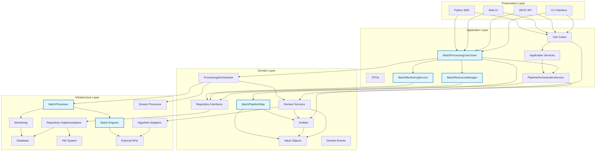
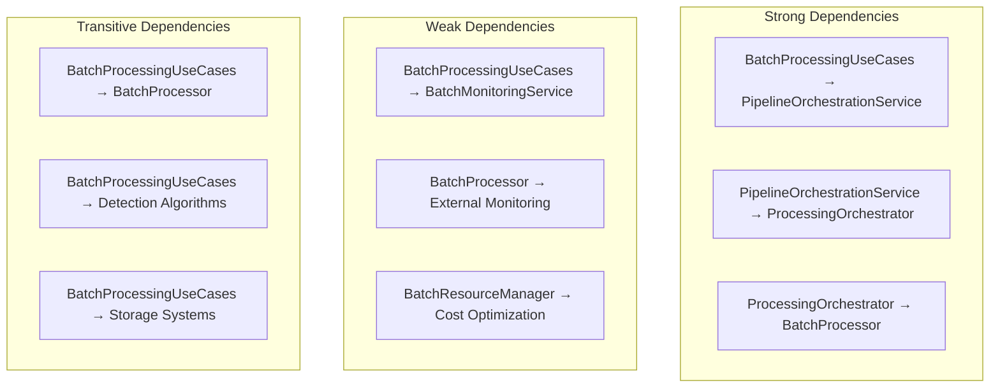

# A-002 Batch Processing Orchestration - Dependency Graph

## Overview

This document presents the updated dependency graph for the Pynomaly system, incorporating the A-002 batch processing orchestration components. The graph shows the relationships between existing components and the new batch processing use cases.

## Updated Dependency Graph



## Component Dependencies Detail

### New Components (A-002)

#### BatchProcessingUseCases
- **Dependencies**: 
  - `PipelineOrchestrationService` (orchestration integration)
  - `ProcessingOrchestrator` (domain coordination)
  - `BatchResourceManager` (resource management)
  - `BatchMonitoringService` (monitoring integration)
- **Dependents**: 
  - Presentation layer components (CLI, API, WEB, SDK)

#### BatchResourceManager
- **Dependencies**: 
  - Repository interfaces (for resource state persistence)
  - Domain entities (for resource allocation modeling)
- **Dependents**: 
  - `BatchProcessingUseCases` (resource allocation decisions)

#### BatchMonitoringService
- **Dependencies**: 
  - Repository interfaces (for metrics persistence)
  - Monitoring infrastructure (for metrics collection)
- **Dependents**: 
  - `BatchProcessingUseCases` (monitoring integration)

#### BatchPipelineStep
- **Dependencies**: 
  - Domain entities (Pipeline, PipelineStep)
  - Value objects (for batch-specific configurations)
- **Dependents**: 
  - `BatchProcessingUseCases` (pipeline step creation)

#### Enhanced BatchProcessor
- **Dependencies**: 
  - Batch engines (processing execution)
  - Monitoring infrastructure (metrics reporting)
  - External systems (distributed processing)
- **Dependents**: 
  - `ProcessingOrchestrator` (batch job execution)

### Existing Components (Modified)

#### PipelineOrchestrationService
- **New Dependencies**: 
  - Enhanced pipeline step support for batch operations
  - Integration with batch-specific scheduling
- **New Dependents**: 
  - `BatchProcessingUseCases` (pipeline creation and management)

#### ProcessingOrchestrator
- **New Dependencies**: 
  - Enhanced `BatchProcessor` integration
  - Support for batch-specific session management
- **New Dependents**: 
  - `BatchProcessingUseCases` (batch session coordination)

## Dependency Analysis

### Critical Path Dependencies


### Cross-Cutting Concerns

```mermaid
graph TB
    subgraph "Monitoring Flow"
        M1[BatchProcessor] --> M2[Monitoring Infrastructure]
        M2 --> M3[BatchMonitoringService]
        M3 --> M4[Client Notifications]
    end
    
    subgraph "Resource Management Flow"
        R1[BatchProcessingUseCases] --> R2[BatchResourceManager]
        R2 --> R3[Resource Allocation]
        R3 --> R4[BatchProcessor Configuration]
    end
    
    subgraph "Error Handling Flow"
        E1[BatchProcessor] --> E2[Error Detection]
        E2 --> E3[Recovery Service]
        E3 --> E4[Alert Service]
    end
```



## Dependency Injection Configuration

### Container Configuration for A-002

```python
# Application Layer
batch_processing_use_cases = providers.Factory(
    BatchProcessingUseCases,
    pipeline_orchestration_service=pipeline_orchestration_service,
    processing_orchestrator=processing_orchestrator,
    batch_resource_manager=batch_resource_manager,
    batch_monitoring_service=batch_monitoring_service
)

batch_resource_manager = providers.Factory(
    BatchResourceManager,
    resource_repository=resource_repository,
    monitoring_service=monitoring_service
)

batch_monitoring_service = providers.Factory(
    BatchMonitoringService,
    metrics_repository=metrics_repository,
    monitoring_infrastructure=monitoring_infrastructure
)

# Domain Layer
batch_pipeline_step = providers.Factory(
    BatchPipelineStep,
    pipeline_repository=pipeline_repository
)

# Infrastructure Layer
enhanced_batch_processor = providers.Factory(
    BatchProcessor,
    config=batch_config,
    monitoring_service=monitoring_service,
    engine_factory=batch_engine_factory
)
```

## Dependency Validation Rules

### Circular Dependency Prevention
- **Rule 1**: Application layer components cannot depend on infrastructure layer components directly
- **Rule 2**: Domain layer components cannot depend on application or infrastructure layers
- **Rule 3**: Infrastructure layer components cannot depend on application layer components

### Dependency Strength Analysis
- **Strong Dependencies**: Required for core functionality
- **Weak Dependencies**: Optional or configurable components
- **Transitive Dependencies**: Indirect dependencies through other components



## Impact Analysis

### Component Addition Impact
- **Low Impact**: New components with minimal integration requirements
- **Medium Impact**: Components requiring configuration changes
- **High Impact**: Components requiring architectural modifications

### Change Propagation Analysis
- **Upstream Changes**: Changes that affect dependent components
- **Downstream Changes**: Changes that affect dependency components
- **Isolated Changes**: Changes with minimal external impact

## Testing Strategy for Dependencies

### Unit Testing
- Mock all external dependencies
- Test each component in isolation
- Verify dependency injection configuration

### Integration Testing
- Test component interactions
- Verify data flow between layers
- Test error propagation

### System Testing
- End-to-end dependency validation
- Performance testing with full dependency graph
- Failure scenario testing

## Deployment Considerations

### Dependency Deployment Order
1. **Infrastructure Layer**: Database, monitoring, external systems
2. **Domain Layer**: Core entities and services
3. **Application Layer**: Use cases and application services
4. **Presentation Layer**: APIs and user interfaces

### Configuration Management
- Environment-specific dependency configuration
- Feature flags for optional dependencies
- Graceful degradation for unavailable dependencies

## Future Considerations

### Potential New Dependencies
- **Machine Learning Pipeline Integration**: For advanced anomaly detection
- **Workflow Orchestration**: For complex multi-step processes
- **Event Sourcing**: For audit and replay capabilities

### Dependency Evolution
- **Microservices Migration**: Breaking down monolithic dependencies
- **API Gateway Integration**: For external service coordination
- **Cloud-Native Dependencies**: For scalable infrastructure

---

*Document Version: 1.0*
*Last Updated: January 8, 2025*
*Status: Draft - Part of A-002 Design Documentation*
