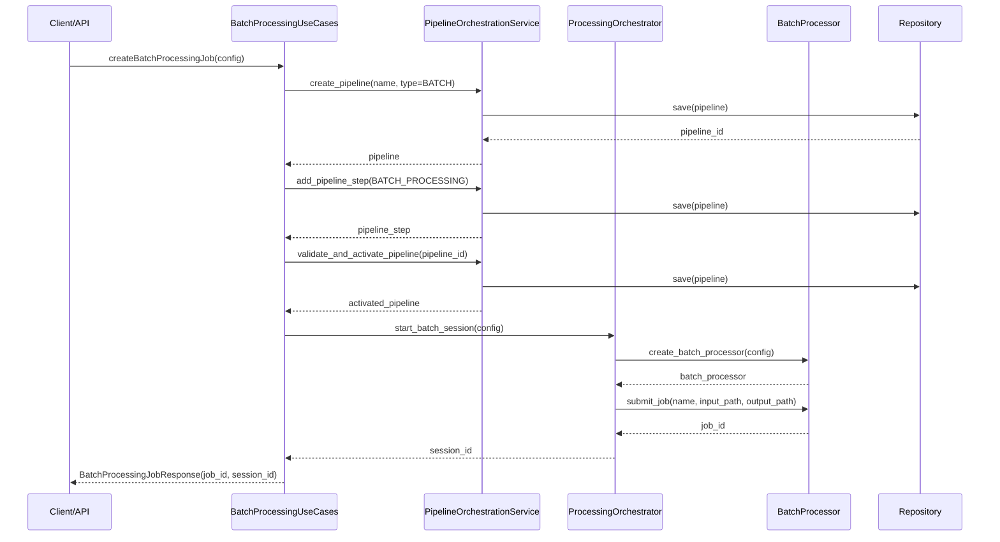
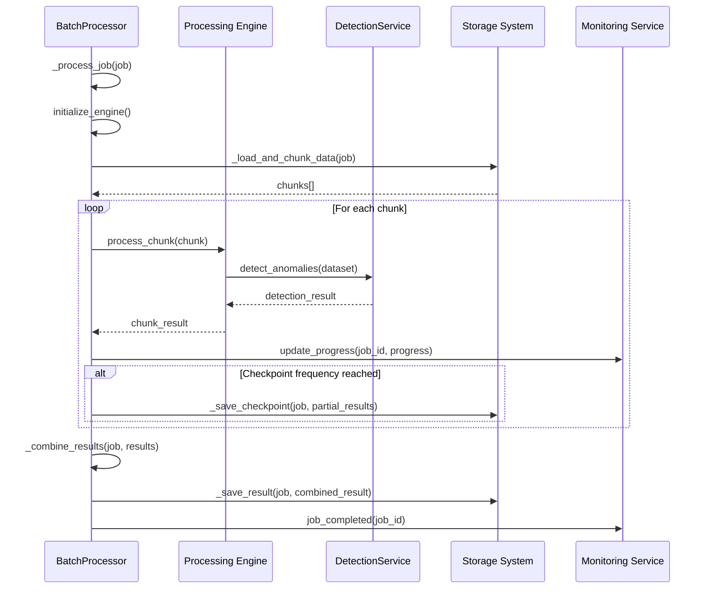
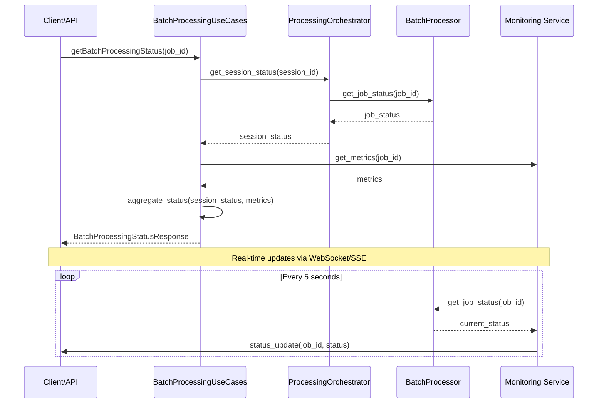
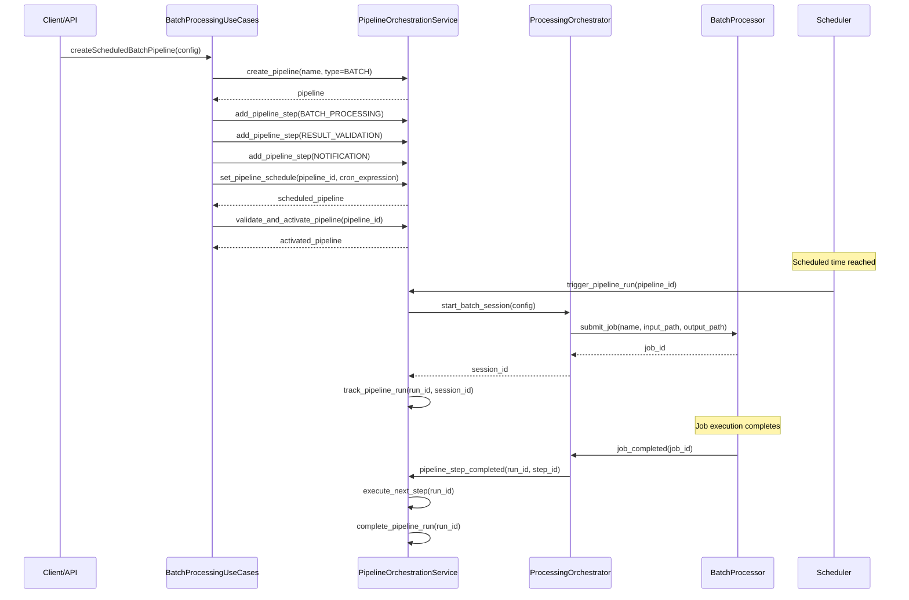
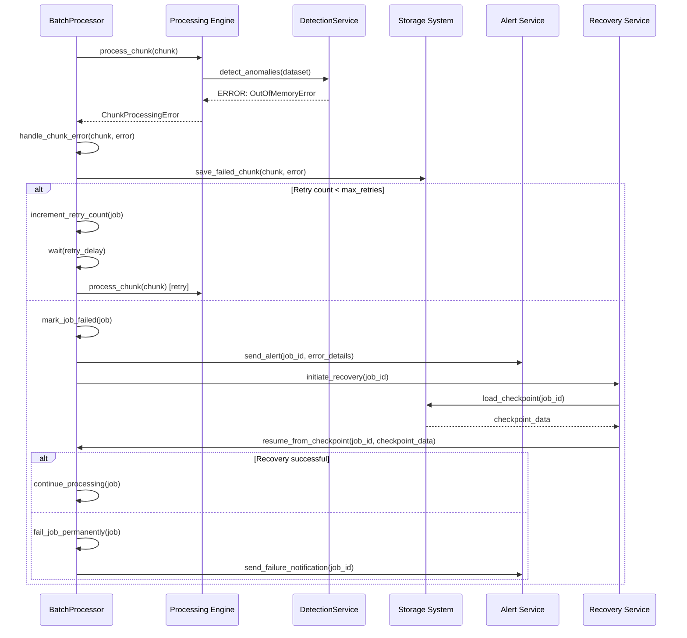
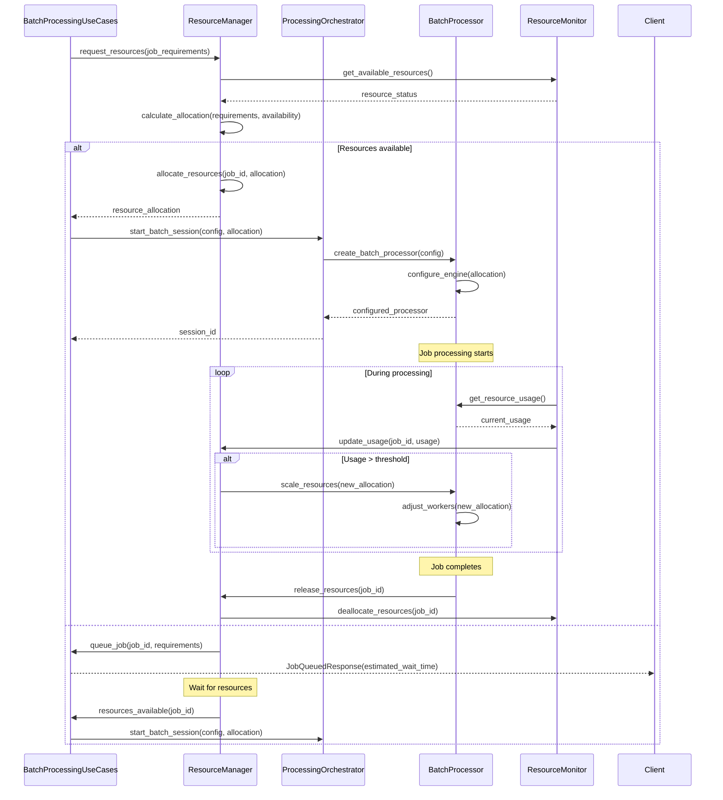

# A-002 Batch Processing Orchestration - Sequence Diagrams

## Overview

This document contains sequence diagrams showing the interactions between `PipelineOrchestrationService`, `BatchProcessingUseCases`, and `BatchProcessor` for the A-002 batch processing orchestration feature.

## Sequence Diagram 1: Batch Processing Job Submission

## Sequence Diagram 2: Batch Processing Execution

## Sequence Diagram 3: Batch Processing Monitoring

## Sequence Diagram 4: Batch Processing Pipeline Integration

## Sequence Diagram 5: Batch Processing Error Handling

## Sequence Diagram 6: Batch Processing Resource Management

## Component Interactions Summary

### Key Interaction Patterns

1. **Request Flow**: Client → BatchProcessingUseCases → PipelineOrchestrationService → ProcessingOrchestrator → BatchProcessor
2. **Monitoring Flow**: BatchProcessor → Monitor → Client (via WebSocket/SSE)
3. **Error Handling**: BatchProcessor → Recovery Service → Alert Service
4. **Resource Management**: ResourceManager ↔ BatchProcessor ↔ ResourceMonitor

### Data Flow

1. **Input Data**: Client/Storage → BatchProcessor → ProcessingEngine
2. **Processing Results**: ProcessingEngine → DetectionService → BatchProcessor
3. **Output Data**: BatchProcessor → Storage → Client
4. **Monitoring Data**: BatchProcessor → Monitor → Client

### Control Flow

1. **Job Lifecycle**: Created → Queued → Running → Completed/Failed
2. **Resource Lifecycle**: Requested → Allocated → Used → Released
3. **Error Handling**: Detected → Logged → Retried → Recovered/Failed

## Architecture Benefits

### Clean Separation of Concerns
- **Use Cases**: Handle business logic and orchestration
- **Services**: Manage specific domain operations
- **Infrastructure**: Handle technical implementation details

### Scalability
- **Horizontal Scaling**: Multiple BatchProcessor instances
- **Vertical Scaling**: Dynamic resource allocation
- **Load Balancing**: Intelligent job distribution

### Fault Tolerance
- **Checkpointing**: Save intermediate results
- **Retry Logic**: Automatic error recovery
- **Graceful Degradation**: Partial result preservation

### Monitoring and Observability
- **Real-time Status**: Live job progress updates
- **Metrics Collection**: Performance and resource usage
- **Alerting**: Proactive issue notification

---

*Document Version: 1.0*
*Last Updated: January 8, 2025*
*Status: Draft - Part of A-002 Design Documentation*
