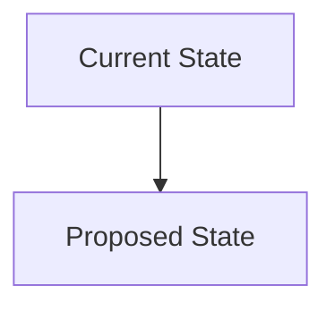
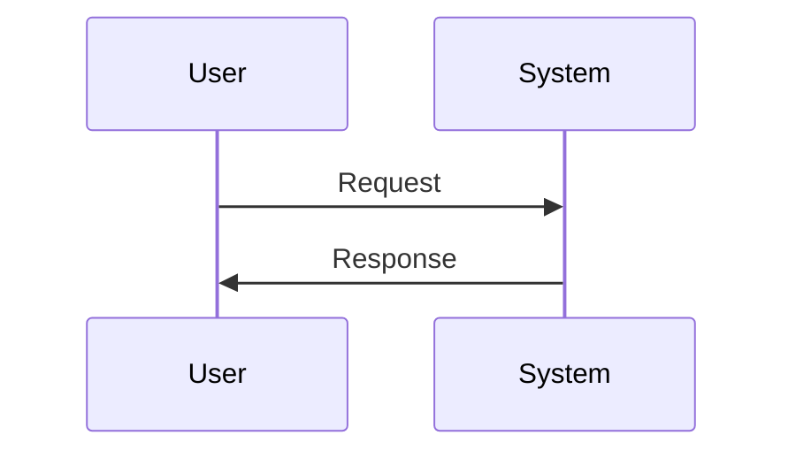

# ADR-003: Example Decision

🍞 **Breadcrumb:** 🏠 [Home](../../../index.md)  [Developer Guides](../../README.md)  [Architecture](../README.md)  [ADR](README.md)  Example Decision

## Status

PROPOSED

## Context

### Problem Statement
This ADR documents the decision to implement XYZ feature...

### Goals
- Establish a clear...

### Constraints
- Limited budget...

### Assumptions
- Existing infrastructure...

## Decision

### Chosen Solution
Implement XYZ feature using ABC technology...

### Rationale
Chosen for its ability to...

## Architecture

### System Overview

### Component Interactions

## Options Considered

### Pros and Cons Matrix

| Option | Pros | Cons | Score |
|--------|------|------|-------|
| Option A | Benefits | Drawbacks | 7/10 |
| **Option B** | Advantages | Disadvantages | **9/10** |

### Rejected Alternatives
Other options were rejected due to...

## Implementation

### Technical Approach

### Migration Strategy

### Testing Strategy

## Consequences

### Positive
- Improved performance...

### Negative
- Increased complexity...

### Neutral
- Maintains...

## Compliance

### Security Impact

### Performance Impact

### Monitoring Requirements

## Decision Log

| Date | Author | Action | Rationale |
|------|--------|--------|-----------|
| 2023-10-01 | Contributor | PROPOSED | Initial proposal

## References

---

## 🔗 Related Documentation

---

**Authors:** Contributor
**Last Updated:** 2023-10-01
**Next Review:** 2024-01-01

