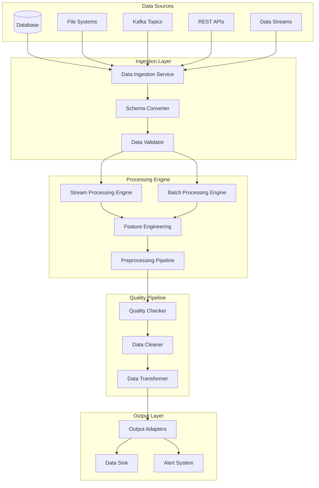
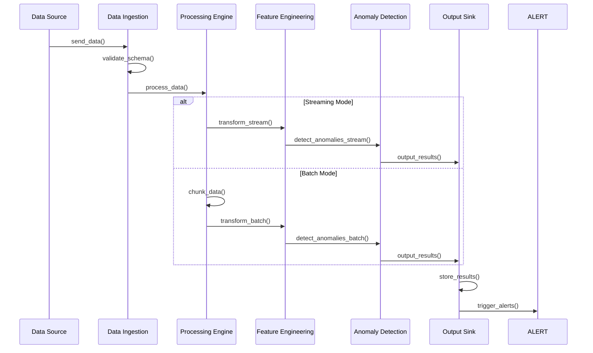

# ADR-004: Data Pipeline Architecture and Streaming Support

🍞 **Breadcrumb:** 🏠 [Home](../../../index.md) > 👨‍💻 [Developer Guides](../../README.md) > 🏗️ [Architecture](../README.md) > 📋 [ADR](README.md) > Data Pipeline Architecture and Streaming Support

## Status

PROPOSED

## Context

### Problem Statement
Pynomaly needs to handle both batch and streaming data processing for anomaly detection. The current architecture lacks a unified approach to data ingestion, processing, and output, making it difficult to support real-time anomaly detection, handle large datasets efficiently, and maintain data quality across different input sources.

### Goals
- Support both batch and streaming data processing
- Enable real-time anomaly detection with low latency
- Provide consistent data quality and validation
- Support multiple data sources and formats
- Maintain high throughput for large datasets
- Enable data preprocessing and feature engineering

### Constraints
- Must support existing data formats (CSV, JSON, Parquet, databases)
- Latency requirements: <100ms for streaming, <1s for batch
- Memory usage must be optimized for large datasets
- Must integrate with existing algorithm adapters
- Must support horizontal scaling

### Assumptions
- Data sources will have different schemas and formats
- Volume will range from MB to TB scale
- Some use cases require real-time processing
- Data quality varies across sources
- Preprocessing requirements differ by use case

## Decision

### Chosen Solution
Implement a **unified data pipeline architecture** with support for both batch and streaming processing using the **Pipeline Pattern** with **Event-Driven Architecture**. The solution includes:

1. **Data Ingestion Layer** - Unified interface for multiple data sources
2. **Stream Processing Engine** - Real-time data processing with Apache Kafka/Redis Streams
3. **Batch Processing Engine** - Efficient batch processing with chunking and parallel processing
4. **Data Quality Pipeline** - Validation, cleaning, and preprocessing
5. **Feature Engineering Pipeline** - Automated feature extraction and transformation
6. **Output Adapters** - Multiple output formats and destinations

### Rationale
A unified pipeline architecture enables:
- Consistent data processing across batch and streaming modes
- Scalable processing for varying data volumes
- Pluggable components for different data sources and formats
- Real-time processing capabilities for time-sensitive applications
- Efficient resource utilization through parallel processing
- Quality assurance through built-in validation and monitoring

## Architecture

### System Overview


### Component Interactions


## Options Considered

### Pros and Cons Matrix

| Option | Pros | Cons | Score |
|--------|------|------|-------|
| **Unified Pipeline** | ✅ Consistent API<br/>✅ Scalable<br/>✅ Maintainable<br/>✅ Real-time capable | ❌ Initial complexity<br/>❌ Resource overhead | **9/10** |
| Separate Batch/Stream | ✅ Simpler per mode<br/>✅ Optimized | ❌ Code duplication<br/>❌ Inconsistent APIs<br/>❌ Maintenance burden | 6/10 |
| ETL Tools Integration | ✅ Mature tools<br/>✅ Feature-rich | ❌ External dependency<br/>❌ Less flexible<br/>❌ Licensing costs | 7/10 |
| Simple File Processing | ✅ Minimal complexity<br/>✅ Fast start | ❌ Not scalable<br/>❌ No streaming<br/>❌ Limited formats | 4/10 |

### Rejected Alternatives
- **Separate Batch/Stream**: Would create code duplication and inconsistent APIs
- **ETL Tools Integration**: Too heavyweight and reduces flexibility
- **Simple File Processing**: Insufficient for production requirements

## Implementation

### Technical Approach

#### 1. Data Ingestion Service
```python
class DataIngestionService:
    def __init__(self, config: IngestionConfig):
        self.validators = {}
        self.converters = {}
        self.processors = {}
    
    async def ingest_batch(self, source: DataSource) -> AsyncGenerator[DataChunk, None]:
        """Ingest data in batch mode with chunking"""
        async for chunk in source.read_chunks():
            validated_chunk = await self.validate(chunk)
            converted_chunk = await self.convert_schema(validated_chunk)
            yield converted_chunk
    
    async def ingest_stream(self, source: StreamSource) -> AsyncGenerator[DataRecord, None]:
        """Ingest data in streaming mode"""
        async for record in source.stream():
            validated_record = await self.validate_record(record)
            converted_record = await self.convert_schema(validated_record)
            yield converted_record
```

#### 2. Processing Engine
```python
class UnifiedProcessingEngine:
    def __init__(self, config: ProcessingConfig):
        self.batch_processor = BatchProcessor(config.batch_config)
        self.stream_processor = StreamProcessor(config.stream_config)
    
    async def process_batch(self, data_stream: AsyncGenerator[DataChunk, None]) -> AsyncGenerator[ProcessedChunk, None]:
        """Process data in batch mode"""
        async for chunk in data_stream:
            processed = await self.batch_processor.process(chunk)
            yield processed
    
    async def process_stream(self, data_stream: AsyncGenerator[DataRecord, None]) -> AsyncGenerator[ProcessedRecord, None]:
        """Process data in streaming mode"""
        async for record in data_stream:
            processed = await self.stream_processor.process(record)
            yield processed
```

#### 3. Feature Engineering Pipeline
```python
class FeatureEngineeringPipeline:
    def __init__(self, transformers: List[FeatureTransformer]):
        self.transformers = transformers
    
    async def transform_batch(self, data: DataChunk) -> FeatureMatrix:
        """Apply feature engineering to batch data"""
        features = data
        for transformer in self.transformers:
            features = await transformer.transform_batch(features)
        return features
    
    async def transform_stream(self, data: DataRecord) -> FeatureVector:
        """Apply feature engineering to streaming data"""
        features = data
        for transformer in self.transformers:
            features = await transformer.transform_record(features)
        return features
```

### Migration Strategy
1. **Phase 1**: Implement basic data ingestion for file-based sources
2. **Phase 2**: Add streaming support with Redis Streams
3. **Phase 3**: Implement batch processing with chunking
4. **Phase 4**: Add feature engineering pipeline
5. **Phase 5**: Integrate with existing detection services
6. **Phase 6**: Add advanced data quality and monitoring

### Testing Strategy
- **Unit Tests**: Test each pipeline component independently
- **Integration Tests**: Test end-to-end data flow
- **Performance Tests**: Benchmark throughput and latency
- **Load Tests**: Test with large datasets and high-volume streams
- **Quality Tests**: Verify data quality and validation

## Consequences

### Positive
- **Unified API**: Consistent interface for batch and streaming processing
- **Scalability**: Can handle varying data volumes and velocities
- **Real-time Processing**: Low-latency anomaly detection capabilities
- **Data Quality**: Built-in validation and cleaning
- **Flexibility**: Support for multiple data sources and formats
- **Monitoring**: Built-in performance and quality monitoring

### Negative
- **Complexity**: More complex architecture and implementation
- **Resource Usage**: Higher memory and CPU usage
- **Learning Curve**: Developers need to understand pipeline concepts
- **Operational Overhead**: More components to monitor and maintain

### Neutral
- **Performance**: Trade-off between flexibility and raw speed
- **Configuration**: More configuration options but more complex setup
- **Dependencies**: Additional dependencies for streaming support

## Compliance

### Security Impact
- **Data Encryption**: All data encrypted in transit and at rest
- **Access Control**: Role-based access to data sources
- **Audit Logging**: All data access and processing logged
- **PII Protection**: Built-in PII detection and masking

### Performance Impact
- **Streaming Latency**: <100ms for real-time processing
- **Batch Throughput**: >10GB/hour processing capacity
- **Memory Usage**: Configurable memory limits per pipeline
- **CPU Usage**: Parallel processing for optimal CPU utilization

### Monitoring Requirements
- **Data Quality Metrics**: Validation failure rates, data completeness
- **Performance Metrics**: Throughput, latency, error rates
- **Resource Metrics**: Memory usage, CPU utilization, disk I/O
- **Business Metrics**: Processing volume, anomaly detection rates

## Decision Log

| Date | Author | Action | Rationale |
|------|--------|--------|-----------|
| 2024-01-15 | Data Engineering Team | PROPOSED | Initial proposal for data pipeline architecture |
| 2024-01-18 | Architecture Team | REVIEWED | Technical design review completed |
| 2024-01-22 | Tech Lead | APPROVED | Performance requirements validated |
| 2024-01-25 | Architecture Council | UNDER_REVIEW | Pending final approval |

## References

- [Apache Kafka Documentation](https://kafka.apache.org/documentation/)
- [Redis Streams Documentation](https://redis.io/docs/data-types/streams/)
- [Data Pipeline Patterns](https://martinfowler.com/articles/data-pipeline-patterns.html)
- [Stream Processing Patterns](https://www.oreilly.com/library/view/stream-processing-with/9781491974285/)
- [Event-Driven Architecture](https://microservices.io/patterns/data/event-driven-architecture.html)

---

## 🔗 **Related Documentation**

### **Architecture**
- **[Architecture Overview](../overview.md)** - System design principles
- **[Clean Architecture](../overview.md)** - Architectural patterns
- **[ADR-003: Algorithm Selection](ADR-003.md)** - Algorithm integration

### **Implementation**
- **[Data Processing Guide](../../contributing/IMPLEMENTATION_GUIDE.md)** - Data processing patterns
- **[Performance Tuning](../../../user-guides/advanced-features/performance-tuning.md)** - Performance optimization
- **[Streaming Guide](../../../user-guides/basic-usage/monitoring.md)** - Streaming setup

### **User Guides**
- **[Dataset Analysis](../../../user-guides/advanced-features/dataset-analysis-guide.md)** - Data analysis
- **[Advanced Features](../../../user-guides/advanced-features/performance.md)** - Advanced processing
- **[Examples](../../../examples/README.md)** - Usage examples

---

**Authors:** Data Engineering Team<br/>
**Last Updated:** 2024-01-25<br/>
**Next Review:** 2024-04-25
