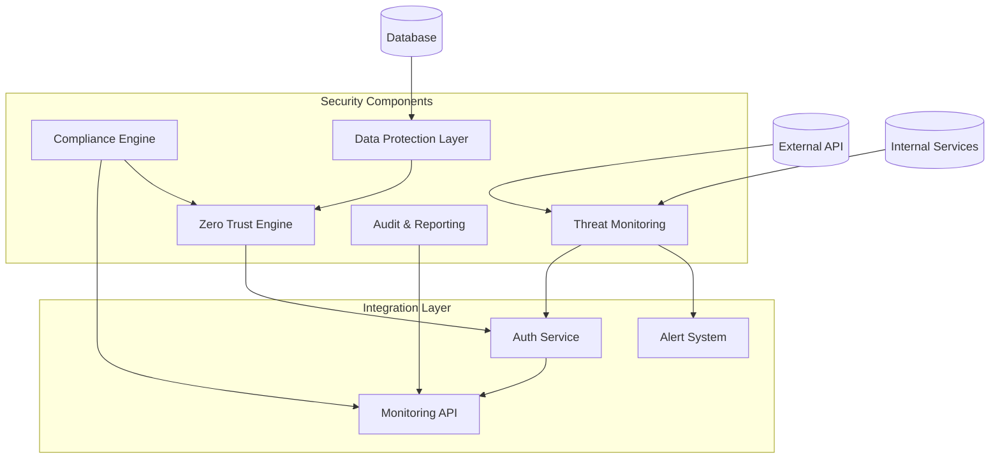
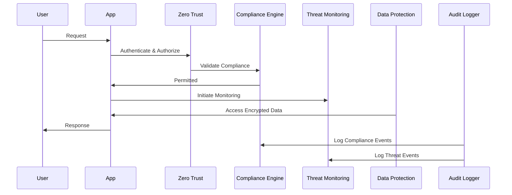

# ADR-005: Security Architecture and Compliance Framework

🍞 **Breadcrumb:** 🏠 [Home](../../../index.md) > 👨‍💻 [Developer Guides](../../README.md) > 🏗️ [Architecture](../README.md) > 📋 [ADR](README.md) > Security Architecture and Compliance Framework

## Status

PROPOSED

## Context

### Problem Statement
Ensuring robust security and compliance within Pynomaly is crucial due to the sensitive nature of anomaly detection in domains like finance, healthcare, and critical infrastructure. Currently, security practices are inconsistently applied, and compliance requirements are manually managed, leading to potential vulnerabilities and inefficiencies.

### Goals
- Implement a unified security architecture across all layers
- Automate compliance checks for various regulatory standards
- Ensure data protection and privacy
- Facilitate audits and reporting
- Enable real-time threat detection and response

### Constraints
- Must support existing authentication and authorization mechanisms
- Compliance with GDPR, CCPA, HIPAA, and other relevant standards
- Minimal performance impact on anomaly detection and processing
- Maintainability and scalability are essential
- Must integrate with existing infrastructure

### Assumptions
- Security threats evolve over time
- Compliance standards have varying requirements
- Existing infrastructure includes basic security policies
- Some data is sensitive and regulated
- Collaboration with external security experts may be required

## Decision

### Chosen Solution
Adopt a comprehensive **Security Architecture and Compliance Framework** incorporating:

1. **Zero Trust Architecture** - Authenticate and authorize each action
2. **Automated Compliance Engine** - Regular audits and checks against standards
3. **Data Protection Layer** - Encryption, access controls, and anonymization
4. **Threat Monitoring System** - Real-time threat detection using anomaly patterns
5. **Audit and Reporting Tools** - Centralized logging and compliance documentation

### Rationale
The proposed framework allows for:
- Centralized control and consistency across security practices
- Proactive threat detection and mitigation
- Simplified compliance management and reporting
- Flexibility to adapt to new regulatory requirements
- Enhanced user privacy and data protection

## Architecture

### System Overview


### Component Interactions


## Options Considered

### Pros and Cons Matrix

| Option | Pros | Cons | Score |
|--------|------|------|-------|
| **Unified Framework** | ✅ Consistent Security<br/>✅ Automated Compliance<br/>✅ Scalability | ❌ Initial Complexity<br/>❌ Requires Expertise | **9/10** |
| Separate Modules | ✅ Simple Start<br/>✅ Incremental Implementation | ❌ Inconsistent Policies<br/>❌ Harder to Manage<br/>❌ Redundant Effort | 6/10 |
| Outsourced Services | ✅ Dedicated Expertise<br/>✅ Fast Setup | ❌ High Cost<br/>❌ Limited Control<br/>❌ Dependency | 7/10 |

### Rejected Alternatives
- **Separate Modules**: Too fragmented leading to inconsistent security practices
- **Outsourced Services**: High cost and reduced control over security posture

## Implementation

### Technical Approach

#### 1. Zero Trust Architecture
```python
class ZeroTrust:
    def authenticate(self, action: str, user: User) -> bool:
        # Implement zero trust policy checks
        pass
```

#### 2. Compliance Engine
```python
class ComplianceEngine:
    def audit(self) -> ComplianceReport:
        # Automated compliance checks against standards
        pass
```

#### 3. Data Protection Layer
```python
class DataProtectionLayer:
    def encrypt_data(self, data: Data) -> EncryptedData:
        # Implement encryption
        pass
```

#### 4. Threat Monitoring System
```python
class ThreatMonitoringSystem:
    def detect_threats(self) -> ThreatReport:
        # Real-time anomaly-based threat detection
        pass
```

### Migration Strategy
1. **Phase 1**: Develop core security components (ZT, DP)
2. **Phase 2**: Implement automated compliance audits
3. **Phase 3**: Integrate threat monitoring and response
4. **Phase 4**: Enable centralized audit logging
5. **Phase 5**: Continuous improvement and adaptation

### Testing Strategy
- **Security Tests**: Penetration testing, vulnerability scanning
- **Compliance Tests**: Regular audit simulations
- **Performance Tests**: Evaluate impact on processing speed
- **Integration Tests**: Validate interaction between components
- **User Acceptance Tests**: Ensure usability and user acceptance

## Consequences

### Positive
- **Enhanced Security**: Reduced risks and increased control
- **Compliance Readiness**: Continuous compliance monitoring
- **Efficient Audits**: Simplified reporting and documentation
- **Flexibility**: Adaptable to new threats and regulations

### Negative
- **Complexity**: Increased architectural complexity
- **Initial Investment**: High initial implementation costs
- **Resource Demand**: Requires ongoing expertise and monitoring

### Neutral
- **Performance Impact**: Minor impact on processing speeds
- **Operational Overhead**: More components to manage

## Compliance

### Security Impact
- **Data Encryption**: Full encryption of sensitive data
- **Access Control**: Granular permissions management
- **Threat Response**: Automated detection and alerts
- **Audit Trail**: Comprehensive logging and reporting

### Performance Impact
- **Response Time**: Slight increase in latency (<50ms)
- **CPU & Memory**: Additional resource utilization for security

### Monitoring Requirements
- **Security Metrics**: Monitor authentication/authorization attempts
- **Threat Metrics**: Real-time alerts on detected threats
- **Compliance Metrics**: Track compliance status and audits

## Decision Log

| Date | Author | Action | Rationale |
|------|--------|--------|-----------|
| 2024-02-01 | Security Council | PROPOSED | Initial security framework proposal |
| 2024-02-10 | Tech Lead | REVIEWED | Security design validation completed |
| 2024-02-18 | Architecture Council | UNDER_REVIEW | Pending final approval |

## References

- [Zero Trust Architecture](https://csrc.nist.gov/publications/detail/sp/800-207/final)
- [GDPR Compliance Guide](https://gdpr.eu/)
- [Cybersecurity Framework](https://www.nist.gov/cyberframework)
- [Anomaly Detection in Security](https://www.oreilly.com/library/view/)

---

## 🔗 **Related Documentation**

### **Architecture**
- **[Architecture Overview](../overview.md)** - System design principles
- **[ADR-003: Algorithm Selection](ADR-003.md)** - Security considerations

### **Implementation**
- **[Security Best Practices](../../../docs/security/security-best-practices.md)** - Security guidelines
- **[Authentication Guide](../../../user-guides/basic-usage/security.md)** - Authentication setup

### **User Guides**
- **[Security Setup](../../../user-guides/basic-usage/security.md)** - User security configuration
- **[Advanced Features](../../../user-guides/advanced-features/security.md)** - Advanced security features

---

**Authors:** Security Council<br/>
**Last Updated:** 2024-02-18<br/>
**Next Review:** 2024-05-18

