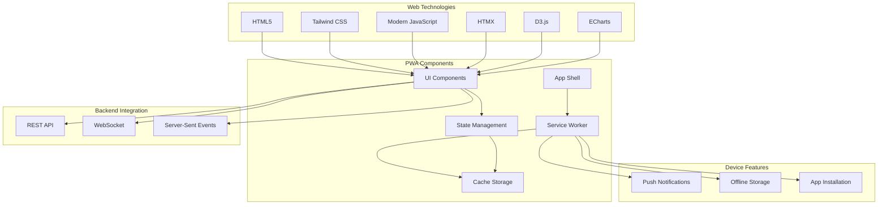
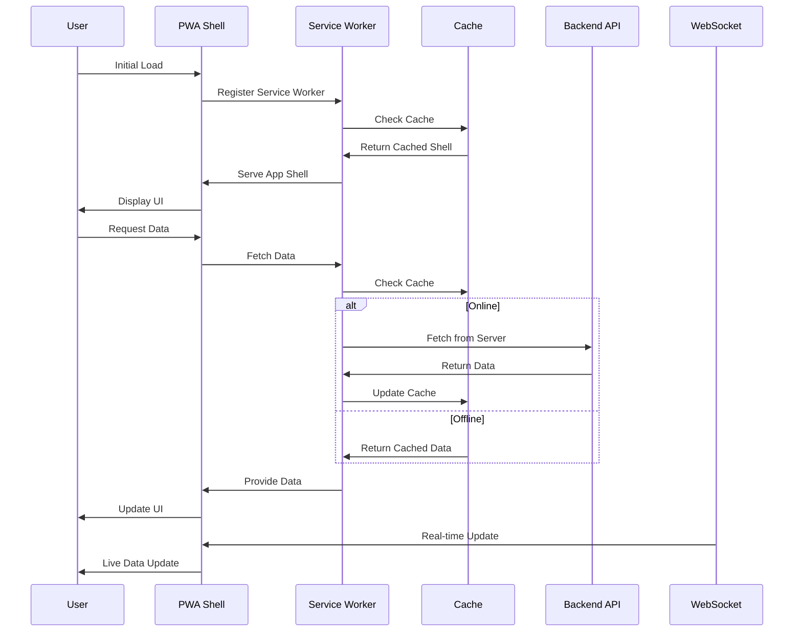

# ADR-006: Progressive Web App (PWA) Architecture

🍞 **Breadcrumb:** 🏠 [Home](../../../index.md) > 👨‍💻 [Developer Guides](../../README.md) > 🏗️ [Architecture](../README.md) > 📋 [ADR](README.md) > Progressive Web App (PWA) Architecture

## Status

PROPOSED

## Context

### Problem Statement
Pynomaly needs a modern, responsive web interface that works across desktop and mobile devices while providing offline capabilities and native app-like experience. Current web interfaces lack consistency, mobile optimization, and offline functionality, limiting user accessibility and productivity.

### Goals
- Provide a responsive, mobile-first web interface
- Enable offline functionality for core features
- Deliver native app-like experience with PWA features
- Maintain high performance and accessibility standards
- Support real-time data visualization and interaction
- Enable push notifications for anomaly alerts

### Constraints
- Must work across modern browsers (Chrome, Firefox, Safari, Edge)
- Offline functionality limited by device storage
- Must integrate with existing REST API
- Performance requirements: <3s initial load, <1s navigation
- Must comply with WCAG 2.1 AA accessibility standards

### Assumptions
- Users access the application from various devices
- Network connectivity may be intermittent
- Real-time updates are important for anomaly monitoring
- Users expect mobile-responsive interfaces
- Push notifications are valuable for alerts

## Decision

### Chosen Solution
Implement a **Progressive Web App (PWA)** using modern web technologies with **App Shell Architecture** and **Service Worker** pattern. The solution includes:

1. **App Shell Architecture** - Core application shell cached for instant loading
2. **Service Worker** - Background processing and caching strategy
3. **Responsive Design** - Mobile-first, responsive layout with Tailwind CSS
4. **Offline Capabilities** - Core features work without internet connection
5. **Push Notifications** - Real-time anomaly alerts and updates
6. **Real-time Updates** - WebSocket integration for live data

### Rationale
PWA architecture provides:
- Cross-platform compatibility without native app development
- Offline functionality through intelligent caching
- Enhanced user experience with app-like behaviors
- Easy distribution through web browsers
- Reduced development and maintenance costs
- Automatic updates and version management

## Architecture

### System Overview


### Component Interactions


## Options Considered

### Pros and Cons Matrix

| Option | Pros | Cons | Score |
|--------|------|------|-------|
| **PWA with App Shell** | ✅ Offline capable<br/>✅ Fast loading<br/>✅ Cross-platform<br/>✅ Push notifications | ❌ Browser limitations<br/>❌ Storage constraints | **9/10** |
| Native Mobile Apps | ✅ Full native features<br/>✅ Better performance | ❌ Multiple codebases<br/>❌ App store approval<br/>❌ Higher development cost | 7/10 |
| Traditional Web App | ✅ Simple development<br/>✅ Easy deployment | ❌ No offline support<br/>❌ Poor mobile experience<br/>❌ No push notifications | 5/10 |
| Electron Desktop App | ✅ Native-like experience<br/>✅ Full system access | ❌ Large bundle size<br/>❌ Platform-specific builds<br/>❌ No mobile support | 6/10 |

### Rejected Alternatives
- **Native Mobile Apps**: Too expensive to maintain multiple codebases
- **Traditional Web App**: Insufficient for modern user expectations
- **Electron Desktop App**: Limited to desktop platforms

## Implementation

### Technical Approach

#### 1. App Shell Architecture
```javascript
// Service Worker registration
if ('serviceWorker' in navigator) {
    window.addEventListener('load', () => {
        navigator.serviceWorker.register('/sw.js')
            .then(registration => console.log('SW registered'))
            .catch(error => console.log('SW registration failed'));
    });
}
```

#### 2. Service Worker Implementation
```javascript
// sw.js - Service Worker
const CACHE_NAME = 'pynomaly-v1';
const urlsToCache = [
    '/',
    '/static/css/styles.css',
    '/static/js/app.js',
    '/static/js/offline.js'
];

self.addEventListener('install', event => {
    event.waitUntil(
        caches.open(CACHE_NAME)
            .then(cache => cache.addAll(urlsToCache))
    );
});

self.addEventListener('fetch', event => {
    event.respondWith(
        caches.match(event.request)
            .then(response => response || fetch(event.request))
    );
});
```

#### 3. Responsive UI Components
```html
<!-- HTMX-powered component -->
<div class="anomaly-dashboard" 
     hx-get="/api/anomalies" 
     hx-trigger="load, every 30s"
     hx-target="#anomaly-list">
    <div id="anomaly-list" class="grid grid-cols-1 md:grid-cols-2 lg:grid-cols-3 gap-4">
        <!-- Anomaly cards rendered here -->
    </div>
</div>
```

#### 4. Offline Data Management
```javascript
class OfflineDataManager {
    constructor() {
        this.dbName = 'PynormalyOfflineDB';
        this.version = 1;
    }
    
    async saveData(storeName, data) {
        const db = await this.openDB();
        const transaction = db.transaction([storeName], 'readwrite');
        const store = transaction.objectStore(storeName);
        return store.put(data);
    }
    
    async getData(storeName, key) {
        const db = await this.openDB();
        const transaction = db.transaction([storeName], 'readonly');
        const store = transaction.objectStore(storeName);
        return store.get(key);
    }
}
```

#### 5. Real-time Updates
```javascript
class RealTimeUpdater {
    constructor() {
        this.websocket = null;
        this.reconnectAttempts = 0;
        this.maxReconnectAttempts = 5;
    }
    
    connect() {
        this.websocket = new WebSocket('ws://localhost:8000/ws');
        
        this.websocket.onmessage = (event) => {
            const data = JSON.parse(event.data);
            this.handleUpdate(data);
        };
        
        this.websocket.onclose = () => {
            this.reconnect();
        };
    }
    
    handleUpdate(data) {
        // Update UI with real-time data
        if (data.type === 'anomaly_detected') {
            this.displayAnomalyAlert(data);
        }
    }
}
```

### Migration Strategy
1. **Phase 1**: Implement basic PWA shell and service worker
2. **Phase 2**: Add offline capabilities and local storage
3. **Phase 3**: Integrate real-time updates and WebSocket
4. **Phase 4**: Implement push notifications
5. **Phase 5**: Add advanced visualizations and interactions
6. **Phase 6**: Performance optimization and testing

### Testing Strategy
- **Unit Tests**: Test JavaScript components and utilities
- **Integration Tests**: Test PWA features and API integration
- **Performance Tests**: Measure load times and runtime performance
- **Accessibility Tests**: WCAG 2.1 compliance verification
- **Cross-Browser Tests**: Compatibility across target browsers
- **Offline Tests**: Verify offline functionality works correctly

## Consequences

### Positive
- **Cross-Platform**: Single codebase works across all devices
- **Offline Capability**: Core features work without internet
- **Performance**: Fast loading through aggressive caching
- **User Experience**: Native app-like experience
- **Maintenance**: Easier to maintain than multiple native apps
- **Distribution**: No app store approval required

### Negative
- **Browser Limitations**: Some features limited by browser capabilities
- **Storage Constraints**: Limited offline storage capacity
- **Development Complexity**: Requires understanding of PWA concepts
- **iOS Limitations**: Some PWA features limited on iOS Safari

### Neutral
- **Caching Strategy**: Requires careful cache management
- **Update Mechanism**: Automatic updates vs. user control
- **Performance Trade-offs**: Flexibility vs. native performance

## Compliance

### Security Impact
- **Content Security Policy**: Strict CSP headers implemented
- **HTTPS Required**: PWA requires secure connection
- **Data Encryption**: Local storage encrypted where possible
- **Origin Isolation**: Service worker follows same-origin policy

### Performance Impact
- **Initial Load**: <3s for first load, <1s for cached loads
- **Runtime Performance**: Smooth 60fps animations
- **Memory Usage**: Optimized for mobile devices
- **Battery Usage**: Efficient background processing

### Monitoring Requirements
- **Performance Metrics**: Core Web Vitals monitoring
- **Error Tracking**: Service worker and runtime errors
- **Usage Analytics**: Feature usage and user behavior
- **Offline Usage**: Track offline feature utilization

## Decision Log

| Date | Author | Action | Rationale |
|------|--------|--------|-----------|
| 2024-01-20 | Frontend Team | PROPOSED | Initial PWA architecture proposal |
| 2024-01-23 | UX Team | REVIEWED | User experience design validated |
| 2024-01-26 | Tech Lead | APPROVED | Technical feasibility confirmed |
| 2024-01-30 | Architecture Council | UNDER_REVIEW | Pending final approval |

## References

- [Progressive Web Apps](https://web.dev/progressive-web-apps/)
- [Service Worker API](https://developer.mozilla.org/en-US/docs/Web/API/Service_Worker_API)
- [App Shell Architecture](https://web.dev/app-shell/)
- [HTMX Documentation](https://htmx.org/)
- [Tailwind CSS](https://tailwindcss.com/)
- [D3.js Documentation](https://d3js.org/)
- [Apache ECharts](https://echarts.apache.org/)

---

## 🔗 **Related Documentation**

### **Architecture**
- **[Architecture Overview](../overview.md)** - System design principles
- **[PWA Architecture](../pwa-architecture.md)** - Detailed PWA implementation
- **[ADR-004: Data Pipeline](ADR-004.md)** - Data integration patterns

### **Implementation**
- **[Progressive Web App Guide](../../../user-guides/progressive-web-app.md)** - PWA setup and usage
- **[Design System](../../../design-system/README.md)** - UI component guidelines
- **[Implementation Guide](../../contributing/IMPLEMENTATION_GUIDE.md)** - Development standards

### **User Guides**
- **[Web Interface Guide](../../../user-guides/progressive-web-app.md)** - Web app usage
- **[Mobile Usage](../../../user-guides/progressive-web-app.md)** - Mobile-specific features
- **[Offline Features](../../../user-guides/progressive-web-app.md)** - Offline functionality

---

**Authors:** Frontend Team<br/>
**Last Updated:** 2024-01-30<br/>
**Next Review:** 2024-04-30
