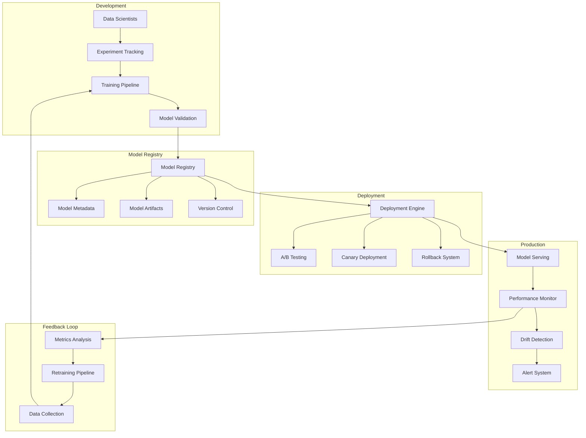
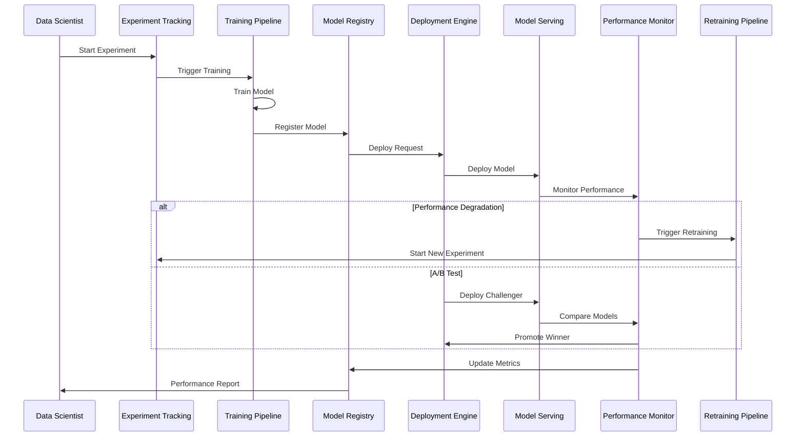

# ADR-007: Model Lifecycle Management and MLOps Integration

🍞 **Breadcrumb:** 🏠 [Home](../../../index.md) > 👨‍💻 [Developer Guides](../../README.md) > 🏗️ [Architecture](../README.md) > 📋 [ADR](README.md) > Model Lifecycle Management and MLOps Integration

## Status

PROPOSED

## Context

### Problem Statement
Pynomaly needs a comprehensive model lifecycle management system to handle training, versioning, deployment, monitoring, and retraining of anomaly detection models. Currently, model management is ad-hoc, making it difficult to track model performance, manage versions, ensure reproducibility, and automate retraining workflows.

### Goals
- Implement end-to-end model lifecycle management
- Enable automated model training and retraining pipelines
- Provide model versioning and experiment tracking
- Support A/B testing and gradual rollouts
- Monitor model performance and drift detection
- Ensure reproducibility and auditability

### Constraints
- Must support multiple ML frameworks (PyOD, scikit-learn, PyTorch, TensorFlow)
- Integration with existing CI/CD pipelines
- Model deployment must be scalable and fault-tolerant
- Performance monitoring with minimal overhead
- Must handle both batch and streaming inference

### Assumptions
- Models will degrade over time and need retraining
- Different models perform better on different data types
- A/B testing is valuable for model validation
- Automated pipelines reduce manual errors
- Model explainability is important for debugging

## Decision

### Chosen Solution
Implement a comprehensive **MLOps platform** using **Model Lifecycle Management** patterns with **Continuous Integration/Continuous Deployment (CI/CD)** for ML. The solution includes:

1. **Model Registry** - Centralized repository for model artifacts and metadata
2. **Experiment Tracking** - Track experiments, hyperparameters, and metrics
3. **Automated Training Pipelines** - CI/CD for model training and validation
4. **Model Deployment Engine** - Automated deployment with rollback capabilities
5. **Performance Monitoring** - Continuous monitoring of model performance and drift
6. **A/B Testing Framework** - Compare model performance in production

### Rationale
MLOps approach provides:
- Systematic model management and versioning
- Automated training and deployment workflows
- Continuous monitoring and improvement
- Reproducible experiments and deployments
- Risk mitigation through A/B testing and rollbacks
- Scalable infrastructure for model serving

## Architecture

### System Overview


### Component Interactions


## Options Considered

### Pros and Cons Matrix

| Option | Pros | Cons | Score |
|--------|------|------|-------|
| **Custom MLOps Platform** | ✅ Tailored to needs<br/>✅ Full control<br/>✅ Integration ready<br/>✅ Cost effective | ❌ Development time<br/>❌ Maintenance burden | **8/10** |
| MLflow + Kubeflow | ✅ Mature ecosystem<br/>✅ Community support | ❌ Complex setup<br/>❌ Heavy infrastructure<br/>❌ Limited customization | 7/10 |
| AWS SageMaker | ✅ Fully managed<br/>✅ Scalable | ❌ Vendor lock-in<br/>❌ High costs<br/>❌ Limited flexibility | 6/10 |
| Manual Processes | ✅ Simple start<br/>✅ Full control | ❌ Error-prone<br/>❌ Not scalable<br/>❌ Poor tracking | 3/10 |

### Rejected Alternatives
- **MLflow + Kubeflow**: Too complex for current requirements and infrastructure
- **AWS SageMaker**: Vendor lock-in and high costs
- **Manual Processes**: Not suitable for production-grade system

## Implementation

### Technical Approach

#### 1. Model Registry
```python
class ModelRegistry:
    def __init__(self, storage_backend: StorageBackend):
        self.storage = storage_backend
        self.metadata_store = MetadataStore()
    
    async def register_model(
        self, 
        model: Any, 
        metadata: ModelMetadata
    ) -> ModelVersion:
        """Register a new model version"""
        version_id = self.generate_version_id()
        artifact_path = await self.storage.save_model(model, version_id)
        
        model_version = ModelVersion(
            id=version_id,
            artifact_path=artifact_path,
            metadata=metadata,
            created_at=datetime.utcnow()
        )
        
        await self.metadata_store.save(model_version)
        return model_version
    
    async def get_model(self, version_id: str) -> Tuple[Any, ModelMetadata]:
        """Retrieve a specific model version"""
        model_version = await self.metadata_store.get(version_id)
        model = await self.storage.load_model(model_version.artifact_path)
        return model, model_version.metadata
```

#### 2. Experiment Tracking
```python
class ExperimentTracker:
    def __init__(self, backend: TrackingBackend):
        self.backend = backend
    
    async def start_experiment(self, name: str, description: str) -> Experiment:
        """Start a new experiment"""
        experiment = Experiment(
            name=name,
            description=description,
            created_at=datetime.utcnow()
        )
        await self.backend.save_experiment(experiment)
        return experiment
    
    async def log_metrics(
        self, 
        experiment_id: str, 
        metrics: Dict[str, float],
        step: int = 0
    ):
        """Log metrics for an experiment"""
        await self.backend.log_metrics(experiment_id, metrics, step)
    
    async def log_parameters(
        self, 
        experiment_id: str, 
        parameters: Dict[str, Any]
    ):
        """Log hyperparameters for an experiment"""
        await self.backend.log_parameters(experiment_id, parameters)
```

#### 3. Training Pipeline
```python
class TrainingPipeline:
    def __init__(
        self, 
        registry: ModelRegistry,
        tracker: ExperimentTracker
    ):
        self.registry = registry
        self.tracker = tracker
    
    async def train_model(
        self, 
        config: TrainingConfig
    ) -> ModelVersion:
        """Execute training pipeline"""
        experiment = await self.tracker.start_experiment(
            config.experiment_name,
            config.description
        )
        
        # Load and prepare data
        data = await self.load_data(config.data_source)
        train_data, val_data = self.split_data(data, config.split_ratio)
        
        # Train model
        model = await self.train(train_data, config.model_config)
        
        # Validate model
        metrics = await self.validate(model, val_data)
        await self.tracker.log_metrics(experiment.id, metrics)
        
        # Register model if validation passes
        if self.meets_criteria(metrics, config.success_criteria):
            metadata = ModelMetadata(
                algorithm=config.algorithm,
                hyperparameters=config.model_config,
                metrics=metrics,
                experiment_id=experiment.id
            )
            return await self.registry.register_model(model, metadata)
        else:
            raise TrainingFailedException("Model did not meet success criteria")
```

#### 4. Deployment Engine
```python
class DeploymentEngine:
    def __init__(self, serving_backend: ServingBackend):
        self.serving_backend = serving_backend
        self.deployment_store = DeploymentStore()
    
    async def deploy_model(
        self, 
        model_version: ModelVersion,
        deployment_config: DeploymentConfig
    ) -> Deployment:
        """Deploy a model version"""
        deployment = Deployment(
            model_version_id=model_version.id,
            config=deployment_config,
            status=DeploymentStatus.DEPLOYING,
            created_at=datetime.utcnow()
        )
        
        try:
            # Deploy to serving backend
            endpoint = await self.serving_backend.deploy(
                model_version, 
                deployment_config
            )
            
            deployment.endpoint = endpoint
            deployment.status = DeploymentStatus.ACTIVE
            
        except Exception as e:
            deployment.status = DeploymentStatus.FAILED
            deployment.error_message = str(e)
            raise
        
        finally:
            await self.deployment_store.save(deployment)
        
        return deployment
    
    async def rollback_deployment(self, deployment_id: str):
        """Rollback to previous deployment"""
        current = await self.deployment_store.get(deployment_id)
        previous = await self.deployment_store.get_previous(deployment_id)
        
        if previous:
            await self.serving_backend.switch_traffic(
                current.endpoint, 
                previous.endpoint
            )
            
            current.status = DeploymentStatus.ROLLED_BACK
            await self.deployment_store.save(current)
```

#### 5. Performance Monitor
```python
class PerformanceMonitor:
    def __init__(self, metrics_backend: MetricsBackend):
        self.metrics_backend = metrics_backend
        self.drift_detector = DriftDetector()
    
    async def monitor_model(self, deployment_id: str):
        """Continuously monitor model performance"""
        while True:
            # Collect performance metrics
            metrics = await self.collect_metrics(deployment_id)
            await self.metrics_backend.record(deployment_id, metrics)
            
            # Check for drift
            drift_detected = await self.drift_detector.check_drift(
                deployment_id, 
                metrics
            )
            
            if drift_detected:
                await self.trigger_alert(deployment_id, "Model drift detected")
                await self.trigger_retraining(deployment_id)
            
            await asyncio.sleep(300)  # Check every 5 minutes
    
    async def collect_metrics(self, deployment_id: str) -> Dict[str, float]:
        """Collect real-time performance metrics"""
        return {
            "accuracy": await self.calculate_accuracy(deployment_id),
            "precision": await self.calculate_precision(deployment_id),
            "recall": await self.calculate_recall(deployment_id),
            "latency_p95": await self.calculate_latency_p95(deployment_id),
            "throughput": await self.calculate_throughput(deployment_id)
        }
```

### Migration Strategy
1. **Phase 1**: Implement basic model registry and experiment tracking
2. **Phase 2**: Add automated training pipelines
3. **Phase 3**: Implement deployment engine with basic serving
4. **Phase 4**: Add performance monitoring and drift detection
5. **Phase 5**: Implement A/B testing and canary deployments
6. **Phase 6**: Add automated retraining pipelines

### Testing Strategy
- **Unit Tests**: Test individual components and utilities
- **Integration Tests**: Test end-to-end workflows
- **Performance Tests**: Benchmark training and serving performance
- **Reliability Tests**: Test failover and recovery mechanisms
- **Load Tests**: Test system under high-volume scenarios

## Consequences

### Positive
- **Reproducibility**: All experiments and deployments are tracked and reproducible
- **Automation**: Reduced manual work and human errors
- **Scalability**: Can handle multiple models and high-volume inference
- **Quality**: Systematic validation and monitoring ensures model quality
- **Agility**: Faster iteration and deployment cycles
- **Risk Management**: A/B testing and rollbacks reduce deployment risks

### Negative
- **Complexity**: More complex system architecture and operations
- **Resource Usage**: Additional infrastructure and storage requirements
- **Learning Curve**: Team needs to learn MLOps practices and tools
- **Initial Investment**: Significant upfront development effort

### Neutral
- **Operational Overhead**: More systems to monitor and maintain
- **Flexibility**: Trade-off between automation and manual control
- **Vendor Dependencies**: Potential dependencies on cloud providers

## Compliance

### Security Impact
- **Model Artifacts**: Secure storage and access control for model files
- **Audit Trail**: Complete audit trail of all model operations
- **Access Control**: Role-based access to different MLOps components
- **Data Privacy**: Ensure training data privacy and compliance

### Performance Impact
- **Training Overhead**: ~5-10% overhead for tracking and validation
- **Serving Latency**: <5ms additional latency for monitoring
- **Storage Requirements**: Additional storage for model artifacts and metadata
- **Network Usage**: Increased network traffic for monitoring and logging

### Monitoring Requirements
- **Model Performance**: Track accuracy, precision, recall, F1-score
- **System Performance**: Monitor training time, serving latency, throughput
- **Resource Usage**: Track CPU, memory, and storage utilization
- **Business Metrics**: Monitor anomaly detection effectiveness

## Decision Log

| Date | Author | Action | Rationale |
|------|--------|--------|-----------|
| 2024-02-01 | ML Engineering Team | PROPOSED | Initial MLOps platform proposal |
| 2024-02-05 | Data Science Team | REVIEWED | Workflow requirements validated |
| 2024-02-08 | DevOps Team | REVIEWED | Infrastructure requirements assessed |
| 2024-02-12 | Architecture Council | UNDER_REVIEW | Pending final approval |

## References

- [MLOps Principles](https://ml-ops.org/)
- [Google MLOps Guide](https://cloud.google.com/architecture/mlops-continuous-delivery-and-automation-pipelines-in-machine-learning)
- [MLflow Documentation](https://mlflow.org/docs/latest/index.html)
- [Kubeflow Documentation](https://www.kubeflow.org/docs/)
- [Model Management Best Practices](https://developers.google.com/machine-learning/guides/rules-of-ml)

---

## 🔗 **Related Documentation**

### **Architecture**
- **[Architecture Overview](../overview.md)** - System design principles
- **[Model Persistence Framework](../model-persistence-framework.md)** - Model storage patterns
- **[ADR-003: Algorithm Selection](ADR-003.md)** - Algorithm management integration

### **Implementation**
- **[Implementation Guide](../../contributing/IMPLEMENTATION_GUIDE.md)** - Development standards
- **[Continuous Learning Framework](../continuous-learning-framework.md)** - Automated learning systems
- **[Deployment Pipeline Framework](../deployment-pipeline-framework.md)** - Deployment automation

### **User Guides**
- **[Model Training Guide](../../../user-guides/advanced-features/automl-and-intelligence.md)** - Model training
- **[Performance Monitoring](../../../user-guides/basic-usage/monitoring.md)** - Model monitoring
- **[Advanced Features](../../../user-guides/advanced-features/performance-tuning.md)** - Performance optimization

---

**Authors:** ML Engineering Team<br/>
**Last Updated:** 2024-02-12<br/>
**Next Review:** 2024-05-12
