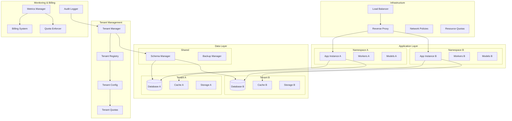
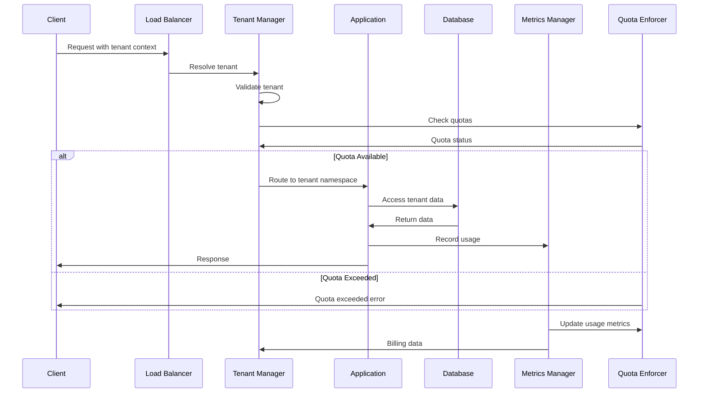

# ADR-008: Multi-tenant Architecture and Resource Isolation

🍞 **Breadcrumb:** 🏠 [Home](../../../index.md) > 👨‍💻 [Developer Guides](../../README.md) > 🏗️ [Architecture](../README.md) > 📋 [ADR](README.md) > Multi-tenant Architecture and Resource Isolation

## Status

PROPOSED

## Context

### Problem Statement
Pynomaly needs to support multiple tenants (organizations, teams, or clients) while ensuring data isolation, resource allocation, and security boundaries. Current single-tenant architecture doesn't scale for SaaS deployment and makes it difficult to onboard new customers, manage resources efficiently, and maintain data privacy across different organizations.

### Goals
- Enable secure multi-tenant SaaS deployment
- Ensure complete data isolation between tenants
- Implement fair resource allocation and quotas
- Provide tenant-specific customization and configuration
- Maintain performance isolation to prevent noisy neighbor issues
- Support horizontal scaling as tenant count grows

### Constraints
- Must maintain strict data isolation for compliance
- Performance isolation is critical for SLA compliance
- Resource utilization must be efficient and cost-effective
- Migration path from single-tenant to multi-tenant required
- Must support different subscription tiers and pricing models

### Assumptions
- Tenants have varying resource requirements and usage patterns
- Some tenants require strict data residency and isolation
- Billing and metering capabilities are needed
- Different tenants may have different feature access levels
- Administrative overhead should be minimized

## Decision

### Chosen Solution
Implement a **hybrid multi-tenant architecture** using **tenant isolation patterns** with **resource partitioning** and **namespace isolation**. The solution includes:

1. **Tenant Management Layer** - Central tenant registration and configuration
2. **Data Isolation Strategy** - Schema-per-tenant with logical separation
3. **Resource Isolation** - Kubernetes namespaces and resource quotas
4. **Security Boundaries** - Role-based access control and network policies
5. **Billing and Metering** - Usage tracking and quota management
6. **Customization Framework** - Tenant-specific configurations and features

### Rationale
Hybrid multi-tenant architecture provides:
- Strong data isolation while maintaining efficiency
- Flexible resource allocation and scaling
- Security boundaries appropriate for enterprise customers
- Cost-effective resource utilization
- Simplified operational overhead
- Support for different tenant tiers and requirements

## Architecture

### System Overview


### Component Interactions


## Options Considered

### Pros and Cons Matrix

| Option | Pros | Cons | Score |
|--------|------|------|-------|
| **Hybrid Multi-tenant** | ✅ Strong isolation<br/>✅ Resource efficiency<br/>✅ Flexible scaling<br/>✅ Enterprise ready | ❌ Complex architecture<br/>❌ Higher dev cost | **9/10** |
| Single-tenant per Instance | ✅ Complete isolation<br/>✅ Simple architecture | ❌ Resource waste<br/>❌ High operational cost<br/>❌ Poor scalability | 6/10 |
| Shared Database Schema | ✅ Simple implementation<br/>✅ Resource efficient | ❌ Poor isolation<br/>❌ Security risks<br/>❌ Compliance issues | 4/10 |
| Container per Tenant | ✅ Good isolation<br/>✅ Scalable | ❌ Resource overhead<br/>❌ Complex orchestration | 7/10 |

### Rejected Alternatives
- **Single-tenant per Instance**: Too expensive and wasteful for SaaS model
- **Shared Database Schema**: Insufficient isolation for enterprise requirements
- **Container per Tenant**: Resource overhead makes it cost-prohibitive

## Implementation

### Technical Approach

#### 1. Tenant Manager
```python
class TenantManager:
    def __init__(self, registry: TenantRegistry):
        self.registry = registry
        self.quota_enforcer = QuotaEnforcer()
        self.resource_allocator = ResourceAllocator()
    
    async def create_tenant(self, tenant_config: TenantConfig) -> Tenant:
        """Create a new tenant with isolated resources"""
        # Create tenant record
        tenant = Tenant(
            id=self.generate_tenant_id(),
            name=tenant_config.name,
            config=tenant_config,
            created_at=datetime.utcnow()
        )
        
        # Provision resources
        await self.provision_tenant_resources(tenant)
        
        # Set up data isolation
        await self.setup_data_isolation(tenant)
        
        # Configure security boundaries
        await self.setup_security_boundaries(tenant)
        
        # Register tenant
        await self.registry.register(tenant)
        
        return tenant
    
    async def provision_tenant_resources(self, tenant: Tenant):
        """Provision isolated resources for tenant"""
        # Create Kubernetes namespace
        await self.resource_allocator.create_namespace(
            f"tenant-{tenant.id}",
            tenant.config.resource_quotas
        )
        
        # Provision database schema
        await self.setup_tenant_database(tenant)
        
        # Set up storage buckets
        await self.setup_tenant_storage(tenant)
    
    async def resolve_tenant(self, request_context: RequestContext) -> Tenant:
        """Resolve tenant from request context"""
        tenant_id = self.extract_tenant_id(request_context)
        return await self.registry.get(tenant_id)
```

#### 2. Data Isolation Strategy
```python
class DataIsolationManager:
    def __init__(self, database_manager: DatabaseManager):
        self.db_manager = database_manager
    
    async def setup_tenant_database(self, tenant: Tenant):
        """Set up isolated database for tenant"""
        schema_name = f"tenant_{tenant.id}"
        
        # Create dedicated schema
        await self.db_manager.create_schema(schema_name)
        
        # Apply database migrations
        await self.db_manager.migrate_schema(schema_name)
        
        # Set up connection pool
        connection_config = DatabaseConfig(
            schema=schema_name,
            max_connections=tenant.config.db_connections,
            timeout=tenant.config.db_timeout
        )
        
        await self.db_manager.create_connection_pool(
            tenant.id, 
            connection_config
        )
    
    async def get_tenant_connection(self, tenant_id: str) -> DatabaseConnection:
        """Get database connection for specific tenant"""
        return await self.db_manager.get_connection(tenant_id)
```

#### 3. Resource Quotas and Limits
```python
class QuotaEnforcer:
    def __init__(self, metrics_backend: MetricsBackend):
        self.metrics = metrics_backend
        self.quotas = QuotaStore()
    
    async def check_quota(
        self, 
        tenant_id: str, 
        resource_type: ResourceType,
        requested_amount: float
    ) -> QuotaCheckResult:
        """Check if tenant can consume requested resources"""
        current_usage = await self.metrics.get_current_usage(
            tenant_id, 
            resource_type
        )
        
        quota_limit = await self.quotas.get_limit(tenant_id, resource_type)
        
        if current_usage + requested_amount > quota_limit:
            return QuotaCheckResult(
                allowed=False,
                reason=f"Would exceed {resource_type} quota",
                current_usage=current_usage,
                limit=quota_limit
            )
        
        return QuotaCheckResult(allowed=True)
    
    async def record_usage(
        self,
        tenant_id: str,
        resource_type: ResourceType,
        amount: float
    ):
        """Record resource usage for billing and monitoring"""
        await self.metrics.record_usage(tenant_id, resource_type, amount)
    
    async def enforce_limits(self, tenant_id: str):
        """Enforce resource limits for tenant"""
        for resource_type in ResourceType:
            usage = await self.metrics.get_current_usage(tenant_id, resource_type)
            limit = await self.quotas.get_limit(tenant_id, resource_type)
            
            if usage > limit:
                await self.throttle_tenant(tenant_id, resource_type)
```

#### 4. Security Boundaries
```python
class SecurityBoundaryManager:
    def __init__(self, rbac_manager: RBACManager):
        self.rbac = rbac_manager
        self.network_policies = NetworkPolicyManager()
    
    async def setup_tenant_security(self, tenant: Tenant):
        """Set up security boundaries for tenant"""
        # Create tenant-specific roles
        await self.rbac.create_tenant_roles(tenant.id, tenant.config.roles)
        
        # Set up network policies
        await self.network_policies.create_tenant_policies(
            tenant.id,
            tenant.config.network_policies
        )
        
        # Configure API access controls
        await self.setup_api_access_controls(tenant)
    
    async def validate_tenant_access(
        self, 
        tenant_id: str,
        user: User,
        resource: str,
        action: str
    ) -> bool:
        """Validate user access to tenant resources"""
        # Check user belongs to tenant
        if not await self.rbac.user_belongs_to_tenant(user.id, tenant_id):
            return False
        
        # Check role permissions
        return await self.rbac.check_permission(
            user.id, 
            tenant_id,
            resource, 
            action
        )
```

#### 5. Tenant Configuration and Customization
```python
class TenantConfigurationManager:
    def __init__(self, config_store: ConfigurationStore):
        self.config_store = config_store
    
    async def get_tenant_config(
        self, 
        tenant_id: str,
        config_key: str
    ) -> Any:
        """Get tenant-specific configuration"""
        # Try tenant-specific config first
        tenant_config = await self.config_store.get(
            f"tenant:{tenant_id}:{config_key}"
        )
        
        if tenant_config is not None:
            return tenant_config
        
        # Fall back to default config
        return await self.config_store.get(f"default:{config_key}")
    
    async def set_tenant_config(
        self,
        tenant_id: str,
        config_key: str,
        value: Any
    ):
        """Set tenant-specific configuration"""
        await self.config_store.set(
            f"tenant:{tenant_id}:{config_key}",
            value
        )
    
    async def get_tenant_features(self, tenant_id: str) -> List[str]:
        """Get enabled features for tenant"""
        tenant = await self.tenant_registry.get(tenant_id)
        return tenant.config.enabled_features
```

### Migration Strategy
1. **Phase 1**: Implement tenant management and registration
2. **Phase 2**: Add data isolation with schema-per-tenant
3. **Phase 3**: Implement resource quotas and monitoring
4. **Phase 4**: Add security boundaries and RBAC
5. **Phase 5**: Implement billing and metering
6. **Phase 6**: Add tenant customization and feature flags

### Testing Strategy
- **Unit Tests**: Test tenant management components
- **Integration Tests**: Test end-to-end tenant isolation
- **Security Tests**: Verify data isolation and access controls
- **Performance Tests**: Test resource allocation and quotas
- **Load Tests**: Test system under multi-tenant load
- **Chaos Tests**: Test tenant isolation under failure conditions

## Consequences

### Positive
- **Scalability**: Can support hundreds of tenants efficiently
- **Data Isolation**: Strong guarantees for data privacy and compliance
- **Resource Efficiency**: Better utilization compared to single-tenant
- **Operational Simplicity**: Centralized management and monitoring
- **Cost Effectiveness**: Shared infrastructure reduces costs
- **Flexibility**: Support for different tenant tiers and requirements

### Negative
- **Complexity**: More complex architecture and operations
- **Development Overhead**: Additional complexity in application code
- **Resource Monitoring**: Need sophisticated monitoring and alerting
- **Noisy Neighbor**: Risk of performance impact between tenants

### Neutral
- **Operational Overhead**: More components to manage and monitor
- **Security Model**: More complex but more granular security
- **Billing Complexity**: Sophisticated metering and billing required

## Compliance

### Security Impact
- **Data Isolation**: Complete logical separation of tenant data
- **Access Control**: Multi-layered security with RBAC and network policies
- **Audit Trail**: Comprehensive logging of all tenant activities
- **Encryption**: Data encrypted at rest and in transit per tenant

### Performance Impact
- **Resource Overhead**: ~10-15% overhead for isolation mechanisms
- **Latency Impact**: <10ms additional latency for tenant resolution
- **Throughput**: Can handle 1000+ concurrent tenants
- **Storage Efficiency**: 85-90% utilization through resource sharing

### Monitoring Requirements
- **Tenant Metrics**: Resource usage, performance, and availability per tenant
- **Security Metrics**: Access attempts, violations, and compliance status
- **Billing Metrics**: Usage tracking and quota enforcement
- **System Metrics**: Overall system health and capacity

## Decision Log

| Date | Author | Action | Rationale |
|------|--------|--------|-----------|
| 2024-02-05 | Platform Team | PROPOSED | Initial multi-tenant architecture proposal |
| 2024-02-08 | Security Team | REVIEWED | Security and isolation requirements validated |
| 2024-02-12 | Operations Team | REVIEWED | Operational complexity assessment |
| 2024-02-15 | Architecture Council | UNDER_REVIEW | Pending final approval |

## References

- [Multi-Tenant Architecture Patterns](https://docs.microsoft.com/en-us/azure/architecture/guide/multitenant/)
- [SaaS Architecture Best Practices](https://aws.amazon.com/blogs/architecture/saas-architecture-fundamentals/)
- [Kubernetes Multi-Tenancy](https://kubernetes.io/docs/concepts/security/multi-tenancy/)
- [Data Isolation Strategies](https://martinfowler.com/articles/multi-tenant-saas.html)

---

## 🔗 **Related Documentation**

### **Architecture**
- **[Architecture Overview](../overview.md)** - System design principles
- **[ADR-005: Security Architecture](ADR-005.md)** - Security framework integration
- **[ADR-007: MLOps Integration](ADR-007.md)** - Multi-tenant model management

### **Implementation**
- **[Implementation Guide](../../contributing/IMPLEMENTATION_GUIDE.md)** - Development standards
- **[Security Best Practices](../../../security/security-best-practices.md)** - Security guidelines
- **[User Management Service](../../../infrastructure/multitenancy/tenant_manager.py)** - Tenant management

### **Operations**
- **[Deployment Guide](../../../deployment/README.md)** - Multi-tenant deployment
- **[Monitoring Guide](../../../user-guides/basic-usage/monitoring.md)** - Tenant monitoring
- **[Security Configuration](../../../deployment/SECURITY.md)** - Security setup

---

**Authors:** Platform Team<br/>
**Last Updated:** 2024-02-15<br/>
**Next Review:** 2024-05-15
