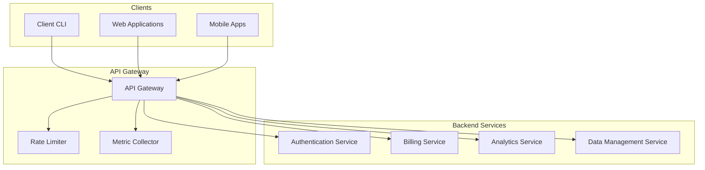
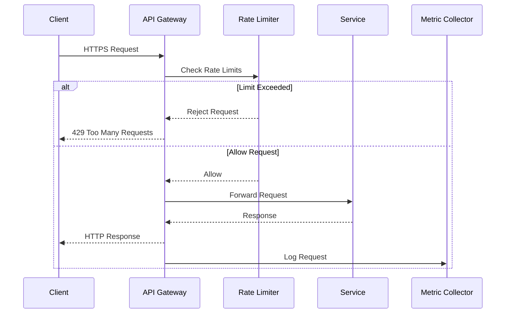

# ADR-009: API Gateway Architecture and Rate Limiting

🍞 **Breadcrumb:** 🏠 [Home](../../../index.md) > 👨‍💻 [Developer Guides](../../README.md) > 🏗️ [Architecture](../README.md) > 📋 [ADR](README.md) > API Gateway Architecture and Rate Limiting

## Status

PROPOSED

## Context

### Problem Statement
Pynomaly requires a robust API gateway solution to manage external client requests, provide rate limiting, security, and routing capabilities. The current architecture lacks centralized management of API traffic, leading to potential security vulnerabilities, performance bottlenecks, and difficulties in scaling.

### Goals
- Provide a centralized entry point for all API requests
- Implement rate limiting to prevent abuse
- Ensure secure communication with clients
- Enable flexible request routing and load balancing
- Support versioning and API transformations
- Monitor and log API requests for observability

### Constraints
- Must support high throughput and low latency
- Must integrate with existing authentication mechanisms
- Minimal disruption to existing API consumers
- Future-proof for new services and API changes
- Compliance with industry security standards

### Assumptions
- API traffic will increase as more services are added
- Some clients may attempt to misuse the API
- Security requirements will evolve over time
- Different APIs may have different performance requirements
- API versioning will be necessary as the platform grows

## Decision

### Chosen Solution
Implement an **API Gateway** using **Envoy Proxy** combined with **Rate Limiting** via a centralized control plane. The solution includes:

1. **Request Handling**
   - Centralized handling of all incoming API requests through the gateway.
2. **Rate Limiting**
   - Implement rate limiting per IP/Client ID using a distributed cache.
3. **Secure Communication**
   - TLS termination and secure handshake for all client connections.
4. **Request Routing**
   - Dynamic routing and service discovery integration.
5. **API Versioning**
   - Seamless version management with backward compatibility.
6. **Monitoring and Logging**
   - Integrated request logging and metric collection for observability.

### Rationale
The chosen architecture allows:
- Scalable API management with central visibility and control.
- Effective protection against API misuse through rate limiting.
- Secure communication and simplified API client interaction.
- Easily pluggable features and extensibility for future needs.
- Simplified operations and management through a consistent control plane.

## Architecture

### System Overview

### Component Interactions

## Options Considered

### Pros and Cons Matrix

| Option | Pros | Cons | Score |
|--------|------|------|-------|
| **Envoy Proxy** | ✅ High performancebr/✅ Extensiblebr/✅ Strong community support | ❌ Steep learning curve | **9/10** |
| NGINX | ✅ Mature technologybr/✅ Widely used | ❌ Less feature-richbr/❌ Limited dynamic capabilities | 8/10 |
| AWS API Gateway | ✅ Fully managedbr/✅ Easy setup | ❌ Expensivebr/❌ Limited customization | 7/10 |

### Rejected Alternatives
- **NGINX**: Lacks some required modern dynamic features.
- **AWS API Gateway**: Vendor lock-in and high costs.

## Implementation

### Technical Approach

#### 1. API Gateway Setup
- **Envoy Proxy Deployment**
  - Set up Envoy as a sidecar on Kubernetes for API traffic management.
- **Configuration Management**
  - Use xDS protocol for dynamic configuration and service discovery.

#### 2. Rate Limiting
- **Distributed Rate Limiting**
  - Deploy Redis to store rate limiting counters and quotas.
- **Custom Filters**
  - Implement Envoy filters for rate limiting logic based on IP and Client ID.

#### 3. Secure Communication
- **TLS Termination**
  - Establish secure TLS connections with automatic certificate management.
- **Forwarding to Services**
  - Use mTLS to communicate with backend services securely.

#### 4. Metrics and Logging
- **Prometheus Metrics**
  - Integrate with Prometheus to collect metrics on API performance.
- **Structured Logging**
  - Use Fluentd to stream logs to centralized logging service.

### Migration Strategy
1. **Phase 1**: Deploy Envoy as a transparent proxy with no configurations.
2. **Phase 2**: Implement basic routing and service discovery.
3. **Phase 3**: Add rate limiting and monitoring features.
4. **Phase 4**: Transition all API traffic through the gateway.
5. **Phase 5**: Implement advanced routing, transformations, and versioning.

### Testing Strategy
- **Unit Tests**: Validate gateway filters and configurations.
- **Integration Tests**: Ensure end-to-end API routing and rate limiting.
- **Load Tests**: Benchmark performance under high traffic.
- **Security Tests**: Verify secure communication and threat protection.
- **User Acceptance Tests**: Confirm user experience for API consumers.

## Consequences

### Positive
- **Control and Security**: Centralized management of API security and traffic.
- **Scalability**: Easily scales with increased API traffic.
- **Extensibility**: Pluggable features for future enhancements.
- **Visibility**: Comprehensive observability and logging.

### Negative
- **Complexity**: Requires expertise to manage complex configurations.
- **Initial Setup**: Time-consuming to configure and deploy.

### Neutral
- **Cost**: Additional resources for gateway and logging.
- **Maintenance**: Ongoing effort to manage configurations and monitoring.

## Compliance

### Security Impact
- **Encryption**: All traffic encrypted in transit with TLS/mTLS.
- **Access Controls**: Rate limits and authentication via gateway.
- **Audit Logs**: Complete logs of all API requests and responses.

### Performance Impact
- **Latency**: ~5ms added per request for gateway processing.
- **Throughput**: Capable of handling tens of thousands of requests per second.

### Monitoring Requirements
- **Traffic Metrics**: API call volumes, response times, and error rates.
- **Security Alerts**: Suspicious activities, failed authentications, and rate limiting events.
- **Resource Utilization**: CPU, memory, and network usage for Envoy pods.

## Decision Log

| Date | Author | Action | Rationale |
|------|--------|--------|-----------|
| 2024-03-01 | API Team | PROPOSED | Initial API gateway architecture |
| 2024-03-05 | Operations Team | REVIEWED | Scalability and operational impact analyzed |
| 2024-03-10 | Security Team | REVIEWED | Security and compliance validated |
| 2024-03-15 | Architecture Council | UNDER_REVIEW | Pending final approval |

## References

- [Envoy Proxy Documentation](https://www.envoyproxy.io/docs/envoy/latest/)
- [Using Envoy as an API Gateway](https://www.datawire.io/guide/envoy/)
- [Rate Limiting with Envoy](https://www.envoyproxy.io/docs/envoy/latest/faq/configuration/rate_limit)
- [Prometheus Monitoring](https://prometheus.io/docs/introduction/overview/)
- [Fluentd Logging](https://www.fluentd.org/)

---

## 🔗 **Related Documentation**

### **Architecture**
- **[Architecture Overview](../overview.md)** - System design principles
- **[Security Architecture](../security-architecture.md)** - Security best practices

### **Implementation**
- **[API Management Guide](../../../user-guides/api-management.md)** - API deployment and management
- **[Rate Limiting Configurations](../../../config/rate-limiting.yml)** - Rate limiting rules

### **Operations**
- **[Deployment Guide](../../../deployment/README.md)** - Gateway deployment
- **[Monitoring Guide](../../../user-guides/basic-usage/monitoring.md)** - API monitoring setup
- **[Security Configuration](../../../deployment/SECURITY.md)** - Security setup

---

**Authors:** API Teambr/
**Last Updated:** 2024-03-15br/
**Next Review:** 2024-06-15
