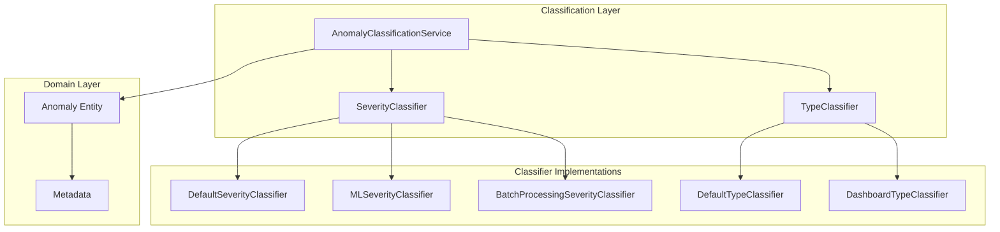

# ADR-010: Anomaly Classification Taxonomy

🍞 **Breadcrumb:** 🏠 [Home](../../../README.md) > 👨‍💻 [Developer Guides](../../README.md) > 🏗️ [Architecture](../README.md) > 📋 [ADR](README.md) > 🏷️ [ADR-010](ADR-010-anomaly-classification-taxonomy.md)

---

## Status
**ACCEPTED** - 2025-01-08

## Context

Pynomaly detects anomalies using various algorithms (PyOD, scikit-learn, custom implementations) but lacks a standardized system for classifying the detected anomalies. This creates several challenges:

1. **Inconsistent Anomaly Interpretation**: Different algorithms produce scores in different ranges and formats
2. **Lack of Business Context**: Raw anomaly scores don't provide actionable business insights
3. **Manual Triage Overhead**: Security analysts and data scientists must manually interpret every anomaly
4. **No Standardized Response**: Different teams handle similar anomalies differently
5. **Scalability Issues**: Manual classification doesn't scale with high-volume anomaly detection

### Current State Analysis

- **Algorithm Diversity**: 40+ PyOD algorithms + scikit-learn + custom implementations
- **Score Heterogeneity**: Scores range from 0-1, -1 to 1, or arbitrary ranges
- **Domain Variety**: Financial fraud, IoT monitoring, cybersecurity, quality control
- **User Types**: Security analysts, data scientists, business stakeholders, automated systems

## Decision

We will implement a **two-dimensional anomaly classification taxonomy** that categorizes anomalies by:

1. **Severity**: Business impact and urgency (Critical, High, Medium, Low)
2. **Type**: Structural characteristics (Point, Collective, Contextual)

### Architecture Decision



### Taxonomy Structure

#### Severity Classification
- **Critical** (≥0.9): Immediate attention, high business impact
- **High** (≥0.7): Significant deviation, requires investigation
- **Medium** (≥0.5): Moderate anomaly, should be reviewed
- **Low** (≥0.0): Minor deviation, informational

#### Type Classification
- **Point Anomaly**: Individual outliers
- **Collective Anomaly**: Pattern-based anomalies
- **Contextual Anomaly**: Context-dependent deviations

### Implementation Strategy

1. **Protocol-Based Design**: Use Python protocols for extensibility
2. **Strategy Pattern**: Pluggable classifiers for different use cases
3. **Metadata Enrichment**: Add classification results to anomaly metadata
4. **Performance Optimization**: Batch processing and caching capabilities
5. **Clean Architecture**: Domain-driven design with clear separation of concerns

## Rationale

### Why Two Dimensions?

1. **Severity addresses "How urgent?"**: Enables prioritization and resource allocation
2. **Type addresses "What kind?"**: Enables appropriate response strategies
3. **Orthogonal Concerns**: Severity and type are independent characteristics
4. **Extensibility**: Additional dimensions can be added without breaking existing code

### Why These Specific Categories?

#### Severity Levels
- **Based on Response Time**: Aligns with common incident response procedures
- **Score-Based Thresholds**: Provides objective classification criteria
- **Business Impact**: Connects technical metrics to business outcomes

#### Type Categories
- **Established Taxonomy**: Based on widely accepted anomaly detection literature
- **Algorithmic Alignment**: Maps to different detection methodologies
- **Response Strategies**: Each type requires different investigation approaches

### Why Protocol-Based Design?

1. **Extensibility**: Easy to add custom classifiers without modifying core code
2. **Testability**: Clear contracts enable comprehensive testing
3. **Dependency Inversion**: Domain layer doesn't depend on specific implementations
4. **Type Safety**: Strong typing with mypy compatibility

## Implementation Details

### Core Components

#### 1. Classification Service
```python
class AnomalyClassificationService:
    def __init__(self, severity_classifier, type_classifier):
        self.severity_classifier = severity_classifier
        self.type_classifier = type_classifier
    
    def classify(self, anomaly: Anomaly) -> None:
        severity = self.severity_classifier.classify_severity(anomaly)
        type_category = self.type_classifier.classify_type(anomaly)
        
        anomaly.add_metadata("severity", severity)
        anomaly.add_metadata("type", type_category)
```

#### 2. Classifier Protocols
```python
class SeverityClassifier(Protocol):
    def classify_severity(self, anomaly: Anomaly) -> str: ...

class TypeClassifier(Protocol):
    def classify_type(self, anomaly: Anomaly) -> str: ...
```

#### 3. Default Implementations
- **DefaultSeverityClassifier**: Score-based thresholds
- **DefaultTypeClassifier**: Heuristic-based type detection
- **MLSeverityClassifier**: Machine learning-enhanced classification
- **BatchProcessingSeverityClassifier**: Optimized for high throughput

### Performance Optimizations

#### Batch Processing
- **Caching**: Cache repeated classifications
- **Vectorization**: Process multiple anomalies efficiently
- **Memory Management**: Configurable cache sizes and cleanup

#### Specialized Classifiers
- **Dashboard Integration**: Human-readable category names
- **Real-time Processing**: Optimized for streaming scenarios
- **Domain-Specific**: Customizable for different use cases

## Consequences

### Positive Outcomes

1. **Standardized Classification**: Consistent anomaly interpretation across algorithms
2. **Actionable Insights**: Business-relevant categorization enables better decision-making
3. **Automated Triage**: Reduces manual effort for anomaly investigation
4. **Scalable Processing**: Handles high-volume anomaly detection efficiently
5. **Extensible Design**: Easy to add new classification dimensions or algorithms

### Potential Challenges

1. **Threshold Tuning**: Requires domain expertise to set appropriate thresholds
2. **Algorithm Dependency**: Different algorithms may require different classification approaches
3. **Performance Overhead**: Additional processing step for each anomaly
4. **Maintenance Burden**: Classification logic needs to be maintained and updated

### Trade-offs Between Non-Parametric and Parametric Methods

1. **Non-Parametric Methods**
   - Pros: Flexibility, no distributional assumptions, robust to outliers.
   - Cons: Computationally intensive, less efficient for large datasets.

2. **Parametric Methods**
   - Pros: Efficient for large datasets, simpler implementation, fewer resources needed.
   - Cons: Relies on distributional assumptions, sensitive to outliers.

### Mitigation Strategies

1. **Default Configurations**: Provide sensible defaults for common use cases
2. **Domain Templates**: Pre-configured classifiers for specific domains
3. **Performance Monitoring**: Track classification performance and optimize as needed
4. **Documentation**: Comprehensive guides for threshold tuning and customization

## Future Considerations

### Potential Enhancements

1. **Additional Dimensions**: Confidence, source, domain-specific attributes
2. **Machine Learning Integration**: Trained classifiers for specific domains
3. **Feedback Loops**: Learn from user corrections and improve classification
4. **Hierarchical Classification**: Sub-categories within severity and type dimensions

### Migration Path

1. **Backward Compatibility**: Existing code continues to work unchanged
2. **Gradual Adoption**: Teams can opt-in to classification features
3. **Configuration Migration**: Tools to migrate from manual to automated classification
4. **Performance Monitoring**: Track classification accuracy and performance

## Related Decisions

- **ADR-003**: Algorithm Selection and Registry Pattern
- **ADR-004**: Data Pipeline Architecture and Streaming Support
- **ADR-006**: Progressive Web App (PWA) Architecture
- **ADR-007**: Model Lifecycle Management and MLOps Integration

## Implementation Status

### Phase 1: Core Implementation ✅ **COMPLETED**
- [x] Classification service architecture
- [x] Default severity and type classifiers
- [x] Protocol-based design
- [x] Basic metadata enrichment

### Phase 2: Advanced Features ⏳ **IN PROGRESS**
- [ ] ML-enhanced classification
- [ ] Batch processing optimization
- [ ] Dashboard integration
- [ ] Performance monitoring

### Phase 3: Domain Specialization 🔄 **PLANNED**
- [ ] Financial services templates
- [ ] IoT monitoring classifiers
- [ ] Cybersecurity specializations
- [ ] Custom domain adapters

## References

### Literature
- Chandola, V., Banerjee, A., & Kumar, V. (2009). Anomaly detection: A survey. ACM computing surveys, 41(3), 1-58.
- Hodge, V., & Austin, J. (2004). A survey of outlier detection methodologies. Artificial intelligence review, 22(2), 85-126.

### Industry Standards
- NIST Cybersecurity Framework
- ISO 27001 Information Security Management
- ITIL Service Management Framework

### Internal Documentation
- [Anomaly Classification Taxonomy](../../../reference/taxonomy/anomaly-classification-taxonomy.md)
- [Domain Services Documentation](../../../reference/services/README.md)
- [Clean Architecture Guidelines](../overview.md)

---

**Author:** Architecture Team  
**Reviewers:** @architecture-council  
**Decision Date:** 2025-01-08  
**Next Review:** 2025-04-08
