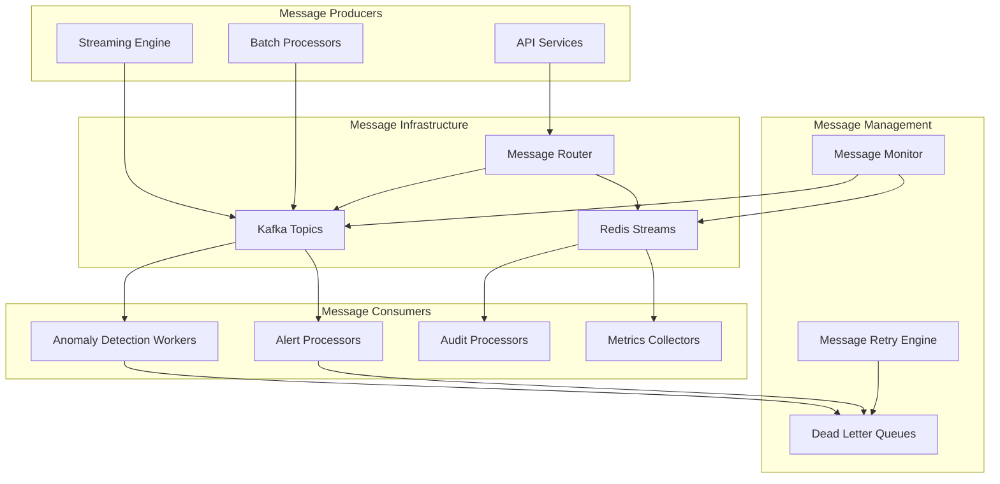
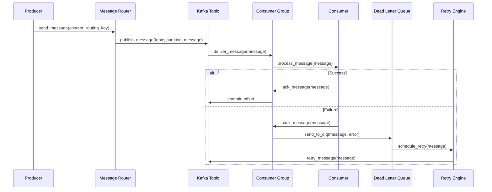

# ADR-013: Message Queue Integration

🍞 **Breadcrumb:** 🏠 [Home](../../../index.md) > 👨‍💻 [Developer Guides](../../README.md) > 🏗️ [Architecture](../README.md) > 📋 [ADR](README.md) > Message Queue Integration

## Status

PROPOSED

## Context

### Problem Statement
Pynomaly needs a robust message queue system to handle asynchronous task processing, event-driven communication between services, and decoupling of system components. The current synchronous processing model creates bottlenecks and limits scalability for computationally intensive anomaly detection tasks.

### Goals
- Enable asynchronous processing of computationally intensive tasks
- Implement event-driven architecture for loose coupling
- Support reliable message delivery with retry mechanisms
- Provide horizontal scaling for message processing
- Enable dead letter queues for failed message handling

### Constraints
- Must integrate with existing streaming engine and caching layer
- Must support message ordering for sequential processing requirements
- Must provide at-least-once delivery guarantees
- Must handle message persistence across system restarts
- Must support message filtering and routing capabilities

### Assumptions
- Message processing latency requirements vary by message type
- System will handle 1000+ messages per second during peak load
- Failed messages require manual intervention or retry logic
- Message payloads will typically be <1MB in size

## Decision

### Chosen Solution
Implement **Apache Kafka** as the primary message queue with **Redis Streams** for real-time messaging.

### Rationale
Kafka provides excellent durability, scalability, and ordering guarantees for high-volume message processing, while Redis Streams offers low-latency messaging for real-time scenarios. This combination enables both reliable batch processing and responsive real-time messaging.

## Architecture

### System Overview

### Component Interactions

## Options Considered

### Pros and Cons Matrix

| Option | Pros | Cons | Score |
|--------|------|------|-------|
| **Kafka + Redis Streams** | ✅ Best of both worlds ✅ Durability + Speed ✅ Mature ecosystem | ❌ Operational complexity ❌ Two systems to manage | **9/10** |
| RabbitMQ | ✅ Feature-rich ✅ Management UI ✅ Flexible routing | ❌ Limited scalability ❌ Single point of failure | 7/10 |
| AWS SQS/SNS | ✅ Managed service ✅ High availability | ❌ Vendor lock-in ❌ Cost implications | 6/10 |

### Rejected Alternatives
- **RabbitMQ**: Limited horizontal scaling capabilities and complex clustering setup
- **AWS SQS/SNS**: Vendor lock-in concerns and cost implications for high-volume messaging

## Implementation

### Technical Approach
1. Set up Kafka cluster infrastructure
2. Implement Redis Streams for real-time messaging
3. Create message routing and handling framework
4. Add dead letter queues and retry mechanisms
5. Implement monitoring and alerting

### Migration Strategy
1. **Phase 1**: Implement message queues alongside existing synchronous processing
2. **Phase 2**: Migrate computationally intensive tasks to async processing
3. **Phase 3**: Transition remaining workflows to event-driven architecture

### Testing Strategy
- Unit tests for message producers and consumers
- Integration tests with streaming engine and caching layer
- Performance tests for message throughput and latency
- Chaos engineering for message delivery reliability

## Consequences

### Positive
- Improved system scalability and performance
- Better fault tolerance and reliability
- Decoupled system components
- Asynchronous processing capabilities
- Enhanced monitoring and observability

### Negative
- Increased operational complexity
- Additional infrastructure requirements
- Message ordering complexity
- Potential message duplication scenarios
- Learning curve for event-driven patterns

### Neutral
- Changes to deployment architecture
- New configuration and monitoring requirements
- Additional testing scenarios for message handling
- Training requirements for message queue operations

## Compliance

### Security Impact
- Message encryption for sensitive data
- Authentication and authorization for message access
- Audit logging for message processing events

### Performance Impact
- Target: >1000 messages per second throughput
- Target: <100ms message processing latency
- Reliability: >99.9% message delivery success rate

### Monitoring Requirements
- Message throughput and latency metrics
- Dead letter queue size and retry success rates
- Consumer lag and processing time
- Message delivery success rate

## Decision Log

| Date | Author | Action | Rationale |
|------|--------|--------|-----------|
| 2025-01-07 | Architecture Team | PROPOSED | Initial proposal for message queue integration |

## References

- [Apache Kafka Documentation](https://kafka.apache.org/documentation/)
- [Redis Streams Documentation](https://redis.io/docs/data-types/streams/)
- [Event-Driven Architecture Patterns](https://microservices.io/patterns/data/event-driven-architecture.html)

---

## 🔗 **Related Documentation**

### **Architecture**
- **[Architecture Overview](../overview.md)** - System design principles
- **[Clean Architecture](../overview.md)** - Architectural patterns
- **[ADR Index](README.md)** - All architectural decisions

### **Implementation**
- **[Implementation Guide](../../contributing/IMPLEMENTATION_GUIDE.md)** - Coding standards
- **[Contributing Guidelines](../../contributing/CONTRIBUTING.md)** - Development process
- **[File Organization](../../contributing/FILE_ORGANIZATION_STANDARDS.md)** - Project structure

### **Deployment**
- **[Production Deployment](../../../deployment/README.md)** - Production setup
- **[Security](../../../deployment/SECURITY.md)** - Security configuration
- **[Monitoring](../../../user-guides/basic-usage/monitoring.md)** - System observability

---

**Authors:** Architecture Team 
**Last Updated:** 2025-01-07 
**Next Review:** 2025-04-07
