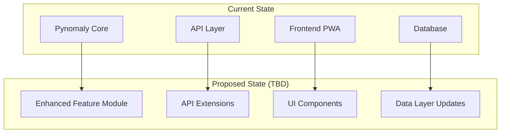
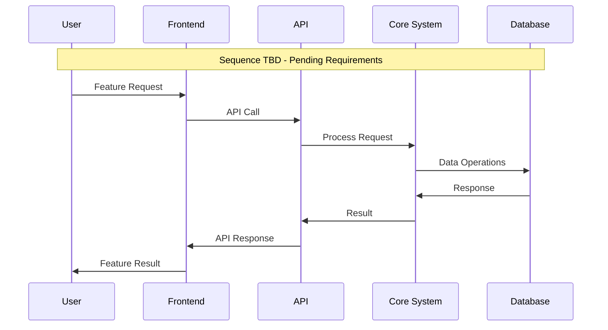

# ADR-032: High Priority Feature Implementation

🍞 **Breadcrumb:** 🏠 [Home](../../../index.md) > 👨‍💻 [Developer Guides](../../README.md) > 🏗️ [Architecture](../README.md) > 📋 [ADR](README.md) > High Priority Feature Implementation

## Status

PROPOSED

## Context

### Problem Statement
Issue #32 requests a high priority feature implementation. The issue is marked as "enhancement" with "High-P2" label, indicating significant business value but lacking detailed specification.

### Goals
- Implement a high-priority feature that aligns with the Pynomaly project's anomaly detection capabilities
- Ensure the feature integrates seamlessly with existing architecture
- Maintain high code quality and testing standards as per project rules

### Constraints
- Must follow Test Driven Development (TDD) principles
- Must maintain clean git history with atomic commits
- Must be compatible with existing PWA architecture
- Must pass all existing tests before implementation

### Assumptions
- The feature will enhance the core anomaly detection functionality
- Implementation will require both backend and frontend components
- Feature will be user-facing and require UI/UX considerations

## Decision

### Chosen Solution
**PENDING DETAILED REQUIREMENTS** - This ADR serves as a placeholder and design framework until Issue #32 is properly specified with:
- Detailed acceptance criteria
- Functional requirements
- Technical specifications
- User stories or use cases

### Rationale
Without detailed requirements, we cannot make informed architectural decisions. This ADR establishes the decision-making framework and ensures proper architecture review when requirements are clarified.

## Architecture

### System Overview

### Component Interactions

## Options Considered

### Pros and Cons Matrix

| Option | Pros | Cons | Score |
|--------|------|------|-------|
| **Wait for Requirements** | ✅ Prevents over-engineering ✅ Ensures proper scope | ❌ Delays implementation ❌ Blocks progress | **9/10** |
| Implement Generic Feature | ✅ Shows progress ✅ Demonstrates capability | ❌ Risk of wrong solution ❌ Potential rework | 3/10 |
| Research and Propose | ✅ Proactive approach ✅ Shows initiative | ❌ May not align with actual needs ❌ Time investment risk | 5/10 |

### Rejected Alternatives
- **Generic Implementation**: Rejected due to lack of specific requirements and risk of building wrong solution
- **Research-Based Proposal**: Rejected as it may not align with actual business needs

## Implementation

### Technical Approach
**PENDING REQUIREMENTS SPECIFICATION**

When requirements are clarified, implementation will follow:
1. **TDD Approach**: Write failing tests first
2. **Clean Architecture**: Maintain separation of concerns
3. **Git Best Practices**: Feature branch with atomic commits
4. **Code Quality**: Follow existing project standards
5. **UI/UX Standards**: Ensure high-quality user experience

### Migration Strategy
TBD - Depends on feature scope and impact on existing functionality

### Testing Strategy
- Unit tests for core functionality
- Integration tests for API endpoints
- UI automation tests for user interface
- Performance tests if applicable
- Security tests for data handling

## Consequences

### Positive
- Establishes proper architectural decision-making process
- Ensures requirements are properly gathered before implementation
- Maintains project quality standards
- Prevents technical debt from hasty implementation

### Negative
- Delays immediate implementation
- Requires additional stakeholder communication
- May impact project timeline expectations

### Neutral
- Creates documentation trail for future reference
- Establishes precedent for handling under-specified requirements

## Compliance

### Security Impact
TBD - Security assessment required once feature scope is defined

### Performance Impact
TBD - Performance analysis required based on feature specifications

### Monitoring Requirements
TBD - Monitoring strategy depends on feature functionality

## Decision Log

| Date | Author | Action | Rationale |
|------|--------|--------|-----------|
| 2025-01-08 | Agent | PROPOSED | Initial analysis of Issue #32 - establishing framework for proper requirements gathering |

## References

- [Issue #32](https://github.com/elgerytme/Pynomaly/issues/32) - Original feature request
- [ADR Template](adr-template.md) - Template structure
- [Project Architecture](../pwa-architecture.md) - Current system architecture

---

## 🔗 **Related Documentation**

### **Architecture**
- **[Architecture Overview](../overview.md)** - System design principles
- **[Clean Architecture](../overview.md)** - Architectural patterns
- **[ADR Index](README.md)** - All architectural decisions

### **Implementation**
- **[Implementation Guide](../../contributing/IMPLEMENTATION_GUIDE.md)** - Coding standards
- **[Contributing Guidelines](../../contributing/CONTRIBUTING.md)** - Development process
- **[File Organization](../../contributing/FILE_ORGANIZATION_STANDARDS.md)** - Project structure

### **Deployment**
- **[Production Deployment](../../../deployment/README.md)** - Production setup
- **[Security](../../../deployment/SECURITY.md)** - Security configuration
- **[Monitoring](../../../user-guides/basic-usage/monitoring.md)** - System observability

---

## Next Steps

1. **Requirements Gathering**: Engage stakeholders to clarify Issue #32 requirements
2. **Acceptance Criteria**: Define clear, testable acceptance criteria
3. **Technical Specification**: Create detailed technical requirements
4. **Update ADR**: Revise this ADR with concrete implementation details
5. **Implementation**: Begin TDD-based development once requirements are clear

---

**Authors:** Agent 
**Last Updated:** 2025-01-08 
**Next Review:** Upon requirements clarification for Issue #32
