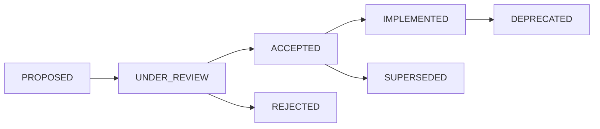

# Architectural Decision Records (ADR)

🍞 **Breadcrumb:** 🏠 [Home](../../../index.md) > 👨‍💻 [Developer Guides](../README.md) > 🏗️ [Architecture](README.md) > 📋 [ADR](README.md)

---

This directory contains Architectural Decision Records (ADRs) that document important architectural decisions made for the Pynomaly project. Each ADR follows a standard template and captures the context, decision, and consequences of architectural choices.

## ADR Index

### High-Priority ADRs (DOC-003 Scope)

| ADR | Title | Status | Date | Priority |
|-----|--------|--------|------|----------|
| [ADR-003](ADR-003.md) | Algorithm Selection and Registry Pattern | PROPOSED | 2024-01-25 | High |
| [ADR-004](ADR-004.md) | Data Pipeline Architecture and Streaming Support | PROPOSED | 2024-01-25 | High |
| [ADR-005](ADR-005.md) | Security Architecture and Compliance Framework | PROPOSED | 2024-02-18 | High |
| [ADR-006](ADR-006.md) | Progressive Web App (PWA) Architecture | PROPOSED | 2024-01-30 | High |
| [ADR-007](ADR-007.md) | Model Lifecycle Management and MLOps Integration | PROPOSED | 2024-02-12 | High |
| [ADR-008](ADR-008.md) | Multi-tenant Architecture and Resource Isolation | PROPOSED | 2024-02-15 | High |
| [ADR-009](ADR-009.md) | API Gateway Architecture and Rate Limiting | PROPOSED | 2024-03-15 | High |

### Templates and Guidelines

- **[ADR Template](adr-template.md)** - Standard template for creating new ADRs

## Creating New ADRs

1. Copy the [ADR Template](adr-template.md)
2. Create a new file with the format `ADR-XXX.md`
3. Fill out all sections thoroughly
4. Include Mermaid diagrams where appropriate
5. Create a feature branch for the ADR
6. Submit a PR with `@architecture-council` review

## ADR Workflow

### Status Definitions

- **PROPOSED**: Initial proposal, awaiting review
- **UNDER_REVIEW**: Architecture Council reviewing
- **ACCEPTED**: Approved for implementation
- **REJECTED**: Not approved, with reasoning
- **IMPLEMENTED**: Successfully implemented
- **SUPERSEDED**: Replaced by newer ADR
- **DEPRECATED**: No longer applicable

## Review Process

1. **Technical Review**: Architecture team reviews technical feasibility
2. **Impact Assessment**: Review impact on existing systems
3. **Architecture Council**: Final approval from @architecture-council
4. **Implementation Planning**: Create implementation roadmap
5. **Status Update**: Update ADR status to ACCEPTED

---

## 🔗 **Related Documentation**

### **Architecture**
- **[Architecture Overview](../overview.md)** - System design principles
- **[Clean Architecture](../overview.md)** - Architectural patterns
- **[Design Patterns](../overview.md)** - Common patterns used

### **Implementation**
- **[Implementation Guide](../../contributing/IMPLEMENTATION_GUIDE.md)** - Coding standards
- **[Contributing Guidelines](../../contributing/CONTRIBUTING.md)** - Development process
- **[File Organization](../../contributing/FILE_ORGANIZATION_STANDARDS.md)** - Project structure

### **Process**
- **[RFC Process](../../contributing/CONTRIBUTING.md)** - Request for Comments
- **[Code Review](../../contributing/CONTRIBUTING.md)** - Review guidelines
- **[Documentation Standards](../../contributing/CONTRIBUTING.md)** - Documentation rules

---

**Maintained by:** Architecture Council 
**Last Updated:** 2024-03-15 
**Review Frequency:** Quarterly
