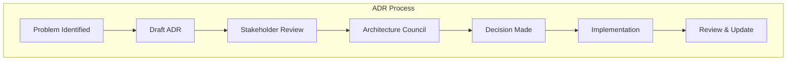

# Architectural Decision Records (ADRs)

🍞 **Breadcrumb:** 🏠 [Home](../../../index.md) > 👨‍💻 [Developer Guides](../../README.md) > 🏗️ [Architecture](../overview.md) > 📋 ADRs

---

## Overview

Architectural Decision Records (ADRs) capture important architectural decisions made during the development of Pynomaly. Each ADR documents the context, decision, and consequences of significant architectural choices to provide historical context and rationale for future development.

## ADR Process

### When to Create an ADR

Create an ADR when making decisions that:
- Affect the overall system architecture
- Impact multiple components or modules
- Involve significant trade-offs
- Require external dependencies or technology choices
- Establish patterns or conventions for the codebase
- Address security, performance, or operational concerns

### ADR Lifecycle

1. **PROPOSED** - Initial proposal for discussion
2. **UNDER_REVIEW** - Currently being reviewed by stakeholders
3. **ACCEPTED** - Approved and ready for implementation
4. **IMPLEMENTED** - Decision has been implemented
5. **REJECTED** - Proposal was rejected
6. **DEPRECATED** - Decision is no longer valid
7. **SUPERSEDED_BY** - Replaced by a newer ADR

### Creating an ADR

1. **Use the Template**: Copy [adr-template.md](adr-template.md) to create a new ADR
2. **Follow Naming**: Use format `ADR-{number}-{title}.md` (e.g., `ADR-008-api-versioning.md`)
3. **Fill All Sections**: Complete all template sections with relevant information
4. **Include Diagrams**: Use Mermaid diagrams for architectural illustrations
5. **Add References**: Link to related documentation and external resources

### Review Process

1. **Create Feature Branch**: `feat/adr-{number}-{title}`
2. **Draft ADR**: Create ADR with status `PROPOSED`
3. **Stakeholder Review**: Share with relevant teams for feedback
4. **Architecture Council**: Present to architecture council for approval
5. **Update Status**: Change to `ACCEPTED` once approved
6. **Merge**: Merge to main branch

## Current ADRs

### Active ADRs

| ADR | Title | Status | Date | Author |
|-----|-------|--------|------|--------|
| [ADR-003](ADR-003.md) | Algorithm Selection and Registry Pattern | PROPOSED | 2024-01-25 | Architecture Team |
| [ADR-007](ADR-007-production-hardening-roadmap.md) | Production Hardening Roadmap | PROPOSED | 2025-01-08 | Architecture Team |

### Planned ADRs

| ADR | Title | Status | Priority | Assignee |
|-----|-------|--------|----------|----------|
| ADR-001 | Core Architecture Patterns | PLANNED | High | Architecture Team |
| ADR-002 | Data Pipeline Architecture | PLANNED | High | Data Team |
| ADR-004 | API Design and Versioning | PLANNED | Medium | API Team |
| ADR-005 | Security Architecture | PLANNED | High | Security Team |
| ADR-006 | Deployment Strategy | PLANNED | Medium | DevOps Team |
| ADR-008 | Monitoring and Observability | PLANNED | High | SRE Team |
| ADR-009 | Testing Strategy | PLANNED | Medium | QA Team |
| ADR-010 | Performance Optimization | PLANNED | Medium | Performance Team |

## Template and Guidelines

### ADR Template

Use the standardized [ADR Template](adr-template.md) for all new ADRs. The template includes:

- **Status**: Current lifecycle stage
- **Context**: Problem statement, goals, constraints, and assumptions
- **Decision**: Chosen solution and rationale
- **Architecture**: System diagrams and component interactions
- **Options Considered**: Alternative solutions and trade-offs
- **Implementation**: Technical approach and migration strategy
- **Consequences**: Positive, negative, and neutral impacts
- **Compliance**: Security, performance, and monitoring considerations
- **Decision Log**: Historical tracking of status changes
- **References**: Related documentation and external resources

### Quality Standards

#### Content Requirements
- **Clear Problem Statement**: Explicitly define the problem being solved
- **Comprehensive Context**: Include all relevant background information
- **Detailed Rationale**: Explain why the decision was made
- **Visual Diagrams**: Use Mermaid diagrams for architectural illustrations
- **Implementation Guidance**: Provide clear implementation direction
- **Impact Analysis**: Document all consequences of the decision

#### Documentation Standards
- **Consistent Formatting**: Follow the standard template structure
- **Proper Linking**: Include breadcrumbs and cross-references
- **Version Control**: Track all changes in the decision log
- **Regular Updates**: Review and update ADRs as needed
- **Accessibility**: Ensure content is clear and well-organized

### Architectural Diagrams

Use Mermaid diagrams for all architectural illustrations:

## Integration with Development Process

### Trunk-Based Development

ADRs follow trunk-based development practices:
- **Feature Branches**: Create feature branches for ADR development
- **Small Changes**: Keep ADR changes focused and atomic
- **Continuous Integration**: Validate ADRs through CI/CD pipeline
- **Regular Merging**: Merge approved ADRs promptly to main

### Automation

Automated processes support ADR management:
- **Link Validation**: Automated checking of all ADR links
- **Table of Contents**: Auto-generated ADR index
- **Status Tracking**: Automated status updates and notifications
- **Template Validation**: Ensure ADRs follow template requirements

## Related Documentation

### Architecture
- **[Architecture Overview](../overview.md)** - System architecture principles
- **[ERD Documentation](../erd.md)** - Entity Relationship Diagrams
- **[PWA Architecture](../pwa-architecture.md)** - Progressive Web App architecture

### Development Process
- **[Contributing Guidelines](../../contributing/CONTRIBUTING.md)** - Development process
- **[API Integration](../../api-integration/README.md)** - API integration guide
- **[Troubleshooting](../../troubleshooting/README.md)** - Troubleshooting guide

### Quality Assurance
- **[Security Guidelines](../../security/README.md)** - Security requirements
- **[Security Best Practices](../../security/security-best-practices.md)** - Security practices
- **[Security Validation](../../security/validation.md)** - Security validation

---

## 🔗 **Navigation**

### **Quick Links**
- **[📋 ADR Template](adr-template.md)** - Template for new ADRs
- **[🏗️ Architecture Overview](../overview.md)** - System architecture
- **[👨‍💻 Developer Guides](../../README.md)** - All developer documentation
- **[🏠 Documentation Home](../../../index.md)** - Main documentation

### **Process**
- **[✍️ Creating ADRs](#creating-an-adr)** - How to create new ADRs
- **[🔄 Review Process](#review-process)** - ADR review workflow
- **[📊 Current ADRs](#current-adrs)** - Active and planned ADRs
- **[📏 Quality Standards](#quality-standards)** - ADR quality requirements

---

**Maintained by:** Architecture Team  
**Last Updated:** 2025-01-08  
**Next Review:** 2025-04-08
