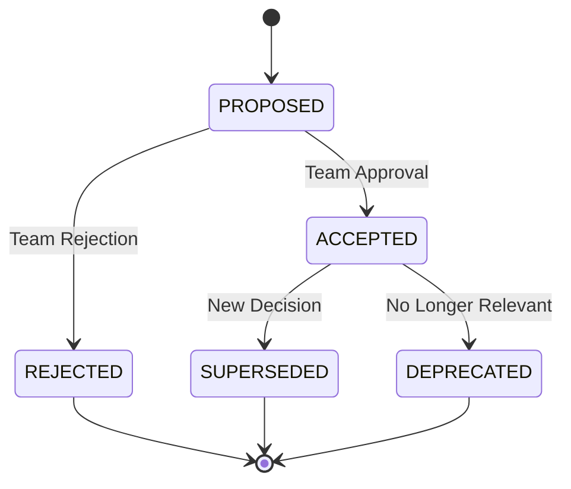

# Architectural Decision Records (ADRs)

🍞 **Breadcrumb:** 🏠 [Home](../../../index.md) > 👨‍💻 [Developer Guides](../../README.md) > 🏗️ [Architecture](../overview.md) > 📋 ADRs

---

## 🎯 Purpose & Philosophy

Architectural Decision Records (ADRs) are a lightweight way to document the important architectural decisions made during the development of Pynomaly. They serve as a historical record of the "why" behind our technical choices, helping current and future developers understand the context and reasoning behind key architectural decisions.

### Why ADRs Matter

- **📚 Historical Context**: Capture the reasoning behind decisions at the time they were made
- **🔄 Knowledge Transfer**: Help new team members understand architectural choices
- **🤔 Decision Transparency**: Make the decision-making process explicit and reviewable
- **🔍 Impact Assessment**: Understand the consequences of past decisions
- **⚡ Faster Onboarding**: Reduce time spent explaining "why we did it this way"

### Our Philosophy

1. **Lightweight Documentation**: ADRs should be concise but comprehensive
2. **Decision-Focused**: Focus on the decision, not implementation details
3. **Context-Rich**: Include sufficient context for future understanding
4. **Immutable Record**: Once accepted, ADRs should not be changed, only superseded
5. **Collaborative Process**: ADRs should be reviewed and discussed by the team

---

## 🚀 How to Create a New ADR

### Step 1: Create the ADR File

```bash
# Navigate to the ADR directory
cd docs/developer-guides/architecture/adr/

# Create a new ADR file following the naming convention
# ADR-###-slug.md where ### is the next sequential number
touch ADR-001-example-decision.md
```

### Step 2: Use the Template

Copy the [ADR template](template.md) and fill in the sections:

```bash
# Copy the template
cp template.md ADR-001-example-decision.md

# Edit the new ADR
# Fill in: Title, Status, Context, Decision, Consequences, etc.
```

### Step 3: Follow the Review Process

```bash
# Create a feature branch
git checkout -b adr/001-example-decision

# Add and commit the ADR
git add ADR-001-example-decision.md
git commit -m "docs(adr): add ADR-001 for example decision"

# Push and create pull request
git push origin adr/001-example-decision
# Open PR for team review
```

### Step 4: Update Status

Once the ADR is approved and merged:

```bash
# The ADR status should be updated to "Accepted"
# Update the table of contents below
```

---

## 📊 Status Lifecycle

ADRs follow a clear lifecycle with defined status transitions:



### Status Definitions

- **🟡 PROPOSED**: ADR is under review and discussion
- **🟢 ACCEPTED**: ADR has been approved and is in effect
- **🔴 REJECTED**: ADR was considered but not approved
- **🟠 SUPERSEDED**: ADR has been replaced by a newer decision
- **⚫ DEPRECATED**: ADR is no longer relevant to the current system

---

## 📝 Naming & Numbering Convention

### File Naming Pattern

```
ADR-###-slug.md
```

- **ADR-**: Fixed prefix for all ADRs
- **###**: Three-digit, zero-padded, monotonically increasing number
- **slug**: Short, descriptive, kebab-case identifier
- **.md**: Markdown file extension

### Examples

```
ADR-001-database-choice.md
ADR-002-authentication-strategy.md
ADR-003-api-versioning-approach.md
ADR-004-deployment-architecture.md
```

### Numbering Rules

1. **Sequential**: Numbers must be sequential (001, 002, 003, ...)
2. **No Gaps**: Don't skip numbers, even for rejected ADRs
3. **No Reuse**: Never reuse numbers from deleted ADRs
4. **Zero-Padded**: Always use three digits (001, not 1)
5. **Monotonic**: Numbers only increase, never decrease

---

## 📚 Table of Contents

<!-- AUTO-GENERATED TABLE OF CONTENTS -->
<!-- This section is automatically updated by GitHub Actions -->
<!-- DO NOT EDIT MANUALLY -->

| ADR | Title | Status | Date | Author |
|-----|-------|--------|------|---------|
| [ADR-001](ADR-001-example.md) | Example ADR |  | 2024-01-15 | @username |

<!-- END AUTO-GENERATED TABLE OF CONTENTS -->

### Status Badges

- 
- 
- 
- 
- 

---

## 🔗 Related Resources

### Templates & Guidelines

- **[ADR Template](template.md)** - Standard template for new ADRs
- **[Contributing Guidelines](../../contributing/CONTRIBUTING.md)** - General contribution process
- **[Architecture Overview](../overview.md)** - System architecture documentation

### Process Documentation

- **[Review Process](../../contributing/CONTRIBUTING.md#pull-requests)** - How ADRs are reviewed
- **[Commit Guidelines](../../contributing/CONTRIBUTING.md#commit-guidelines)** - Commit message standards
- **[Documentation Standards](../../contributing/README.md)** - Documentation best practices

### External Resources

- **[ADR GitHub Organization](https://adr.github.io/)** - ADR community resources
- **[Documenting Architecture Decisions](https://cognitect.com/blog/2011/11/15/documenting-architecture-decisions)** - Original ADR concept
- **[ADR Tools](https://github.com/npryce/adr-tools)** - Command-line tools for ADR management

---

## 🎯 Best Practices

### Writing Effective ADRs

1. **Be Specific**: Focus on one decision per ADR
2. **Include Context**: Explain the situation that led to the decision
3. **Show Alternatives**: Document options considered and why they were rejected
4. **Explain Consequences**: Be honest about trade-offs and implications
5. **Use Simple Language**: Write for future team members, not just experts

### Review Guidelines

1. **Technical Accuracy**: Verify technical details are correct
2. **Completeness**: Ensure all template sections are filled
3. **Clarity**: Check that the decision and reasoning are clear
4. **Consistency**: Ensure ADR follows project conventions
5. **Future Impact**: Consider long-term implications

### Maintenance

1. **Keep Current**: Update the table of contents when new ADRs are added
2. **Link Related ADRs**: Reference related decisions in new ADRs
3. **Mark Superseded**: Update status when decisions are replaced
4. **Archive Deprecated**: Mark ADRs as deprecated when no longer relevant

---

## 📊 GitHub Actions Integration

The table of contents above is automatically maintained by our GitHub Actions workflow:

```yaml
# .github/workflows/adr-update.yml
name: Update ADR Table of Contents
on:
  push:
    paths:
      - 'docs/developer-guides/architecture/adr/ADR-*.md'
      - 'docs/developer-guides/architecture/adr/README.md'
```

This workflow:
1. Scans all ADR files for metadata
2. Generates status badges
3. Updates the table of contents
4. Commits changes back to the repository

---

## 🤝 Contributing

We welcome contributions to our ADR process! Here's how you can help:

### Proposing New ADRs

1. **Check Existing ADRs**: Ensure your decision isn't already documented
2. **Follow the Template**: Use the provided template structure
3. **Engage Early**: Discuss significant decisions before writing
4. **Be Thorough**: Include all relevant context and alternatives

### Improving the Process

1. **Template Updates**: Suggest improvements to the ADR template
2. **Process Refinements**: Propose better workflows or conventions
3. **Tooling**: Contribute tools or automation for ADR management
4. **Documentation**: Help improve this README and related docs

### Questions & Support

- **GitHub Issues**: Open an issue for process questions
- **Discussions**: Use GitHub Discussions for broader topics
- **Pull Requests**: Submit PRs for template or process improvements

---

*This ADR system helps us maintain architectural consistency and knowledge sharing across the Pynomaly project. By documenting our decisions, we create a valuable resource for current and future contributors.*
