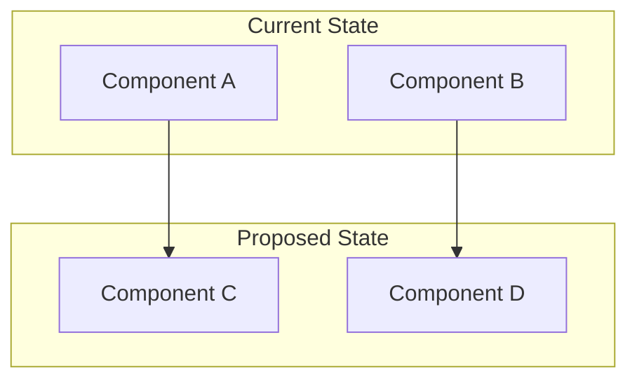
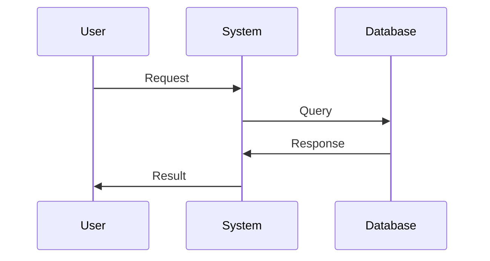

# ADR-{number}: {title}

🍞 **Breadcrumb:** 🏠 [Home](../../../index.md) > 👨‍💻 [Developer Guides](../../README.md) > 🏗️ [Architecture](../README.md) > 📋 [ADR](README.md) > {title}

## Status

{PROPOSED | ACCEPTED | REJECTED | DEPRECATED | SUPERSEDED_BY}

## Context

### Problem Statement
{Describe the problem/issue that requires a decision}

### Goals
{What are we trying to achieve?}

### Constraints
{What are the limitations/constraints?}

### Assumptions
{What are we assuming?}

## Decision

### Chosen Solution
{Description of the chosen solution}

### Rationale
{Why this solution was chosen}

## Architecture

### System Overview

### Component Interactions

## Options Considered

### Pros and Cons Matrix

| Option | Pros | Cons | Score |
|--------|------|------|-------|
| Option A | ✅ Pro 1 ✅ Pro 2 | ❌ Con 1 ❌ Con 2 | 7/10 |
| Option B | ✅ Pro 1 ✅ Pro 2 | ❌ Con 1 ❌ Con 2 | 6/10 |
| **Option C** | ✅ Pro 1 ✅ Pro 2 | ❌ Con 1 ❌ Con 2 | **8/10** |

### Rejected Alternatives
{Why other options were rejected}

## Implementation

### Technical Approach
{How will this be implemented?}

### Migration Strategy
{How to migrate from current to new solution}

### Testing Strategy
{How will this be tested?}

## Consequences

### Positive
- {Positive consequence 1}
- {Positive consequence 2}

### Negative
- {Negative consequence 1}
- {Negative consequence 2}

### Neutral
- {Neutral consequence 1}
- {Neutral consequence 2}

## Compliance

### Security Impact
{Security considerations}

### Performance Impact
{Performance considerations}

### Monitoring Requirements
{What needs to be monitored}

## Decision Log

| Date | Author | Action | Rationale |
|------|--------|--------|-----------|
| {date} | {author} | PROPOSED | Initial proposal |
| {date} | {author} | ACCEPTED | Architecture Council approval |

## References

- [Related ADR](#)
- [External Documentation](#)
- [Architecture Overview](../overview.md)

---

## 🔗 **Related Documentation**

### **Architecture**
- **[Architecture Overview](../overview.md)** - System design principles
- **[Clean Architecture](../overview.md)** - Architectural patterns
- **[ADR Index](README.md)** - All architectural decisions

### **Implementation**
- **[Implementation Guide](../../contributing/IMPLEMENTATION_GUIDE.md)** - Coding standards
- **[Contributing Guidelines](../../contributing/CONTRIBUTING.md)** - Development process
- **[File Organization](../../contributing/FILE_ORGANIZATION_STANDARDS.md)** - Project structure

### **Deployment**
- **[Production Deployment](../../../deployment/README.md)** - Production setup
- **[Security](../../../deployment/SECURITY.md)** - Security configuration
- **[Monitoring](../../../user-guides/basic-usage/monitoring.md)** - System observability

---

**Authors:** {author} 
**Last Updated:** {date} 
**Next Review:** {next_review_date}
