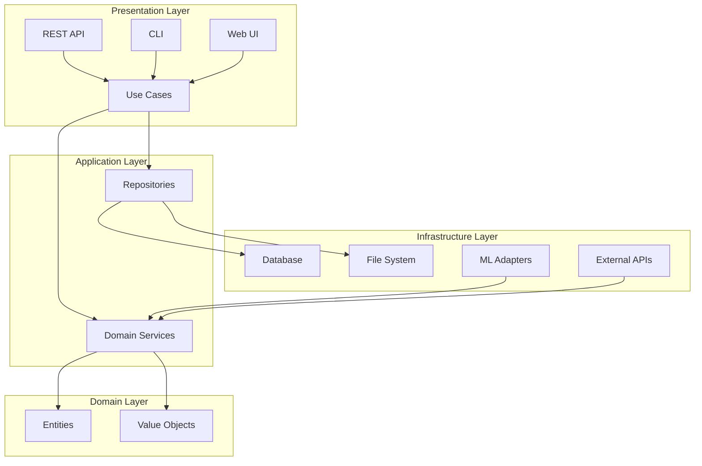
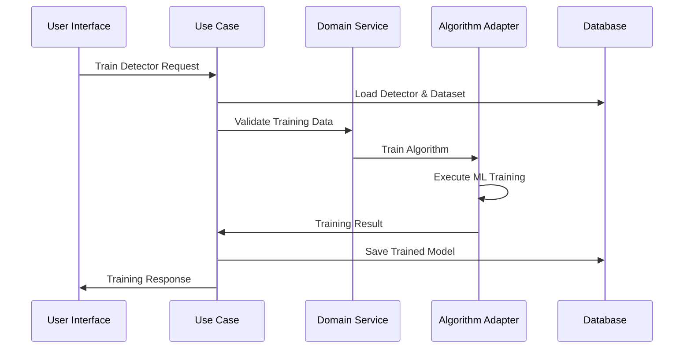
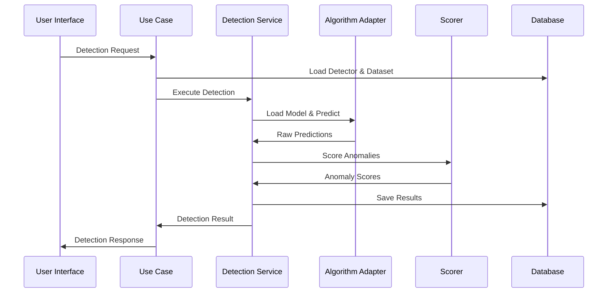

# Pynomaly Architecture Guide

🍞 **Breadcrumb:** 🏠 [Home](../index.md) > 💡 [Examples](README.md) > 📁 Tutorials > 📄 02 Pynomaly Architecture Guide

---


## Overview

Pynomaly follows Clean Architecture principles combined with Domain-Driven Design (DDD) and Hexagonal Architecture (Ports & Adapters) patterns. This guide provides a comprehensive overview of the system architecture, design decisions, and implementation patterns.

## Table of Contents

1. [Architectural Principles](#architectural-principles)
2. [System Architecture](#system-architecture)
3. [Layer Design](#layer-design)
4. [Component Architecture](#component-architecture)
5. [Data Flow](#data-flow)
6. [Integration Patterns](#integration-patterns)
7. [Scalability and Performance](#scalability-and-performance)
8. [Security Architecture](#security-architecture)

## Architectural Principles

### Core Principles

1. **Separation of Concerns**: Each layer has distinct responsibilities
2. **Dependency Inversion**: High-level modules don't depend on low-level modules
3. **Interface Segregation**: Clients depend only on interfaces they use
4. **Single Responsibility**: Each component has one reason to change
5. **Open/Closed Principle**: Open for extension, closed for modification

### Design Patterns Applied

- **Repository Pattern**: Data access abstraction
- **Factory Pattern**: Object creation and algorithm instantiation
- **Strategy Pattern**: Interchangeable algorithms
- **Observer Pattern**: Event-driven architecture
- **Decorator Pattern**: Feature enhancement
- **Chain of Responsibility**: Data processing pipelines

## System Architecture

### High-Level Architecture

```
┌─────────────────────────────────────────────────────────────┐
│                    Presentation Layer                       │
├─────────────────┬─────────────────┬─────────────────────────┤
│   REST API      │   CLI Interface │   Web UI (PWA)         │
│   (FastAPI)     │   (Typer)       │   (HTMX + Tailwind)    │
└─────────────────┴─────────────────┴─────────────────────────┘
                              │
┌─────────────────────────────────────────────────────────────┐
│                   Application Layer                         │
├─────────────────┬─────────────────┬─────────────────────────┤
│   Use Cases     │   Services      │   DTOs                  │
│   - DetectAnom  │   - Detection   │   - Requests           │
│   - TrainModel  │   - Ensemble    │   - Responses          │
│   - Evaluate    │   - AutoML      │   - Mappers            │
└─────────────────┴─────────────────┴─────────────────────────┘
                              │
┌─────────────────────────────────────────────────────────────┐
│                     Domain Layer                            │
├─────────────────┬─────────────────┬─────────────────────────┤
│   Entities      │   Value Objects │   Domain Services       │
│   - Anomaly     │   - AnomalyScore│   - Scorer             │
│   - Detector    │   - ContamRate  │   - Validator          │
│   - Dataset     │   - Confidence  │   - Aggregator         │
└─────────────────┴─────────────────┴─────────────────────────┘
                              │
┌─────────────────────────────────────────────────────────────┐
│                 Infrastructure Layer                        │
├─────────────────┬─────────────────┬─────────────────────────┤
│   Adapters      │   Persistence   │   External Services     │
│   - PyOD        │   - Database    │   - Auth               │
│   - PyTorch     │   - File System │   - Monitoring         │
│   - JAX         │   - Cache       │   - Messaging          │
└─────────────────┴─────────────────┴─────────────────────────┘
```

### Component Interaction



## Layer Design

### 1. Domain Layer (Core Business Logic)

The domain layer contains the core business logic and is independent of external concerns.

#### Entities

```python
# domain/entities/detector.py
@dataclass
class Detector:
    """Core detector entity representing an anomaly detection model."""
    
    id: DetectorId
    name: str
    algorithm: AlgorithmType
    parameters: Dict[str, Any]
    status: DetectorStatus
    created_at: datetime
    trained_at: Optional[datetime] = None
    version: str = "1.0.0"
    
    def is_trained(self) -> bool:
        return self.status == DetectorStatus.TRAINED
    
    def can_detect(self) -> bool:
        return self.is_trained() and self.status == DetectorStatus.ACTIVE
```

#### Value Objects

```python
# domain/value_objects/anomaly_score.py
@dataclass(frozen=True)
class AnomalyScore:
    """Immutable anomaly score with validation."""
    
    value: float
    confidence: float
    
    def __post_init__(self):
        if not 0.0 <= self.value <= 1.0:
            raise ValueError("Anomaly score must be between 0 and 1")
        if not 0.0 <= self.confidence <= 1.0:
            raise ValueError("Confidence must be between 0 and 1")
    
    def is_anomaly(self, threshold: float = 0.5) -> bool:
        return self.value >= threshold
```

#### Domain Services

```python
# domain/services/anomaly_scorer.py
class AnomalyScorer:
    """Domain service for scoring anomalies."""
    
    def score_samples(
        self, 
        predictions: np.ndarray, 
        confidence: np.ndarray
    ) -> List[AnomalyScore]:
        """Convert raw predictions to domain-specific scores."""
        return [
            AnomalyScore(value=pred, confidence=conf)
            for pred, conf in zip(predictions, confidence)
        ]
    
    def calculate_threshold(
        self, 
        scores: List[AnomalyScore], 
        contamination_rate: ContaminationRate
    ) -> float:
        """Calculate optimal threshold based on contamination rate."""
        values = [score.value for score in scores]
        return np.percentile(values, (1 - contamination_rate.value) * 100)
```

### 2. Application Layer (Use Cases and Services)

The application layer orchestrates the domain layer and handles use cases.

#### Use Cases

```python
# application/use_cases/detect_anomalies.py
class DetectAnomaliesUseCase:
    """Use case for detecting anomalies in data."""
    
    def __init__(
        self,
        detector_repository: DetectorRepository,
        dataset_repository: DatasetRepository,
        detection_service: DetectionService
    ):
        self._detector_repo = detector_repository
        self._dataset_repo = dataset_repository
        self._detection_service = detection_service
    
    async def execute(
        self, 
        request: DetectAnomaliesRequest
    ) -> DetectAnomaliesResponse:
        """Execute anomaly detection use case."""
        
        # 1. Validate inputs
        detector = await self._detector_repo.find_by_id(request.detector_id)
        if not detector.can_detect():
            raise DetectorNotReadyError(f"Detector {detector.id} not ready")
        
        dataset = await self._dataset_repo.find_by_id(request.dataset_id)
        
        # 2. Execute detection
        result = await self._detection_service.detect(
            detector=detector,
            data=dataset.data,
            threshold=request.threshold
        )
        
        # 3. Return response
        return DetectAnomaliesResponse(
            detection_id=result.id,
            anomalies=result.anomalies,
            metrics=result.metrics,
            processing_time=result.processing_time
        )
```

#### Application Services

```python
# application/services/detection_service.py
class DetectionService:
    """Application service for anomaly detection orchestration."""
    
    def __init__(
        self,
        algorithm_factory: AlgorithmFactory,
        anomaly_scorer: AnomalyScorer,
        result_repository: ResultRepository
    ):
        self._algorithm_factory = algorithm_factory
        self._anomaly_scorer = anomaly_scorer
        self._result_repo = result_repository
    
    async def detect(
        self,
        detector: Detector,
        data: np.ndarray,
        threshold: float
    ) -> DetectionResult:
        """Orchestrate the anomaly detection process."""
        
        # 1. Get algorithm implementation
        algorithm = self._algorithm_factory.create(detector.algorithm)
        
        # 2. Load trained model
        model = await algorithm.load_model(detector.id)
        
        # 3. Predict anomalies
        predictions = await algorithm.predict(model, data)
        
        # 4. Score results
        scores = self._anomaly_scorer.score_samples(
            predictions.scores, 
            predictions.confidence
        )
        
        # 5. Create result
        result = DetectionResult(
            detector_id=detector.id,
            scores=scores,
            threshold=threshold,
            timestamp=datetime.utcnow()
        )
        
        # 6. Persist result
        await self._result_repo.save(result)
        
        return result
```

### 3. Infrastructure Layer (External Integrations)

The infrastructure layer handles all external concerns and implements interfaces defined in the domain/application layers.

#### Algorithm Adapters

```python
# infrastructure/adapters/pyod_adapter.py
class PyODAdapter(DetectorProtocol):
    """Adapter for PyOD anomaly detection algorithms."""
    
    def __init__(self, algorithm_name: str):
        self._algorithm_name = algorithm_name
        self._model_registry = {
            "IsolationForest": IForest,
            "LOF": LOF,
            "OneClassSVM": OCSVM
        }
    
    async def train(
        self, 
        data: np.ndarray, 
        parameters: Dict[str, Any]
    ) -> TrainingResult:
        """Train PyOD model with given data and parameters."""
        
        # 1. Get algorithm class
        AlgorithmClass = self._model_registry[self._algorithm_name]
        
        # 2. Initialize model with parameters
        model = AlgorithmClass(**parameters)
        
        # 3. Train model
        start_time = time.time()
        model.fit(data)
        training_time = time.time() - start_time
        
        # 4. Return result
        return TrainingResult(
            model=model,
            training_time=training_time,
            metrics=self._calculate_training_metrics(model, data)
        )
    
    async def predict(
        self, 
        model: Any, 
        data: np.ndarray
    ) -> PredictionResult:
        """Make predictions using trained PyOD model."""
        
        # 1. Get predictions
        predictions = model.decision_function(data)
        labels = model.predict(data)
        
        # 2. Calculate confidence scores
        confidence = model.predict_proba(data)[:, 1] if hasattr(model, 'predict_proba') else np.ones_like(predictions)
        
        # 3. Normalize scores
        normalized_scores = self._normalize_scores(predictions)
        
        return PredictionResult(
            scores=normalized_scores,
            labels=labels,
            confidence=confidence
        )
```

#### Repository Implementations

```python
# infrastructure/persistence/database_repositories.py
class SQLDetectorRepository(DetectorRepository):
    """SQL database implementation of detector repository."""
    
    def __init__(self, session_factory: Callable[[], AsyncSession]):
        self._session_factory = session_factory
    
    async def save(self, detector: Detector) -> None:
        """Save detector to database."""
        async with self._session_factory() as session:
            # Map domain entity to database model
            db_detector = DetectorModel(
                id=str(detector.id),
                name=detector.name,
                algorithm=detector.algorithm.value,
                parameters=json.dumps(detector.parameters),
                status=detector.status.value,
                created_at=detector.created_at,
                trained_at=detector.trained_at,
                version=detector.version
            )
            
            session.add(db_detector)
            await session.commit()
    
    async def find_by_id(self, detector_id: DetectorId) -> Optional[Detector]:
        """Find detector by ID."""
        async with self._session_factory() as session:
            query = select(DetectorModel).where(DetectorModel.id == str(detector_id))
            result = await session.execute(query)
            db_detector = result.scalar_one_or_none()
            
            if not db_detector:
                return None
            
            # Map database model to domain entity
            return Detector(
                id=DetectorId(db_detector.id),
                name=db_detector.name,
                algorithm=AlgorithmType(db_detector.algorithm),
                parameters=json.loads(db_detector.parameters),
                status=DetectorStatus(db_detector.status),
                created_at=db_detector.created_at,
                trained_at=db_detector.trained_at,
                version=db_detector.version
            )
```

### 4. Presentation Layer (User Interfaces)

The presentation layer provides various interfaces for interacting with the system.

#### REST API

```python
# presentation/api/endpoints/detection.py
@router.post("/detect", response_model=DetectionResponse)
async def detect_anomalies(
    request: DetectionRequest,
    use_case: DetectAnomaliesUseCase = Depends(get_detection_use_case),
    current_user: User = Depends(get_current_user)
) -> DetectionResponse:
    """REST endpoint for anomaly detection."""
    
    try:
        # Convert API request to use case request
        use_case_request = DetectAnomaliesRequest(
            detector_id=DetectorId(request.detector_id),
            dataset_id=DatasetId(request.dataset_id),
            threshold=request.threshold,
            user_id=current_user.id
        )
        
        # Execute use case
        result = await use_case.execute(use_case_request)
        
        # Convert use case response to API response
        return DetectionResponse(
            detection_id=str(result.detection_id),
            anomalies=[
                AnomalyResponse(
                    score=anomaly.score.value,
                    confidence=anomaly.score.confidence,
                    sample_index=anomaly.sample_index
                )
                for anomaly in result.anomalies
            ],
            metrics=MetricsResponse(
                total_samples=result.metrics.total_samples,
                anomalies_detected=result.metrics.anomalies_detected,
                processing_time_ms=result.metrics.processing_time_ms
            )
        )
        
    except DomainException as e:
        raise HTTPException(status_code=400, detail=str(e))
    except Exception as e:
        raise HTTPException(status_code=500, detail="Internal server error")
```

#### CLI Interface

```python
# presentation/cli/detection.py
@app.command()
def detect(
    detector_name: str = typer.Option(..., help="Name of the detector to use"),
    dataset_path: str = typer.Option(..., help="Path to dataset file"),
    threshold: float = typer.Option(0.5, help="Anomaly threshold"),
    output: Optional[str] = typer.Option(None, help="Output file path")
):
    """Detect anomalies using trained detector."""
    
    try:
        # Get container and dependencies
        container = get_cli_container()
        use_case = container.detect_anomalies_use_case()
        
        # Load dataset
        dataset = load_dataset_from_file(dataset_path)
        
        # Create request
        request = DetectAnomaliesRequest(
            detector_id=DetectorId(detector_name),
            dataset_id=dataset.id,
            threshold=threshold
        )
        
        # Execute detection
        with console.status("Detecting anomalies..."):
            result = asyncio.run(use_case.execute(request))
        
        # Display results
        display_detection_results(result, output)
        
    except Exception as e:
        console.print(f"[red]Error:[/red] {e}")
        raise typer.Exit(1)
```

## Data Flow

### Training Flow



### Detection Flow



## Integration Patterns

### Algorithm Integration

New algorithms are integrated through the adapter pattern:

```python
# Define protocol for all algorithms
class DetectorProtocol(Protocol):
    async def train(self, data: np.ndarray, parameters: Dict[str, Any]) -> TrainingResult:
        ...
    
    async def predict(self, model: Any, data: np.ndarray) -> PredictionResult:
        ...
    
    async def save_model(self, model: Any, path: str) -> None:
        ...
    
    async def load_model(self, path: str) -> Any:
        ...

# Implement adapter for new library
class NewLibraryAdapter(DetectorProtocol):
    """Adapter for integrating new anomaly detection library."""
    
    async def train(self, data: np.ndarray, parameters: Dict[str, Any]) -> TrainingResult:
        # Implementation specific to new library
        pass
```

### Data Source Integration

Data sources are integrated through the data loader protocol:

```python
class DataLoaderProtocol(Protocol):
    async def load(self, source: str, **kwargs) -> Dataset:
        ...
    
    async def validate(self, dataset: Dataset) -> ValidationResult:
        ...
    
    def supported_formats(self) -> List[str]:
        ...

# Register new data loader
class S3DataLoader(DataLoaderProtocol):
    """Load data from AWS S3."""
    
    async def load(self, source: str, **kwargs) -> Dataset:
        # S3-specific loading logic
        pass
```

### External Service Integration

External services are integrated through dependency injection:

```python
# Define interface
class NotificationService(Protocol):
    async def send_alert(self, message: str, recipients: List[str]) -> None:
        ...

# Implement concrete service
class SlackNotificationService(NotificationService):
    async def send_alert(self, message: str, recipients: List[str]) -> None:
        # Slack-specific implementation
        pass

# Configure in container
container.notification_service.override(
    providers.Singleton(SlackNotificationService)
)
```

## Scalability and Performance

### Horizontal Scaling

```yaml
# Kubernetes horizontal pod autoscaler
apiVersion: autoscaling/v2
kind: HorizontalPodAutoscaler
metadata:
  name: pynomaly-api-hpa
spec:
  scaleTargetRef:
    apiVersion: apps/v1
    kind: Deployment
    name: pynomaly-api
  minReplicas: 2
  maxReplicas: 10
  metrics:
  - type: Resource
    resource:
      name: cpu
      target:
        type: Utilization
        averageUtilization: 70
  - type: Resource
    resource:
      name: memory
      target:
        type: Utilization
        averageUtilization: 80
```

### Caching Strategy

```python
# Multi-level caching architecture
class CacheManager:
    def __init__(self):
        self.l1_cache = LRUCache(maxsize=1000)  # In-memory
        self.l2_cache = RedisCache()            # Distributed
        self.l3_cache = DatabaseCache()         # Persistent
    
    async def get(self, key: str) -> Optional[Any]:
        # Try L1 cache first
        value = self.l1_cache.get(key)
        if value is not None:
            return value
        
        # Try L2 cache
        value = await self.l2_cache.get(key)
        if value is not None:
            self.l1_cache.set(key, value)
            return value
        
        # Try L3 cache
        value = await self.l3_cache.get(key)
        if value is not None:
            await self.l2_cache.set(key, value)
            self.l1_cache.set(key, value)
            return value
        
        return None
```

### Asynchronous Processing

```python
# Background task processing
class TaskProcessor:
    def __init__(self, queue: AsyncQueue):
        self.queue = queue
        self.workers = []
    
    async def start_workers(self, num_workers: int = 4):
        for i in range(num_workers):
            worker = asyncio.create_task(self._worker(f"worker-{i}"))
            self.workers.append(worker)
    
    async def _worker(self, name: str):
        while True:
            try:
                task = await self.queue.get()
                await self._process_task(task)
                self.queue.task_done()
            except asyncio.CancelledError:
                break
            except Exception as e:
                logger.error(f"Worker {name} error: {e}")
```

## Security Architecture

### Authentication and Authorization

```python
# JWT-based authentication
class JWTAuthService:
    def __init__(self, secret_key: str, algorithm: str = "HS256"):
        self.secret_key = secret_key
        self.algorithm = algorithm
    
    def create_access_token(self, user: User) -> str:
        payload = {
            "sub": str(user.id),
            "username": user.username,
            "roles": user.roles,
            "exp": datetime.utcnow() + timedelta(hours=24)
        }
        return jwt.encode(payload, self.secret_key, algorithm=self.algorithm)
    
    def verify_token(self, token: str) -> TokenPayload:
        try:
            payload = jwt.decode(token, self.secret_key, algorithms=[self.algorithm])
            return TokenPayload(**payload)
        except jwt.ExpiredSignatureError:
            raise AuthenticationError("Token expired")
        except jwt.InvalidTokenError:
            raise AuthenticationError("Invalid token")

# Role-based access control
class PermissionChecker:
    def __init__(self, required_permissions: List[str]):
        self.required_permissions = required_permissions
    
    def check_permissions(self, user: User) -> bool:
        user_permissions = self._get_user_permissions(user)
        return all(perm in user_permissions for perm in self.required_permissions)
```

### Data Security

```python
# Encryption service
class EncryptionService:
    def __init__(self, key: bytes):
        self.cipher_suite = Fernet(key)
    
    def encrypt_sensitive_data(self, data: Dict[str, Any]) -> Dict[str, Any]:
        encrypted_data = {}
        for key, value in data.items():
            if self._is_sensitive_field(key):
                encrypted_data[key] = self.cipher_suite.encrypt(
                    json.dumps(value).encode()
                ).decode()
            else:
                encrypted_data[key] = value
        return encrypted_data
    
    def decrypt_sensitive_data(self, data: Dict[str, Any]) -> Dict[str, Any]:
        decrypted_data = {}
        for key, value in data.items():
            if self._is_sensitive_field(key):
                decrypted_value = self.cipher_suite.decrypt(value.encode())
                decrypted_data[key] = json.loads(decrypted_value.decode())
            else:
                decrypted_data[key] = value
        return decrypted_data
```

## Conclusion

The Pynomaly architecture is designed for maintainability, scalability, and extensibility. The clean separation of concerns allows for independent development and testing of components, while the hexagonal architecture enables easy integration of new algorithms and data sources.

Key architectural benefits:
- **Testability**: Each layer can be tested independently
- **Maintainability**: Clear separation of concerns
- **Extensibility**: Easy to add new algorithms and integrations
- **Scalability**: Designed for horizontal scaling
- **Security**: Built-in security patterns and practices

This architecture supports the evolution of the system while maintaining stability and performance in production environments.

---

## 🔗 **Related Documentation**

### **Getting Started**
- **[Installation Guide](../../getting-started/installation.md)** - Setup and installation
- **[Quick Start](../../getting-started/quickstart.md)** - Your first detection
- **[Platform Setup](../../getting-started/platform-specific/)** - Platform-specific guides

### **User Guides**
- **[Basic Usage](../basic-usage/README.md)** - Essential functionality
- **[Advanced Features](../advanced-features/README.md)** - Sophisticated capabilities  
- **[Troubleshooting](../troubleshooting/README.md)** - Problem solving

### **Reference**
- **[Algorithm Reference](../../reference/algorithms/README.md)** - Algorithm documentation
- **[API Documentation](../../developer-guides/api-integration/README.md)** - Programming interfaces
- **[Configuration](../../reference/configuration/)** - System configuration

### **Examples**
- **[Examples & Tutorials](../../examples/README.md)** - Real-world use cases
- **[Banking Examples](../../examples/banking/)** - Financial fraud detection
- **[Notebooks](../../examples/notebooks/)** - Interactive examples

---

## 🆘 **Getting Help**

- **[Troubleshooting Guide](../troubleshooting/troubleshooting.md)** - Common issues and solutions
- **[GitHub Issues](https://github.com/your-org/pynomaly/issues)** - Report bugs and request features
- **[GitHub Discussions](https://github.com/your-org/pynomaly/discussions)** - Ask questions and share ideas
- **[Security Issues](mailto:security@pynomaly.org)** - Report security vulnerabilities
