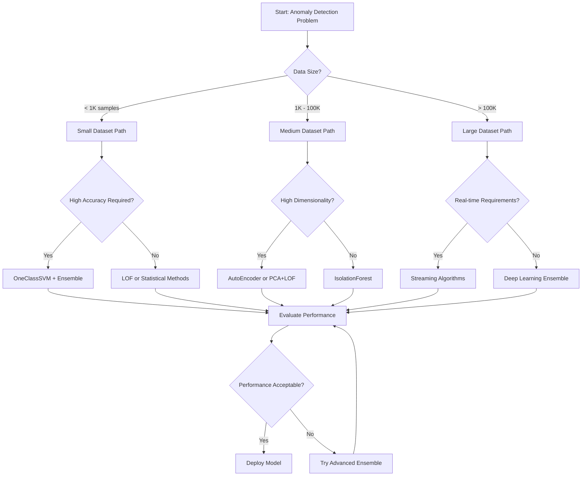
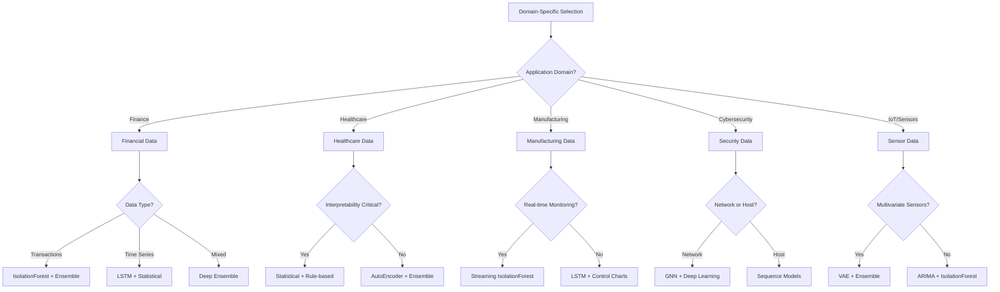

# Algorithm Rationale and Selection Guide

🍞 **Breadcrumb:** 🏠 [Home](../index.md) > 💡 [Examples](README.md) > 📁 Tutorials > 📄 05 Algorithm Rationale Selection Guide

---


## Overview

Selecting the right anomaly detection algorithm is crucial for optimal performance. This guide provides comprehensive rationale for each algorithm type, detailed selection criteria, and practical decision-making frameworks to help you choose the most appropriate approach for your specific use case.

## Table of Contents

1. [Algorithm Selection Framework](#algorithm-selection-framework)
2. [Decision Trees and Flowcharts](#decision-trees-and-flowcharts)
3. [Algorithm Rationale by Category](#algorithm-rationale-by-category)
4. [Use Case Specific Recommendations](#use-case-specific-recommendations)
5. [Performance vs. Resource Trade-offs](#performance-vs-resource-trade-offs)
6. [Common Pitfalls and Solutions](#common-pitfalls-and-solutions)
7. [Expert Decision Guidelines](#expert-decision-guidelines)

## Algorithm Selection Framework

### Multi-Criteria Decision Matrix

The algorithm selection process considers multiple factors weighted by importance:

| Criterion | Weight | Description | Measurement |
|-----------|--------|-------------|-------------|
| **Data Characteristics** | 30% | Size, dimensionality, type, distribution | Objective metrics |
| **Performance Requirements** | 25% | Accuracy, precision, recall, F1-score | Validation results |
| **Computational Constraints** | 20% | Training time, prediction speed, memory | Resource monitoring |
| **Interpretability Needs** | 15% | Explainability, transparency, trust | Subjective assessment |
| **Domain Requirements** | 10% | Compliance, regulations, industry standards | Domain expertise |

### Selection Process

```python
class AlgorithmSelector:
    """Systematic algorithm selection framework."""
    
    def __init__(self):
        self.criteria_weights = {
            "data_characteristics": 0.30,
            "performance_requirements": 0.25,
            "computational_constraints": 0.20,
            "interpretability_needs": 0.15,
            "domain_requirements": 0.10
        }
        
        self.algorithm_scores = self._initialize_algorithm_scores()
    
    def select_optimal_algorithm(
        self,
        data_profile: DataProfile,
        requirements: Requirements
    ) -> AlgorithmRecommendation:
        """Select optimal algorithm based on systematic evaluation."""
        
        # Score each algorithm against criteria
        algorithm_ratings = {}
        
        for algorithm in self.available_algorithms:
            total_score = 0
            
            for criterion, weight in self.criteria_weights.items():
                criterion_score = self._evaluate_criterion(
                    algorithm, criterion, data_profile, requirements
                )
                total_score += criterion_score * weight
            
            algorithm_ratings[algorithm] = total_score
        
        # Rank algorithms by total score
        ranked_algorithms = sorted(
            algorithm_ratings.items(),
            key=lambda x: x[1],
            reverse=True
        )
        
        return AlgorithmRecommendation(
            primary=ranked_algorithms[0][0],
            alternatives=ranked_algorithms[1:4],
            rationale=self._generate_rationale(ranked_algorithms, data_profile),
            confidence=self._calculate_confidence(ranked_algorithms)
        )
```

### Data Characteristics Assessment

#### 1. Dataset Size Categories

```python
def categorize_dataset_size(n_samples: int, n_features: int) -> str:
    """Categorize dataset by size for algorithm selection."""
    
    if n_samples < 1000:
        return "small"
    elif n_samples < 10000:
        return "medium" 
    elif n_samples < 100000:
        return "large"
    else:
        return "very_large"

# Algorithm suitability by dataset size
size_suitability = {
    "small": {
        "recommended": ["LOF", "OneClassSVM", "EllipticEnvelope"],
        "suitable": ["IsolationForest", "ZScore"],
        "avoid": ["DeepLearning", "LSTM", "Transformer"]
    },
    "medium": {
        "recommended": ["IsolationForest", "LOF", "RandomForest"],
        "suitable": ["OneClassSVM", "AutoEncoder", "PCA"],
        "avoid": ["GNN", "Transformer"]
    },
    "large": {
        "recommended": ["IsolationForest", "AutoEncoder", "Ensemble"],
        "suitable": ["RandomForest", "GradientBoosting", "LSTM"],
        "avoid": ["OneClassSVM", "LOF"]
    },
    "very_large": {
        "recommended": ["DistributedIsolationForest", "DeepEnsemble"],
        "suitable": ["StreamingAlgorithms", "MiniBatchKMeans"],
        "avoid": ["LOF", "OneClassSVM", "ExactMethods"]
    }
}
```

#### 2. Dimensionality Impact

```python
def assess_dimensionality_impact(n_features: int) -> Dict[str, Any]:
    """Assess how dimensionality affects algorithm choice."""
    
    if n_features <= 10:
        return {
            "category": "low_dimensional",
            "challenges": ["Limited feature interactions"],
            "recommended": ["LOF", "OneClassSVM", "Statistical"],
            "considerations": ["Feature engineering may help"]
        }
    elif n_features <= 100:
        return {
            "category": "medium_dimensional", 
            "challenges": ["Moderate curse of dimensionality"],
            "recommended": ["IsolationForest", "PCA", "AutoEncoder"],
            "considerations": ["Consider feature selection"]
        }
    elif n_features <= 1000:
        return {
            "category": "high_dimensional",
            "challenges": ["Curse of dimensionality", "Sparse data"],
            "recommended": ["AutoEncoder", "PCA+LOF", "DeepLearning"],
            "considerations": ["Dimensionality reduction essential"]
        }
    else:
        return {
            "category": "very_high_dimensional",
            "challenges": ["Severe sparsity", "Computational complexity"],
            "recommended": ["DeepAutoEncoder", "RandomProjection"],
            "considerations": ["Advanced feature selection required"]
        }
```

#### 3. Data Type Analysis

```python
def analyze_data_types(data: np.ndarray) -> DataTypeProfile:
    """Analyze data types and their impact on algorithm selection."""
    
    profile = DataTypeProfile()
    
    # Numerical data assessment
    numerical_features = self._identify_numerical_features(data)
    profile.numerical = {
        "count": len(numerical_features),
        "distributions": self._analyze_distributions(data[:, numerical_features]),
        "scaling_needed": self._assess_scaling_needs(data[:, numerical_features]),
        "outliers_present": self._detect_outliers(data[:, numerical_features])
    }
    
    # Categorical data assessment  
    categorical_features = self._identify_categorical_features(data)
    profile.categorical = {
        "count": len(categorical_features),
        "cardinalities": self._calculate_cardinalities(data[:, categorical_features]),
        "encoding_strategy": self._recommend_encoding(data[:, categorical_features]),
        "rare_categories": self._identify_rare_categories(data[:, categorical_features])
    }
    
    # Temporal data assessment
    temporal_features = self._identify_temporal_features(data)
    profile.temporal = {
        "count": len(temporal_features),
        "seasonality": self._detect_seasonality(data[:, temporal_features]),
        "trends": self._detect_trends(data[:, temporal_features]),
        "frequency": self._determine_frequency(data[:, temporal_features])
    }
    
    return profile
```

## Decision Trees and Flowcharts

### Primary Algorithm Selection Flowchart



### Domain-Specific Decision Tree



### Performance vs. Resource Decision Matrix

```python
def create_performance_resource_matrix():
    """Create decision matrix balancing performance and resources."""
    
    return {
        "high_performance_low_resource": {
            "algorithms": ["IsolationForest", "RandomForest"],
            "use_cases": ["Production systems", "Edge computing"],
            "trade_offs": "Good balance of accuracy and efficiency"
        },
        "high_performance_high_resource": {
            "algorithms": ["DeepEnsemble", "Transformer", "GNN"],
            "use_cases": ["Critical applications", "Research"],
            "trade_offs": "Maximum accuracy, high computational cost"
        },
        "medium_performance_low_resource": {
            "algorithms": ["Statistical methods", "PCA", "k-NN"],
            "use_cases": ["Baseline models", "Resource-constrained"],
            "trade_offs": "Fast and interpretable, limited accuracy"
        },
        "medium_performance_medium_resource": {
            "algorithms": ["LOF", "OneClassSVM", "AutoEncoder"],
            "use_cases": ["General applications", "Development"],
            "trade_offs": "Balanced approach for most scenarios"
        }
    }
```

## Algorithm Rationale by Category

### Statistical Methods

#### When to Choose Statistical Methods

**Ideal Scenarios:**
- Small to medium datasets (< 10K samples)
- Well-understood data distributions
- High interpretability requirements
- Regulatory compliance needs
- Baseline model development
- Quick prototyping

**Rationale:**
Statistical methods provide:
- **Theoretical Foundation**: Solid mathematical basis
- **Interpretability**: Clear understanding of decisions
- **Speed**: Fast computation and prediction
- **Simplicity**: Easy to implement and understand
- **Robustness**: Less prone to overfitting

#### Algorithm-Specific Rationale

##### Isolation Forest
```python
isolation_forest_rationale = {
    "strengths": [
        "Excellent scalability to high dimensions",
        "No assumptions about data distribution", 
        "Fast training and prediction",
        "Effective for global anomalies",
        "Minimal parameter tuning required"
    ],
    "ideal_for": [
        "High-dimensional tabular data",
        "Production systems requiring speed",
        "General-purpose anomaly detection",
        "Baseline model establishment"
    ],
    "limitations": [
        "May miss local patterns",
        "Less effective for very small datasets",
        "Limited interpretability of individual predictions"
    ],
    "when_to_avoid": [
        "Highly interpretable results required",
        "Strong local patterns present",
        "Very small datasets (< 100 samples)"
    ]
}
```

##### Local Outlier Factor (LOF)
```python
lof_rationale = {
    "strengths": [
        "Excellent for local anomalies",
        "Adapts to varying data density",
        "Intuitive interpretation",
        "No distribution assumptions"
    ],
    "ideal_for": [
        "Datasets with clusters of varying density",
        "Local pattern anomalies",
        "Small to medium datasets",
        "Spatial data analysis"
    ],
    "limitations": [
        "Poor scalability to large datasets",
        "Sensitive to parameter choices",
        "High memory requirements",
        "Struggles with high dimensions"
    ],
    "when_to_avoid": [
        "Large datasets (> 100K samples)",
        "High-dimensional data (> 50 features)",
        "Real-time processing requirements"
    ]
}
```

### Machine Learning Methods

#### When to Choose ML Methods

**Ideal Scenarios:**
- Medium to large datasets (1K - 100K samples)
- Balanced performance requirements
- Mixed data types
- Production deployment
- Ensemble approaches

**Rationale:**
ML methods offer:
- **Flexibility**: Handle various data types and patterns
- **Performance**: Good accuracy-speed balance
- **Robustness**: Less sensitive to outliers during training
- **Scalability**: Handle reasonably large datasets
- **Feature Learning**: Automatic pattern recognition

#### Algorithm-Specific Rationale

##### Random Forest for Anomaly Detection
```python
random_forest_rationale = {
    "strengths": [
        "Handles mixed data types naturally",
        "Provides feature importance",
        "Robust to outliers and noise",
        "Good performance without tuning",
        "Parallelizable training"
    ],
    "ideal_for": [
        "Mixed numerical/categorical data",
        "Feature importance analysis",
        "Robust baseline models",
        "Ensemble components"
    ],
    "limitations": [
        "Can overfit with too many trees",
        "Memory intensive for large forests",
        "Less interpretable than single trees"
    ],
    "preprocessing_needs": [
        "Categorical encoding",
        "Missing value handling",
        "Optional scaling"
    ]
}
```

### Deep Learning Methods

#### When to Choose Deep Learning

**Ideal Scenarios:**
- Large datasets (> 10K samples)
- High-dimensional data
- Complex patterns
- Feature learning required
- Maximum accuracy needed

**Rationale:**
Deep learning excels at:
- **Pattern Recognition**: Complex, non-linear patterns
- **Feature Learning**: Automatic feature extraction
- **Scalability**: Handles very large datasets
- **Flexibility**: Adaptable architectures
- **State-of-the-art Performance**: Best results for complex data

#### Architecture Selection Rationale

##### AutoEncoder
```python
autoencoder_rationale = {
    "architecture_choice": {
        "symmetric": "For reconstruction-based detection",
        "asymmetric": "For compressed representation learning",
        "deep": "For complex pattern learning",
        "sparse": "For feature selection during learning"
    },
    "when_optimal": [
        "High-dimensional data (> 100 features)",
        "Complex non-linear patterns",
        "Unsupervised learning scenarios",
        "Feature learning required"
    ],
    "hyperparameter_sensitivity": {
        "learning_rate": "High - affects convergence",
        "architecture_depth": "Medium - balances complexity",
        "regularization": "High - prevents overfitting"
    }
}
```

##### LSTM for Sequential Data
```python
lstm_rationale = {
    "sequential_data_strengths": [
        "Captures long-term dependencies",
        "Handles variable sequence lengths",
        "Learns temporal patterns automatically",
        "Robust to missing time steps"
    ],
    "optimal_applications": [
        "Time series anomaly detection",
        "Log file analysis",
        "Sensor data streams",
        "User behavior sequences"
    ],
    "architecture_decisions": {
        "single_layer": "Simple patterns, fast training",
        "multiple_layers": "Complex temporal patterns",
        "bidirectional": "Full sequence context available",
        "attention_mechanism": "Long sequences, interpretability"
    }
}
```

### Specialized Methods

#### Graph Neural Networks (GNN)

```python
gnn_selection_rationale = {
    "data_requirements": [
        "Graph-structured data",
        "Node and edge features available",
        "Relationship information crucial",
        "Network/social data"
    ],
    "architecture_choices": {
        "GCN": "General graph convolutions",
        "GraphSAGE": "Large graphs, inductive learning", 
        "GAT": "Attention-based, interpretable",
        "GIN": "Graph isomorphism, powerful"
    },
    "performance_factors": [
        "Graph size and density",
        "Feature quality",
        "Relationship strength",
        "Homophily vs. heterophily"
    ]
}
```

#### Time Series Specific Methods

```python
time_series_method_selection = {
    "ARIMA": {
        "best_for": ["Stationary series", "Linear trends", "Seasonal patterns"],
        "rationale": "Statistical foundation, interpretable, fast",
        "limitations": ["Assumes stationarity", "Linear relationships"]
    },
    "Prophet": {
        "best_for": ["Business time series", "Strong seasonality", "Holiday effects"],
        "rationale": "Handles missing data, robust to outliers, intuitive",
        "limitations": ["Daily/weekly data focus", "Less flexible"]
    },
    "LSTM": {
        "best_for": ["Complex patterns", "Long sequences", "Multivariate series"],
        "rationale": "Learns complex patterns, handles multiple variables",
        "limitations": ["Requires large datasets", "Less interpretable"]
    }
}
```

## Use Case Specific Recommendations

### Financial Services

#### Fraud Detection
```python
fraud_detection_recommendations = {
    "primary_algorithms": [
        {
            "algorithm": "IsolationForest",
            "rationale": "Fast detection, handles transaction volumes",
            "parameters": {
                "contamination": 0.01,  # Low fraud rate
                "n_estimators": 200,    # Stability
                "max_features": 0.8     # Feature sampling
            }
        },
        {
            "algorithm": "GradientBoosting", 
            "rationale": "High accuracy for critical decisions",
            "parameters": {
                "learning_rate": 0.05,
                "max_depth": 6,
                "n_estimators": 500
            }
        }
    ],
    "ensemble_strategy": {
        "combination": "Weighted voting",
        "weights": [0.6, 0.4],  # Favor speed over accuracy
        "threshold_optimization": "Maximize precision"
    },
    "preprocessing_pipeline": [
        "Numerical scaling",
        "Categorical encoding", 
        "Time-based features",
        "Velocity features",
        "Risk scoring"
    ]
}
```

#### Market Anomaly Detection
```python
market_anomaly_recommendations = {
    "data_characteristics": {
        "high_frequency": "Streaming algorithms required",
        "multi_asset": "Multivariate time series",
        "regime_changes": "Adaptive models needed"
    },
    "algorithm_selection": {
        "real_time": ["StreamingIsolationForest", "OnlineLSTM"],
        "batch_analysis": ["VAE", "Transformer", "LSTM"],
        "regime_detection": ["HMM", "ChangePointDetection"]
    },
    "performance_requirements": {
        "latency": "< 10ms for high-frequency trading",
        "accuracy": "High precision to avoid false alarms",
        "adaptability": "Quick adaptation to market changes"
    }
}
```

### Healthcare Applications

#### Medical Imaging Anomalies
```python
medical_imaging_recommendations = {
    "data_preparation": {
        "image_preprocessing": [
            "Normalization",
            "Noise reduction",
            "Region of interest extraction",
            "Data augmentation"
        ],
        "feature_extraction": [
            "CNN features",
            "Radiomics features", 
            "Traditional image features"
        ]
    },
    "algorithm_selection": {
        "primary": "ConvolutionalAutoEncoder",
        "rationale": "Spatial pattern recognition, feature learning",
        "architecture": {
            "encoder": "Progressive downsampling",
            "decoder": "Progressive upsampling", 
            "skip_connections": "Preserve fine details"
        }
    },
    "validation_strategy": {
        "cross_validation": "Patient-level splits",
        "metrics": ["Sensitivity", "Specificity", "AUC"],
        "clinical_validation": "Radiologist review required"
    }
}
```

#### Patient Monitoring
```python
patient_monitoring_recommendations = {
    "data_streams": [
        "Vital signs (ECG, BP, SpO2)",
        "Laboratory values",
        "Medication administration",
        "Clinical notes"
    ],
    "algorithm_strategy": {
        "multivariate_vitals": {
            "algorithm": "LSTM + Attention",
            "rationale": "Temporal dependencies, multiple signals"
        },
        "lab_values": {
            "algorithm": "IsolationForest",
            "rationale": "Sparse measurements, outlier detection"
        },
        "early_warning": {
            "algorithm": "Ensemble voting",
            "rationale": "High sensitivity required"
        }
    },
    "clinical_integration": {
        "interpretability": "SHAP explanations required",
        "alert_fatigue": "Precision optimization critical",
        "workflow_integration": "EMR compatibility needed"
    }
}
```

### Manufacturing and Quality Control

#### Predictive Maintenance
```python
predictive_maintenance_recommendations = {
    "sensor_data_analysis": {
        "algorithm": "LSTM + AutoEncoder hybrid",
        "rationale": "Temporal patterns + reconstruction errors",
        "preprocessing": [
            "Sensor calibration",
            "Missing value interpolation",
            "Feature engineering (RMS, peak, frequency)"
        ]
    },
    "failure_mode_detection": {
        "bearing_failures": "Frequency domain analysis + CNN",
        "motor_degradation": "Vibration analysis + LSTM",
        "thermal_issues": "Temperature pattern + Statistical control"
    },
    "deployment_considerations": {
        "edge_computing": "Lightweight models preferred",
        "maintenance_windows": "Batch processing acceptable",
        "safety_critical": "High precision, interpretable results"
    }
}
```

### Cybersecurity Applications

#### Network Intrusion Detection
```python
network_security_recommendations = {
    "traffic_analysis": {
        "flow_based": {
            "algorithm": "IsolationForest + Ensemble",
            "features": ["Packet counts", "Byte counts", "Duration", "Flags"],
            "rationale": "Fast processing, handles volume"
        },
        "packet_level": {
            "algorithm": "CNN + LSTM",
            "features": ["Packet sequences", "Payload patterns"],
            "rationale": "Deep pattern recognition"
        }
    },
    "attack_types": {
        "DDoS": "Statistical methods for volume detection",
        "APT": "Long-term behavioral analysis with LSTM", 
        "Malware": "Graph neural networks for propagation",
        "Insider_threats": "User behavior analytics"
    },
    "real_time_requirements": {
        "latency": "< 1ms for inline processing",
        "throughput": "Gbps traffic rates",
        "scalability": "Distributed processing required"
    }
}
```

## Performance vs. Resource Trade-offs

### Computational Complexity Analysis

```python
def analyze_computational_complexity():
    """Analyze time and space complexity for different algorithms."""
    
    complexity_analysis = {
        "IsolationForest": {
            "training_time": "O(n * log(n) * t)",  # n=samples, t=trees
            "prediction_time": "O(log(n) * t)",
            "memory": "O(t * max_depth)",
            "scalability": "Excellent",
            "parallelization": "Embarrassingly parallel"
        },
        "LOF": {
            "training_time": "O(n²)",
            "prediction_time": "O(k * n)",  # k=neighbors
            "memory": "O(n²)",
            "scalability": "Poor",
            "parallelization": "Limited"
        },
        "AutoEncoder": {
            "training_time": "O(epochs * n * hidden_units)",
            "prediction_time": "O(hidden_units)",
            "memory": "O(weights + activations)",
            "scalability": "Good with GPU",
            "parallelization": "Excellent on GPU"
        },
        "LSTM": {
            "training_time": "O(epochs * sequence_length * n * hidden_units)",
            "prediction_time": "O(sequence_length * hidden_units)",
            "memory": "O(sequence_length * hidden_units)",
            "scalability": "Moderate",
            "parallelization": "Limited by sequence dependencies"
        }
    }
    
    return complexity_analysis
```

### Resource Optimization Strategies

#### Memory-Constrained Environments
```python
memory_constrained_recommendations = {
    "small_memory": {
        "budget": "< 1GB",
        "algorithms": ["Statistical methods", "PCA", "Mini-batch k-means"],
        "strategies": [
            "Data sampling",
            "Online learning",
            "Feature selection",
            "Model compression"
        ]
    },
    "medium_memory": {
        "budget": "1-8GB", 
        "algorithms": ["IsolationForest", "Random Forest", "Simple AutoEncoder"],
        "strategies": [
            "Batch processing",
            "Model ensembles",
            "Moderate feature engineering"
        ]
    },
    "large_memory": {
        "budget": "> 8GB",
        "algorithms": ["Deep learning", "Complex ensembles", "Graph methods"],
        "strategies": [
            "Full dataset processing",
            "Complex models",
            "Extensive feature engineering"
        ]
    }
}
```

#### Speed-Critical Applications
```python
speed_critical_recommendations = {
    "ultra_low_latency": {
        "requirement": "< 1ms",
        "algorithms": ["Pre-computed thresholds", "Simple statistical"],
        "optimizations": [
            "Model precompilation",
            "Hardware acceleration",
            "Lookup tables"
        ]
    },
    "low_latency": {
        "requirement": "< 10ms",
        "algorithms": ["IsolationForest", "k-NN with indexing"],
        "optimizations": [
            "Model quantization",
            "Batch processing",
            "Caching"
        ]
    },
    "moderate_latency": {
        "requirement": "< 100ms",
        "algorithms": ["AutoEncoder", "Ensemble methods"],
        "optimizations": [
            "Model optimization",
            "Efficient inference",
            "Parallel processing"
        ]
    }
}
```

## Common Pitfalls and Solutions

### Algorithm Selection Pitfalls

#### 1. Inappropriate Algorithm for Data Size
```python
data_size_pitfalls = {
    "pitfall": "Using complex algorithms on small datasets",
    "consequence": "Overfitting, poor generalization",
    "solution": {
        "detection": "Cross-validation performance degradation",
        "mitigation": [
            "Use simpler algorithms (LOF, Statistical)",
            "Increase regularization",
            "Data augmentation",
            "Transfer learning"
        ]
    },
    "example": {
        "wrong": "Using deep AutoEncoder on 500 samples",
        "right": "Using LOF or OneClassSVM on 500 samples"
    }
}
```

#### 2. Ignoring Data Characteristics
```python
data_characteristics_pitfalls = {
    "pitfall": "Ignoring temporal dependencies in time series",
    "consequence": "Poor pattern recognition, data leakage",
    "solution": {
        "detection": "Unrealistic performance on standard splits",
        "mitigation": [
            "Use temporal validation splits",
            "Apply sequence-aware algorithms",
            "Feature engineering for temporal patterns"
        ]
    },
    "prevention": [
        "Thorough exploratory data analysis",
        "Domain expert consultation",
        "Proper validation strategies"
    ]
}
```

#### 3. Computational Resource Mismatches
```python
resource_mismatch_pitfalls = {
    "pitfall": "Choosing resource-intensive algorithms without adequate infrastructure",
    "consequence": "Training failures, poor user experience",
    "solution": {
        "assessment": [
            "Profile algorithm resource requirements",
            "Measure available computational resources",
            "Consider deployment constraints"
        ],
        "alternatives": [
            "Model compression techniques",
            "Distributed computing",
            "Cloud-based training",
            "Algorithm substitution"
        ]
    }
}
```

### Performance Optimization Pitfalls

#### 1. Premature Optimization
```python
premature_optimization_pitfall = {
    "description": "Optimizing for speed before achieving adequate accuracy",
    "symptoms": [
        "Fast but inaccurate models",
        "Complex optimization without clear need",
        "Reduced model interpretability"
    ],
    "prevention": [
        "Establish performance baselines first", 
        "Profile actual bottlenecks",
        "Maintain accuracy standards",
        "Measure real-world performance needs"
    ],
    "best_practice": "Optimize only after identifying actual performance bottlenecks"
}
```

#### 2. Hyperparameter Tunnel Vision
```python
hyperparameter_pitfall = {
    "description": "Over-focusing on hyperparameter tuning instead of algorithm selection",
    "symptoms": [
        "Extensive tuning of suboptimal algorithms",
        "Marginal improvements with significant effort",
        "Neglecting data quality issues"
    ],
    "solution": [
        "Try multiple algorithm families first",
        "Address data quality issues",
        "Use automated hyperparameter optimization",
        "Focus on high-impact parameters"
    ]
}
```

## Expert Decision Guidelines

### Decision Framework for Experts

#### 1. Systematic Evaluation Process
```python
class ExpertDecisionFramework:
    """Systematic framework for expert algorithm selection."""
    
    def __init__(self):
        self.evaluation_stages = [
            "problem_definition",
            "data_analysis", 
            "constraint_assessment",
            "algorithm_screening",
            "detailed_evaluation",
            "final_selection"
        ]
    
    def expert_algorithm_selection(
        self,
        problem_context: ProblemContext,
        data_profile: DataProfile,
        constraints: Constraints
    ) -> ExpertRecommendation:
        """Expert-level algorithm selection process."""
        
        # Stage 1: Problem Definition
        problem_type = self._classify_problem_type(problem_context)
        success_metrics = self._define_success_metrics(problem_context)
        
        # Stage 2: Data Analysis
        data_insights = self._deep_data_analysis(data_profile)
        pattern_complexity = self._assess_pattern_complexity(data_profile)
        
        # Stage 3: Constraint Assessment
        hard_constraints = self._identify_hard_constraints(constraints)
        soft_constraints = self._identify_soft_constraints(constraints)
        
        # Stage 4: Algorithm Screening
        candidate_algorithms = self._screen_algorithms(
            problem_type, data_insights, hard_constraints
        )
        
        # Stage 5: Detailed Evaluation
        evaluation_results = self._detailed_algorithm_evaluation(
            candidate_algorithms, data_profile, success_metrics
        )
        
        # Stage 6: Final Selection
        final_recommendation = self._make_final_selection(
            evaluation_results, soft_constraints, problem_context
        )
        
        return final_recommendation
```

#### 2. Expert Heuristics
```python
expert_heuristics = {
    "data_driven_selection": {
        "rule": "Let data characteristics drive initial algorithm selection",
        "rationale": "Data properties fundamentally determine algorithm suitability",
        "application": [
            "High dimensions → Dimensionality reduction first",
            "Temporal data → Sequence-aware algorithms",
            "Sparse data → Methods robust to sparsity",
            "Mixed types → Algorithms handling heterogeneous data"
        ]
    },
    
    "progressive_complexity": {
        "rule": "Start simple, increase complexity only when needed",
        "rationale": "Simpler models are more interpretable and less prone to overfitting",
        "progression": [
            "Statistical baseline",
            "Classical ML methods",
            "Ensemble methods",
            "Deep learning",
            "Specialized architectures"
        ]
    },
    
    "domain_expertise_integration": {
        "rule": "Incorporate domain knowledge into algorithm selection",
        "rationale": "Domain expertise can guide appropriate algorithm choices",
        "methods": [
            "Domain-specific feature engineering",
            "Constraint incorporation",
            "Prior knowledge integration",
            "Expert validation"
        ]
    },
    
    "robustness_over_optimization": {
        "rule": "Prefer robust solutions over highly optimized ones",
        "rationale": "Real-world deployment requires stability",
        "practices": [
            "Conservative hyperparameter choices",
            "Ensemble methods for stability", 
            "Validation on multiple datasets",
            "Stress testing under various conditions"
        ]
    }
}
```

### Advanced Selection Strategies

#### 1. Multi-Objective Algorithm Selection
```python
class MultiObjectiveSelection:
    """Advanced multi-objective algorithm selection."""
    
    def __init__(self):
        self.objectives = [
            "accuracy",
            "interpretability", 
            "computational_efficiency",
            "robustness",
            "maintainability"
        ]
    
    def pareto_optimal_selection(
        self,
        algorithms: List[str],
        evaluation_results: Dict[str, Dict[str, float]]
    ) -> ParetoFront:
        """Find Pareto-optimal algorithms across multiple objectives."""
        
        pareto_front = []
        
        for algorithm in algorithms:
            is_pareto_optimal = True
            
            for other_algorithm in algorithms:
                if algorithm == other_algorithm:
                    continue
                
                # Check if other algorithm dominates current
                dominates = True
                for objective in self.objectives:
                    if evaluation_results[algorithm][objective] > evaluation_results[other_algorithm][objective]:
                        dominates = False
                        break
                
                if dominates:
                    is_pareto_optimal = False
                    break
            
            if is_pareto_optimal:
                pareto_front.append(algorithm)
        
        return ParetoFront(
            algorithms=pareto_front,
            trade_offs=self._analyze_trade_offs(pareto_front, evaluation_results),
            recommendations=self._generate_pareto_recommendations(pareto_front)
        )
```

#### 2. Adaptive Algorithm Selection
```python
class AdaptiveAlgorithmSelection:
    """Algorithm selection that adapts to changing conditions."""
    
    def __init__(self):
        self.performance_history = {}
        self.context_tracker = ContextTracker()
        self.meta_learner = MetaLearner()
    
    def adaptive_selection(
        self,
        current_context: Context,
        performance_feedback: Dict[str, float]
    ) -> AdaptiveRecommendation:
        """Select algorithm based on current context and historical performance."""
        
        # Update performance history
        self._update_performance_history(current_context, performance_feedback)
        
        # Detect context changes
        context_change = self.context_tracker.detect_change(current_context)
        
        if context_change.significant:
            # Re-evaluate algorithm suitability
            new_recommendations = self.meta_learner.predict_performance(
                current_context
            )
        else:
            # Use current best-performing algorithm
            new_recommendations = self._get_current_best_algorithms()
        
        return AdaptiveRecommendation(
            recommended_algorithms=new_recommendations,
            adaptation_reason=context_change.reason if context_change.significant else "stable_performance",
            confidence=self._calculate_recommendation_confidence(new_recommendations)
        )
```

## Conclusion

Effective algorithm selection for anomaly detection requires:

### Key Principles

1. **Data-Driven Decisions**: Let data characteristics guide initial selections
2. **Systematic Evaluation**: Use structured frameworks for consistent decisions
3. **Progressive Complexity**: Start simple and increase complexity only when needed
4. **Multi-Objective Optimization**: Balance accuracy, speed, interpretability, and resources
5. **Domain Integration**: Incorporate domain expertise and constraints
6. **Continuous Learning**: Adapt selections based on performance feedback

### Selection Priority Framework

1. **Hard Constraints First**: Eliminate algorithms that violate hard constraints
2. **Data Suitability**: Prioritize algorithms suitable for data characteristics
3. **Performance Requirements**: Meet minimum performance thresholds
4. **Resource Optimization**: Optimize within available computational resources
5. **Interpretability Needs**: Balance complexity with explainability requirements

### Best Practices Summary

- **Start with simple baselines** before trying complex methods
- **Use ensemble methods** when single algorithms are insufficient
- **Validate thoroughly** using appropriate cross-validation strategies
- **Consider deployment constraints** early in the selection process
- **Maintain performance monitoring** for production systems
- **Document selection rationale** for future reference and improvement

This comprehensive approach ensures optimal algorithm selection tailored to specific use cases, constraints, and requirements while maintaining the flexibility to adapt as conditions change.

---

## 🔗 **Related Documentation**

### **Getting Started**
- **[Installation Guide](../../getting-started/installation.md)** - Setup and installation
- **[Quick Start](../../getting-started/quickstart.md)** - Your first detection
- **[Platform Setup](../../getting-started/platform-specific/)** - Platform-specific guides

### **User Guides**
- **[Basic Usage](../basic-usage/README.md)** - Essential functionality
- **[Advanced Features](../advanced-features/README.md)** - Sophisticated capabilities  
- **[Troubleshooting](../troubleshooting/README.md)** - Problem solving

### **Reference**
- **[Algorithm Reference](../../reference/algorithms/README.md)** - Algorithm documentation
- **[API Documentation](../../developer-guides/api-integration/README.md)** - Programming interfaces
- **[Configuration](../../reference/configuration/)** - System configuration

### **Examples**
- **[Examples & Tutorials](../../examples/README.md)** - Real-world use cases
- **[Banking Examples](../../examples/banking/)** - Financial fraud detection
- **[Notebooks](../../examples/notebooks/)** - Interactive examples

---

## 🆘 **Getting Help**

- **[Troubleshooting Guide](../troubleshooting/troubleshooting.md)** - Common issues and solutions
- **[GitHub Issues](https://github.com/your-org/pynomaly/issues)** - Report bugs and request features
- **[GitHub Discussions](https://github.com/your-org/pynomaly/discussions)** - Ask questions and share ideas
- **[Security Issues](mailto:security@pynomaly.org)** - Report security vulnerabilities
