# C-003 Regression Threshold Flow

```mermaid
graph TB
    A[Current Performance Data] --> B[Compare Against Baseline]
    B --> C{Within C-003 Threshold?}
    C -->|Yes| D[✅ Performance Acceptable]
    C -->|No| E[🚨 Regression Detected]
    
    E --> F[Calculate Severity Level]
    F --> G{Severity Assessment}
    G -->|Critical >50%| H[🔴 Critical Alert]
    G -->|Warning 20-50%| I[🟡 Warning Alert]
    
    H --> J[Immediate Notification]
    I --> K[Standard Notification]
    
    J --> L[Escalate to On-Call Team]
    K --> M[Notify Development Team]
    
    L --> N[Performance Investigation]
    M --> N
    N --> O[Root Cause Analysis]
    O --> P[Performance Remediation]
    
    Q[Baseline Data Storage] --> B
    R[Historical Performance Metrics] --> Q
    S[Performance Baseline JSON] --> Q
    
    style A fill:#e1f5fe
    style E fill:#ffebee
    style H fill:#f44336,color:#fff
    style I fill:#ff9800,color:#fff
    style D fill:#4caf50,color:#fff
```



## Key Components

### Regression Threshold Criteria (C-003)
- **Warning Level**: 20-50% performance degradation
- **Critical Level**: >50% performance degradation
- **Baseline Reference**: Historical performance metrics stored in `performance_baseline.json`

### Threshold Configuration
```yaml
regression_thresholds:
  warning_percent: 20.0
  critical_percent: 50.0
  baseline_file: ".github/baselines/performance_baseline.json"
  notification_channels:
    - email
    - slack
    - pagerduty
```

### Integration Points
1. **CI/CD Pipeline**: Automated threshold checking in `complexity-monitoring.yml`
2. **Performance Tests**: Regression detection in `test_performance_regression_comprehensive.py`
3. **Baseline Management**: Historical data storage and comparison logic
