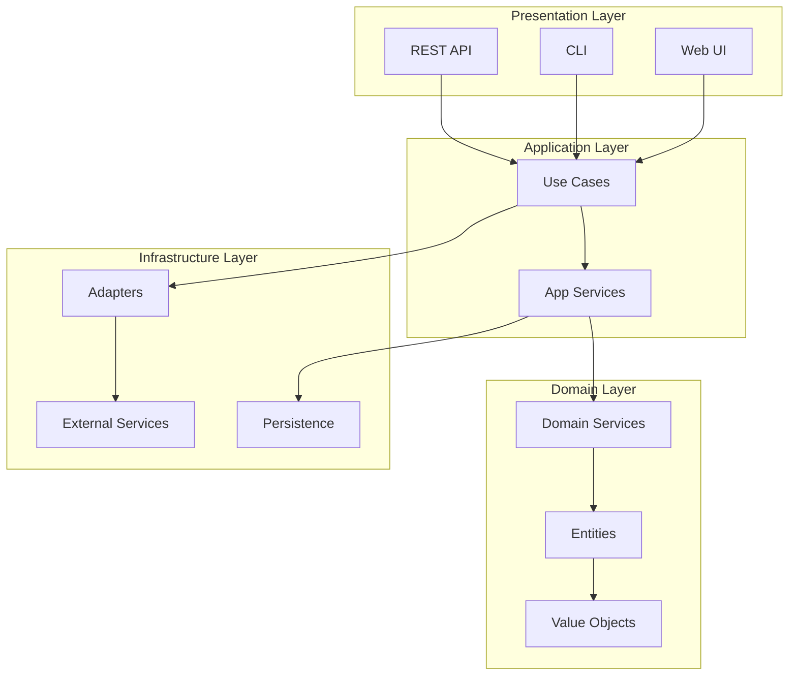

# Welcome to Pynomaly

State-of-the-art Python anomaly detection platform with clean architecture.

## Overview

Pynomaly is a comprehensive anomaly detection platform that brings together the best algorithms from various libraries under a unified, production-ready interface. Built with clean architecture principles, it provides a robust foundation for detecting anomalies in your data.

## Key Features

### 🏗️ Clean Architecture
- Domain-driven design with hexagonal architecture
- Clear separation of concerns
- Extensible and maintainable codebase
- Protocol-based interfaces for easy integration

### 🔌 40+ Algorithms
- Comprehensive collection from PyOD, scikit-learn, and deep learning frameworks
- Statistical, proximity-based, probabilistic, and ensemble methods
- Neural network approaches including autoencoders
- Consistent interface across all algorithms

### 🚀 Production Ready
- Async support for high performance
- Comprehensive monitoring and metrics
- Caching and batch processing
- Robust error handling and validation

### 🖥️ Multiple Interfaces
- **REST API**: Full-featured API with OpenAPI documentation
- **CLI**: Rich command-line interface with intuitive commands
- **Web UI**: Progressive Web App with real-time updates

### 📊 Visualizations
- Interactive charts with D3.js and Apache ECharts
- Real-time anomaly detection dashboard
- Experiment tracking and comparison
- Dataset quality analysis

## Quick Example

```python
from pynomaly.infrastructure.config import create_container
from pynomaly.domain.entities import Detector, Dataset
import pandas as pd

# Initialize
container = create_container()

# Create detector
detector = Detector(
    name="Fraud Detector",
    algorithm="IsolationForest",
    parameters={"contamination": 0.1}
)

# Load data
data = pd.read_csv("transactions.csv")
dataset = Dataset(name="Transactions", data=data)

# Detect anomalies
detection_service = container.detection_service()
results = await detection_service.detect_anomalies(detector, dataset)

print(f"Found {results.n_anomalies} anomalies ({results.anomaly_rate:.1%})")
```

## Architecture Overview



## Next Steps

- [Installation Guide](getting-started/installation.md) - Get Pynomaly up and running
- [Web API Setup Guide](WEB_API_SETUP_GUIDE.md) - Complete web API setup and testing
- [Quick Start Tutorial](getting-started/quickstart.md) - Your first anomaly detection
- [Architecture Deep Dive](getting-started/architecture.md) - Understand the design
- [API Reference](api/domain.md) - Detailed API documentation