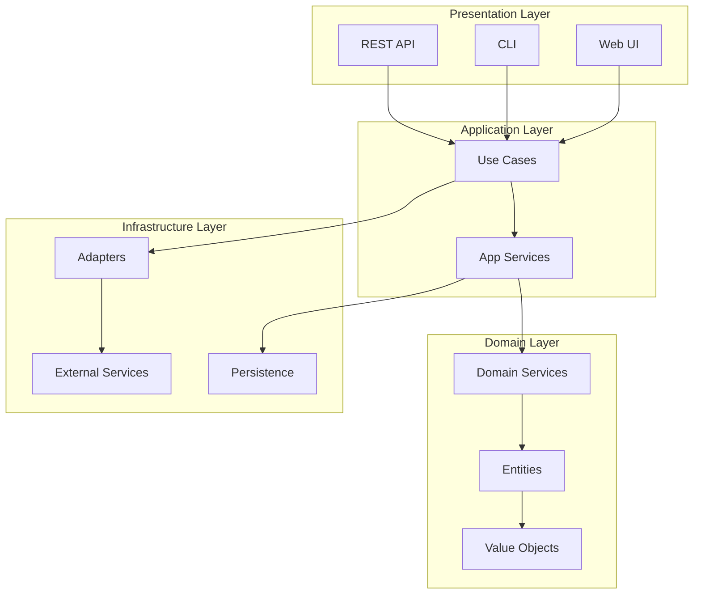

# Pynomaly Documentation

Welcome to the Pynomaly documentation! This guide will help you get started with state-of-the-art anomaly detection using modern Python tooling.

## 🚀 Quick Start

### New to Pynomaly?
- **[Installation Guide](getting-started/installation.md)** - Set up Pynomaly with Hatch or pip
- **[Quick Start Guide](getting-started/quickstart.md)** - Get up and running in minutes
- **[Development Setup](development/README.md)** - Modern development environment

### For Developers
- **[Hatch Workflow Guide](development/HATCH_GUIDE.md)** - Comprehensive Hatch usage
- **[File Organization Standards](development/FILE_ORGANIZATION_STANDARDS.md)** - Project structure guidelines
- **[Contributing Guidelines](CONTRIBUTING.md)** - How to contribute to Pynomaly

## 📚 Documentation Structure

### 🏁 Getting Started
Essential guides for new users and developers.

- **[Installation](getting-started/installation.md)** - Install with Hatch, pip, or Docker
- **[Quick Start](getting-started/quickstart.md)** - Complete workflow walkthrough
- **[CLI Setup](getting-started/SETUP_CLI.md)** - Command-line interface setup

### 🔧 Development
Modern development practices and tools.

- **[Development Environment](development/README.md)** - Modern Python development with Hatch
- **[Hatch Guide](development/HATCH_GUIDE.md)** - Build system and environment management
- **[Implementation Guide](development/IMPLEMENTATION_GUIDE.md)** - Architecture and patterns
- **[File Organization](development/FILE_ORGANIZATION_STANDARDS.md)** - Project structure standards
- **[Environment Management Migration](development/ENVIRONMENT_MANAGEMENT_MIGRATION.md)** - Centralized environment organization
- **[Test Analysis](development/COMPREHENSIVE_TEST_ANALYSIS.md)** - Testing infrastructure and coverage

### 🏗️ Architecture
System design and architectural decisions.

- **[Architecture Overview](architecture/overview.md)** - Clean architecture principles
- **[Model Persistence Framework](architecture/model-persistence-framework.md)** - ML model management
- **[Deployment Pipeline](architecture/deployment-pipeline-framework.md)** - CI/CD architecture
- **[Continuous Learning](architecture/continuous-learning-framework.md)** - Online learning systems

### 📡 API Reference
Complete API documentation and integration guides.

- **[REST API](api/rest-api.md)** - Complete HTTP API reference
- **[Python SDK](api/python-sdk.md)** - Python client library
- **[CLI Reference](api/cli.md)** - Command-line interface
- **[Authentication](api/authentication.md)** - Security and auth patterns

### 📖 User Guides
Feature guides and best practices.

- **[Algorithm Selection](guides/algorithms.md)** - Choose the right detection algorithm
- **[Dataset Management](guides/datasets.md)** - Data preparation and validation
- **[Performance Tuning](guides/performance-tuning.md)** - Optimization strategies
- **[Monitoring](guides/monitoring.md)** - Observability and alerting
- **[Explainability](guides/explainability.md)** - Understanding anomaly predictions
- **[Troubleshooting](guides/troubleshooting.md)** - Common issues and solutions

### 🚀 Deployment
Production deployment and operations.

- **[Production Deployment](deployment/PRODUCTION_DEPLOYMENT_GUIDE.md)** - Deploy to production
- **[Docker Guide](deployment/DOCKER_DEPLOYMENT_GUIDE.md)** - Containerized deployment
- **[Kubernetes](deployment/kubernetes.md)** - Orchestrated deployment
- **[Security](deployment/SECURITY.md)** - Security best practices

### 📋 Examples
Practical examples and tutorials.

- **[Basic Usage](examples/README.md)** - Simple anomaly detection examples
- **[Advanced Tutorials](tutorials/advanced.md)** - Complex scenarios and patterns
- **[Business Intelligence Integration](../README.md#business-intelligence-integrations)** - Export to Excel, Power BI, etc.

## 🛠️ Modern Development Stack

Pynomaly is built with cutting-edge Python tooling:

- **🔨 Hatch**: Modern build system and environment management
- **⚡ Ruff**: Lightning-fast linting and formatting
- **🔍 MyPy**: Strict type checking with 100% coverage
- **✅ TDD System**: Comprehensive test-driven development enforcement
- **🌐 Environment Management**: Centralized virtual environment organization
- **🔄 Pre-commit**: Automated code quality and compliance checks
- **📊 Coverage**: Detailed test coverage analysis and reporting

## Key Features

### 🏗️ Clean Architecture
- Domain-driven design with hexagonal architecture
- Clear separation of concerns
- Extensible and maintainable codebase
- Protocol-based interfaces for easy integration

### 🔌 40+ Algorithms
- Comprehensive collection from PyOD, scikit-learn, and deep learning frameworks
- Statistical, proximity-based, probabilistic, and ensemble methods
- Neural network approaches including autoencoders
- Consistent interface across all algorithms

### 🚀 Production Ready
- Async support for high performance
- Comprehensive monitoring and metrics
- Caching and batch processing
- Robust error handling and validation

### ✅ Test-Driven Development
- **Active TDD enforcement** with 85% coverage threshold
- Automated test requirement tracking and validation
- Git hook integration for pre-commit compliance
- Comprehensive CLI tooling for TDD management

### 🖥️ Multiple Interfaces
- **REST API**: Full-featured API with OpenAPI documentation
- **CLI**: Rich command-line interface with intuitive commands
- **Web UI**: Progressive Web App with real-time updates

### 📊 Visualizations
- Interactive charts with D3.js and Apache ECharts
- Real-time anomaly detection dashboard
- Experiment tracking and comparison
- Dataset quality analysis

## Quick Example

```python
from pynomaly.infrastructure.config import create_container
from pynomaly.domain.entities import Detector, Dataset
import pandas as pd

# Initialize
container = create_container()

# Create detector
detector = Detector(
    name="Fraud Detector",
    algorithm="IsolationForest",
    parameters={"contamination": 0.1}
)

# Load data
data = pd.read_csv("transactions.csv")
dataset = Dataset(name="Transactions", data=data)

# Detect anomalies
detection_service = container.detection_service()
results = await detection_service.detect_anomalies(detector, dataset)

print(f"Found {results.n_anomalies} anomalies ({results.anomaly_rate:.1%})")
```

## Architecture Overview



## Next Steps

- [Installation Guide](getting-started/installation.md) - Get Pynomaly up and running
- [Web API Setup Guide](WEB_API_SETUP_GUIDE.md) - Complete web API setup and testing
- [Quick Start Tutorial](getting-started/quickstart.md) - Your first anomaly detection
- [Architecture Deep Dive](getting-started/architecture.md) - Understand the design
- [API Reference](api/domain.md) - Detailed API documentation