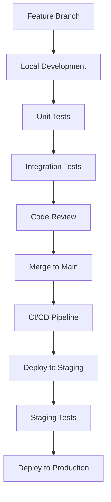

# MLOps Platform Team Onboarding Guide

## Welcome to the MLOps Platform Team! 🎉

This guide will help you get up to speed with our ML/MLOps platform, team processes, and development workflows.

## Quick Start Checklist

### Day 1: Environment Setup
- [ ] **Access & Accounts**
  - [ ] GitHub repository access granted
  - [ ] Slack workspace added (#mlops-general, #mlops-tech)
  - [ ] Cloud platform access (AWS/GCP/Azure)
  - [ ] Kubernetes cluster access
  - [ ] Confluence/documentation access

- [ ] **Development Environment**
  - [ ] Clone repository: `git clone https://github.com/company/monorepo.git`
  - [ ] Install Docker Desktop
  - [ ] Install kubectl and helm
  - [ ] Deploy local environment: `cd infrastructure/environments/development && ./deploy.sh`
  - [ ] Validate setup: `./validate.sh`

- [ ] **Platform Familiarization**
  - [ ] Read platform overview documentation
  - [ ] Review architecture diagrams
  - [ ] Explore Jupyter Lab environment (localhost:8888)
  - [ ] Access Grafana dashboards (localhost:3000)

### Day 2-3: Deep Dive
- [ ] **Technical Understanding**
  - [ ] Complete platform walkthrough with team lead
  - [ ] Review code architecture and patterns
  - [ ] Understand CI/CD pipeline
  - [ ] Learn deployment processes

- [ ] **Team Integration**
  - [ ] Meet team members (intro calls)
  - [ ] Join daily standups
  - [ ] Attend architecture review meeting
  - [ ] Shadow experienced team member

### Week 1: First Contributions
- [ ] **Hands-on Learning**
  - [ ] Complete onboarding exercises
  - [ ] Make first code contribution (documentation/small feature)
  - [ ] Participate in code review process
  - [ ] Deploy changes to development environment

## Role-Specific Onboarding

### ML Engineers
```yaml
Focus Areas:
  - Model development workflows
  - Feature engineering pipelines
  - Experiment tracking and management
  - Model serving and deployment
  - A/B testing framework

Key Skills to Develop:
  - Platform APIs and SDKs
  - MLflow experiment tracking
  - Feature store usage patterns
  - Model explainability tools
  - Performance monitoring

First Week Goals:
  - Deploy a simple model using the platform
  - Create and use features from feature store
  - Set up model monitoring and alerts
  - Conduct A/B test experiment
```

### DevOps Engineers
```yaml
Focus Areas:
  - Kubernetes cluster management
  - CI/CD pipeline optimization
  - Infrastructure monitoring
  - Security and compliance
  - Cost optimization

Key Skills to Develop:
  - Platform infrastructure components
  - Prometheus/Grafana monitoring
  - Kubernetes operations
  - Container orchestration
  - Cloud platform services

First Week Goals:
  - Deploy platform to staging environment
  - Set up monitoring and alerting
  - Optimize resource utilization
  - Implement backup procedures
```

### Data Engineers
```yaml
Focus Areas:
  - Data pipeline development
  - Feature store architecture
  - Streaming data processing
  - Data quality monitoring
  - ETL/ELT optimization

Key Skills to Develop:
  - Feature engineering patterns
  - Kafka streaming integration
  - Data validation frameworks
  - Pipeline orchestration
  - Performance tuning

First Week Goals:
  - Build end-to-end data pipeline
  - Implement feature transformations
  - Set up data quality monitoring
  - Optimize pipeline performance
```

### Backend Engineers
```yaml
Focus Areas:
  - API development and optimization
  - Service integration
  - Database schema design
  - Performance optimization
  - Security implementation

Key Skills to Develop:
  - FastAPI framework
  - Microservices patterns
  - Database optimization
  - API authentication/authorization
  - Service mesh concepts

First Week Goals:
  - Develop new API endpoint
  - Optimize existing service performance
  - Implement security middleware
  - Create comprehensive API documentation
```

## Platform Overview

### Core Components
```yaml
Model Serving Infrastructure:
  - Purpose: Production model serving and management
  - Technologies: FastAPI, Docker, Kubernetes
  - Port: 8000
  - Key Features: Auto-scaling, health checks, metrics

Feature Store:
  - Purpose: Centralized feature management and serving
  - Technologies: PostgreSQL, Redis, Kafka
  - Port: 8001
  - Key Features: Real-time serving, batch processing, versioning

Inference Engine:
  - Purpose: Real-time model inference with optimizations
  - Technologies: FastAPI, Redis caching, load balancing
  - Port: 8002
  - Key Features: Low latency, high throughput, A/B testing

A/B Testing Framework:
  - Purpose: Controlled experimentation and gradual rollouts
  - Technologies: Statistical analysis, traffic routing
  - Features: Statistical significance, automated rollback

Explainability Framework:
  - Purpose: Model interpretability and compliance
  - Technologies: SHAP, LIME, custom attribution methods
  - Features: Local/global explanations, visualization

Governance Framework:
  - Purpose: Compliance, audit trails, risk management
  - Technologies: Policy engine, audit logging
  - Features: GDPR compliance, bias detection, approval workflows
```

### Development Workflow


## Development Standards

### Code Quality
```yaml
Language Standards:
  - Python: PEP 8, type hints, docstrings
  - SQL: Consistent formatting, proper indexing
  - YAML/JSON: Consistent indentation, validation

Testing Requirements:
  - Unit test coverage: >80%
  - Integration tests for all APIs
  - End-to-end tests for critical workflows
  - Performance tests for latency-critical paths

Code Review Process:
  - All changes require peer review
  - Automated checks must pass
  - Security review for sensitive changes
  - Architecture review for major changes
```

### Git Workflow
```bash
# Feature development
git checkout -b feature/your-feature-name
git commit -m "feat: add new feature description"
git push origin feature/your-feature-name

# Create pull request
# After review and approval
git checkout main
git pull origin main
git branch -d feature/your-feature-name
```

### Commit Message Format
```
<type>(<scope>): <description>

Types: feat, fix, docs, style, refactor, test, chore
Scope: component being changed (optional)
Description: brief description of change

Examples:
feat(inference): add batch prediction endpoint
fix(feature-store): resolve caching issue
docs(api): update authentication documentation
```

## Learning Resources

### Platform Documentation
- [Architecture Overview](../architecture/PLATFORM_ARCHITECTURE.md)
- [API Documentation](../api/API_REFERENCE.md)
- [Deployment Guide](../deployment/DEPLOYMENT_GUIDE.md)
- [Monitoring Guide](../monitoring/MONITORING_GUIDE.md)

### External Resources
```yaml
ML Engineering:
  - "Designing Machine Learning Systems" by Chip Huyen
  - "Machine Learning Design Patterns" by Valliappa Lakshmanan
  - MLOps Community: https://mlops.community/

Kubernetes & DevOps:
  - "Kubernetes in Action" by Marko Lukša
  - "Site Reliability Engineering" by Google
  - CNCF Training: https://www.cncf.io/training/

Data Engineering:
  - "Fundamentals of Data Engineering" by Joe Reis
  - "Streaming Systems" by Tyler Akidau
  - Data Engineering Weekly: https://dataengineeringweekly.com/
```

### Training Schedule
```yaml
Week 1: Platform Fundamentals
  - Day 1: Architecture overview and local setup
  - Day 2: Core components deep dive
  - Day 3: Development workflow and tools
  - Day 4: First contribution walkthrough
  - Day 5: Team retrospective and Q&A

Week 2: Advanced Topics
  - Day 1: Performance optimization techniques
  - Day 2: Security and compliance requirements
  - Day 3: Monitoring and observability
  - Day 4: Troubleshooting and debugging
  - Day 5: Production deployment process

Week 3: Specialization
  - Role-specific deep dives
  - Advanced use cases
  - Integration with external systems
  - Best practices and patterns
  - Knowledge sharing sessions
```

## Communication Protocols

### Daily Standups (9:00 AM PT)
```yaml
Format: What did yesterday, what doing today, blockers
Duration: 15 minutes maximum
Participants: Core team members
Tool: Slack huddle or video call
```

### Weekly Team Meetings
```yaml
Architecture Review (Wednesday 2:00 PM PT):
  - Technical decisions and design discussions
  - Code architecture reviews
  - Performance and scalability topics

Sprint Planning (Friday 1:00 PM PT):
  - Sprint goal setting
  - Story estimation and assignment
  - Capacity planning and commitment

Retrospective (Friday 3:00 PM PT):
  - Process improvements
  - Team feedback and action items
  - Celebration of achievements
```

### Communication Channels
```yaml
Slack Channels:
  - #mlops-general: Team announcements and general discussion
  - #mlops-tech: Technical discussions and decisions
  - #mlops-alerts: System alerts and monitoring notifications
  - #mlops-deployments: Deployment notifications and status
  - #mlops-random: Informal team chat and social

Documentation:
  - Confluence: Team documentation and meeting notes
  - GitHub Wiki: Technical documentation and runbooks
  - Notion: Project planning and requirements

Code Collaboration:
  - GitHub: Source code and pull requests
  - GitHub Issues: Bug tracking and feature requests
  - GitHub Projects: Sprint planning and task tracking
```

## Onboarding Exercises

### Exercise 1: Platform Setup and Validation
```bash
# Goal: Successfully deploy and validate local development environment
cd infrastructure/environments/development
./deploy.sh
./validate.sh

# Verify you can access:
# - Jupyter Lab: http://localhost:8888
# - Grafana: http://localhost:3000
# - Prometheus: http://localhost:9090
```

### Exercise 2: First Model Deployment
```python
# Goal: Deploy a simple model using the platform
# 1. Create a simple scikit-learn model
# 2. Register it in the model registry
# 3. Deploy it for serving
# 4. Make a prediction request
# 5. Monitor its performance

# Use the provided example in:
# docs/examples/simple_model_deployment.py
```

### Exercise 3: Feature Engineering Pipeline
```python
# Goal: Create and use features from the feature store
# 1. Define a feature group
# 2. Implement feature transformations
# 3. Ingest sample data
# 4. Retrieve features for model training
# 5. Monitor feature quality and freshness

# Use the provided example in:
# docs/examples/feature_pipeline_example.py
```

### Exercise 4: A/B Test Experiment
```python
# Goal: Set up and analyze an A/B test
# 1. Create two model variants
# 2. Configure A/B test experiment
# 3. Route traffic between variants
# 4. Collect and analyze results
# 5. Make data-driven rollout decision

# Use the provided example in:
# docs/examples/ab_test_example.py
```

## Success Metrics

### Week 1 Goals
- [ ] Development environment fully functional
- [ ] First code contribution merged
- [ ] Participated in all team meetings
- [ ] Completed role-specific exercises
- [ ] Basic platform knowledge demonstrated

### Month 1 Goals
- [ ] Independently complete development tasks
- [ ] Contribute to architectural decisions
- [ ] Mentor new team members
- [ ] Identify and implement improvements
- [ ] Deep expertise in core platform areas

### Quarter 1 Goals
- [ ] Lead feature development projects
- [ ] Contribute to platform roadmap
- [ ] Share knowledge through presentations
- [ ] Optimize platform performance
- [ ] Drive adoption and best practices

## Getting Help

### Immediate Support
- **Slack**: Post in #mlops-general for quick questions
- **Buddy System**: Your assigned buddy for first 2 weeks
- **Office Hours**: Daily 3:00-4:00 PM PT for Q&A

### Documentation and Resources
- **Wiki**: Searchable knowledge base
- **Runbooks**: Step-by-step operational procedures
- **FAQs**: Common questions and solutions

### Escalation Path
1. **Peer Support**: Ask team members in Slack
2. **Technical Lead**: For complex technical issues
3. **Team Lead**: For process or resource questions
4. **Management**: For organizational or priority issues

---

## Welcome aboard! 🚀

We're excited to have you on the team. Don't hesitate to ask questions, share ideas, and contribute to our mission of building world-class ML infrastructure.

Your success is our success! 💪