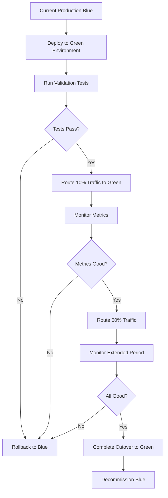

# Production Deployment Strategy

## Overview

This document outlines the comprehensive strategy for deploying the MLOps platform to production, ensuring zero-downtime deployment, robust monitoring, and seamless user experience during the transition.

## Deployment Phases

### Phase 1: Pre-Production Validation (Week 1)
- [ ] **Infrastructure Readiness Assessment**
- [ ] **Security & Compliance Validation**
- [ ] **Performance Benchmark Establishment**
- [ ] **Disaster Recovery Testing**

### Phase 2: Staged Production Rollout (Weeks 2-3)
- [ ] **Blue-Green Deployment Setup**
- [ ] **Model Migration & Validation**
- [ ] **Traffic Routing Configuration**
- [ ] **Monitoring & Alerting Activation**

### Phase 3: Full Production Activation (Week 4)
- [ ] **Complete Traffic Cutover**
- [ ] **Legacy System Decommissioning**
- [ ] **Performance Optimization**
- [ ] **Post-Deployment Validation**

## Production Environment Architecture

### Infrastructure Components
```yaml
Production Cluster:
  - Kubernetes 1.28+ with multi-zone deployment
  - 50+ nodes across 3 availability zones
  - Auto-scaling: 20-200 nodes based on demand
  - Network: VPC with private subnets
  - Load Balancing: Application Load Balancer with SSL termination

Compute Resources:
  - Node Types: CPU-optimized, Memory-optimized, GPU-enabled
  - Instance Families: c5.2xlarge, m5.4xlarge, p3.2xlarge
  - Total Capacity: 800 vCPUs, 3200 GB RAM, 32 GPUs
  - Storage: EBS with 10,000 IOPS, 1PB total capacity

Database Layer:
  - PostgreSQL 15 with read replicas
  - Redis Cluster for caching
  - S3 for object storage
  - Data encryption at rest and in transit
```

### Security Configuration
```yaml
Network Security:
  - VPC with private subnets
  - Security groups with least privilege
  - WAF for application protection
  - DDoS protection with AWS Shield

Identity & Access:
  - IAM roles with minimal permissions
  - RBAC for Kubernetes resources
  - Service mesh with mutual TLS
  - API gateway with authentication

Data Protection:
  - Encryption at rest (AES-256)
  - Encryption in transit (TLS 1.3)
  - Key management with AWS KMS
  - Regular security audits
```

## Deployment Strategy: Blue-Green with Canary

### Blue-Green Deployment Process


### Canary Release Strategy
```yaml
Canary Stages:
  Stage 1: 5% traffic for 2 hours
    - Monitor error rates and latency
    - Validate business metrics
    - Check user feedback
    
  Stage 2: 25% traffic for 6 hours
    - Extended monitoring period
    - Performance validation
    - Capacity testing
    
  Stage 3: 50% traffic for 12 hours
    - Full load validation
    - Business impact assessment
    - Final go/no-go decision
    
  Stage 4: 100% traffic cutover
    - Complete transition
    - Legacy system shutdown
    - Celebration! 🎉

Rollback Triggers:
  - Error rate > 0.1%
  - Latency p95 > 120ms
  - Business metric degradation > 5%
  - Customer complaints spike
  - Security incidents
```

## Model Deployment Pipeline

### Production Model Validation
```python
class ProductionModelValidator:
    def __init__(self):
        self.validation_criteria = {
            'accuracy_threshold': 0.85,
            'latency_threshold_ms': 100,
            'throughput_threshold_rps': 1000,
            'memory_threshold_gb': 8,
            'bias_threshold': 0.1
        }
    
    async def validate_model_for_production(self, model_id: str, version: str):
        """Comprehensive model validation before production deployment"""
        
        validation_results = {
            'model_id': model_id,
            'version': version,
            'validation_timestamp': datetime.now(),
            'passed': False,
            'checks': {}
        }
        
        # Performance validation
        validation_results['checks']['performance'] = await self._validate_performance(model_id, version)
        
        # Security validation
        validation_results['checks']['security'] = await self._validate_security(model_id, version)
        
        # Bias and fairness validation
        validation_results['checks']['bias'] = await self._validate_bias(model_id, version)
        
        # Load testing
        validation_results['checks']['load_test'] = await self._validate_load_capacity(model_id, version)
        
        # Business logic validation
        validation_results['checks']['business'] = await self._validate_business_logic(model_id, version)
        
        # Overall validation result
        all_checks_passed = all(check['passed'] for check in validation_results['checks'].values())
        validation_results['passed'] = all_checks_passed
        
        return validation_results

    async def _validate_performance(self, model_id: str, version: str):
        """Validate model performance metrics"""
        # Implementation would include:
        # - Accuracy/precision/recall testing
        # - Latency benchmarking
        # - Memory usage profiling
        # - Throughput testing
        pass

    async def _validate_security(self, model_id: str, version: str):
        """Validate model security aspects"""
        # Implementation would include:
        # - Input validation testing
        # - Adversarial attack resistance
        # - Data privacy compliance
        # - Access control verification
        pass
```

### Automated Deployment Pipeline
```yaml
Production Deployment Pipeline:
  
  Stage 1: Build & Test
    - Model artifact validation
    - Container image building
    - Security scanning
    - Unit and integration tests
    
  Stage 2: Staging Deployment
    - Deploy to staging environment
    - End-to-end testing
    - Performance benchmarking
    - User acceptance testing
    
  Stage 3: Production Validation
    - Blue-green environment setup
    - Model performance validation
    - Security compliance check
    - Business logic verification
    
  Stage 4: Production Deployment
    - Canary release initiation
    - Traffic routing configuration
    - Monitoring activation
    - Rollback preparation
    
  Stage 5: Post-Deployment
    - Performance monitoring
    - Business metrics tracking
    - User feedback collection
    - Success criteria validation

Approval Gates:
  - Technical Lead approval for staging
  - Security team approval for production
  - Product Owner approval for business logic
  - Executive approval for major releases
```

## Monitoring & Observability in Production

### Enhanced Production Monitoring
```yaml
Performance Monitoring:
  - Response time percentiles (p50, p95, p99)
  - Request rate and error rate tracking
  - Resource utilization (CPU, memory, GPU)
  - Queue depth and processing time
  
Business Monitoring:
  - Revenue impact tracking
  - User engagement metrics
  - Conversion rate monitoring
  - Customer satisfaction scores
  
Technical Monitoring:
  - Infrastructure health
  - Database performance
  - Cache hit rates
  - API gateway metrics
  
Security Monitoring:
  - Authentication failures
  - Suspicious access patterns
  - Data access auditing
  - Vulnerability scanning results
```

### Production Alert Configuration
```yaml
Critical Alerts (Immediate Response):
  - Platform availability < 99.9%
  - API response time p95 > 150ms
  - Error rate > 0.5%
  - Security incidents
  - Revenue impact > 10% drop

Warning Alerts (15-minute Response):
  - Resource utilization > 80%
  - Cache hit rate < 70%
  - Queue depth > 100 requests
  - Model accuracy degradation > 3%

Info Alerts (Monitoring Only):
  - Deployment completions
  - Traffic pattern changes
  - Resource scaling events
  - Successful security scans
```

## Data Migration Strategy

### Production Data Migration
```yaml
Migration Phases:

Phase 1: Data Replication Setup
  - Establish real-time data replication
  - Validate data consistency
  - Performance testing with production load
  - Rollback preparation

Phase 2: Gradual Migration
  - Route 10% of new data to new system
  - Validate data processing accuracy
  - Monitor performance impact
  - Incremental traffic increase

Phase 3: Historical Data Migration
  - Batch migration of historical data
  - Data validation and integrity checks
  - Feature store population
  - Model retraining with full dataset

Phase 4: Complete Cutover
  - Final data sync
  - System cutover
  - Legacy system decommissioning
  - Post-migration validation

Data Validation:
  - Row count verification
  - Schema consistency checks
  - Data quality validation
  - Business logic verification
  - Performance benchmarking
```

## Risk Management & Contingency Planning

### Risk Assessment Matrix
```yaml
High-Impact, High-Probability Risks:
  - Performance degradation during migration
  - Data consistency issues
  - User authentication problems
  - Third-party service dependencies

Medium-Impact Risks:
  - Monitoring gaps during transition
  - Team coordination challenges
  - Documentation inconsistencies
  - Training requirements

Low-Impact Risks:
  - Minor UI/UX changes
  - Non-critical feature deprecation
  - Logging format changes
  - Development workflow adjustments
```

### Contingency Plans
```yaml
Scenario 1: Performance Degradation
  Response:
    - Immediate traffic reduction to new system
    - Scale up resources automatically
    - Enable performance optimization features
    - Route traffic back to legacy if needed
  
Scenario 2: Data Inconsistency
  Response:
    - Pause data migration immediately
    - Validate data integrity
    - Resync affected data
    - Comprehensive testing before resuming
  
Scenario 3: Security Incident
  Response:
    - Immediate system isolation
    - Security team activation
    - Incident response protocol
    - Communication to stakeholders
  
Scenario 4: Third-Party Service Failure
  Response:
    - Activate backup services
    - Implement circuit breakers
    - Graceful degradation mode
    - Vendor escalation procedures
```

## Success Criteria & Validation

### Production Success Metrics
```yaml
Technical Success Criteria:
  ✅ Platform availability > 99.95%
  ✅ API response time p95 < 100ms
  ✅ Error rate < 0.1%
  ✅ All models performing within SLA
  ✅ Zero security incidents
  ✅ Data consistency 100%

Business Success Criteria:
  ✅ User adoption > 95%
  ✅ Business metrics maintained or improved
  ✅ Cost within budget
  ✅ Customer satisfaction > 4.5/5
  ✅ Revenue impact positive
  ✅ Team productivity maintained

Operational Success Criteria:
  ✅ Monitoring fully operational
  ✅ Alerting properly configured
  ✅ Documentation complete
  ✅ Team trained and ready
  ✅ Support processes established
  ✅ Backup and recovery verified
```

### Post-Deployment Validation Plan
```yaml
Week 1: Intensive Monitoring
  - 24/7 monitoring by dedicated team
  - Daily performance reviews
  - User feedback collection
  - Issue triage and resolution

Week 2-3: Stability Validation
  - Extended performance monitoring
  - Business metrics analysis
  - Optimization opportunities identification
  - Documentation updates

Week 4: Production Readiness Declaration
  - Comprehensive performance review
  - Business impact assessment
  - Team feedback and lessons learned
  - Official production status declaration
```

## Communication Plan

### Stakeholder Communication
```yaml
Executive Leadership:
  - Weekly status updates
  - Risk and issue escalation
  - Business impact reports
  - Success milestone communications

Engineering Teams:
  - Daily standup updates
  - Technical issue discussions
  - Architecture decision records
  - Performance optimization plans

Business Users:
  - Feature availability announcements
  - Training session schedules
  - User guide distributions
  - Feedback collection surveys

External Partners:
  - API changes and deprecations
  - SLA updates and commitments
  - Security certification updates
  - Integration timeline communications
```

This production deployment strategy ensures a smooth, risk-mitigated transition to production while maintaining the highest standards of performance, security, and user experience.