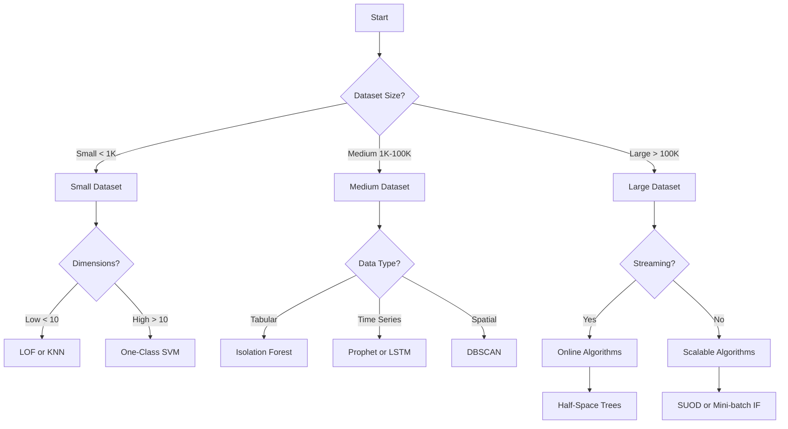

# Algorithm Guide

This comprehensive guide covers all anomaly detection algorithms available in the package, their parameters, use cases, and performance characteristics.

!!! info "Related Guides"
    - **New to anomaly detection?** Start with the [Getting Started Guide](getting-started/index.md)
    - **Ready to implement?** See [Practical Examples](getting-started/examples.md)
    - **Want to combine algorithms?** Check out [Ensemble Methods](ensemble.md)
    - **Need to optimize performance?** Visit [Performance Optimization](performance.md)
    - **Deploying to production?** Follow the [Deployment Guide](deployment.md)

## Table of Contents

1. [Algorithm Overview](#algorithm-overview)
2. [Algorithm Selection Guide](#algorithm-selection-guide)
3. [Core Algorithms](#core-algorithms)
4. [PyOD Algorithms](#pyod-algorithms)
5. [Deep Learning Algorithms](#deep-learning-algorithms)
6. [Ensemble Methods](#ensemble-methods)
7. [Performance Comparison](#performance-comparison)
8. [Parameter Tuning](#parameter-tuning)
9. [Best Practices](#best-practices)

## Algorithm Overview

### Categories of Anomaly Detection Algorithms

1. **Statistical Methods**: Assume data follows a statistical distribution
2. **Proximity-Based**: Use distance or density measures
3. **Linear Models**: Project data to lower dimensions
4. **Tree-Based**: Use isolation or partitioning
5. **Neural Networks**: Learn complex patterns via deep learning
6. **Ensemble Methods**: Combine multiple algorithms

### Key Characteristics

| Algorithm | Type | Training | Scalability | Interpretability | Best For |
|-----------|------|----------|-------------|------------------|----------|
| Isolation Forest | Tree-based | Unsupervised | High | Medium | General purpose |
| Local Outlier Factor | Proximity | Unsupervised | Medium | High | Local anomalies |
| One-Class SVM | Boundary | Semi-supervised | Low | Low | High-dimensional |
| Autoencoder | Neural Network | Unsupervised | Medium | Low | Complex patterns |
| DBSCAN | Clustering | Unsupervised | Medium | High | Spatial data |
| Gaussian Mixture | Statistical | Unsupervised | High | High | Gaussian data |

## Algorithm Selection Guide

### Decision Tree for Algorithm Selection



### Use Case Mapping

| Use Case | Recommended Algorithms | Reason |
|----------|----------------------|---------|
| Network Intrusion | Isolation Forest, OCSVM | Handle mixed data types |
| Credit Card Fraud | Random Forest, XGBoost | Supervised with labels |
| Sensor Anomalies | LSTM, Autoencoders | Temporal patterns |
| Manufacturing Defects | LOF, DBSCAN | Spatial/local anomalies |
| Log Anomalies | Isolation Forest, ECOD | High-dimensional sparse |
| Medical Diagnosis | Ensemble Methods | High stakes, need confidence |

## Core Algorithms

### 1. Isolation Forest

**Principle**: Isolates anomalies instead of profiling normal points. Anomalies are easier to isolate and require fewer partitions.

```python
from anomaly_detection import DetectionService

service = DetectionService()
result = service.detect_anomalies(
    data=X,
    algorithm='iforest',
    n_estimators=100,        # Number of trees
    max_samples='auto',      # Subsample size
    contamination=0.1,       # Expected anomaly fraction
    max_features=1.0,        # Features per tree
    bootstrap=False,         # Sampling with replacement
    n_jobs=-1,              # Parallel jobs
    random_state=42         # Reproducibility
)
```

**Parameters**:
- `n_estimators`: More trees = more stable (default: 100)
- `max_samples`: Controls tree size, 'auto' = min(256, n_samples)
- `contamination`: Prior estimate of anomaly fraction
- `max_features`: Feature sampling per tree

**When to Use**:
- ✅ General purpose anomaly detection ([see examples](getting-started/examples.md#example-1-credit-card-fraud-detection))
- ✅ No assumptions about data distribution
- ✅ Scales well with large datasets - [performance optimization](performance.md#algorithm-optimization)
- ✅ Works with high-dimensional data
- ❌ Not suitable for local anomalies (use [LOF](#2-local-outlier-factor-lof) instead)
- ❌ Less effective with very small datasets

**Performance**: O(n log n) training, O(n) prediction

!!! tip "Best Practices"
    Isolation Forest works well in [ensemble methods](ensemble.md#base-algorithm-selection) and can be optimized for [real-time streaming](streaming.md#streaming-compatible-algorithms).

### 2. Local Outlier Factor (LOF)

**Principle**: Compares local density of a point to its neighbors. Points with substantially lower density are anomalies.

```python
result = service.detect_anomalies(
    data=X,
    algorithm='lof',
    n_neighbors=20,         # Number of neighbors
    algorithm='auto',       # auto, ball_tree, kd_tree, brute
    leaf_size=30,          # Tree leaf size
    metric='minkowski',    # Distance metric
    p=2,                   # Minkowski parameter
    contamination=0.1,     # Expected anomaly fraction
    novelty=True,          # True for predict, False for fit_predict
    n_jobs=-1             # Parallel jobs
)
```

**Parameters**:
- `n_neighbors`: Key parameter, typically 10-50
- `metric`: Distance metric ('euclidean', 'manhattan', 'cosine')
- `novelty`: True for new data, False for training data

**When to Use**:
- ✅ Local anomalies in clusters ([network intrusion example](getting-started/examples.md#example-2-network-intrusion-detection))
- ✅ Varying density regions
- ✅ Need interpretable scores - [explainability guide](explainability.md#algorithm-specific-explanations)
- ❌ Large datasets (quadratic complexity) - consider [performance optimization](performance.md#parallel-processing)
- ❌ High-dimensional sparse data

**Performance**: O(n²) for training

!!! warning "Scalability Considerations"
    LOF can be memory-intensive. For large datasets, consider [ensemble approaches](ensemble.md#scalable-ensemble-architectures) or [streaming variants](streaming.md#concept-drift-detection).

### 3. One-Class SVM

**Principle**: Learns a boundary around normal data in feature space using kernel trick.

```python
result = service.detect_anomalies(
    data=X,
    algorithm='ocsvm',
    kernel='rbf',          # Kernel type: linear, poly, rbf, sigmoid
    gamma='scale',         # Kernel coefficient
    nu=0.1,               # Upper bound on fraction of outliers
    shrinking=True,       # Use shrinking heuristic
    cache_size=200,       # Kernel cache size (MB)
    tol=0.001,           # Tolerance for stopping
    max_iter=-1          # Maximum iterations
)
```

**Parameters**:
- `kernel`: RBF for non-linear, linear for linear boundaries
- `nu`: Similar to contamination, bounds the fraction of outliers
- `gamma`: Controls influence of single training example

**When to Use**:
- ✅ Non-linear boundaries needed
- ✅ Semi-supervised scenarios
- ✅ High-dimensional data
- ❌ Large datasets (doesn't scale well)
- ❌ Need probability estimates

**Performance**: O(n²) to O(n³) depending on parameters

### 4. Elliptic Envelope

**Principle**: Fits a robust covariance estimate to the data, assuming Gaussian distribution.

```python
result = service.detect_anomalies(
    data=X,
    algorithm='elliptic',
    contamination=0.1,            # Expected anomaly fraction
    support_fraction=None,        # Fraction of points for MCD
    random_state=42              # Random seed
)
```

**When to Use**:
- ✅ Gaussian distributed data
- ✅ Need statistical interpretation
- ✅ Low to medium dimensions
- ❌ Non-Gaussian data
- ❌ High dimensions (covariance estimation fails)

### 5. DBSCAN (via PyOD)

**Principle**: Density-based clustering that identifies outliers as points not belonging to any cluster.

```python
result = service.detect_anomalies(
    data=X,
    algorithm='dbscan',
    eps=0.5,              # Maximum distance between points
    min_samples=5,        # Minimum points to form cluster
    metric='euclidean',   # Distance metric
    algorithm='auto',     # Algorithm for neighbor search
    leaf_size=30,        # Leaf size for tree algorithms
    n_jobs=-1           # Parallel jobs
)
```

**When to Use**:
- ✅ Spatial data with clusters
- ✅ Arbitrary shaped clusters
- ✅ Different density regions
- ❌ High-dimensional data
- ❌ Uniform density expected

## PyOD Algorithms

### Overview of PyOD Integration

```python
from anomaly_detection.infrastructure.adapters.algorithms import PyODAdapter

# Use any PyOD algorithm
adapter = PyODAdapter(
    algorithm='knn',      # PyOD algorithm name
    contamination=0.1,    # Common parameter
    **algorithm_params    # Algorithm-specific params
)
```

### Popular PyOD Algorithms

#### 1. k-Nearest Neighbors (KNN)

```python
result = service.detect_anomalies(
    data=X,
    algorithm='knn',
    n_neighbors=5,        # Number of neighbors
    method='largest',     # largest, mean, median
    contamination=0.1,
    n_jobs=-1
)
```

**Use Cases**: Similar to LOF but simpler and faster

#### 2. Angle-Based Outlier Detection (ABOD)

```python
result = service.detect_anomalies(
    data=X,
    algorithm='abod',
    n_neighbors=5,       # Neighbors for angle calculation
    contamination=0.1
)
```

**Use Cases**: High-dimensional data where distance fails

#### 3. Histogram-Based Outlier Score (HBOS)

```python
result = service.detect_anomalies(
    data=X,
    algorithm='hbos',
    n_bins=10,          # Number of bins
    alpha=0.1,          # Regularizer for histogram
    tol=0.5,           # Tolerance for bin width
    contamination=0.1
)
```

**Use Cases**: Fast detection, assumes feature independence

#### 4. Clustering-Based Local Outlier Factor (CBLOF)

```python
result = service.detect_anomalies(
    data=X,
    algorithm='cblof',
    n_clusters=8,       # Number of clusters
    alpha=0.9,         # Coefficient for large clusters
    beta=5,            # Coefficient for small clusters
    contamination=0.1
)
```

**Use Cases**: When data has clear cluster structure

#### 5. Feature Bagging

```python
result = service.detect_anomalies(
    data=X,
    algorithm='feature_bagging',
    base_estimator=None,    # Base detector
    n_estimators=10,        # Number of estimators
    max_features=1.0,       # Features per estimator
    contamination=0.1
)
```

**Use Cases**: Ensemble method for stability

#### 6. Copula-Based Outlier Detection (COPOD)

```python
result = service.detect_anomalies(
    data=X,
    algorithm='copod',
    contamination=0.1
)
```

**Use Cases**: Parameter-free, interpretable method

#### 7. ECOD (Empirical Cumulative Distribution)

```python
result = service.detect_anomalies(
    data=X,
    algorithm='ecod',
    contamination=0.1,
    n_jobs=-1
)
```

**Use Cases**: Fast, parameter-free, good for mixed data

### Advanced PyOD Algorithms

#### Subspace Outlier Detection (SOD)

```python
result = service.detect_anomalies(
    data=X,
    algorithm='sod',
    n_neighbors=20,
    ref_set=10,
    alpha=0.8,
    contamination=0.1
)
```

#### Lightweight Online Detector (LODA)

```python
result = service.detect_anomalies(
    data=X,
    algorithm='loda',
    n_bins=10,
    n_random_cuts=100,
    contamination=0.1
)
```

## Deep Learning Algorithms

### 1. Autoencoder

**Principle**: Neural network that learns to compress and reconstruct data. High reconstruction error indicates anomalies.

```python
from anomaly_detection import DeepLearningAdapter

result = service.detect_anomalies(
    data=X,
    algorithm='autoencoder',
    encoding_dim=32,           # Bottleneck dimension
    hidden_layers=[128, 64],   # Hidden layer sizes
    activation='relu',         # Activation function
    output_activation='sigmoid',
    epochs=100,               # Training epochs
    batch_size=32,           # Batch size
    validation_split=0.1,    # Validation fraction
    early_stopping=True,     # Enable early stopping
    patience=10,            # Early stopping patience
    learning_rate=0.001,    # Learning rate
    contamination=0.1       # For threshold setting
)
```

**Architecture Example**:
```
Input (100) → Dense (128) → Dense (64) → Dense (32) → Dense (64) → Dense (128) → Output (100)
                                           ↑
                                    Encoding Layer
```

**When to Use**:
- ✅ Complex non-linear patterns
- ✅ Image data
- ✅ High-dimensional data
- ✅ Sufficient training data
- ❌ Need interpretability
- ❌ Small datasets

### 2. Variational Autoencoder (VAE)

```python
result = service.detect_anomalies(
    data=X,
    algorithm='vae',
    latent_dim=20,            # Latent space dimension
    intermediate_dim=64,      # Hidden layer size
    epsilon_std=1.0,         # Standard deviation
    reconstruction_weight=1.0, # Loss weight
    kl_weight=0.1,           # KL divergence weight
    epochs=100,
    batch_size=32
)
```

**Advantages over standard autoencoder**:
- Probabilistic framework
- Better regularization
- Can generate new samples

### 3. Deep SVDD (Support Vector Data Description)

```python
result = service.detect_anomalies(
    data=X,
    algorithm='deep_svdd',
    network_depth=4,         # Network depth
    pretrain=True,          # Use autoencoder pretraining
    pretrain_epochs=50,     # Pretraining epochs
    epochs=100,
    batch_size=32,
    learning_rate=0.001,
    weight_decay=1e-5,
    contamination=0.1
)
```

**Use Cases**: 
- One-class classification
- When normal class is well-defined
- Need deep features

### 4. LSTM Autoencoder (Time Series)

```python
result = service.detect_anomalies(
    data=X,  # Shape: (samples, timesteps, features)
    algorithm='lstm_autoencoder',
    sequence_length=50,      # Sequence length
    lstm_units=[100, 50],   # LSTM layer units
    dropout=0.2,           # Dropout rate
    recurrent_dropout=0.2, # Recurrent dropout
    epochs=100,
    batch_size=32
)
```

**Use Cases**:
- Time series anomaly detection
- Sequence data
- Temporal patterns

## Ensemble Methods

### 1. Majority Voting

```python
from anomaly_detection import EnsembleService

ensemble = EnsembleService()
result = ensemble.detect_with_ensemble(
    data=X,
    algorithms=['iforest', 'lof', 'ocsvm'],
    method='majority',
    contamination=0.1
)
```

### 2. Average of Scores

```python
result = ensemble.detect_with_ensemble(
    data=X,
    algorithms=['iforest', 'lof', 'knn'],
    method='average',
    weights=[0.5, 0.3, 0.2],  # Optional weights
    contamination=0.1
)
```

### 3. Maximum Score

```python
result = ensemble.detect_with_ensemble(
    data=X,
    algorithms=['iforest', 'lof', 'copod'],
    method='maximum',
    contamination=0.1
)
```

### 4. Stacking (Meta-Learning)

```python
# First level: base detectors
base_algorithms = [
    {'name': 'iforest', 'params': {'n_estimators': 100}},
    {'name': 'lof', 'params': {'n_neighbors': 20}},
    {'name': 'ocsvm', 'params': {'nu': 0.1}}
]

# Second level: meta-learner
result = ensemble.create_stacking_ensemble(
    data=X,
    base_algorithms=base_algorithms,
    meta_algorithm='logistic_regression',
    cv_folds=5,
    contamination=0.1
)
```

### 5. SUOD (Scalable Unsupervised Outlier Detection)

```python
result = service.detect_anomalies(
    data=X,
    algorithm='suod',
    base_estimators=[     # List of base estimators
        ('iforest', IForest()),
        ('lof', LOF()),
        ('copod', COPOD())
    ],
    n_jobs=-1,
    contamination=0.1
)
```

**Benefits**:
- Accelerates training and prediction
- Reduces memory usage
- Maintains accuracy

## Performance Comparison

### Time Complexity

| Algorithm | Training | Prediction | Space |
|-----------|----------|------------|-------|
| Isolation Forest | O(n log n) | O(n log n) | O(n) |
| LOF | O(n²) | O(n²) | O(n) |
| One-Class SVM | O(n² to n³) | O(n × sv) | O(sv) |
| KNN | O(n²) | O(n × k) | O(n) |
| HBOS | O(n) | O(n) | O(n) |
| Autoencoder | O(n × epochs) | O(n) | O(params) |
| COPOD | O(n) | O(n) | O(n) |

### Accuracy Benchmarks

Performance on common benchmark datasets:

| Algorithm | KDD Cup 99 | Credit Card | Thyroid | Satellite |
|-----------|------------|-------------|---------|-----------|
| Isolation Forest | 0.85 | 0.92 | 0.88 | 0.71 |
| LOF | 0.79 | 0.89 | 0.82 | 0.65 |
| One-Class SVM | 0.80 | 0.88 | 0.78 | 0.68 |
| Autoencoder | 0.88 | 0.94 | 0.85 | 0.74 |
| Ensemble | 0.91 | 0.95 | 0.90 | 0.78 |

## Parameter Tuning

### Grid Search Example

```python
from anomaly_detection.utils import GridSearchAD

param_grid = {
    'n_estimators': [50, 100, 200],
    'max_samples': ['auto', 256, 512],
    'contamination': [0.05, 0.1, 0.15]
}

grid_search = GridSearchAD(
    algorithm='iforest',
    param_grid=param_grid,
    scoring='f1',
    cv=5,
    n_jobs=-1
)

best_params = grid_search.fit(X_train, y_train)
print(f"Best parameters: {best_params}")
```

### Bayesian Optimization

```python
from anomaly_detection.utils import BayesianOptAD

search_space = {
    'n_neighbors': (5, 50),
    'contamination': (0.01, 0.2)
}

bayesian_opt = BayesianOptAD(
    algorithm='lof',
    search_space=search_space,
    n_iter=50,
    scoring='auc'
)

best_params = bayesian_opt.optimize(X_train, y_train)
```

### Cross-Validation for Unsupervised Methods

```python
from anomaly_detection.utils import UnsupervisedCV

# Use internal metrics for evaluation
cv_scores = UnsupervisedCV(
    algorithm='iforest',
    params={'n_estimators': 100},
    metrics=['silhouette', 'calinski_harabasz'],
    cv=5
).evaluate(X)

print(f"CV Scores: {cv_scores}")
```

## Best Practices

### 1. Data Preprocessing

```python
from anomaly_detection.preprocessing import AnomalyPreprocessor

preprocessor = AnomalyPreprocessor()
X_processed = preprocessor.fit_transform(
    X,
    scaling='robust',      # robust, standard, minmax
    handle_missing='impute', # impute, drop
    remove_outliers=True,  # Pre-remove extreme outliers
    outlier_threshold=6    # Standard deviations
)
```

### 2. Feature Engineering

```python
from anomaly_detection.features import FeatureEngineer

engineer = FeatureEngineer()
X_enhanced = engineer.create_features(
    X,
    polynomial_features=True,
    interaction_features=True,
    statistical_features=['mean', 'std', 'skew', 'kurtosis'],
    pca_components=0.95  # Keep 95% variance
)
```

### 3. Algorithm Selection Strategy

```python
from anomaly_detection.selection import AlgorithmSelector

selector = AlgorithmSelector()
recommended_algorithms = selector.recommend(
    data_characteristics={
        'n_samples': len(X),
        'n_features': X.shape[1],
        'data_type': 'tabular',
        'has_labels': False,
        'domain': 'finance'
    }
)

print(f"Recommended algorithms: {recommended_algorithms}")
```

### 4. Evaluation Without Labels

```python
from anomaly_detection.evaluation import UnsupervisedMetrics

metrics = UnsupervisedMetrics()
scores = metrics.evaluate(
    X=X,
    predictions=predictions,
    algorithms=['silhouette', 'davies_bouldin', 'calinski_harabasz']
)

print(f"Evaluation scores: {scores}")
```

### 5. Threshold Selection

```python
from anomaly_detection.threshold import ThresholdSelector

selector = ThresholdSelector()

# Using contamination rate
threshold = selector.from_contamination(scores, contamination=0.1)

# Using percentile
threshold = selector.from_percentile(scores, percentile=95)

# Using statistical method
threshold = selector.from_statistics(scores, method='iqr', multiplier=1.5)

# Using elbow method
threshold = selector.from_elbow(scores)
```

### 6. Production Deployment

```python
from anomaly_detection.deployment import ModelDeployer

deployer = ModelDeployer()

# Save model with preprocessing pipeline
deployer.save_pipeline(
    model=detector,
    preprocessor=preprocessor,
    path='models/anomaly_detector_v1.pkl',
    metadata={
        'algorithm': 'iforest',
        'training_date': '2024-01-23',
        'performance_metrics': metrics
    }
)

# Load for inference
pipeline = deployer.load_pipeline('models/anomaly_detector_v1.pkl')
predictions = pipeline.predict(new_data)
```

## Algorithm Cheat Sheet

### Quick Selection Guide

| If You Have... | Use This Algorithm |
|----------------|-------------------|
| No assumptions about data | Isolation Forest |
| Local anomalies | LOF or KNN |
| Gaussian data | Elliptic Envelope |
| High dimensions | One-Class SVM, COPOD |
| Time series | LSTM Autoencoder |
| Streaming data | Half-Space Trees |
| Limited labels | Semi-supervised methods |
| Need speed | HBOS, ECOD |
| Need accuracy | Ensemble methods |
| Need interpretability | LOF, Statistical methods |

### Common Pitfalls to Avoid

1. **Wrong contamination rate**: Always validate with domain knowledge
2. **No preprocessing**: Scaling is crucial for distance-based methods
3. **Ignoring data type**: Don't use Gaussian methods on non-Gaussian data
4. **Over-parameterization**: Start simple, add complexity if needed
5. **Single algorithm reliance**: Consider ensembles for critical applications
6. **Ignoring computational constraints**: Consider complexity for real-time needs
7. **No validation strategy**: Use appropriate metrics for unsupervised evaluation