# Architecture Guide

This document describes the architecture of the Anomaly Detection package, following Domain-Driven Design (DDD) principles and clean architecture patterns.

## Table of Contents

1. [Overview](#overview)
2. [Architecture Principles](#architecture-principles)
3. [Layer Architecture](#layer-architecture)
4. [Component Diagrams](#component-diagrams)
5. [Data Flow](#data-flow)
6. [Domain Model](#domain-model)
7. [Service Architecture](#service-architecture)
8. [Integration Points](#integration-points)
9. [Deployment Architecture](#deployment-architecture)

## Overview

The Anomaly Detection package is designed as a modular, scalable system that separates concerns across well-defined layers. It follows hexagonal architecture (ports and adapters) to ensure the core business logic remains independent of external dependencies.

### Key Design Goals

1. **Modularity**: Independent components that can be developed and tested in isolation
2. **Scalability**: Horizontal scaling support for high-throughput scenarios
3. **Extensibility**: Easy addition of new algorithms and adapters
4. **Maintainability**: Clear separation of concerns and dependencies
5. **Testability**: All components are easily testable with clear interfaces

## Architecture Principles

### Domain-Driven Design (DDD)

We follow DDD principles to model the anomaly detection domain:

- **Ubiquitous Language**: Consistent terminology across code and documentation
- **Bounded Context**: Clear boundaries between anomaly detection and external systems
- **Aggregates**: DetectionResult as an aggregate root
- **Value Objects**: Algorithm parameters, anomaly scores
- **Domain Services**: DetectionService, EnsembleService, StreamingService

### Clean Architecture

The architecture follows Uncle Bob's Clean Architecture principles:

```
┌─────────────────────────────────────────────────────┐
│                   Presentation                      │
│  (Web API, CLI, UI)                                │
├─────────────────────────────────────────────────────┤
│                   Application                       │
│  (Use Cases, DTOs, Application Services)           │
├─────────────────────────────────────────────────────┤
│                     Domain                          │
│  (Entities, Value Objects, Domain Services)        │
├─────────────────────────────────────────────────────┤
│                 Infrastructure                      │
│  (Adapters, Repositories, External Services)       │
└─────────────────────────────────────────────────────┘
```

### SOLID Principles

- **Single Responsibility**: Each class has one reason to change
- **Open/Closed**: Open for extension via adapters, closed for modification
- **Liskov Substitution**: All algorithm adapters are interchangeable
- **Interface Segregation**: Focused interfaces for specific capabilities
- **Dependency Inversion**: Domain depends on abstractions, not implementations

## Layer Architecture

### 1. Domain Layer

The core business logic, independent of frameworks and external dependencies.

```
domain/
├── entities/
│   ├── anomaly.py          # Anomaly entity
│   ├── dataset.py          # Dataset value object
│   ├── detection_result.py # Aggregate root
│   └── model.py           # Model entity
├── interfaces/
│   ├── algorithm.py       # Algorithm port
│   ├── repository.py      # Repository port
│   └── monitoring.py      # Monitoring port
└── services/
    ├── detection_service.py   # Core detection logic
    ├── ensemble_service.py    # Ensemble coordination
    └── streaming_service.py   # Stream processing
```

**Key Components:**

- **Entities**: Business objects with identity and lifecycle
- **Value Objects**: Immutable objects defined by attributes
- **Domain Services**: Stateless operations that don't belong to entities
- **Interfaces**: Ports defining contracts for external dependencies

### 2. Application Layer

Orchestrates domain objects to perform use cases.

```
application/
├── services/
│   ├── explanation/
│   │   ├── analyzers/     # Feature importance analyzers
│   │   └── engines/       # Explanation engines (SHAP, LIME)
│   └── performance/
│       ├── optimization/  # Performance optimizers
│       └── streaming/     # Stream processors
├── use_cases/
│   ├── detect_anomalies.py
│   ├── train_model.py
│   └── explain_results.py
└── dto/
    ├── request/
    └── response/
```

**Responsibilities:**

- Use case orchestration
- Transaction management
- DTO transformation
- Authorization checks

### 3. Infrastructure Layer

Implements interfaces defined by the domain layer.

```
infrastructure/
├── adapters/
│   ├── algorithms/
│   │   ├── adapters/
│   │   │   ├── sklearn_adapter.py    # Scikit-learn integration
│   │   │   ├── pyod_adapter.py       # PyOD integration
│   │   │   └── deeplearning_adapter.py # TF/PyTorch integration
│   │   ├── ensemble/
│   │   └── specialized/
│   └── external/
│       ├── mlflow_adapter.py
│       └── kafka_adapter.py
├── repositories/
│   └── model_repository.py
├── config/
│   └── settings.py
├── logging/
│   ├── structured_logger.py
│   └── error_handler.py
└── monitoring/
    ├── metrics_collector.py
    └── health_checker.py
```

**Key Adapters:**

- **Algorithm Adapters**: Integrate various ML libraries
- **Storage Adapters**: File system, S3, databases
- **Monitoring Adapters**: Prometheus, StatsD, OpenTelemetry
- **Messaging Adapters**: Kafka, RabbitMQ, Redis

### 4. Presentation Layer

User-facing interfaces and API endpoints.

```
presentation/
├── api/
│   ├── v1/
│   │   ├── endpoints/
│   │   ├── middleware/
│   │   └── dependencies/
│   └── graphql/
├── cli/
│   └── commands/
└── web/
    └── dashboard/
```

## Component Diagrams

### High-Level Component Architecture

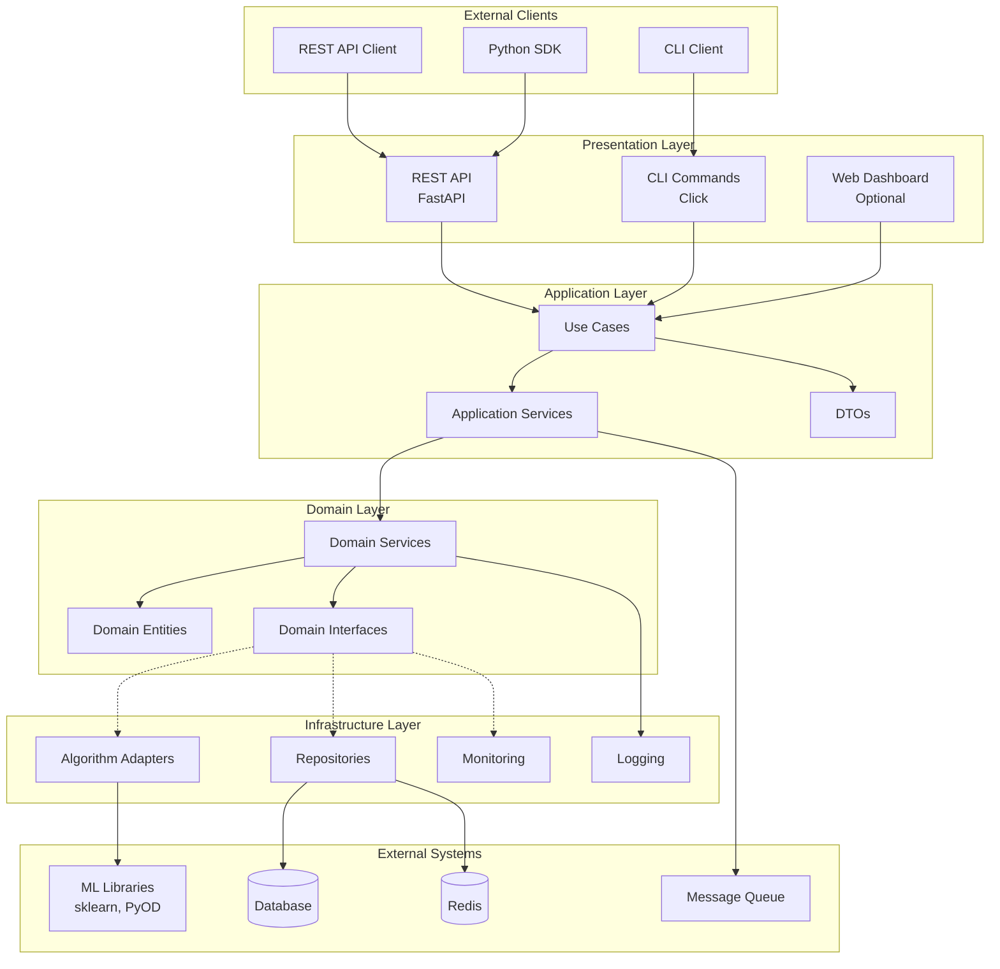

### Algorithm Adapter Architecture

```mermaid
graph LR
    subgraph "Domain"
        AI[Algorithm Interface]
        DS[Detection Service]
    end
    
    subgraph "Infrastructure"
        AA[Abstract Adapter]
        
        subgraph "Concrete Adapters"
            SA[Sklearn Adapter]
            PA[PyOD Adapter]
            DA[Deep Learning Adapter]
        end
    end
    
    subgraph "External Libraries"
        SK[Scikit-learn]
        PY[PyOD]
        TF[TensorFlow]
        PT[PyTorch]
    end
    
    DS --> AI
    AI <|-- AA
    AA <|-- SA
    AA <|-- PA
    AA <|-- DA
    
    SA --> SK
    PA --> PY
    DA --> TF
    DA --> PT
```

## Data Flow

### Detection Flow

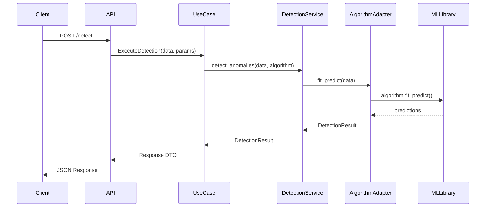

### Streaming Detection Flow

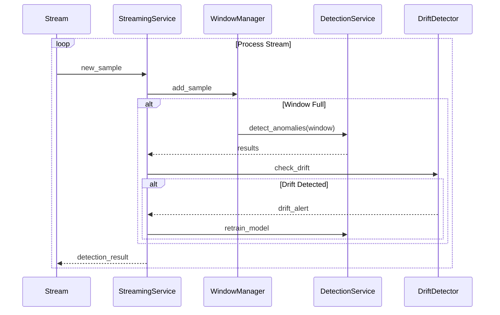

## Domain Model

### Core Entities and Value Objects

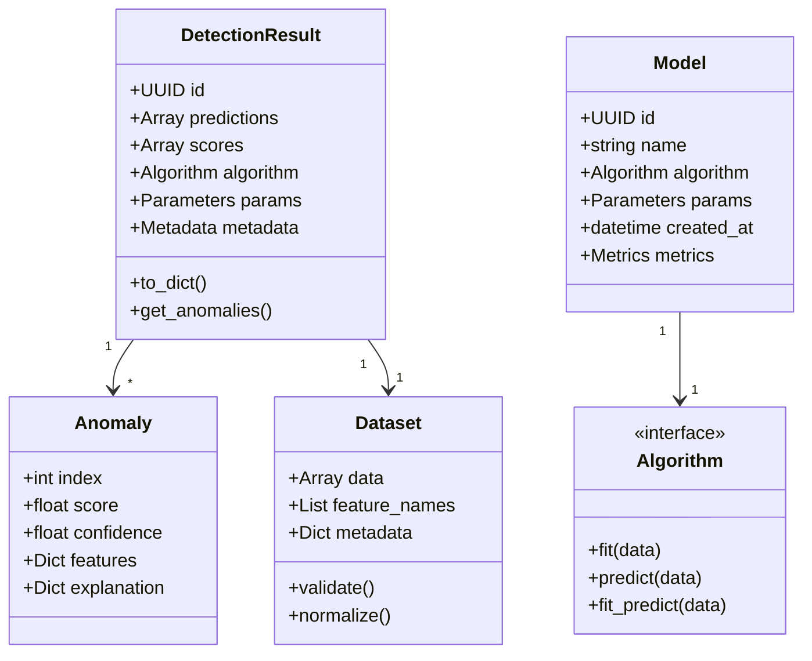

### Domain Services

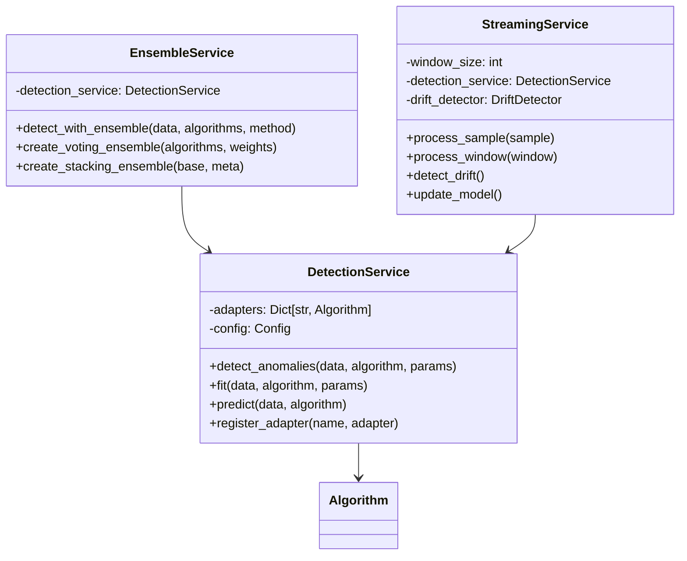

## Service Architecture

### Microservice Deployment

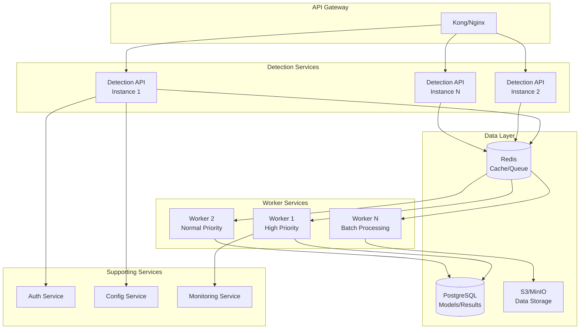

### Container Architecture

```yaml
# docker-compose.yml representation
services:
  api:
    image: anomaly-detection:api
    ports: ["8001:8001"]
    environment:
      - WORKERS=4
      - LOG_LEVEL=INFO
    depends_on:
      - redis
      - postgres
    deploy:
      replicas: 3
      resources:
        limits:
          cpus: '2'
          memory: 2G
  
  worker:
    image: anomaly-detection:worker
    environment:
      - MAX_JOBS=10
      - QUEUE_NAMES=high,normal,low
    depends_on:
      - redis
      - postgres
    deploy:
      replicas: 5
      resources:
        limits:
          cpus: '4'
          memory: 4G
  
  redis:
    image: redis:7-alpine
    volumes:
      - redis-data:/data
  
  postgres:
    image: postgres:15
    environment:
      - POSTGRES_DB=anomaly_detection
    volumes:
      - postgres-data:/var/lib/postgresql/data
```

## Integration Points

### External System Integration

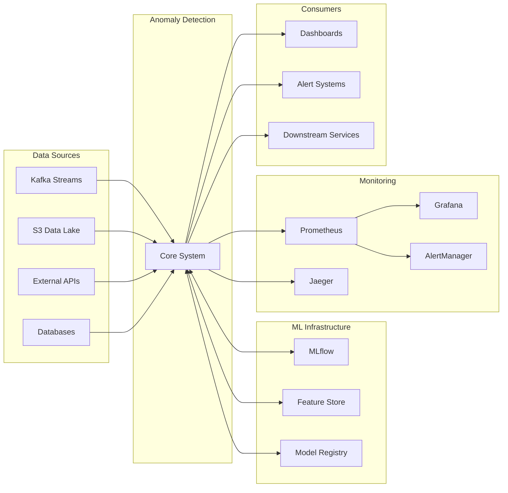

### Event-Driven Architecture

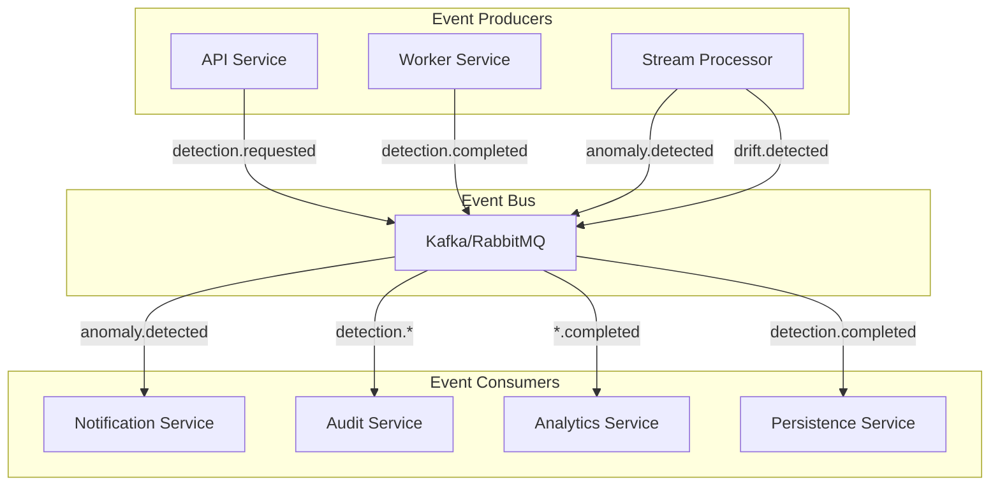

## Deployment Architecture

### Kubernetes Deployment

```yaml
# Kubernetes architecture representation
apiVersion: apps/v1
kind: Deployment
metadata:
  name: anomaly-detection-api
spec:
  replicas: 3
  selector:
    matchLabels:
      app: anomaly-detection
      component: api
  template:
    metadata:
      labels:
        app: anomaly-detection
        component: api
    spec:
      containers:
      - name: api
        image: anomaly-detection:api-latest
        ports:
        - containerPort: 8001
        env:
        - name: ENVIRONMENT
          value: "production"
        resources:
          requests:
            memory: "1Gi"
            cpu: "500m"
          limits:
            memory: "2Gi"
            cpu: "2000m"
        livenessProbe:
          httpGet:
            path: /health/liveness
            port: 8001
          initialDelaySeconds: 30
          periodSeconds: 10
        readinessProbe:
          httpGet:
            path: /health/readiness
            port: 8001
          initialDelaySeconds: 5
          periodSeconds: 5
```

### Auto-Scaling Architecture

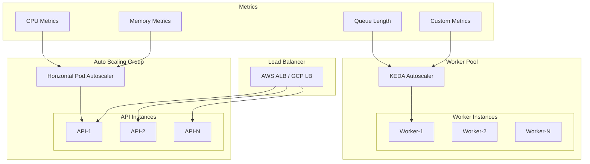

## Security Architecture

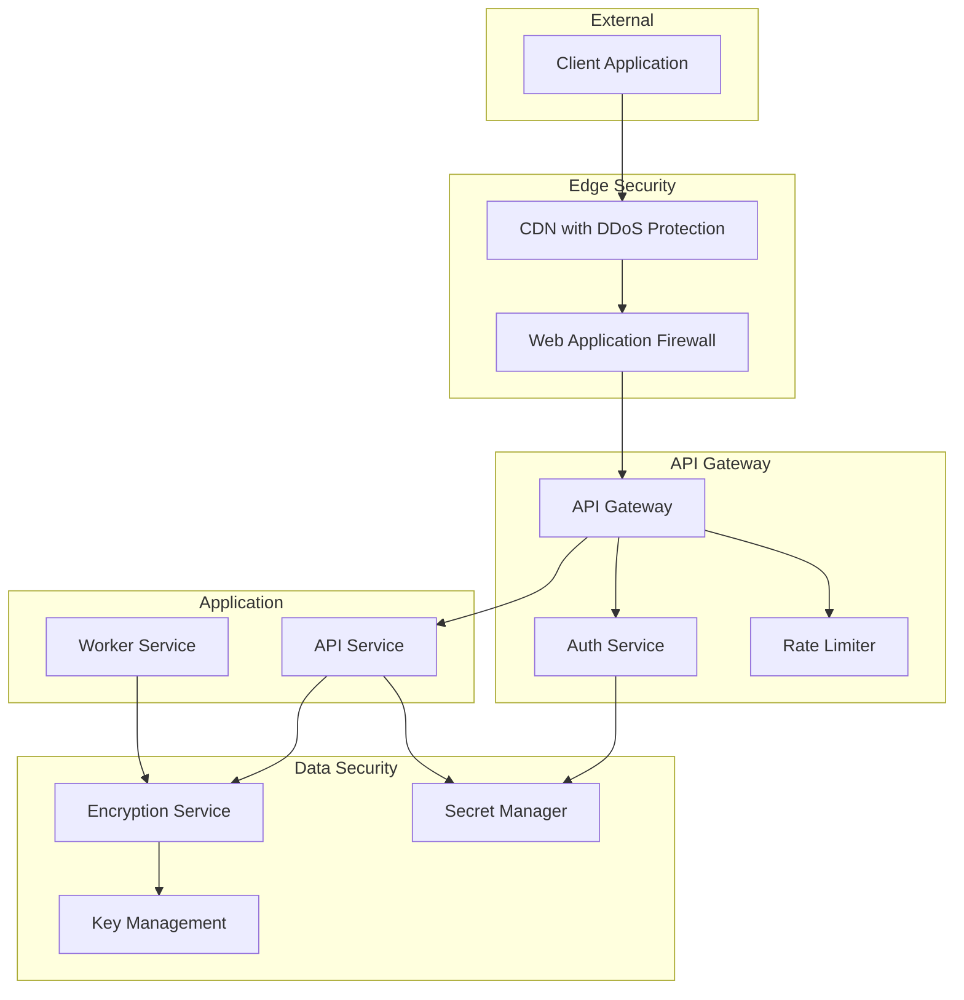

## Performance Architecture

### Caching Strategy

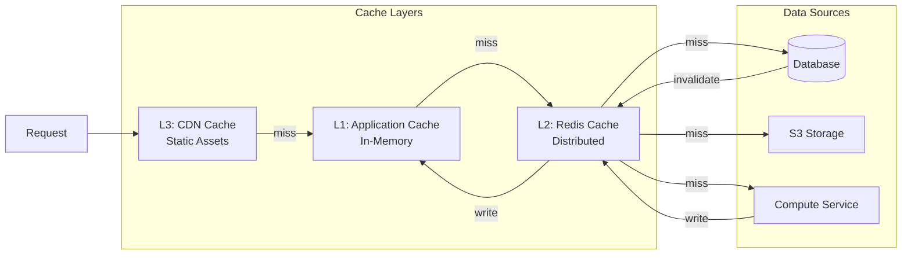

## Best Practices

1. **Dependency Direction**: Dependencies always point inward (from outer to inner layers)
2. **Interface Segregation**: Define narrow, focused interfaces
3. **Immutability**: Use immutable value objects where possible
4. **Event Sourcing**: Consider event sourcing for audit and replay capabilities
5. **CQRS**: Separate read and write models for complex scenarios
6. **Circuit Breakers**: Implement circuit breakers for external service calls
7. **Bulkheads**: Isolate critical resources to prevent cascade failures
8. **Observability**: Comprehensive logging, metrics, and tracing

## Future Architecture Considerations

1. **GraphQL API**: For flexible client queries
2. **gRPC Services**: For internal service communication
3. **Service Mesh**: Istio/Linkerd for advanced traffic management
4. **Edge Computing**: Process data closer to sources
5. **Federated Learning**: Distributed model training
6. **Multi-Region**: Global deployment with data locality
7. **Serverless**: Lambda/Cloud Functions for burst processing