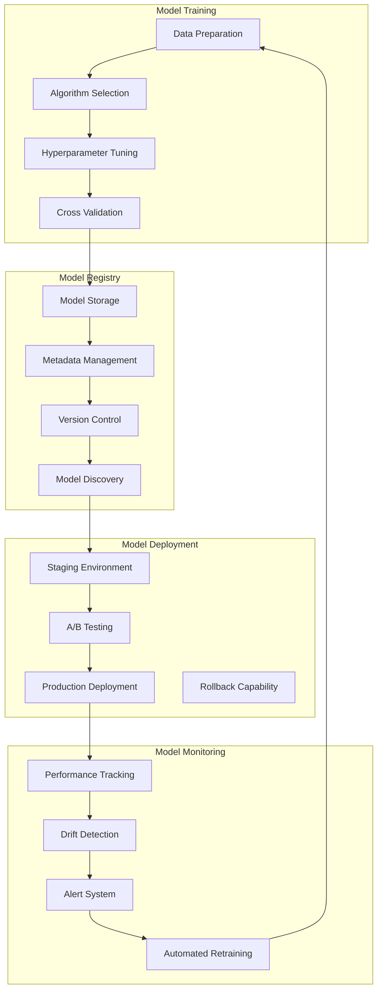

# Model Management Guide

This comprehensive guide covers model training, persistence, versioning, deployment, and lifecycle management for the Anomaly Detection package.

!!! note "Prerequisites"
    - **New to anomaly detection?** Complete the [Getting Started Guide](getting-started/index.md) first
    - **Need algorithm knowledge?** Review the [Algorithm Guide](algorithms.md) for training considerations
    - **Want examples?** See [Practical Examples](getting-started/examples.md) for model training workflows

!!! info "Related Guides"
    - **Using ensembles?** Check [Ensemble Methods](ensemble.md) for multi-model management
    - **Need explanations?** See [Explainability Guide](explainability.md) for model interpretability
    - **Going to production?** Review [Deployment Guide](deployment.md) for scaling model serving
    - **Performance issues?** Use [Performance Optimization](performance.md) for model efficiency

## Table of Contents

1. [Overview](#overview)
2. [Model Training](#model-training)
3. [Model Persistence](#model-persistence)
4. [Model Versioning](#model-versioning)
5. [Model Registry](#model-registry)
6. [Model Deployment](#model-deployment)
7. [Model Monitoring](#model-monitoring)
8. [Model Lifecycle Management](#model-lifecycle-management)
9. [A/B Testing](#ab-testing)
10. [Performance Optimization](#performance-optimization)
11. [Best Practices](#best-practices)

## Overview

The Anomaly Detection package provides comprehensive model management capabilities including:

- **Training & Validation**: Train models with various algorithms and validation strategies
- **Persistence**: Save and load models with metadata and versioning
- **Registry**: Centralized model storage with search and discovery
- **Deployment**: Deploy models to production with rollback capabilities
- **Monitoring**: Track model performance and detect drift
- **Lifecycle**: Automated model retraining and retirement

### Key Components



## Model Training

### Basic Model Training

```python
from anomaly_detection.domain.services import ModelTrainingService
from anomaly_detection.infrastructure.model_manager import ModelManager

# Initialize training service
trainer = ModelTrainingService()

# Train basic model
training_config = {
    'algorithm': 'isolation_forest',
    'parameters': {
        'n_estimators': 100,
        'contamination': 0.1,
        'random_state': 42
    },
    'validation': {
        'method': 'holdout',
        'test_size': 0.2
    }
}

# Train model
model = await trainer.train_model(
    data=training_data,
    config=training_config,
    name='fraud_detector_v1'
)

print(f"Model trained with accuracy: {model.metrics['accuracy']:.3f}")
```

### Advanced Training with Cross-Validation

```python
from anomaly_detection.application.services import ModelTrainingService
from anomaly_detection.infrastructure.validation import CrossValidator

class AdvancedModelTrainer:
    def __init__(self):
        self.trainer = ModelTrainingService()
        self.validator = CrossValidator()
        
    async def train_with_cv(self, 
                           data: np.ndarray,
                           algorithm: str,
                           param_grid: dict,
                           cv_folds: int = 5):
        """Train model with cross-validation and hyperparameter tuning."""
        
        # Define parameter search space
        search_space = {
            'isolation_forest': {
                'n_estimators': [50, 100, 200],
                'max_samples': ['auto', 256, 512],
                'contamination': [0.05, 0.1, 0.15]
            },
            'local_outlier_factor': {
                'n_neighbors': [10, 20, 30],
                'contamination': [0.05, 0.1, 0.15],
                'metric': ['euclidean', 'manhattan']
            }
        }
        
        best_params = None
        best_score = -np.inf
        
        # Grid search with cross-validation
        for params in self._generate_param_combinations(search_space[algorithm]):
            cv_scores = []
            
            for fold in range(cv_folds):
                # Split data for this fold
                train_idx, val_idx = self.validator.get_fold_indices(
                    data, fold, cv_folds
                )
                
                train_fold = data[train_idx]
                val_fold = data[val_idx]
                
                # Train model on fold
                model = await self.trainer.train_model(
                    data=train_fold,
                    config={
                        'algorithm': algorithm,
                        'parameters': params
                    }
                )
                
                # Validate on fold
                predictions = await model.predict(val_fold)
                score = self._calculate_score(val_fold, predictions)
                cv_scores.append(score)
            
            # Average score across folds
            avg_score = np.mean(cv_scores)
            
            if avg_score > best_score:
                best_score = avg_score
                best_params = params
        
        # Train final model with best parameters
        final_model = await self.trainer.train_model(
            data=data,
            config={
                'algorithm': algorithm,
                'parameters': best_params
            },
            metadata={
                'cv_score': best_score,
                'cv_folds': cv_folds,
                'best_params': best_params
            }
        )
        
        return final_model
    
    def _generate_param_combinations(self, param_space):
        """Generate all parameter combinations."""
        from itertools import product
        
        keys = param_space.keys()
        values = param_space.values()
        
        for combination in product(*values):
            yield dict(zip(keys, combination))
    
    def _calculate_score(self, data, predictions):
        """Calculate validation score."""
        # Implement your scoring logic here
        # This could be based on anomaly rate, silhouette score, etc.
        return np.mean(predictions.confidence_scores)

# Usage
trainer = AdvancedModelTrainer()
model = await trainer.train_with_cv(
    data=training_data,
    algorithm='isolation_forest',
    param_grid={},
    cv_folds=5
)
```

### Ensemble Model Training

```python
from anomaly_detection.domain.services import EnsembleTrainingService

class EnsembleModelTrainer:
    def __init__(self):
        self.ensemble_trainer = EnsembleTrainingService()
    
    async def train_ensemble_model(self, 
                                  data: np.ndarray,
                                  base_algorithms: list,
                                  ensemble_method: str = 'voting'):
        """Train ensemble model with multiple base algorithms."""
        
        # Configure base models
        base_configs = [
            {
                'algorithm': 'isolation_forest',
                'parameters': {'n_estimators': 100, 'contamination': 0.1}
            },
            {
                'algorithm': 'local_outlier_factor', 
                'parameters': {'n_neighbors': 20, 'contamination': 0.1}
            },
            {
                'algorithm': 'one_class_svm',
                'parameters': {'kernel': 'rbf', 'nu': 0.1}
            }
        ]
        
        # Train base models
        base_models = []
        for config in base_configs:
            model = await self.ensemble_trainer.train_base_model(
                data=data,
                config=config
            )
            base_models.append(model)
        
        # Create ensemble
        ensemble_config = {
            'method': ensemble_method,
            'base_models': base_models,
            'weights': [0.4, 0.3, 0.3] if ensemble_method == 'weighted' else None
        }
        
        ensemble_model = await self.ensemble_trainer.create_ensemble(
            config=ensemble_config,
            validation_data=data
        )
        
        return ensemble_model
    
    async def train_stacking_ensemble(self, 
                                     data: np.ndarray,
                                     labels: np.ndarray,
                                     base_algorithms: list,
                                     meta_algorithm: str = 'logistic_regression'):
        """Train stacking ensemble with meta-learner."""
        
        # Split data for stacking
        from sklearn.model_selection import train_test_split
        
        X_blend, X_holdout, y_blend, y_holdout = train_test_split(
            data, labels, test_size=0.2, random_state=42
        )
        
        # Train base models and create blend features
        blend_features = []
        base_models = []
        
        for algorithm in base_algorithms:
            # Cross-validation for base model
            kfold = 5
            blend_pred = np.zeros(len(X_blend))
            
            for fold in range(kfold):
                # Split blend data for this fold
                fold_size = len(X_blend) // kfold
                start_idx = fold * fold_size
                end_idx = (fold + 1) * fold_size if fold < kfold - 1 else len(X_blend)
                
                train_idx = list(range(0, start_idx)) + list(range(end_idx, len(X_blend)))
                val_idx = list(range(start_idx, end_idx))
                
                X_fold_train = X_blend[train_idx]
                X_fold_val = X_blend[val_idx]
                
                # Train base model on fold
                model = await self.ensemble_trainer.train_base_model(
                    data=X_fold_train,
                    config={'algorithm': algorithm, 'parameters': {}}
                )
                
                # Predict on validation fold
                predictions = await model.predict(X_fold_val)
                blend_pred[val_idx] = predictions.anomaly_scores
            
            blend_features.append(blend_pred)
            
            # Train final base model on all blend data
            final_base_model = await self.ensemble_trainer.train_base_model(
                data=X_blend,
                config={'algorithm': algorithm, 'parameters': {}}
            )
            base_models.append(final_base_model)
        
        # Prepare meta-features
        X_meta = np.column_stack(blend_features)
        
        # Train meta-learner
        meta_model = await self.ensemble_trainer.train_meta_model(
            X_meta=X_meta,
            y_meta=y_blend,
            algorithm=meta_algorithm
        )
        
        # Create stacking ensemble
        stacking_ensemble = await self.ensemble_trainer.create_stacking_ensemble(
            base_models=base_models,
            meta_model=meta_model
        )
        
        # Validate on holdout set
        holdout_predictions = await stacking_ensemble.predict(X_holdout)
        validation_score = self._evaluate_predictions(holdout_predictions, y_holdout)
        
        stacking_ensemble.metadata['validation_score'] = validation_score
        
        return stacking_ensemble

# Usage
ensemble_trainer = EnsembleModelTrainer()

# Train voting ensemble
voting_model = await ensemble_trainer.train_ensemble_model(
    data=training_data,
    base_algorithms=['isolation_forest', 'lof', 'ocsvm'],
    ensemble_method='voting'
)

# Train stacking ensemble (if labels available)
stacking_model = await ensemble_trainer.train_stacking_ensemble(
    data=training_data,
    labels=training_labels,
    base_algorithms=['isolation_forest', 'lof', 'ocsvm'],
    meta_algorithm='logistic_regression'
)
```

### Automated Hyperparameter Optimization

```python
import optuna
from anomaly_detection.domain.services import ModelTrainingService

class AutoMLTrainer:
    def __init__(self):
        self.trainer = ModelTrainingService()
    
    async def optimize_hyperparameters(self,
                                      data: np.ndarray,
                                      algorithm: str,
                                      n_trials: int = 100):
        """Optimize hyperparameters using Bayesian optimization."""
        
        def objective(trial):
            # Define parameter search space based on algorithm
            if algorithm == 'isolation_forest':
                params = {
                    'n_estimators': trial.suggest_int('n_estimators', 50, 300),
                    'max_samples': trial.suggest_categorical('max_samples', ['auto', 128, 256, 512]),
                    'contamination': trial.suggest_float('contamination', 0.01, 0.3),
                    'max_features': trial.suggest_float('max_features', 0.5, 1.0)
                }
            elif algorithm == 'local_outlier_factor':
                params = {
                    'n_neighbors': trial.suggest_int('n_neighbors', 5, 50),
                    'contamination': trial.suggest_float('contamination', 0.01, 0.3),
                    'metric': trial.suggest_categorical('metric', ['euclidean', 'manhattan', 'cosine'])
                }
            else:
                raise ValueError(f"Algorithm {algorithm} not supported for optimization")
            
            # Train model with suggested parameters
            try:
                model = asyncio.run(self.trainer.train_model(
                    data=data,
                    config={
                        'algorithm': algorithm,
                        'parameters': params
                    }
                ))
                
                # Evaluate model (using internal validation)
                score = self._evaluate_model(model, data)
                return score
                
            except Exception as e:
                # Return poor score for failed trials
                return -1.0
        
        # Run optimization
        study = optuna.create_study(direction='maximize')
        study.optimize(objective, n_trials=n_trials)
        
        # Train final model with best parameters
        best_params = study.best_params
        final_model = await self.trainer.train_model(
            data=data,
            config={
                'algorithm': algorithm,
                'parameters': best_params
            },
            metadata={
                'optimization_score': study.best_value,
                'n_trials': n_trials,
                'best_params': best_params
            }
        )
        
        return final_model, study
    
    def _evaluate_model(self, model, data):
        """Evaluate model performance."""
        predictions = asyncio.run(model.predict(data))
        
        # Use silhouette score as proxy for quality
        from sklearn.metrics import silhouette_score
        
        try:
            score = silhouette_score(data, predictions.predictions)
            return score
        except:
            return -1.0

# Usage
automl_trainer = AutoMLTrainer()

model, study = await automl_trainer.optimize_hyperparameters(
    data=training_data,
    algorithm='isolation_forest',
    n_trials=50
)

print(f"Best parameters: {study.best_params}")
print(f"Best score: {study.best_value:.3f}")
```

## Model Persistence

### Basic Model Saving and Loading

```python
from anomaly_detection.infrastructure.repositories import ModelRepository
from anomaly_detection.domain.entities import Model

class ModelPersistenceManager:
    def __init__(self, storage_backend='filesystem'):
        self.repository = ModelRepository(backend=storage_backend)
    
    async def save_model(self, 
                        model,
                        name: str,
                        version: str = None,
                        metadata: dict = None):
        """Save model with metadata."""
        
        # Prepare model entity
        model_entity = Model(
            name=name,
            version=version or self._generate_version(),
            algorithm=model.algorithm,
            parameters=model.parameters,
            training_data_hash=self._hash_data(model.training_data),
            created_at=datetime.now(),
            metrics=model.metrics,
            metadata=metadata or {}
        )
        
        # Save model artifacts
        model_id = await self.repository.save_model(
            model_entity=model_entity,
            model_artifact=model.get_serializable_state(),
            preprocessing_pipeline=model.preprocessing_pipeline
        )
        
        print(f"Model saved with ID: {model_id}")
        return model_id
    
    async def load_model(self, model_id: str):
        """Load model by ID."""
        
        model_entity = await self.repository.get_model(model_id)
        
        if not model_entity:
            raise ValueError(f"Model {model_id} not found")
        
        # Reconstruct model
        model = await self._reconstruct_model(model_entity)
        
        return model
    
    async def load_model_by_name(self, name: str, version: str = None):
        """Load model by name and version."""
        
        if version:
            model_entity = await self.repository.get_model_by_name_version(name, version)
        else:
            # Get latest version
            model_entity = await self.repository.get_latest_model(name)
        
        if not model_entity:
            raise ValueError(f"Model {name}:{version} not found")
        
        model = await self._reconstruct_model(model_entity)
        return model
    
    async def _reconstruct_model(self, model_entity):
        """Reconstruct model from saved entity."""
        
        # Load model artifacts
        artifacts = await self.repository.load_model_artifacts(model_entity.id)
        
        # Recreate model based on algorithm
        if model_entity.algorithm == 'isolation_forest':
            from anomaly_detection.infrastructure.adapters.algorithms import SklearnAdapter
            model = SklearnAdapter('iforest', **model_entity.parameters)
            model.load_state(artifacts['model_state'])
        elif model_entity.algorithm == 'ensemble':
            from anomaly_detection.domain.services import EnsembleService
            model = EnsembleService()
            model.load_state(artifacts['ensemble_state'])
        else:
            raise ValueError(f"Unknown algorithm: {model_entity.algorithm}")
        
        # Attach metadata
        model.metadata = model_entity.metadata
        model.metrics = model_entity.metrics
        
        return model
    
    def _generate_version(self):
        """Generate version string."""
        return datetime.now().strftime("%Y%m%d_%H%M%S")
    
    def _hash_data(self, data):
        """Generate hash of training data."""
        import hashlib
        return hashlib.sha256(str(data).encode()).hexdigest()[:16]

# Usage
persistence_manager = ModelPersistenceManager()

# Save model
model_id = await persistence_manager.save_model(
    model=trained_model,
    name='fraud_detector',
    version='1.0',
    metadata={
        'dataset': 'credit_card_transactions',
        'training_samples': 10000,
        'accuracy': 0.95
    }
)

# Load model
loaded_model = await persistence_manager.load_model(model_id)

# Load by name
latest_model = await persistence_manager.load_model_by_name('fraud_detector')
```

### Advanced Model Serialization

```python
import pickle
import joblib
import json
import gzip
from pathlib import Path

class AdvancedModelSerializer:
    def __init__(self):
        self.supported_formats = ['pickle', 'joblib', 'json', 'compressed']
    
    async def serialize_model(self, 
                             model,
                             format: str = 'joblib',
                             compress: bool = True):
        """Serialize model with various formats."""
        
        # Prepare serialization data
        serialization_data = {
            'algorithm': model.algorithm,
            'parameters': model.parameters,
            'model_state': model.get_state(),
            'preprocessing_pipeline': model.preprocessing_pipeline.get_state() if model.preprocessing_pipeline else None,
            'metadata': model.metadata,
            'metrics': model.metrics,
            'created_at': datetime.now().isoformat(),
            'package_version': self._get_package_version()
        }
        
        if format == 'pickle':
            serialized = pickle.dumps(serialization_data)
        elif format == 'joblib':
            # More efficient for scikit-learn models
            from io import BytesIO
            buffer = BytesIO()
            joblib.dump(serialization_data, buffer)
            serialized = buffer.getvalue()
        elif format == 'json':
            # For metadata and simple models only
            json_safe_data = self._make_json_safe(serialization_data)
            serialized = json.dumps(json_safe_data).encode()
        else:
            raise ValueError(f"Unsupported format: {format}")
        
        # Apply compression if requested
        if compress:
            serialized = gzip.compress(serialized)
        
        return serialized
    
    async def deserialize_model(self, 
                               serialized_data: bytes,
                               format: str = 'joblib',
                               compressed: bool = True):
        """Deserialize model from bytes."""
        
        # Decompress if needed
        if compressed:
            serialized_data = gzip.decompress(serialized_data)
        
        # Deserialize based on format
        if format == 'pickle':
            data = pickle.loads(serialized_data)
        elif format == 'joblib':
            from io import BytesIO
            buffer = BytesIO(serialized_data)
            data = joblib.load(buffer)
        elif format == 'json':
            data = json.loads(serialized_data.decode())
        else:
            raise ValueError(f"Unsupported format: {format}")
        
        # Reconstruct model
        model = await self._reconstruct_from_data(data)
        return model
    
    def _make_json_safe(self, data):
        """Convert data to JSON-safe format."""
        if isinstance(data, dict):
            return {k: self._make_json_safe(v) for k, v in data.items()}
        elif isinstance(data, list):
            return [self._make_json_safe(item) for item in data]
        elif isinstance(data, np.ndarray):
            return data.tolist()
        elif isinstance(data, (np.integer, np.floating)):
            return float(data)
        elif isinstance(data, datetime):
            return data.isoformat()
        else:
            return data
    
    def _get_package_version(self):
        """Get package version for compatibility checking."""
        import anomaly_detection
        return getattr(anomaly_detection, '__version__', 'unknown')

# Usage
serializer = AdvancedModelSerializer()

# Serialize model
serialized = await serializer.serialize_model(
    model=trained_model,
    format='joblib',
    compress=True
)

# Save to file
with open('model.joblib.gz', 'wb') as f:
    f.write(serialized)

# Load from file
with open('model.joblib.gz', 'rb') as f:
    serialized = f.read()

# Deserialize model
loaded_model = await serializer.deserialize_model(
    serialized_data=serialized,
    format='joblib',
    compressed=True
)
```

### Cloud Storage Integration

```python
import boto3
from google.cloud import storage as gcs
from azure.storage.blob import BlobServiceClient

class CloudModelStorage:
    def __init__(self, provider='aws', **config):
        self.provider = provider
        self.config = config
        self._init_client()
    
    def _init_client(self):
        """Initialize cloud storage client."""
        
        if self.provider == 'aws':
            self.client = boto3.client(
                's3',
                aws_access_key_id=self.config.get('access_key'),
                aws_secret_access_key=self.config.get('secret_key'),
                region_name=self.config.get('region', 'us-east-1')
            )
        elif self.provider == 'gcp':
            self.client = gcs.Client(
                project=self.config.get('project_id'),
                credentials_path=self.config.get('credentials_path')
            )
        elif self.provider == 'azure':
            self.client = BlobServiceClient(
                account_url=self.config.get('account_url'),
                credential=self.config.get('credential')
            )
        else:
            raise ValueError(f"Unsupported provider: {self.provider}")
    
    async def upload_model(self, 
                          model_data: bytes,
                          model_id: str,
                          bucket: str,
                          metadata: dict = None):
        """Upload model to cloud storage."""
        
        key = f"models/{model_id}/model.joblib.gz"
        
        if self.provider == 'aws':
            extra_args = {
                'Metadata': metadata or {},
                'ServerSideEncryption': 'AES256'
            }
            
            self.client.put_object(
                Bucket=bucket,
                Key=key,
                Body=model_data,
                **extra_args
            )
            
        elif self.provider == 'gcp':
            bucket_obj = self.client.bucket(bucket)
            blob = bucket_obj.blob(key)
            
            blob.metadata = metadata or {}
            blob.upload_from_string(model_data)
            
        elif self.provider == 'azure':
            blob_client = self.client.get_blob_client(
                container=bucket,
                blob=key
            )
            
            blob_client.upload_blob(
                data=model_data,
                metadata=metadata or {},
                overwrite=True
            )
        
        return f"{self.provider}://{bucket}/{key}"
    
    async def download_model(self, 
                           bucket: str,
                           model_id: str):
        """Download model from cloud storage."""
        
        key = f"models/{model_id}/model.joblib.gz"
        
        if self.provider == 'aws':
            response = self.client.get_object(Bucket=bucket, Key=key)
            model_data = response['Body'].read()
            metadata = response.get('Metadata', {})
            
        elif self.provider == 'gcp':
            bucket_obj = self.client.bucket(bucket)
            blob = bucket_obj.blob(key)
            
            model_data = blob.download_as_bytes()
            metadata = blob.metadata or {}
            
        elif self.provider == 'azure':
            blob_client = self.client.get_blob_client(
                container=bucket,
                blob=key
            )
            
            download_stream = blob_client.download_blob()
            model_data = download_stream.readall()
            
            properties = blob_client.get_blob_properties()
            metadata = properties.metadata or {}
        
        return model_data, metadata
    
    async def list_models(self, bucket: str, prefix: str = "models/"):
        """List available models in storage."""
        
        models = []
        
        if self.provider == 'aws':
            response = self.client.list_objects_v2(
                Bucket=bucket,
                Prefix=prefix
            )
            
            for obj in response.get('Contents', []):
                if obj['Key'].endswith('model.joblib.gz'):
                    model_id = obj['Key'].split('/')[1]
                    models.append({
                        'model_id': model_id,
                        'last_modified': obj['LastModified'],
                        'size': obj['Size']
                    })
                    
        elif self.provider == 'gcp':
            bucket_obj = self.client.bucket(bucket)
            blobs = bucket_obj.list_blobs(prefix=prefix)
            
            for blob in blobs:
                if blob.name.endswith('model.joblib.gz'):
                    model_id = blob.name.split('/')[1]
                    models.append({
                        'model_id': model_id,
                        'last_modified': blob.time_created,
                        'size': blob.size
                    })
        
        return models

# Usage
cloud_storage = CloudModelStorage(
    provider='aws',
    access_key='your-access-key',
    secret_key='your-secret-key',
    region='us-east-1'
)

# Upload model
model_url = await cloud_storage.upload_model(
    model_data=serialized_model,
    model_id='fraud_detector_v1',
    bucket='ml-models',
    metadata={'algorithm': 'isolation_forest', 'version': '1.0'}
)

# Download model
model_data, metadata = await cloud_storage.download_model(
    bucket='ml-models',
    model_id='fraud_detector_v1'
)

# List models
available_models = await cloud_storage.list_models(bucket='ml-models')
```

## Model Versioning

### Semantic Versioning System

```python
from dataclasses import dataclass
from typing import Optional, List
from datetime import datetime
import semver

@dataclass
class ModelVersion:
    major: int
    minor: int
    patch: int
    prerelease: Optional[str] = None
    build: Optional[str] = None
    
    def __str__(self):
        version = f"{self.major}.{self.minor}.{self.patch}"
        if self.prerelease:
            version += f"-{self.prerelease}"
        if self.build:
            version += f"+{self.build}"
        return version
    
    @classmethod
    def from_string(cls, version_str: str):
        """Parse version from string."""
        parsed = semver.VersionInfo.parse(version_str)
        return cls(
            major=parsed.major,
            minor=parsed.minor,
            patch=parsed.patch,
            prerelease=parsed.prerelease,
            build=parsed.build
        )
    
    def increment(self, level: str = 'patch'):
        """Increment version level."""
        if level == 'major':
            return ModelVersion(self.major + 1, 0, 0)
        elif level == 'minor':
            return ModelVersion(self.major, self.minor + 1, 0)
        elif level == 'patch':
            return ModelVersion(self.major, self.minor, self.patch + 1)
        else:
            raise ValueError(f"Invalid level: {level}")

class ModelVersionManager:
    def __init__(self, repository):
        self.repository = repository
    
    async def create_version(self,
                           model,
                           model_name: str,
                           increment_level: str = 'patch',
                           description: str = None):
        """Create new model version."""
        
        # Get latest version
        latest_version = await self.get_latest_version(model_name)
        
        if latest_version:
            new_version = latest_version.increment(increment_level)
        else:
            new_version = ModelVersion(1, 0, 0)
        
        # Save new version
        version_id = await self.repository.save_model_version(
            model=model,
            name=model_name,
            version=str(new_version),
            description=description,
            created_at=datetime.now()
        )
        
        return version_id, new_version
    
    async def get_latest_version(self, model_name: str) -> Optional[ModelVersion]:
        """Get latest version of model."""
        
        versions = await self.repository.list_model_versions(model_name)
        
        if not versions:
            return None
        
        # Sort versions and return latest
        version_objects = [ModelVersion.from_string(v.version) for v in versions]
        latest = max(version_objects, key=lambda v: (v.major, v.minor, v.patch))
        
        return latest
    
    async def list_versions(self, model_name: str) -> List[dict]:
        """List all versions of a model."""
        
        versions = await self.repository.list_model_versions(model_name)
        
        return [
            {
                'version': v.version,
                'created_at': v.created_at,
                'description': v.description,
                'metrics': v.metrics
            }
            for v in versions
        ]
    
    async def compare_versions(self,
                             model_name: str,
                             version1: str,
                             version2: str,
                             test_data: np.ndarray = None):
        """Compare two model versions."""
        
        # Load both versions
        model1 = await self.repository.load_model_version(model_name, version1)
        model2 = await self.repository.load_model_version(model_name, version2)
        
        comparison = {
            'version1': version1,
            'version2': version2,
            'algorithm_comparison': {
                'v1_algorithm': model1.algorithm,
                'v2_algorithm': model2.algorithm,
                'same_algorithm': model1.algorithm == model2.algorithm
            },
            'parameter_comparison': self._compare_parameters(
                model1.parameters, 
                model2.parameters
            ),
            'metrics_comparison': self._compare_metrics(
                model1.metrics,
                model2.metrics
            )
        }
        
        # Performance comparison on test data
        if test_data is not None:
            pred1 = await model1.predict(test_data)
            pred2 = await model2.predict(test_data)
            
            comparison['performance_comparison'] = {
                'v1_anomaly_rate': np.mean(pred1.predictions == -1),
                'v2_anomaly_rate': np.mean(pred2.predictions == -1),
                'agreement_rate': np.mean(pred1.predictions == pred2.predictions)
            }
        
        return comparison
    
    def _compare_parameters(self, params1: dict, params2: dict):
        """Compare model parameters."""
        
        all_keys = set(params1.keys()) | set(params2.keys())
        comparison = {}
        
        for key in all_keys:
            v1_val = params1.get(key, 'MISSING')
            v2_val = params2.get(key, 'MISSING')
            
            comparison[key] = {
                'version1': v1_val,
                'version2': v2_val,
                'changed': v1_val != v2_val
            }
        
        return comparison
    
    def _compare_metrics(self, metrics1: dict, metrics2: dict):
        """Compare model metrics."""
        
        all_keys = set(metrics1.keys()) | set(metrics2.keys())
        comparison = {}
        
        for key in all_keys:
            v1_val = metrics1.get(key)
            v2_val = metrics2.get(key)
            
            if v1_val is not None and v2_val is not None:
                try:
                    change = v2_val - v1_val
                    percent_change = (change / v1_val) * 100 if v1_val != 0 else 0
                except:
                    change = None
                    percent_change = None
            else:
                change = None
                percent_change = None
            
            comparison[key] = {
                'version1': v1_val,
                'version2': v2_val,
                'change': change,
                'percent_change': percent_change
            }
        
        return comparison

# Usage
version_manager = ModelVersionManager(repository)

# Create new version
version_id, version = await version_manager.create_version(
    model=improved_model,
    model_name='fraud_detector',
    increment_level='minor',
    description='Improved accuracy with new features'
)

print(f"Created version: {version}")

# List versions
versions = await version_manager.list_versions('fraud_detector')
for v in versions:
    print(f"Version {v['version']}: {v['description']}")

# Compare versions
comparison = await version_manager.compare_versions(
    model_name='fraud_detector',
    version1='1.0.0',
    version2='1.1.0',
    test_data=test_dataset
)

print(f"Performance improvement: {comparison['performance_comparison']}")
```

## Model Registry

### Centralized Model Registry

```python
from typing import Dict, List, Optional
from dataclasses import dataclass
from datetime import datetime

@dataclass
class ModelRegistryEntry:
    id: str
    name: str
    version: str
    algorithm: str
    status: str  # 'development', 'staging', 'production', 'archived'
    created_at: datetime
    updated_at: datetime
    created_by: str
    description: str
    tags: List[str]
    metrics: Dict
    parameters: Dict
    model_uri: str
    metadata: Dict

class ModelRegistry:
    def __init__(self, backend='database'):
        self.backend = backend
        self._init_storage()
    
    def _init_storage(self):
        """Initialize storage backend."""
        
        if self.backend == 'database':
            from anomaly_detection.infrastructure.repositories import DatabaseModelRepository
            self.storage = DatabaseModelRepository()
        elif self.backend == 'filesystem':
            from anomaly_detection.infrastructure.repositories import FilesystemModelRepository
            self.storage = FilesystemModelRepository()
        else:
            raise ValueError(f"Unsupported backend: {self.backend}")
    
    async def register_model(self,
                           model,
                           name: str,
                           version: str,
                           description: str = None,
                           tags: List[str] = None,
                           created_by: str = None) -> str:
        """Register a new model in the registry."""
        
        # Generate unique ID
        model_id = self._generate_model_id(name, version)
        
        # Save model artifacts
        model_uri = await self._save_model_artifacts(model, model_id)
        
        # Create registry entry
        entry = ModelRegistryEntry(
            id=model_id,
            name=name,
            version=version,
            algorithm=model.algorithm,
            status='development',
            created_at=datetime.now(),
            updated_at=datetime.now(),
            created_by=created_by or 'system',
            description=description or '',
            tags=tags or [],
            metrics=model.metrics or {},
            parameters=model.parameters or {},
            model_uri=model_uri,
            metadata=model.metadata or {}
        )
        
        # Save to registry
        await self.storage.save_registry_entry(entry)
        
        return model_id
    
    async def get_model(self, model_id: str) -> Optional[ModelRegistryEntry]:
        """Get model by ID."""
        return await self.storage.get_registry_entry(model_id)
    
    async def search_models(self,
                          name: str = None,
                          tags: List[str] = None,
                          algorithm: str = None,
                          status: str = None,
                          limit: int = 100) -> List[ModelRegistryEntry]:
        """Search models by criteria."""
        
        filters = {}
        if name:
            filters['name'] = name
        if tags:
            filters['tags'] = tags
        if algorithm:
            filters['algorithm'] = algorithm
        if status:
            filters['status'] = status
        
        return await self.storage.search_models(filters, limit)
    
    async def update_model_status(self,
                                model_id: str,
                                status: str,
                                updated_by: str = None):
        """Update model status."""
        
        entry = await self.get_model(model_id)
        if not entry:
            raise ValueError(f"Model {model_id} not found")
        
        entry.status = status
        entry.updated_at = datetime.now()
        
        await self.storage.update_registry_entry(entry)
        
        # Log status change
        await self._log_status_change(model_id, status, updated_by)
    
    async def add_tags(self, model_id: str, tags: List[str]):
        """Add tags to model."""
        
        entry = await self.get_model(model_id)
        if not entry:
            raise ValueError(f"Model {model_id} not found")
        
        # Add new tags (avoid duplicates)
        existing_tags = set(entry.tags)
        new_tags = set(tags)
        entry.tags = list(existing_tags | new_tags)
        entry.updated_at = datetime.now()
        
        await self.storage.update_registry_entry(entry)
    
    async def get_production_models(self) -> List[ModelRegistryEntry]:
        """Get all production models."""
        return await self.search_models(status='production')
    
    async def get_model_lineage(self, model_id: str) -> Dict:
        """Get model lineage and dependencies."""
        
        entry = await self.get_model(model_id)
        if not entry:
            raise ValueError(f"Model {model_id} not found")
        
        # Get all versions of this model
        all_versions = await self.search_models(name=entry.name)
        all_versions.sort(key=lambda x: x.created_at)
        
        # Get dependencies (models used in ensemble, etc.)
        dependencies = await self._get_model_dependencies(model_id)
        
        # Get models that depend on this one
        dependents = await self._get_model_dependents(model_id)
        
        return {
            'model_id': model_id,
            'all_versions': [
                {
                    'id': v.id,
                    'version': v.version,
                    'created_at': v.created_at,
                    'status': v.status
                }
                for v in all_versions
            ],
            'dependencies': dependencies,
            'dependents': dependents
        }
    
    async def archive_model(self, model_id: str, reason: str = None):
        """Archive a model."""
        
        await self.update_model_status(model_id, 'archived')
        
        # Add archive metadata
        entry = await self.get_model(model_id)
        entry.metadata['archived_at'] = datetime.now().isoformat()
        entry.metadata['archive_reason'] = reason or 'Manual archive'
        
        await self.storage.update_registry_entry(entry)
    
    def _generate_model_id(self, name: str, version: str) -> str:
        """Generate unique model ID."""
        import uuid
        base_id = f"{name}_{version}_{datetime.now().strftime('%Y%m%d_%H%M%S')}"
        return f"{base_id}_{str(uuid.uuid4())[:8]}"
    
    async def _save_model_artifacts(self, model, model_id: str) -> str:
        """Save model artifacts and return URI."""
        
        # Serialize model
        serializer = AdvancedModelSerializer()
        serialized = await serializer.serialize_model(model)
        
        # Save to storage
        uri = await self.storage.save_model_artifacts(model_id, serialized)
        
        return uri
    
    async def _log_status_change(self, model_id: str, status: str, user: str):
        """Log model status change."""
        
        log_entry = {
            'model_id': model_id,
            'status': status,
            'changed_by': user or 'system',
            'changed_at': datetime.now().isoformat()
        }
        
        await self.storage.log_model_event(log_entry)
    
    async def _get_model_dependencies(self, model_id: str) -> List[str]:
        """Get models that this model depends on."""
        
        entry = await self.get_model(model_id)
        
        # For ensemble models, get base model dependencies
        if entry.algorithm == 'ensemble':
            dependencies = entry.metadata.get('base_models', [])
            return dependencies
        
        return []
    
    async def _get_model_dependents(self, model_id: str) -> List[str]:
        """Get models that depend on this model."""
        
        # Search for ensemble models that use this model
        all_ensembles = await self.search_models(algorithm='ensemble')
        
        dependents = []
        for ensemble in all_ensembles:
            base_models = ensemble.metadata.get('base_models', [])
            if model_id in base_models:
                dependents.append(ensemble.id)
        
        return dependents

# Usage
registry = ModelRegistry(backend='database')

# Register model
model_id = await registry.register_model(
    model=trained_model,
    name='fraud_detector',
    version='1.0.0',
    description='Initial fraud detection model',
    tags=['fraud', 'financial', 'production-ready'],
    created_by='data-scientist@company.com'
)

# Search models
fraud_models = await registry.search_models(
    tags=['fraud'],
    status='production'
)

# Get model lineage
lineage = await registry.get_model_lineage(model_id)
print(f"Model has {len(lineage['all_versions'])} versions")

# Update status to production
await registry.update_model_status(
    model_id=model_id,
    status='production',
    updated_by='ml-engineer@company.com'
)
```

This comprehensive model management guide provides everything needed to effectively train, persist, version, and manage anomaly detection models throughout their lifecycle.