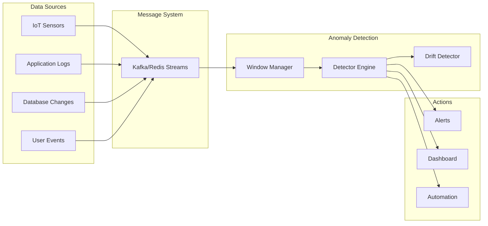

# Streaming Anomaly Detection Guide

This comprehensive guide covers real-time anomaly detection, concept drift detection, and production streaming patterns using the Anomaly Detection package.

!!! warning "Advanced Topic"
    This guide covers real-time streaming patterns. Ensure you understand batch anomaly detection first from the [Getting Started Guide](getting-started/index.md).

!!! info "Prerequisites & Related Guides"
    - **New to anomaly detection?** Start with [Your First Detection](getting-started/first-detection.md)
    - **Need algorithm selection?** Review the [Algorithm Guide](algorithms.md) for streaming-compatible algorithms
    - **Performance concerns?** Check [Performance Optimization](performance.md) for low-latency techniques
    - **Deploying streams?** Combine with [Deployment Guide](deployment.md) for production streaming
    - **Integration needs?** See [Integration Patterns](integration.md) for message queue setup

## Table of Contents

1. [Overview](#overview)
2. [Core Concepts](#core-concepts)  
3. [Streaming Service](#streaming-service)
4. [Real-time Detection Patterns](#real-time-detection-patterns)
5. [Concept Drift Detection](#concept-drift-detection)
6. [Integration with Message Systems](#integration-with-message-systems)
7. [Performance Optimization](#performance-optimization)
8. [Production Deployment](#production-deployment)
9. [Monitoring & Observability](#monitoring--observability)
10. [Best Practices](#best-practices)

## Overview

Streaming anomaly detection enables real-time identification of anomalous patterns in continuously arriving data. This guide covers the complete workflow from data ingestion to anomaly response.

### Key Features

- **Real-time Processing**: Sub-second anomaly detection latency
- **Concept Drift Detection**: Automatic model adaptation to changing patterns
- **Window-based Analysis**: Sliding and tumbling window support
- **Backpressure Handling**: Graceful degradation under high load
- **Integration Ready**: Native support for Kafka, Redis Streams, and more

### Use Cases

- **IoT Sensor Monitoring**: Real-time sensor anomaly detection
- **Financial Fraud Detection**: Transaction stream analysis
- **Network Security**: Traffic pattern monitoring
- **System Monitoring**: Infrastructure metric anomaly detection
- **User Behavior Analytics**: Real-time user activity analysis

## Core Concepts

### Streaming Architecture



### Data Flow Patterns

#### 1. Single Sample Processing
Process individual data points as they arrive:

```python
from anomaly_detection.domain.services import StreamingService

# Initialize streaming service
streaming = StreamingService(
    algorithm='iforest',
    window_size=1000,
    update_frequency=100,
    drift_detection=True
)

# Process single sample
async def process_sample(sample_data):
    result = await streaming.process_sample(sample_data)
    
    if result.is_anomaly:
        await handle_anomaly(result)
    
    if result.drift_detected:
        await retrain_model()
```

#### 2. Batch Processing
Process multiple samples in batches for efficiency:

```python
# Process batch of samples
async def process_batch(batch_data):
    results = await streaming.process_batch(batch_data)
    
    anomalies = [r for r in results if r.is_anomaly]
    if anomalies:
        await handle_batch_anomalies(anomalies)
```

#### 3. Window-based Processing
Analyze data over time windows:

```python
# Configure window processing
streaming = StreamingService(
    window_type='sliding',  # sliding, tumbling
    window_size=300,        # 5 minutes
    slide_interval=60,      # 1 minute slide
    aggregation='features'  # features, statistics
)
```

## Streaming Service

### Initialization and Configuration

```python
from anomaly_detection.domain.services import StreamingService

# Basic configuration
streaming = StreamingService(
    algorithm='iforest',
    window_size=1000,
    contamination=0.1,
    update_frequency=100
)

# Advanced configuration
streaming = StreamingService(
    algorithm='ensemble',
    algorithms=['iforest', 'lof', 'copod'],
    window_size=5000,
    window_type='sliding',
    slide_interval=1000,
    contamination=0.05,
    update_frequency=500,
    drift_detection=True,
    drift_threshold=0.1,
    retrain_threshold=1000,
    max_memory_samples=50000,
    async_processing=True,
    buffer_size=10000
)
```

### Core Methods

#### Processing Individual Samples

```python
# Process single data point
result = await streaming.process_sample(sample)

# Result contains:
# - is_anomaly: boolean
# - anomaly_score: float  
# - confidence: float
# - drift_detected: boolean
# - processing_time: float
# - sample_count: int
```

#### Processing Sample Batches

```python
# Process multiple samples efficiently
batch = np.array([[1, 2, 3], [4, 5, 6], [7, 8, 9]])
results = await streaming.process_batch(batch)

# Each result in results list contains same fields as single sample
for result in results:
    if result.is_anomaly:
        print(f"Anomaly detected: score={result.anomaly_score}")
```

#### Window Management

```python
# Get current window statistics
window_stats = streaming.get_window_stats()
print(f"Window size: {window_stats['size']}")
print(f"Anomaly rate: {window_stats['anomaly_rate']:.2%}")
print(f"Average score: {window_stats['avg_score']:.3f}")

# Force window processing
await streaming.process_window()

# Clear window (useful for concept drift adaptation)
streaming.clear_window()
```

## Real-time Detection Patterns

### Pattern 1: IoT Sensor Monitoring

```python
import asyncio
from anomaly_detection.domain.services import StreamingService

class IoTAnomalyDetector:
    def __init__(self):
        self.streaming = StreamingService(
            algorithm='iforest',
            window_size=1440,  # 24 hours of minute samples
            contamination=0.02,
            update_frequency=60  # Update model every hour
        )
        
    async def monitor_sensor_stream(self, sensor_id: str):
        """Monitor IoT sensor data stream."""
        
        async for sensor_reading in self.get_sensor_stream(sensor_id):
            # Extract features
            features = np.array([
                sensor_reading['temperature'],
                sensor_reading['humidity'], 
                sensor_reading['pressure'],
                sensor_reading['vibration']
            ])
            
            # Detect anomaly
            result = await self.streaming.process_sample(features)
            
            if result.is_anomaly:
                await self.handle_sensor_anomaly(
                    sensor_id, 
                    sensor_reading, 
                    result
                )
            
            # Check for concept drift
            if result.drift_detected:
                await self.adapt_to_drift(sensor_id)
    
    async def handle_sensor_anomaly(self, sensor_id, reading, result):
        """Handle detected sensor anomaly."""
        alert = {
            'sensor_id': sensor_id,
            'timestamp': reading['timestamp'],
            'anomaly_score': result.anomaly_score,
            'confidence': result.confidence,
            'reading': reading
        }
        
        # Send alert
        await self.send_alert(alert)
        
        # Log for analysis
        await self.log_anomaly(alert)
    
    async def adapt_to_drift(self, sensor_id):
        """Adapt model to concept drift."""
        print(f"Concept drift detected for sensor {sensor_id}")
        
        # Get recent normal data for retraining
        recent_data = await self.get_recent_normal_data(sensor_id)
        
        # Retrain model
        await self.streaming.retrain_model(recent_data)
        
        print(f"Model retrained for sensor {sensor_id}")
```

### Pattern 2: Financial Transaction Monitoring

```python
class TransactionAnomalyDetector:
    def __init__(self):
        self.streaming = StreamingService(
            algorithm='ensemble',
            algorithms=['iforest', 'lof', 'ocsvm'],
            window_size=10000,  # 10k transactions
            contamination=0.001,  # Very low fraud rate
            update_frequency=1000,
            drift_detection=True
        )
        
    async def monitor_transactions(self):
        """Monitor transaction stream for fraud."""
        
        async for transaction in self.get_transaction_stream():
            # Feature engineering
            features = self.extract_transaction_features(transaction)
            
            # Real-time detection
            result = await self.streaming.process_sample(features)
            
            if result.is_anomaly:
                # High confidence anomalies get immediate action
                if result.confidence > 0.9:
                    await self.block_transaction(transaction, result)
                else:
                    await self.flag_for_review(transaction, result)
            
            # Update risk models periodically
            if self.streaming.samples_processed % 5000 == 0:
                await self.update_risk_models()
    
    def extract_transaction_features(self, transaction):
        """Extract features from transaction."""
        return np.array([
            transaction['amount'],
            transaction['hour_of_day'],
            transaction['day_of_week'],
            transaction['merchant_category'],
            transaction['time_since_last_transaction'],
            transaction['amount_vs_avg_ratio'],
            transaction['location_risk_score'],
            transaction['device_risk_score']
        ])
```

### Pattern 3: Network Traffic Analysis

```python
class NetworkAnomalyDetector:
    def __init__(self):
        self.streaming = StreamingService(
            algorithm='autoencoder',
            window_size=3600,  # 1 hour
            window_type='sliding',
            slide_interval=300,  # 5 minutes
            contamination=0.05,
            async_processing=True
        )
    
    async def monitor_network_traffic(self):
        """Monitor network traffic for anomalies."""
        
        async for flow_batch in self.get_network_flows():
            # Process flows in batches for efficiency
            features_batch = []
            
            for flow in flow_batch:
                features = np.array([
                    flow['bytes_per_second'],
                    flow['packets_per_second'],
                    flow['connection_duration'],
                    flow['port_entropy'],
                    flow['protocol_distribution'],
                    flow['unique_ips'],
                    flow['geographic_entropy']
                ])
                features_batch.append(features)
            
            # Batch processing
            results = await self.streaming.process_batch(
                np.array(features_batch)
            )
            
            # Handle anomalies
            for flow, result in zip(flow_batch, results):
                if result.is_anomaly:
                    await self.investigate_flow(flow, result)
    
    async def investigate_flow(self, flow, result):
        """Investigate anomalous network flow."""
        investigation = {
            'flow_id': flow['id'],
            'source_ip': flow['src_ip'],
            'dest_ip': flow['dst_ip'],
            'anomaly_score': result.anomaly_score,
            'timestamp': flow['timestamp']
        }
        
        # Automated threat classification
        threat_type = await self.classify_threat(flow, result)
        investigation['threat_type'] = threat_type
        
        # Take action based on threat level
        if threat_type in ['malware', 'ddos', 'data_exfiltration']:
            await self.block_traffic(flow)
        
        await self.log_investigation(investigation)
```

## Concept Drift Detection

### Drift Detection Methods

#### 1. Statistical Drift Detection

```python
from anomaly_detection.infrastructure.drift import StatisticalDriftDetector

drift_detector = StatisticalDriftDetector(
    method='kolmogorov_smirnov',  # ks, chi2, permutation
    window_size=1000,
    reference_window=5000,
    significance_level=0.05,
    min_samples=100
)

# Integrate with streaming service
streaming = StreamingService(
    algorithm='iforest',
    drift_detector=drift_detector,
    auto_retrain=True
)
```

#### 2. Performance-based Drift Detection

```python
from anomaly_detection.infrastructure.drift import PerformanceDriftDetector

perf_detector = PerformanceDriftDetector(
    metric='anomaly_rate',  # accuracy, precision, recall, f1
    window_size=1000,
    threshold=0.1,  # 10% performance degradation
    min_samples=500
)

streaming = StreamingService(
    algorithm='lof',
    drift_detector=perf_detector,
    retrain_threshold=0.15
)
```

#### 3. Custom Drift Detection

```python
from anomaly_detection.domain.interfaces import DriftDetector

class CustomDriftDetector(DriftDetector):
    def __init__(self, threshold=0.1):
        self.threshold = threshold
        self.reference_distribution = None
        
    def update_reference(self, data):
        """Update reference distribution."""
        self.reference_distribution = self.compute_distribution(data)
    
    def detect_drift(self, current_data):
        """Detect drift in current data."""
        if self.reference_distribution is None:
            return False
            
        current_dist = self.compute_distribution(current_data)
        distance = self.compute_distance(
            self.reference_distribution, 
            current_dist
        )
        
        return distance > self.threshold
    
    def compute_distribution(self, data):
        """Compute data distribution features."""
        return {
            'mean': np.mean(data, axis=0),
            'std': np.std(data, axis=0),
            'skew': scipy.stats.skew(data, axis=0),
            'kurtosis': scipy.stats.kurtosis(data, axis=0)
        }
    
    def compute_distance(self, dist1, dist2):
        """Compute distance between distributions."""
        mean_dist = np.linalg.norm(dist1['mean'] - dist2['mean'])
        std_dist = np.linalg.norm(dist1['std'] - dist2['std'])
        return mean_dist + std_dist

# Use custom detector
custom_detector = CustomDriftDetector(threshold=0.2)
streaming = StreamingService(
    algorithm='iforest',
    drift_detector=custom_detector
)
```

### Drift Adaptation Strategies

#### 1. Complete Model Retraining

```python
async def full_retrain_strategy(streaming_service, drift_signal):
    """Completely retrain model on recent data."""
    
    # Get recent normal data
    recent_data = await streaming_service.get_recent_data(
        samples=5000,
        anomaly_filter=True  # Only normal samples
    )
    
    # Retrain model
    await streaming_service.retrain_model(recent_data)
    
    # Clear old statistics
    streaming_service.reset_statistics()
    
    print("Model fully retrained due to concept drift")
```

#### 2. Incremental Model Update

```python
async def incremental_update_strategy(streaming_service, drift_signal):
    """Incrementally update model with new data."""
    
    # Get recent samples
    recent_samples = await streaming_service.get_recent_data(samples=1000)
    
    # Update model incrementally
    await streaming_service.partial_fit(recent_samples)
    
    # Adjust contamination rate based on recent anomaly rate
    recent_anomaly_rate = streaming_service.get_recent_anomaly_rate()
    streaming_service.adjust_contamination(recent_anomaly_rate)
    
    print("Model incrementally updated")
```

#### 3. Ensemble Model Switching

```python
class EnsembleAdaptationStrategy:
    def __init__(self):
        self.models = {
            'stable': StreamingService(algorithm='iforest'),
            'adaptive': StreamingService(algorithm='lof'),
            'robust': StreamingService(algorithm='ocsvm')
        }
        self.current_model = 'stable'
        self.performance_history = {}
    
    async def adapt_to_drift(self, drift_signal):
        """Switch to best performing model."""
        
        # Evaluate all models on recent data
        recent_data = await self.get_recent_test_data()
        
        best_model = None
        best_score = -np.inf
        
        for name, model in self.models.items():
            score = await self.evaluate_model(model, recent_data)
            
            if score > best_score:
                best_score = score
                best_model = name
        
        # Switch to best model
        if best_model != self.current_model:
            self.current_model = best_model
            print(f"Switched to {best_model} model (score: {best_score:.3f})")
```

## Integration with Message Systems

### Kafka Integration

```python
import asyncio
from kafka import KafkaConsumer, KafkaProducer
from anomaly_detection.domain.services import StreamingService

class KafkaAnomalyProcessor:
    def __init__(self, bootstrap_servers=['localhost:9092']):
        self.consumer = KafkaConsumer(
            'sensor-data',
            bootstrap_servers=bootstrap_servers,
            value_deserializer=lambda x: json.loads(x.decode('utf-8')),
            group_id='anomaly-detector'
        )
        
        self.producer = KafkaProducer(
            bootstrap_servers=bootstrap_servers,
            value_serializer=lambda x: json.dumps(x).encode('utf-8')
        )
        
        self.streaming = StreamingService(
            algorithm='iforest',
            window_size=1000,
            async_processing=True
        )
    
    async def process_stream(self):
        """Process Kafka stream for anomalies."""
        
        for message in self.consumer:
            try:
                # Parse message
                data = message.value
                features = np.array(data['features'])
                
                # Detect anomaly
                result = await self.streaming.process_sample(features)
                
                # Publish results
                if result.is_anomaly:
                    await self.publish_anomaly(data, result)
                
                # Publish metrics
                await self.publish_metrics(result)
                
            except Exception as e:
                print(f"Error processing message: {e}")
    
    async def publish_anomaly(self, original_data, result):
        """Publish detected anomaly to alert topic."""
        
        alert = {
            'timestamp': original_data['timestamp'],
            'source': original_data['source'],
            'anomaly_score': result.anomaly_score,
            'confidence': result.confidence,
            'data': original_data
        }
        
        self.producer.send('anomaly-alerts', value=alert)
    
    async def publish_metrics(self, result):
        """Publish processing metrics."""
        
        metrics = {
            'timestamp': datetime.now().isoformat(),
            'processing_time': result.processing_time,
            'anomaly_score': result.anomaly_score,
            'sample_count': result.sample_count
        }
        
        self.producer.send('anomaly-metrics', value=metrics)

# Usage
processor = KafkaAnomalyProcessor()
asyncio.run(processor.process_stream())
```

### Redis Streams Integration

```python
import redis.asyncio as redis
from anomaly_detection.domain.services import StreamingService

class RedisStreamProcessor:
    def __init__(self, redis_url='redis://localhost:6379'):
        self.redis = redis.from_url(redis_url)
        self.streaming = StreamingService(
            algorithm='ensemble',
            algorithms=['iforest', 'lof']
        )
        
    async def process_stream(self, stream_name='sensor-stream'):
        """Process Redis stream for anomalies."""
        
        consumer_group = 'anomaly-detectors'
        consumer_name = 'detector-1'
        
        # Create consumer group if it doesn't exist
        try:
            await self.redis.xgroup_create(stream_name, consumer_group, id='0')
        except:
            pass  # Group already exists
        
        while True:
            try:
                # Read from stream
                messages = await self.redis.xreadgroup(
                    consumer_group,
                    consumer_name,
                    {stream_name: '>'},
                    count=10,
                    block=1000
                )
                
                for stream, msgs in messages:
                    for msg_id, fields in msgs:
                        await self.process_message(msg_id, fields)
                        
                        # Acknowledge message
                        await self.redis.xack(stream_name, consumer_group, msg_id)
                        
            except Exception as e:
                print(f"Error processing stream: {e}")
                await asyncio.sleep(1)
    
    async def process_message(self, msg_id, fields):
        """Process individual message."""
        
        # Extract features
        features = np.array([
            float(fields[b'temperature']),
            float(fields[b'humidity']),
            float(fields[b'pressure'])
        ])
        
        # Detect anomaly
        result = await self.streaming.process_sample(features)
        
        if result.is_anomaly:
            # Publish alert to another stream
            alert = {
                'message_id': msg_id.decode(),
                'anomaly_score': result.anomaly_score,
                'timestamp': fields[b'timestamp'].decode()
            }
            
            await self.redis.xadd('anomaly-alerts', alert)

# Usage
processor = RedisStreamProcessor()
asyncio.run(processor.process_stream())
```

### WebSocket Real-time Processing

```python
import websockets
import json
from anomaly_detection.domain.services import StreamingService

class WebSocketAnomalyServer:
    def __init__(self, host='localhost', port=8765):
        self.host = host
        self.port = port
        self.streaming = StreamingService(
            algorithm='iforest',
            window_size=500,
            update_frequency=50
        )
        self.clients = set()
    
    async def register_client(self, websocket):
        """Register new client."""
        self.clients.add(websocket)
        print(f"Client {websocket.remote_address} connected")
    
    async def unregister_client(self, websocket):
        """Unregister client."""
        self.clients.remove(websocket)
        print(f"Client {websocket.remote_address} disconnected")
    
    async def broadcast_anomaly(self, anomaly_data):
        """Broadcast anomaly to all connected clients."""
        if self.clients:
            message = json.dumps(anomaly_data)
            await asyncio.gather(
                *[client.send(message) for client in self.clients],
                return_exceptions=True
            )
    
    async def handle_client(self, websocket, path):
        """Handle individual client connection."""
        await self.register_client(websocket)
        
        try:
            async for message in websocket:
                try:
                    data = json.loads(message)
                    features = np.array(data['features'])
                    
                    # Process sample
                    result = await self.streaming.process_sample(features)
                    
                    # Send response
                    response = {
                        'timestamp': data.get('timestamp'),
                        'is_anomaly': result.is_anomaly,
                        'anomaly_score': result.anomaly_score,
                        'confidence': result.confidence
                    }
                    
                    await websocket.send(json.dumps(response))
                    
                    # Broadcast if anomaly
                    if result.is_anomaly:
                        await self.broadcast_anomaly({
                            'alert': 'Anomaly detected',
                            'score': result.anomaly_score,
                            'data': data
                        })
                        
                except Exception as e:
                    await websocket.send(json.dumps({'error': str(e)}))
                    
        except websockets.exceptions.ConnectionClosed:
            pass
        finally:
            await self.unregister_client(websocket)
    
    def start_server(self):
        """Start WebSocket server."""
        return websockets.serve(
            self.handle_client,
            self.host,
            self.port
        )

# Usage
server = WebSocketAnomalyServer()
start_server = server.start_server()

asyncio.get_event_loop().run_until_complete(start_server)
asyncio.get_event_loop().run_forever()
```

## Performance Optimization

### Memory Management

```python
from anomaly_detection.domain.services import StreamingService

# Configure memory-efficient streaming
streaming = StreamingService(
    algorithm='iforest',
    window_size=10000,
    max_memory_samples=50000,  # Limit memory usage
    memory_cleanup_interval=1000,  # Clean up every 1000 samples
    sample_compression=True,  # Compress older samples
    lazy_loading=True  # Load models on demand
)

# Monitor memory usage
def monitor_memory():
    stats = streaming.get_memory_stats()
    print(f"Memory usage: {stats['memory_mb']:.1f} MB")
    print(f"Sample count: {stats['sample_count']}")
    print(f"Model size: {stats['model_size_mb']:.1f} MB")
    
    if stats['memory_mb'] > 1000:  # 1GB limit
        streaming.cleanup_memory()
```

### Batch Processing Optimization

```python
class OptimizedBatchProcessor:
    def __init__(self, batch_size=1000, max_queue_size=10000):
        self.batch_size = batch_size
        self.queue = asyncio.Queue(maxsize=max_queue_size)
        self.streaming = StreamingService(
            algorithm='iforest',
            async_processing=True,
            batch_optimization=True
        )
        
    async def add_sample(self, sample):
        """Add sample to processing queue."""
        await self.queue.put(sample)
    
    async def batch_processor(self):
        """Process samples in optimized batches."""
        
        while True:
            batch = []
            
            # Collect batch
            for _ in range(self.batch_size):
                try:
                    sample = await asyncio.wait_for(
                        self.queue.get(), 
                        timeout=0.1
                    )
                    batch.append(sample)
                except asyncio.TimeoutError:
                    break
            
            if batch:
                # Process batch efficiently
                batch_array = np.array(batch)
                results = await self.streaming.process_batch(batch_array)
                
                # Handle results
                await self.handle_batch_results(batch, results)
    
    async def handle_batch_results(self, batch, results):
        """Handle batch processing results."""
        anomalies = []
        
        for sample, result in zip(batch, results):
            if result.is_anomaly:
                anomalies.append((sample, result))
        
        if anomalies:
            await self.handle_anomaly_batch(anomalies)

# Usage
processor = OptimizedBatchProcessor()

# Start batch processor
asyncio.create_task(processor.batch_processor())

# Add samples
for sample in data_stream:
    await processor.add_sample(sample)
```

### Parallel Processing

```python
import asyncio
from concurrent.futures import ThreadPoolExecutor
from anomaly_detection.domain.services import StreamingService

class ParallelStreamProcessor:
    def __init__(self, num_workers=4):
        self.num_workers = num_workers
        self.executor = ThreadPoolExecutor(max_workers=num_workers)
        self.services = [
            StreamingService(
                algorithm='iforest',
                window_size=1000
            ) for _ in range(num_workers)
        ]
        self.load_balancer = 0
    
    async def process_sample_parallel(self, sample):
        """Process sample using parallel workers."""
        
        # Select worker (round-robin)
        worker_id = self.load_balancer % self.num_workers
        self.load_balancer += 1
        
        service = self.services[worker_id]
        
        # Process in thread pool
        loop = asyncio.get_event_loop()
        result = await loop.run_in_executor(
            self.executor,
            lambda: asyncio.run(service.process_sample(sample))
        )
        
        return result
    
    async def process_stream_parallel(self, data_stream):
        """Process entire stream with parallel workers."""
        
        tasks = []
        
        async for sample in data_stream:
            task = asyncio.create_task(
                self.process_sample_parallel(sample)
            )
            tasks.append(task)
            
            # Process in batches to avoid memory issues
            if len(tasks) >= 1000:
                results = await asyncio.gather(*tasks)
                await self.handle_batch_results(results)
                tasks = []
        
        # Process remaining tasks
        if tasks:
            results = await asyncio.gather(*tasks)
            await self.handle_batch_results(results)

# Usage
processor = ParallelStreamProcessor(num_workers=8)
await processor.process_stream_parallel(data_stream)
```

## Production Deployment

### Docker Configuration

```dockerfile
# Dockerfile for streaming anomaly detection
FROM python:3.11-slim

WORKDIR /app

# Install system dependencies
RUN apt-get update && apt-get install -y \
    gcc \
    g++ \
    && rm -rf /var/lib/apt/lists/*

# Copy requirements
COPY requirements.txt .
RUN pip install --no-cache-dir -r requirements.txt

# Copy application
COPY src/ ./src/
COPY config/ ./config/

# Install package
RUN pip install -e .

# Set environment variables
ENV STREAMING_ALGORITHM=iforest
ENV STREAMING_WINDOW_SIZE=1000
ENV STREAMING_CONTAMINATION=0.1

# Health check
HEALTHCHECK --interval=30s --timeout=10s --start-period=5s --retries=3 \
    CMD curl -f http://localhost:8080/health || exit 1

# Run streaming service
CMD ["anomaly-detection-stream", "--config", "config/streaming.yaml"]
```

### Kubernetes Deployment

```yaml
# streaming-deployment.yaml
apiVersion: apps/v1
kind: Deployment
metadata:
  name: anomaly-detection-streaming
  labels:
    app: anomaly-detection-streaming
spec:
  replicas: 3
  selector:
    matchLabels:
      app: anomaly-detection-streaming
  template:
    metadata:
      labels:
        app: anomaly-detection-streaming
    spec:
      containers:
      - name: streaming-detector
        image: anomaly-detection:streaming-latest
        ports:
        - containerPort: 8080
        env:
        - name: KAFKA_BOOTSTRAP_SERVERS
          value: "kafka:9092"
        - name: REDIS_URL
          value: "redis://redis:6379"
        - name: STREAMING_ALGORITHM
          value: "ensemble"
        resources:
          requests:
            memory: "512Mi"
            cpu: "500m"
          limits:
            memory: "2Gi"
            cpu: "2000m"
        livenessProbe:
          httpGet:
            path: /health
            port: 8080
          initialDelaySeconds: 30
          periodSeconds: 10
        readinessProbe:
          httpGet:
            path: /ready
            port: 8080
          initialDelaySeconds: 5
          periodSeconds: 5
---
apiVersion: v1
kind: Service
metadata:
  name: anomaly-detection-streaming-service
spec:
  selector:
    app: anomaly-detection-streaming
  ports:
    - protocol: TCP
      port: 80
      targetPort: 8080
  type: ClusterIP
---
apiVersion: autoscaling/v2
kind: HorizontalPodAutoscaler
metadata:
  name: anomaly-detection-streaming-hpa
spec:
  scaleTargetRef:
    apiVersion: apps/v1
    kind: Deployment
    name: anomaly-detection-streaming
  minReplicas: 2
  maxReplicas: 10
  metrics:
  - type: Resource
    resource:
      name: cpu
      target:
        type: Utilization
        averageUtilization: 70
  - type: Resource
    resource:
      name: memory
      target:
        type: Utilization
        averageUtilization: 80
```

### Load Balancing Configuration

```yaml
# nginx-lb.conf
upstream anomaly_detection_streaming {
    least_conn;
    server streaming-1:8080 max_fails=3 fail_timeout=30s;
    server streaming-2:8080 max_fails=3 fail_timeout=30s;
    server streaming-3:8080 max_fails=3 fail_timeout=30s;
}

server {
    listen 80;
    server_name streaming.anomaly-detection.com;
    
    location / {
        proxy_pass http://anomaly_detection_streaming;
        proxy_set_header Host $host;
        proxy_set_header X-Real-IP $remote_addr;
        proxy_set_header X-Forwarded-For $proxy_add_x_forwarded_for;
        
        # WebSocket support
        proxy_http_version 1.1;
        proxy_set_header Upgrade $http_upgrade;
        proxy_set_header Connection "upgrade";
        
        # Timeouts
        proxy_connect_timeout 60s;
        proxy_send_timeout 60s;
        proxy_read_timeout 60s;
    }
    
    location /health {
        access_log off;
        proxy_pass http://anomaly_detection_streaming/health;
    }
}
```

## Monitoring & Observability

### Metrics Collection

```python
from prometheus_client import Counter, Histogram, Gauge, start_http_server
from anomaly_detection.domain.services import StreamingService

class MonitoredStreamingService:
    def __init__(self):
        # Prometheus metrics
        self.samples_processed = Counter(
            'anomaly_detection_samples_processed_total',
            'Total samples processed',
            ['algorithm']
        )
        
        self.anomalies_detected = Counter(
            'anomaly_detection_anomalies_detected_total',
            'Total anomalies detected',
            ['algorithm', 'confidence_level']
        )
        
        self.processing_time = Histogram(
            'anomaly_detection_processing_duration_seconds',
            'Processing time per sample',
            ['algorithm']
        )
        
        self.drift_detections = Counter(
            'anomaly_detection_drift_detections_total',
            'Total concept drift detections',
            ['algorithm']
        )
        
        self.model_retrains = Counter(
            'anomaly_detection_model_retrains_total',
            'Total model retraining events',
            ['algorithm', 'reason']
        )
        
        self.window_size = Gauge(
            'anomaly_detection_window_size',
            'Current window size',
            ['algorithm']
        )
        
        self.streaming = StreamingService(
            algorithm='iforest',
            window_size=1000
        )
    
    async def process_sample_with_metrics(self, sample):
        """Process sample and collect metrics."""
        
        start_time = time.time()
        
        try:
            result = await self.streaming.process_sample(sample)
            
            # Update metrics
            self.samples_processed.labels(algorithm='iforest').inc()
            
            processing_duration = time.time() - start_time
            self.processing_time.labels(algorithm='iforest').observe(processing_duration)
            
            if result.is_anomaly:
                confidence_level = 'high' if result.confidence > 0.8 else 'low'
                self.anomalies_detected.labels(
                    algorithm='iforest',
                    confidence_level=confidence_level
                ).inc()
            
            if result.drift_detected:
                self.drift_detections.labels(algorithm='iforest').inc()
            
            self.window_size.labels(algorithm='iforest').set(
                self.streaming.current_window_size
            )
            
            return result
            
        except Exception as e:
            # Error metrics could be added here
            raise

# Start Prometheus metrics server
start_http_server(8000)

# Use monitored service
monitored_service = MonitoredStreamingService()
```

### Structured Logging

```python
import structlog
from anomaly_detection.domain.services import StreamingService

# Configure structured logging
structlog.configure(
    processors=[
        structlog.stdlib.filter_by_level,
        structlog.stdlib.add_logger_name,
        structlog.stdlib.add_log_level,
        structlog.stdlib.PositionalArgumentsFormatter(),
        structlog.processors.TimeStamper(fmt="iso"),
        structlog.processors.StackInfoRenderer(),
        structlog.processors.format_exc_info,
        structlog.processors.UnicodeDecoder(),
        structlog.processors.JSONRenderer()
    ],
    context_class=dict,
    logger_factory=structlog.stdlib.LoggerFactory(),
    wrapper_class=structlog.stdlib.BoundLogger,
    cache_logger_on_first_use=True,
)

logger = structlog.get_logger()

class LoggingStreamingService:
    def __init__(self):
        self.streaming = StreamingService(
            algorithm='iforest',
            window_size=1000
        )
        self.logger = logger.bind(component='streaming_service')
    
    async def process_sample_with_logging(self, sample, context=None):
        """Process sample with comprehensive logging."""
        
        sample_logger = self.logger.bind(
            sample_id=context.get('id') if context else None,
            source=context.get('source') if context else None
        )
        
        sample_logger.info("Processing sample", sample_shape=sample.shape)
        
        try:
            result = await self.streaming.process_sample(sample)
            
            if result.is_anomaly:
                sample_logger.warning(
                    "Anomaly detected",
                    anomaly_score=result.anomaly_score,
                    confidence=result.confidence,
                    processing_time=result.processing_time
                )
            else:
                sample_logger.debug(
                    "Normal sample processed",
                    anomaly_score=result.anomaly_score,
                    processing_time=result.processing_time
                )
            
            if result.drift_detected:
                sample_logger.error(
                    "Concept drift detected",
                    drift_magnitude=result.drift_magnitude,
                    window_size=self.streaming.current_window_size
                )
            
            return result
            
        except Exception as e:
            sample_logger.error(
                "Error processing sample",
                error=str(e),
                error_type=type(e).__name__
            )
            raise

# Usage
logging_service = LoggingStreamingService()
```

### Distributed Tracing

```python
from opentelemetry import trace
from opentelemetry.exporter.jaeger.thrift import JaegerExporter
from opentelemetry.sdk.trace import TracerProvider
from opentelemetry.sdk.trace.export import BatchSpanProcessor

# Configure tracing
trace.set_tracer_provider(TracerProvider())
tracer = trace.get_tracer(__name__)

jaeger_exporter = JaegerExporter(
    agent_host_name="jaeger",
    agent_port=6831,
)

span_processor = BatchSpanProcessor(jaeger_exporter)
trace.get_tracer_provider().add_span_processor(span_processor)

class TracedStreamingService:
    def __init__(self):
        self.streaming = StreamingService(algorithm='iforest')
        self.tracer = trace.get_tracer(__name__)
    
    async def process_sample_with_tracing(self, sample, context=None):
        """Process sample with distributed tracing."""
        
        with self.tracer.start_as_current_span("process_sample") as span:
            # Add span attributes
            span.set_attribute("sample.size", len(sample))
            span.set_attribute("algorithm", "iforest")
            
            if context:
                span.set_attribute("source", context.get('source', 'unknown'))
                span.set_attribute("sample_id", context.get('id', 'unknown'))
            
            try:
                # Process sample
                with self.tracer.start_as_current_span("anomaly_detection"):
                    result = await self.streaming.process_sample(sample)
                
                # Add result attributes
                span.set_attribute("result.is_anomaly", result.is_anomaly)
                span.set_attribute("result.anomaly_score", result.anomaly_score)
                span.set_attribute("result.confidence", result.confidence)
                span.set_attribute("result.processing_time", result.processing_time)
                
                if result.drift_detected:
                    with self.tracer.start_as_current_span("concept_drift_handling"):
                        span.set_attribute("drift.detected", True)
                        # Handle drift...
                
                return result
                
            except Exception as e:
                span.record_exception(e)
                span.set_status(trace.Status(trace.StatusCode.ERROR, str(e)))
                raise

# Usage
traced_service = TracedStreamingService()
```

## Best Practices

### 1. Algorithm Selection for Streaming

```python
# Guidelines for algorithm selection in streaming scenarios

# High-throughput scenarios (>10k samples/sec)
streaming_ht = StreamingService(
    algorithm='iforest',  # Fast, scalable
    window_size=5000,
    contamination=0.1,
    n_estimators=50  # Reduced for speed
)

# High-accuracy scenarios
streaming_ha = StreamingService(
    algorithm='ensemble',  # Better accuracy
    algorithms=['iforest', 'lof', 'copod'],
    window_size=2000,
    contamination=0.05
)

# Memory-constrained scenarios
streaming_mc = StreamingService(
    algorithm='hbos',  # Low memory usage
    window_size=1000,
    contamination=0.1
)

# Concept drift scenarios
streaming_cd = StreamingService(
    algorithm='lof',  # Good drift adaptation
    window_size=1000,
    drift_detection=True,
    auto_retrain=True
)
```

### 2. Window Size Optimization

```python
def optimize_window_size(data_stream, algorithms=['iforest', 'lof']):
    """Find optimal window size for streaming detection."""
    
    window_sizes = [500, 1000, 2000, 5000, 10000]
    results = {}
    
    for algorithm in algorithms:
        results[algorithm] = {}
        
        for window_size in window_sizes:
            streaming = StreamingService(
                algorithm=algorithm,
                window_size=window_size
            )
            
            # Simulate stream processing
            scores = []
            times = []
            
            for batch in data_stream:
                start_time = time.time()
                batch_results = await streaming.process_batch(batch)
                processing_time = time.time() - start_time
                
                avg_score = np.mean([r.anomaly_score for r in batch_results])
                scores.append(avg_score)
                times.append(processing_time)
            
            results[algorithm][window_size] = {
                'avg_processing_time': np.mean(times),
                'score_stability': np.std(scores),
                'memory_usage': streaming.get_memory_usage()
            }
    
    return results

# Usage
optimization_results = optimize_window_size(data_stream)
```

### 3. Error Handling and Recovery

```python
import asyncio
from typing import Optional

class RobustStreamingService:
    def __init__(self):
        self.streaming = StreamingService(algorithm='iforest')
        self.error_count = 0
        self.max_errors = 10
        self.recovery_strategy = 'restart'
        self.backup_service: Optional[StreamingService] = None
    
    async def process_sample_robust(self, sample, max_retries=3):
        """Process sample with error handling and recovery."""
        
        for attempt in range(max_retries):
            try:
                result = await self.streaming.process_sample(sample)
                self.error_count = 0  # Reset on success
                return result
                
            except Exception as e:
                self.error_count += 1
                
                print(f"Error processing sample (attempt {attempt + 1}): {e}")
                
                if attempt < max_retries - 1:
                    await asyncio.sleep(0.1 * (2 ** attempt))  # Exponential backoff
                    continue
                
                # Max retries reached
                if self.error_count >= self.max_errors:
                    await self.recover_from_errors()
                
                # Use backup service if available
                if self.backup_service:
                    try:
                        return await self.backup_service.process_sample(sample)
                    except:
                        pass
                
                # Re-raise if all recovery attempts failed
                raise
    
    async def recover_from_errors(self):
        """Recover from persistent errors."""
        
        print(f"Recovering from {self.error_count} errors")
        
        if self.recovery_strategy == 'restart':
            # Restart service
            self.streaming = StreamingService(
                algorithm=self.streaming.algorithm,
                window_size=self.streaming.window_size
            )
            
        elif self.recovery_strategy == 'switch_algorithm':
            # Switch to more robust algorithm
            self.streaming = StreamingService(
                algorithm='hbos',  # Simple, robust algorithm
                window_size=self.streaming.window_size
            )
            
        elif self.recovery_strategy == 'reduce_complexity':
            # Reduce model complexity
            self.streaming = StreamingService(
                algorithm='iforest',
                window_size=max(500, self.streaming.window_size // 2),
                n_estimators=50
            )
        
        self.error_count = 0
        print("Recovery completed")

# Usage
robust_service = RobustStreamingService()
```

### 4. Performance Monitoring and Alerting

```python
class PerformanceMonitor:
    def __init__(self, alert_thresholds=None):
        self.alert_thresholds = alert_thresholds or {
            'processing_time': 1.0,      # 1 second
            'memory_usage': 1000,        # 1GB
            'anomaly_rate': 0.2,         # 20%
            'error_rate': 0.05           # 5%
        }
        
        self.metrics_history = {
            'processing_times': [],
            'memory_usage': [],
            'anomaly_rates': [],
            'error_counts': []
        }
    
    def record_metrics(self, result, processing_time, memory_usage):
        """Record performance metrics."""
        
        # Update history
        self.metrics_history['processing_times'].append(processing_time)
        self.metrics_history['memory_usage'].append(memory_usage)
        
        # Keep only recent history
        max_history = 1000
        for key in self.metrics_history:
            if len(self.metrics_history[key]) > max_history:
                self.metrics_history[key] = self.metrics_history[key][-max_history:]
        
        # Check for alerts
        self.check_alerts()
    
    def check_alerts(self):
        """Check for performance issues and send alerts."""
        
        if not self.metrics_history['processing_times']:
            return
        
        # Check processing time
        recent_times = self.metrics_history['processing_times'][-100:]
        avg_time = np.mean(recent_times)
        
        if avg_time > self.alert_thresholds['processing_time']:
            self.send_alert(
                'HIGH_PROCESSING_TIME',
                f'Average processing time: {avg_time:.2f}s'
            )
        
        # Check memory usage
        if self.metrics_history['memory_usage']:
            current_memory = self.metrics_history['memory_usage'][-1]
            if current_memory > self.alert_thresholds['memory_usage']:
                self.send_alert(
                    'HIGH_MEMORY_USAGE',
                    f'Memory usage: {current_memory:.1f}MB'
                )
    
    def send_alert(self, alert_type, message):
        """Send performance alert."""
        print(f"ALERT [{alert_type}]: {message}")
        
        # In production, this would send to monitoring system
        # e.g., Slack, PagerDuty, email, etc.

# Usage with streaming service
monitor = PerformanceMonitor()

async def monitored_processing(sample):
    start_time = time.time()
    
    try:
        result = await streaming.process_sample(sample)
        processing_time = time.time() - start_time
        memory_usage = streaming.get_memory_usage()
        
        monitor.record_metrics(result, processing_time, memory_usage)
        
        return result
        
    except Exception as e:
        monitor.metrics_history['error_counts'].append(1)
        raise
```

### 5. Configuration Management

```python
from dataclasses import dataclass
from typing import Optional, Dict, Any

@dataclass
class StreamingConfig:
    """Configuration for streaming anomaly detection."""
    
    # Algorithm settings
    algorithm: str = 'iforest'
    algorithms: Optional[list] = None  # For ensemble
    contamination: float = 0.1
    window_size: int = 1000
    
    # Performance settings
    batch_size: int = 100
    max_memory_mb: int = 1000
    async_processing: bool = True
    num_workers: int = 4
    
    # Drift detection
    drift_detection: bool = True
    drift_threshold: float = 0.1
    auto_retrain: bool = True
    retrain_threshold: int = 1000
    
    # Monitoring
    enable_metrics: bool = True
    metrics_port: int = 8000
    enable_tracing: bool = False
    log_level: str = 'INFO'
    
    # Integration
    kafka_bootstrap_servers: Optional[str] = None
    redis_url: Optional[str] = None
    output_topic: Optional[str] = None

def create_streaming_service(config: StreamingConfig) -> StreamingService:
    """Create streaming service from configuration."""
    
    return StreamingService(
        algorithm=config.algorithm,
        algorithms=config.algorithms,
        contamination=config.contamination,
        window_size=config.window_size,
        batch_size=config.batch_size,
        max_memory_mb=config.max_memory_mb,
        async_processing=config.async_processing,
        drift_detection=config.drift_detection,
        drift_threshold=config.drift_threshold,
        auto_retrain=config.auto_retrain
    )

# Load configuration from environment or file
def load_config() -> StreamingConfig:
    """Load configuration from environment variables or config file."""
    
    config = StreamingConfig()
    
    # Override with environment variables
    config.algorithm = os.getenv('STREAMING_ALGORITHM', config.algorithm)
    config.contamination = float(os.getenv('STREAMING_CONTAMINATION', config.contamination))
    config.window_size = int(os.getenv('STREAMING_WINDOW_SIZE', config.window_size))
    
    return config

# Usage
config = load_config()
streaming_service = create_streaming_service(config)
```

This comprehensive streaming guide provides everything needed to implement production-ready real-time anomaly detection systems using the anomaly detection package.