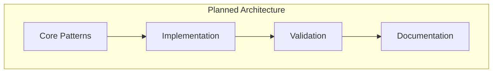

# ADR-001: Core Architecture Patterns

🍞 **Breadcrumb:** 🏠 [Home](../../../index.md) > 👨‍💻 [Developer Guides](../../README.md) > 🏗️ [Architecture](../README.md) > 📋 [ADR](README.md) > Core Architecture Patterns

## Status

PLANNED

## Context

### Problem Statement
Pynomaly needs a consistent architectural foundation that guides development decisions and ensures maintainable, scalable, and testable code across all components.

### Goals
- Establish clear architectural patterns for all system components
- Ensure consistent implementation across the codebase
- Provide guidelines for new feature development
- Support clean architecture principles

### Constraints
- Must align with existing codebase structure
- Should support both monolithic and microservices architectures
- Must facilitate testing and maintainability
- Should enable future scalability

### Assumptions
- Development team will follow established patterns
- Patterns will evolve with system requirements
- Clear documentation will reduce implementation inconsistencies

## Decision

### Chosen Solution
*[To be completed when ADR moves to PROPOSED status]*

### Rationale
*[To be completed when ADR moves to PROPOSED status]*

## Architecture

### System Overview

### Component Interactions
*[To be completed when ADR moves to PROPOSED status]*

## Options Considered

### Pros and Cons Matrix

| Option | Pros | Cons | Score |
|--------|------|------|-------|
| TBD | TBD | TBD | TBD |

### Rejected Alternatives
*[To be completed when ADR moves to PROPOSED status]*

## Implementation

### Technical Approach
*[To be completed when ADR moves to PROPOSED status]*

### Migration Strategy
*[To be completed when ADR moves to PROPOSED status]*

### Testing Strategy
*[To be completed when ADR moves to PROPOSED status]*

## Consequences

### Positive
- *[To be documented when decision is made]*

### Negative
- *[To be documented when decision is made]*

### Neutral
- *[To be documented when decision is made]*

## Compliance

### Security Impact
*[To be completed when ADR moves to PROPOSED status]*

### Performance Impact
*[To be completed when ADR moves to PROPOSED status]*

### Monitoring Requirements
*[To be completed when ADR moves to PROPOSED status]*

## Decision Log

| Date | Author | Action | Rationale |
|------|--------|--------|--------------|
| 2025-01-08 | Architecture Team | PLANNED | Identified need for core architecture patterns |

## References

- [Clean Architecture Principles](../overview.md)
- [System Design Documentation](../system-design.md)
- [ADR Index](README.md)

---

## 🔗 **Related Documentation**

### **Architecture**
- **[Architecture Overview](../README.md)** - System design principles
- **[Clean Architecture](../overview.md)** - Architectural patterns
- **[ADR Index](README.md)** - All architectural decisions

### **Implementation**
- **[Implementation Guide](../../contributing/IMPLEMENTATION_GUIDE.md)** - Coding standards
- **[Contributing Guidelines](../../contributing/CONTRIBUTING.md)** - Development process
- **[File Organization](../../contributing/FILE_ORGANIZATION_STANDARDS.md)** - Project structure

### **Quality**
- **[Testing Strategy](../../testing/README.md)** - Testing approach
- **[Code Quality](../../quality/README.md)** - Quality standards
- **[Documentation Standards](../../contributing/documentation.md)** - Documentation requirements

---

**Authors:** Architecture Team  
**Last Updated:** 2025-01-08  
**Next Review:** 2025-04-08
