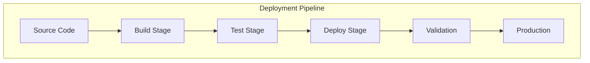

# ADR-006: Deployment Strategy

🍞 **Breadcrumb:** 🏠 [Home](../../../index.md) > 👨‍💻 [Developer Guides](../../README.md) > 🏗️ [Architecture](../README.md) > 📋 [ADR](README.md) > Deployment Strategy

## Status

PLANNED

## Context

### Problem Statement
Pynomaly requires a robust deployment strategy that supports various environments, ensures zero-downtime deployments, and enables rapid rollback capabilities.

### Goals
- Enable zero-downtime deployments
- Support multiple deployment environments (dev, staging, prod)
- Implement automated rollback mechanisms
- Ensure consistency across different deployment targets

### Constraints
- Must support both cloud and on-premise deployments
- Should minimize deployment complexity
- Must ensure data consistency during deployments
- Should support blue-green deployment patterns

### Assumptions
- Deployments will occur frequently
- Different environments will have varying requirements
- Rollback scenarios will be needed regularly
- Infrastructure as Code will be used

## Decision

### Chosen Solution
*[To be completed when ADR moves to PROPOSED status]*

### Rationale
*[To be completed when ADR moves to PROPOSED status]*

## Architecture

### System Overview

### Component Interactions
*[To be completed when ADR moves to PROPOSED status]*

## Options Considered

### Pros and Cons Matrix

| Option | Pros | Cons | Score |
|--------|------|------|-------|
| TBD | TBD | TBD | TBD |

### Rejected Alternatives
*[To be completed when ADR moves to PROPOSED status]*

## Implementation

### Technical Approach
*[To be completed when ADR moves to PROPOSED status]*

### Migration Strategy
*[To be completed when ADR moves to PROPOSED status]*

### Testing Strategy
*[To be completed when ADR moves to PROPOSED status]*

## Consequences

### Positive
- *[To be documented when decision is made]*

### Negative
- *[To be documented when decision is made]*

### Neutral
- *[To be documented when decision is made]*

## Compliance

### Security Impact
*[To be completed when ADR moves to PROPOSED status]*

### Performance Impact
*[To be completed when ADR moves to PROPOSED status]*

### Monitoring Requirements
*[To be completed when ADR moves to PROPOSED status]*

## Decision Log

| Date | Author | Action | Rationale |
|------|--------|--------|-----------|
| 2025-01-08 | DevOps Team | PLANNED | Identified need for comprehensive deployment strategy |

## References

- [Deployment Best Practices](../../operations/deployment.md)
- [Infrastructure as Code](../../operations/infrastructure.md)
- [ADR Index](README.md)

---

## 🔗 **Related Documentation**

### **Architecture**
- **[Architecture Overview](../README.md)** - System design principles
- **[Deployment Architecture](../deployment-architecture.md)** - Deployment system design
- **[ADR Index](README.md)** - All architectural decisions

### **Operations**
- **[Deployment Guide](../../operations/deployment.md)** - Deployment procedures
- **[Infrastructure Guide](../../operations/infrastructure.md)** - Infrastructure management
- **[Monitoring Guide](../../operations/monitoring.md)** - System monitoring

### **DevOps**
- **[CI/CD Pipeline](../../operations/ci-cd.md)** - Continuous integration/deployment
- **[Environment Management](../../operations/environments.md)** - Environment setup
- **[Rollback Procedures](../../operations/rollback.md)** - Rollback strategies

---

**Authors:** DevOps Team  
**Last Updated:** 2025-01-08  
**Next Review:** 2025-04-08
