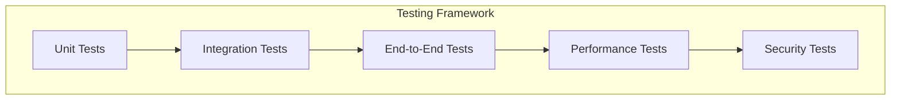

# ADR-009: Testing Strategy

🍞 **Breadcrumb:** 🏠 [Home](../../../index.md) > 👨‍💻 [Developer Guides](../../README.md) > 🏗️ [Architecture](../README.md) > 📋 [ADR](README.md) > Testing Strategy

## Status

PLANNED

## Context

### Problem Statement
Pynomaly requires a comprehensive testing strategy that ensures code quality, system reliability, and rapid development feedback while maintaining high test coverage across all components.

### Goals
- Achieve comprehensive test coverage across all system components
- Implement automated testing pipelines
- Enable rapid feedback for development teams
- Ensure quality gates for production deployments

### Constraints
- Must support multiple testing levels (unit, integration, e2e)
- Should minimize test execution time
- Must integrate with CI/CD pipeline
- Should support various testing frameworks

### Assumptions
- Test automation will be crucial for development velocity
- Code coverage requirements will increase over time
- Testing infrastructure will need to scale with system growth
- Quality standards will become more stringent

## Decision

### Chosen Solution
*[To be completed when ADR moves to PROPOSED status]*

### Rationale
*[To be completed when ADR moves to PROPOSED status]*

## Architecture

### System Overview

### Component Interactions
*[To be completed when ADR moves to PROPOSED status]*

## Options Considered

### Pros and Cons Matrix

| Option | Pros | Cons | Score |
|--------|------|------|-------|
| TBD | TBD | TBD | TBD |

### Rejected Alternatives
*[To be completed when ADR moves to PROPOSED status]*

## Implementation

### Technical Approach
*[To be completed when ADR moves to PROPOSED status]*

### Migration Strategy
*[To be completed when ADR moves to PROPOSED status]*

### Testing Strategy
*[To be completed when ADR moves to PROPOSED status]*

## Consequences

### Positive
- *[To be documented when decision is made]*

### Negative
- *[To be documented when decision is made]*

### Neutral
- *[To be documented when decision is made]*

## Compliance

### Security Impact
*[To be completed when ADR moves to PROPOSED status]*

### Performance Impact
*[To be completed when ADR moves to PROPOSED status]*

### Monitoring Requirements
*[To be completed when ADR moves to PROPOSED status]*

## Decision Log

| Date | Author | Action | Rationale |
|------|--------|--------|-----------|
| 2025-01-08 | QA Team | PLANNED | Identified need for comprehensive testing strategy |

## References

- [Testing Best Practices](../../testing/README.md)
- [Quality Assurance Guidelines](../../testing/qa-guidelines.md)
- [ADR Index](README.md)

---

## 🔗 **Related Documentation**

### **Architecture**
- **[Architecture Overview](../README.md)** - System design principles
- **[Testing Architecture](../testing-architecture.md)** - Testing system design
- **[ADR Index](README.md)** - All architectural decisions

### **Testing**
- **[Testing Guide](../../testing/README.md)** - Testing procedures
- **[Test Automation](../../testing/automation.md)** - Test automation setup
- **[Quality Gates](../../testing/quality-gates.md)** - Quality assurance

### **Quality**
- **[Code Quality](../../quality/README.md)** - Code quality standards
- **[Coverage Requirements](../../quality/coverage.md)** - Coverage targets
- **[Performance Testing](../../quality/performance.md)** - Performance validation

---

**Authors:** QA Team  
**Last Updated:** 2025-01-08  
**Next Review:** 2025-04-08
