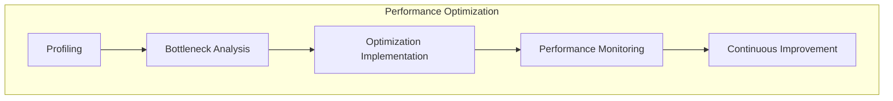

# ADR-010: Performance Optimization

🍞 **Breadcrumb:** 🏠 [Home](../../../index.md) > 👨‍💻 [Developer Guides](../../README.md) > 🏗️ [Architecture](../README.md) > 📋 [ADR](README.md) > Performance Optimization

## Status

PLANNED

## Context

### Problem Statement
Pynomaly requires systematic performance optimization strategies to ensure scalability, responsiveness, and efficient resource utilization as the system grows and handles increasing workloads.

### Goals
- Achieve optimal system performance under various load conditions
- Implement efficient resource utilization strategies
- Establish performance monitoring and optimization processes
- Ensure scalability for future growth

### Constraints
- Must maintain system reliability while optimizing performance
- Should minimize impact on development velocity
- Must work within existing infrastructure limitations
- Should support various deployment environments

### Assumptions
- Performance requirements will increase with system adoption
- Resource optimization will become increasingly important
- Performance bottlenecks will emerge in different system components
- Continuous optimization will be needed

## Decision

### Chosen Solution
*[To be completed when ADR moves to PROPOSED status]*

### Rationale
*[To be completed when ADR moves to PROPOSED status]*

## Architecture

### System Overview

### Component Interactions
*[To be completed when ADR moves to PROPOSED status]*

## Options Considered

### Pros and Cons Matrix

| Option | Pros | Cons | Score |
|--------|------|------|-------|
| TBD | TBD | TBD | TBD |

### Rejected Alternatives
*[To be completed when ADR moves to PROPOSED status]*

## Implementation

### Technical Approach
*[To be completed when ADR moves to PROPOSED status]*

### Migration Strategy
*[To be completed when ADR moves to PROPOSED status]*

### Testing Strategy
*[To be completed when ADR moves to PROPOSED status]*

## Consequences

### Positive
- *[To be documented when decision is made]*

### Negative
- *[To be documented when decision is made]*

### Neutral
- *[To be documented when decision is made]*

## Compliance

### Security Impact
*[To be completed when ADR moves to PROPOSED status]*

### Performance Impact
*[To be completed when ADR moves to PROPOSED status]*

### Monitoring Requirements
*[To be completed when ADR moves to PROPOSED status]*

## Decision Log

| Date | Author | Action | Rationale |
|------|--------|--------|-----------|
| 2025-01-08 | Performance Team | PLANNED | Identified need for systematic performance optimization |

## References

- [Performance Best Practices](../../performance/README.md)
- [Optimization Guidelines](../../performance/optimization.md)
- [ADR Index](README.md)

---

## 🔗 **Related Documentation**

### **Architecture**
- **[Architecture Overview](../README.md)** - System design principles
- **[Performance Architecture](../performance-architecture.md)** - Performance system design
- **[ADR Index](README.md)** - All architectural decisions

### **Performance**
- **[Performance Guide](../../performance/README.md)** - Performance procedures
- **[Benchmarking](../../performance/benchmarking.md)** - Performance benchmarks
- **[Profiling](../../performance/profiling.md)** - Performance profiling

### **Optimization**
- **[Code Optimization](../../optimization/code.md)** - Code optimization strategies
- **[Database Optimization](../../optimization/database.md)** - Database performance
- **[System Optimization](../../optimization/system.md)** - System-level optimization

---

**Authors:** Performance Team  
**Last Updated:** 2025-01-08  
**Next Review:** 2025-04-08
